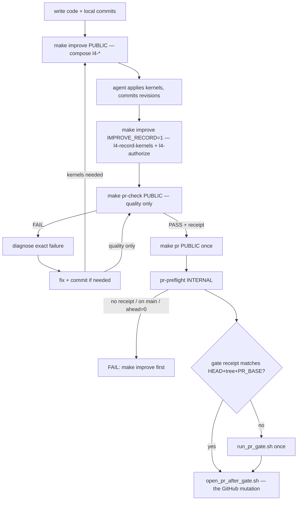

# Repair make pr lifecycle: capability graph + failure loop

Stolen from [`WIP/8-15-26/makefile/Makefile-CG.md`](WIP/8-15-26/makefile/Makefile-CG.md) and [`WIP/8-15-26/makefile/pe-activation/Makefile PE.md`](WIP/8-15-26/makefile/pe-activation/Makefile%20PE.md): the **capability-graph contract** and **command-discipline law**. Not stolen: delete `pr-check`, byte-replace the Makefile, or `PR_AUTOMERGE=1 make pr`.

## Doctrine (gold, now binding on this repair)

- **Makefile = stable API + capability graph.** Prerequisites express capabilities already true. Recipes express ordered state transitions. Complex behavior stays in scripts.
- **PUBLIC** (agent/operator verbs): `improve`, `pr-check`, `pr`.
- **INTERNAL** (implementation leaf): `pr-preflight`. Agents do not invoke it as a shipping command.
- **Phases as prerequisites:** `pr: pr-preflight pr-check` on one new Makefile line (GNU Make 3.81 left-to-right). Existing `pr:` recipe body stays. `pr-check` requires no L4 capability.
- **`make improve` composes existing `l4-*` wrappers** (`l4-begin` / `l4-record-kernels` / `l4-authorize` already on the live Makefile). Do not invent a second L4 CLI. Do not leave agents on the four-command ritual.
- **Single path to GitHub = mutation** (push / create / update / merge). `improve` and `pr-check` are not shipping paths. Raw `git push` / `gh pr create` remain leaves of `make pr` only (`local_execution_gate.py` unchanged).
- **One full quality validation per unchanged repository state.** `pr-check` writes a gate receipt. A later `make pr` on the same HEAD + worktree + `PR_BASE` reuses it (skip expensive re-gate). State change voids the receipt.
- **Failure loop:** diagnose → fix → `make improve` if kernels apply → `make pr-check` → `make pr` **once** to publish. Forbidden: fail → bare ruff/pre-commit/full gate → `make pr` as a second full validation of the same tree.

## Lifecycle

## Verified defects

- [`resolve_changed_files.sh`](ops/scripts/resolve_changed_files.sh) `:134-136` exits 1 on empty changeset; [`run_pr_gate.sh`](ops/scripts/run_pr_gate.sh) resolves **after** pre-commit (`:135` vs `:188`) and [`run_pr_precommit.sh`](ops/scripts/run_pr_precommit.sh) `:25` resolves again — doubled error, wasted work.
- L4 `check-remote` lives in [`open_pr_after_gate.sh`](ops/scripts/open_pr_after_gate.sh) `:95-109`, after the expensive gate.
- L4 kernels have no PUBLIC command: live [`Makefile`](Makefile) already has `l4-status` / `l4-begin` / `l4-record-kernels` / `l4-authorize` as thin wrappers; agents still copy four `python3 ops/autonomy/l4_local.py …` lines from AGENTS.md. Nothing composes them, so kernels run late or not at all.
- `make pr` always re-runs the full gate even when `pr-check` just passed the same tree (PE.md P2: one validation per state — named, never built).

## Changes

### 1. `make improve` PUBLIC — compose existing `l4-*`

New [`ops/scripts/run_improve.sh`](ops/scripts/run_improve.sh). Calls the same CLI the Makefile wrappers already use (`ops/autonomy/l4_local.py`). No state-machine rewrite.

- No phase → `begin` (refuses main/master, [`l4_local.py`](ops/autonomy/l4_local.py) `:151-155`).
- Emit `L9_AGENT_REQUIRED` (same pattern as [`open_pr_after_gate.sh`](ops/scripts/open_pr_after_gate.sh) `:350-365`): apply [`kernels/Recursive Alignment.md`](kernels/Recursive%20Alignment.md) then [`kernels/Validate & Repair.md`](kernels/Validate%20%26%20Repair.md) as a revision pass vs `PR_BASE`; commit revisions.
- `IMPROVE_RECORD=1`: refuse unless phase is `executing` or `kernels_recorded` (no rubber-stamp); then `record-kernels` + `authorize-release`.
- Makefile `improve` recipe invokes the script. Existing `l4-begin` / `l4-record-kernels` / `l4-authorize` stay as INTERNAL-callable leaves; agents are taught `make improve` only.

### 2. `pr-preflight` INTERNAL — read-only publish predicates

New [`ops/scripts/pr_preflight.sh`](ops/scripts/pr_preflight.sh): detached HEAD / main|master / `rev-list --count $PR_BASE..HEAD` = 0 / `l4_local.py check-remote` denied (honor `L9_L4_LOCAL_AUTONOMY=0` and breakglass, [`l4_local.py`](ops/autonomy/l4_local.py) `:319-322`). On L4 deny: `run: make improve` then `make improve IMPROVE_RECORD=1`. No mutation. <2s.

Not a pre-commit hook (PE.md: PR-context checks stay outside hooks).

### 3. `make pr-check` PUBLIC — quality only, plus gate receipt

- [`resolve_changed_files.sh`](ops/scripts/resolve_changed_files.sh): `PR_ALLOW_EMPTY=1` → `SOURCE:empty` exit 0. Default remain fail-closed.
- [`run_pr_gate.sh`](ops/scripts/run_pr_gate.sh): resolve **first**; empty → `OK: nothing to gate` exit 0 after always-run contract-surface checks (`:65-74`). Pass list via `PR_CHANGED_FILE` so the resolver runs once. **No L4.**
- On PASS, write gitignored [`.l9/pr/gate-receipt.json`](.l9/pr/gate-receipt.json): `{head, worktree_digest, pr_base, passed_at}`. Digest = `git rev-parse HEAD` + `git status --porcelain` cksum (same dirtiness domain the gate already measures).
- On entry: if receipt matches current HEAD + porcelain + `PR_BASE`, print `OK: gate receipt matches unchanged state — skipping full validation` and exit 0. Any dirty/HEAD/`PR_BASE` change voids it (PE.md: writer mutated tree → prior validation is void).

### 4. Makefile — additive capability graph (root file protected)

No recipe rewrites. No byte-replace of [`WIP/8-15-26/makefile/Makefile-CG.md`](WIP/8-15-26/makefile/Makefile-CG.md).

Additive lines only:

- Comment block: PUBLIC = `improve` `pr-check` `pr`; INTERNAL = `pr-preflight`; single path to GitHub = `pr` only.
- `.PHONY` additions for `improve` `pr-preflight`.
- `improve:` → `run_improve.sh`.
- `pr-preflight:` → `pr_preflight.sh`.
- **`pr: pr-preflight pr-check`** on one new line (same additive pattern as live `pr-check: capability-contract-validate` at [`Makefile`](Makefile) `:367-368`). Existing `pr:` recipe (`:374-381`) untouched — still calls `open_pr_after_gate.sh` when `OPEN_PR=1`.

Because `pr-check` honors the gate receipt, `make pr` after a fresh `pr-check` on the same tree does not pay a second full validation.

### 5. `open_pr_after_gate.sh` — mutation leaf, drift signal

Keep branch/ahead/L4 checks as defense-in-depth (`PUSH_ONLY=1` still uses this script). L4 fail message names `make improve` and says preflight should have caught it (drift). This script remains the **only** sanctioned GitHub mutation implementation.

### 6. Tests + doctrine

- Tests next to [`tests/ops/autonomy/test_publish_path_gate.py`](tests/ops/autonomy/test_publish_path_gate.py): improve refuse-on-main and no-record-without-phase; preflight fails; `PR_ALLOW_EMPTY`; nothing-to-gate = 0; receipt skip vs void-on-dirt.
- [`AGENTS.md`](AGENTS.md) append-only correction block:
  - PUBLIC/INTERNAL classification
  - single path to GitHub = mutation through `make pr`
  - failure loop: diagnose → fix → (`make improve` if kernels) → `make pr-check` → `make pr` once
  - supersede raw `l4_local.py begin && record-kernels && authorize-release` as the happy path
  - do **not** delete `pr-check` or teach `PR_AUTOMERGE=1` as default ship
- [`rules/48-make-pr-remediation.mdc`](rules/48-make-pr-remediation.mdc): if it teaches `pr-check && pr` as two full gates, retarget to receipt reuse.

## Landing

Per `KERNEL_PACK_NEW_BRANCH_DEFAULT_V1`: new branch from `origin/main` in `~/.cursor-governance`. Prove the loop on itself: `make improve` → revise → `make improve IMPROVE_RECORD=1` → `make pr-check` → `make pr` once. Second `make pr` without tree change must print the receipt-skip line.

## Out of scope

- No `l4_local.py` / `local_execution_gate.py` rewrite.
- No landing `Makefile-CG.md` or campaign `level3-make-pr-single-path`.
- No deleting `pr-check`. No `PR_AUTOMERGE` default. No merge-law change.
- No awk-`help` rewrite or full PUBLIC_TARGETS inventory migration (optional later; do not block this PR).
- No CI workflow changes.
