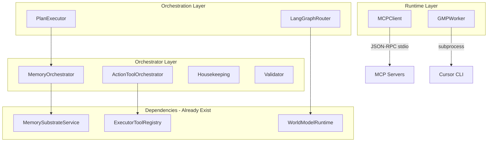

# Stub Gap Resolution Plan

## Architecture Overview



---

## Phase 1: Runtime Layer (High Priority)

### 1.1 MCP Client - stdio Protocol

**File:** [runtime/mcp_client.py](runtime/mcp_client.py)**What to implement:**

- JSON-RPC 2.0 over stdio (spawn subprocess, communicate via stdin/stdout)
- Server lifecycle management (start/stop MCP server processes)
- Tool call serialization per MCP spec

**Key code pattern:**

```python
async def _call_mcp_tool(self, server_id: str, tool_name: str, arguments: dict) -> dict:
    proc = self._server_processes.get(server_id)
    if not proc:
        proc = await self._start_server(server_id)

    request = {"jsonrpc": "2.0", "method": "tools/call", "params": {"name": tool_name, "arguments": arguments}, "id": uuid4().hex}
    proc.stdin.write(json.dumps(request) + "\n")
    response = await self._read_response(proc.stdout)
    return response.get("result", {})
```

**Effort:** ~100 lines---

### 1.2 GMP Worker - Cursor Integration

**File:** [runtime/gmp_worker.py](runtime/gmp_worker.py)**What to implement:**

- Write GMP markdown to temp file
- Invoke Cursor CLI: `cursor --goto /path/to/repo --file gmp.md`
- Parse Cursor output/exit code for success/failure

**Key code pattern:**

```python
async def _execute_gmp(self, gmp_markdown: str, repo_root: str, caller: str, metadata: dict) -> dict:
    gmp_file = Path(repo_root) / ".cursor" / "gmp_task.md"
    gmp_file.write_text(gmp_markdown)

    proc = await asyncio.create_subprocess_exec(
        "cursor", "--goto", repo_root, "--file", str(gmp_file),
        stdout=asyncio.subprocess.PIPE, stderr=asyncio.subprocess.PIPE
    )
    stdout, stderr = await proc.communicate()

    return {"success": proc.returncode == 0, "output": stdout.decode(), "error": stderr.decode() if proc.returncode else None}
```

**Effort:** ~60 lines---

## Phase 2: Orchestrator Layer (Medium Priority)

### 2.1 Memory Orchestrator

**Files:**

- [orchestrators/memory/orchestrator.py](orchestrators/memory/orchestrator.py)
- [orchestrators/memory/housekeeping.py](orchestrators/memory/housekeeping.py)

**What to implement:**

- `BATCH_WRITE`: Call `substrate_service.store_packet()` for each packet
- `REPLAY`: Query packets by time range, re-emit to world model
- `GC`: Delete packets older than threshold
- `COMPACT`: Vacuum/optimize (passthrough to repository)

**Dependencies:** `MemorySubstrateService` (already exists at `memory/substrate_service.py`)**Effort:** ~80 lines total---

### 2.2 ActionTool Orchestrator

**Files:**

- [orchestrators/action_tool/orchestrator.py](orchestrators/action_tool/orchestrator.py)
- [orchestrators/action_tool/validator.py](orchestrators/action_tool/validator.py)

**What to implement:**

- Validator: Check tool exists, check safety level, check governance approval
- Orchestrator: Retry loop with exponential backoff, dispatch via `ExecutorToolRegistry`

**Dependencies:** `ExecutorToolRegistry` (already exists at `core/tools/registry_adapter.py`)**Effort:** ~100 lines total---

## Phase 3: Orchestration Layer (Medium Priority)

### 3.1 Plan Executor - Real File Writing

**File:** [orchestration/plan_executor.py](orchestration/plan_executor.py)**What to implement:**

- `_handle_code_write`: Use `pathlib.Path.write_text()` with backup
- Safety: Validate path is within allowed directories

**Effort:** ~30 lines---

### 3.2 LangGraph Router

**File:** [orchestration/ws_task_router.py](orchestration/ws_task_router.py)**What to implement:**

- Initialize `StateGraph` from LangGraph
- Define routing nodes (context_load, classify, route)
- Wire world model for context enrichment

**Dependencies:** LangGraph (already in use at `orchestration/long_plan_graph.py`)**Effort:** ~80 lines---

## Phase 4: Schemas and Tests (Low Priority)

### 4.1 Task Schemas

**File:** [core/schemas/tasks.py](core/schemas/tasks.py)**What to implement:**

- Add `StateGraph` reference field to `TaskDependencies`
- Add transaction ID field to `AtomicTask`

**Effort:** ~10 lines---

### 4.2 Slack Webhook Negative Test

**File:** [api/adapters/slack_adapter/tests/test_slack_webhook.py](api/adapters/slack_adapter/tests/test_slack_webhook.py)**What to implement:**

- Test case: invalid signature returns 401
- Test case: expired timestamp returns 401

**Effort:** ~20 lines---

## Execution Order

| Order | Component | Files | Lines | Dependencies |

|-------|-----------|-------|-------|--------------|

| 1 | MCP Client | runtime/mcp_client.py | ~100 | None |

| 2 | GMP Worker | runtime/gmp_worker.py | ~60 | None |

| 3 | Memory Orchestrator | orchestrators/memory/*.py | ~80 | MemorySubstrateService |

| 4 | ActionTool Orchestrator | orchestrators/action_tool/*.py | ~100 | ExecutorToolRegistry |

| 5 | Plan Executor | orchestration/plan_executor.py | ~30 | None |

| 6 | LangGraph Router | orchestration/ws_task_router.py | ~80 | LangGraph, WorldModel |

| 7 | Task Schemas | core/schemas/tasks.py | ~10 | None |

| 8 | Slack Tests | api/adapters/.../test_*.py | ~20 | None |**Total estimated: ~480 lines of new code**---

## Verification

After each phase:

1. `python3 ci/check_syntax.py` - syntax validation
2. `python3 ci/lint_forbidden_imports.py` - no print/logging
