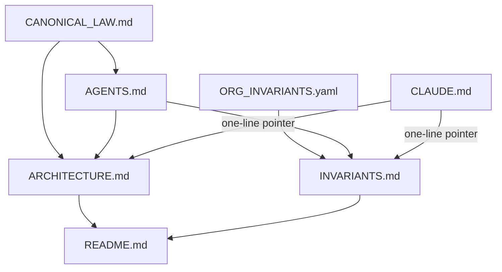

# Draft root ARCHITECTURE.md and INVARIANTS.md

User override: draft the two missing root files. An unexecuted plan ([docs/plans/ra_root-docs_pointer_09ff9571.plan.md](docs/plans/ra_root-docs_pointer_09ff9571.plan.md)) listed them as out of scope because they did not exist. This plan **creates** them, and keeps Recursive Alignment’s one-owner rule: they index authority; they do not replace it.

## Execute via Cursor Build

Press **Build**. Work in the **current checkout**.

- Do not run `make campaign`.
- Do not admit a Program Lock or write `Lock: origin/main = <sha>`.
- Do not open a tip worktree as a planning requirement.
- Stage only paths this plan authors. The tree is already dirty with unrelated `l9-plan-simple` / PE work — do not scoop those files.

## Locked design

These are **first-class root agent docs** written by [skills/l9-update-agent-docs/SKILL.md](skills/l9-update-agent-docs/SKILL.md), with this repo’s authority chain as the bind:

1. `CANONICAL_LAW.md` remains the constitution.
2. `ORG_INVARIANTS.yaml` remains the machine org-policy SSOT.
3. `AGENTS.md` remains the operating-instruction SSOT.
4. `CLAUDE.md` stays a short load pointer.
5. Root `ARCHITECTURE.md` / `INVARIANTS.md` are **indexes**. Every metric comes from a cited file. No copied CI tables, skill registries, or YAML invariant bodies.

Register both as **managed** in [ops/config/root-file-protection.json](ops/config/root-file-protection.json) (same tier as `README.md`). The skill must be able to refresh them. Do **not** make them `additive_only` — that would block later surgical updates.

## Audit first (skill Steps 1–6)

No project adapter exists today. Skip domain/Odoo inventory. At Build, re-read live sources and write counts only from those files (`Unknown` if unverified):

- **CI:** every workflow under `.github/workflows/` (14 files). Split blocking vs informational. Known map to start from, then verify:
  - Blocking PR path: `l9-lint-test.yml` (`scope` / `lint` / `test`), `governance-self-check.yml`, `root-file-protection.yml`, `validate-org-policy.yml`, `peer-execution.yml`, `repo-hygiene.yml`, `governance.yml`, `supply-chain.yml`, `codeql.yml`
  - Non-blocking / scheduled / post-merge: `lint-autofix.yml` (main janitor only), `branch-hygiene.yml`, `memory-distill.yml`, `on-org-update.yml`
- **Pre-commit:** [.pre-commit-config.yaml](.pre-commit-config.yaml) — count hooks; record global `exclude` (`WIP/`, `C_GOV_FILES/`, `reports/`, `^workflows/`, archives). Do not claim a git commit hook exists (`AGENTS.md` §4).
- **Lint:** [pyproject.toml](pyproject.toml) `[tool.ruff]` `line-length = 100` plus per-file ignores. Pins stay in `AGENTS.md` §6 / `requirements.txt`.
- **False positives:** cite exclusion **location**. Candidates: pre-commit `exclude`; ruff `per-file-ignores`; generated-path merge (`GENERATED_PATH_PREFIXES`); `SEMGREP_APP_TOKEN` / `SONAR_TOKEN` not required for `make pr`.

## File contracts

### [ARCHITECTURE.md](ARCHITECTURE.md) (new, repo root)

Skill sections: module/package index, CI/CD architecture, version.

Required shape:

- Header: purpose = **this-repo map**; not PE architecture; not the L9 Coding Control Plane kernel doc.
- Authority box: `CANONICAL_LAW.md` > `ops/autonomy/surface_profile.yaml` > `AGENTS.md` > skills. This file does not outrank them.
- **Module index** from the live tree (align with [README.md](README.md) directory list, then verify on disk): `skills/`, `commands/`, `rules/`, `ops/` (hooks, scripts, graphiti, secrets, autonomy, ui-operator), `environment/` (contracts, ide, program-execution, agents/adapters), `learning/`, `docs/plans/`, `kernels/` (cite only; do not land KERNEL edits).
- Subsystem pointers, not copies: [environment/program-execution/ARCHITECTURE.md](environment/program-execution/ARCHITECTURE.md); `environment/agents/adapters/claude-code/`; `ops/autonomy/surface_profile.yaml`.
- **CI/CD architecture:** `make pr-check` / `PR_REMEDIATE=0 make pr` as the local publish path; GitHub workflows as the remote map. Point at `AGENTS.md` §4–6 for the live table. Do not paste hook/job dumps that will rot.
- Version: `1.0.0` / `2026-08-21`.

Forbidden: inventing packages; restating PE Controller law; expanding CLAUDE-style Always/Never lists.

### [INVARIANTS.md](INVARIANTS.md) (new, repo root)

Skill sections: invariant list, CI enforcement map, false positives.

This is **not** a second `ORG_INVARIANTS.yaml`. Org policy stays in the YAML; [docs/governance/ORG_INVARIANTS.md](docs/governance/ORG_INVARIANTS.md) stays the org-policy operator note.

Required shape:

- Authority box: machine org SSOT = `ORG_INVARIANTS.yaml`; this file indexes **this-repo operating invariants** plus a pointer into the YAML `invariants:` block (do not copy L9-ORG-* bodies).
- **Invariant list** as named pointers (one line + path each), harvested from live law — examples to bind at write time:
  - One governance root / no Dropbox fallback — `CANONICAL_LAW.md` §1, `ops/scripts/resolve_governance_paths.sh`
  - Cursor-primary, thin adapters — `CANONICAL_LAW.md` §2.1
  - Symlink law — `AGENTS.md` §10
  - `make pr` only publish path — `AGENTS.md` §4
  - L4 no mid-execution push — `AGENTS.md` §3.1
  - Graphiti-only episodic memory — `AGENTS.md` §7
  - Secrets never in git — `AGENTS.md` §8
  - Root files append-only / new root files must be registered — `AGENTS.md` §14, `ops/config/root-file-protection.json`
  - Shared-worktree isolation / pathspec staging — `AGENTS.md` + rule 49
  - Org birth under Quantum-L9 — `ORG_INVARIANTS.yaml` `invariants` / `docs/governance/ORG_INVARIANTS.md`
- **CI enforcement map:** invariant → workflow or script (e.g. root-file-protection → `.github/workflows/root-file-protection.yml` + `ops/scripts/validate_root_file_protection.py`; org policy → `validate-org-policy.yml`; wiring → `governance-self-check.yml` / `check_governance_wiring.sh`).
- **False positives:** only items with a cited exclude/ignore. No invented “known flakes.”

Forbidden: copying the YAML `invariants:` list; restating all of `AGENTS.md`.

## Companion writes (required for alignment)

New tracked root files must be registered the same change (`AGENTS.md` §14 + inventory completeness in `validate_root_file_protection.py`).

- [ops/config/root-file-protection.json](ops/config/root-file-protection.json) — add `ARCHITECTURE.md` and `INVARIANTS.md` as `tier: managed`, `rule: managed`.
- [README.md](README.md) — add both to the directory tree and Key Files (managed; surgical).
- [AGENTS.md](AGENTS.md) §9 — **append-only** two bullets. Do not fold or rewrite existing lines. No `ALLOW-ROOT-DELETION`.
- [CLAUDE.md](CLAUDE.md) — one short pointer line under authority or “Checking what is actually wired.” Do not add Always/Never or CI tables.
- New adapter [`.claude/adapters/cursor-governance-update-agent-docs.md`](.claude/adapters/cursor-governance-update-agent-docs.md) so the next `/update-agent-docs` run keeps the pointer-not-dump contract and names these two files as live targets.
- [skills/l9-update-agent-docs/SKILL.md](skills/l9-update-agent-docs/SKILL.md) — surgical: list the Cursor-Governance adapter first; change Step 7 “when they exist” to treat root `ARCHITECTURE.md` / `INVARIANTS.md` as live **indexes**. Do not change the skill `description` unless required (avoid registry re-wire). If description/triggers change, stop and run `l9-wire-skill-into-repo` only.

## Out of scope

- `CANONICAL_LAW.md`, `ORG_INVARIANTS.yaml`, PE `ARCHITECTURE.md`, kernels
- Executing the RA pointer plan or folding `AGENTS.md`
- Commit / `make pr` unless the user asks after review
- Mixing unrelated dirty files into this change

## Validation

- Both files exist at repo root and are listed in `root-file-protection.json`.
- Counts in the new docs match the audit (or are marked `Unknown`).
- `rg` shows no pasted workflow job tables that already live in `AGENTS.md` §4–6.
- `INVARIANTS.md` does not contain `L9-ORG-` requirement bodies copied from the YAML.
- `python3 ops/scripts/validate_root_file_protection.py` still understands the config (new files are brand-new; inventory must include them).
- `make pr-check` on **this plan’s paths only** after the files exist (no commit, no push). If the dirty foreign tree makes a full gate unusable, report that and run the validator + a path-scoped read instead of scooping other agents’ files.
