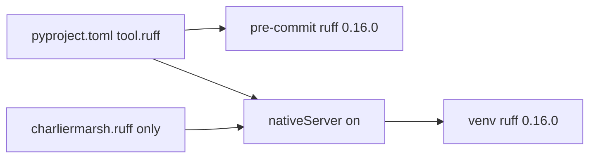

# Optimize Ruff config and keep one plugin

**Depth:** deep (protected `pyproject.toml`, IDE profile). **Baseline:** `1ef39f9b39d39044b3bc8c6a5ab9418ec6a856b8`. **Execute after Build:** `@environment/program-execution` then `/autonomy` under a Program lease — do not free-form mutate from this markdown.

## Ground truth

- There is **no** `ruff.toml`. SSOT is `[tool.ruff]` in [pyproject.toml](pyproject.toml) (lines 61–98): `line-length = 100`, `target-version = "py312"`, `force-exclude = true`, `lint.select = ["E", "F", "I", "UP"]`, plus per-file E501/E402 ignores. Pin is `ruff==0.16.0` (also [.pre-commit-config.yaml](.pre-commit-config.yaml) `rev: v0.16.0`).
- `pyproject.toml` is **additive_only**. Execution may **insert new tables/keys**. It must **not** rewrite existing `select` / `exclude` / `line-length` lines unless a commit carries `ALLOW-ROOT-DELETION: pyproject.toml — …`.
- Governed formatter is already `charliermarsh.ruff` ([environment/ide/extensions.core.json](environment/ide/extensions.core.json), [environment/ide/render.cursor.json](environment/ide/render.cursor.json)). Workspace `[python]` formatter is that ID.
- Machine has **two installed versions of the same extension**: `charliermarsh.ruff-2026.70.0` (bundled ruff 0.16.2) and `charliermarsh.ruff-2026.72.0` (bundled ruff 0.16.3). No second Ruff marketplace ID. The 2026.72 extension still ships deprecated `ruff-lsp` plus the native server (`ruff.nativeServer` default `auto`).
- [ops/scripts/adapters/cursor.sh](ops/scripts/adapters/cursor.sh) `cursor --install-extension --force` **updates** but does **not** prune leftover version folders or foreign `*ruff*` IDs.

## Locked decisions

- **Keep config in `pyproject.toml`.** Do not add a root `ruff.toml` (second SSOT + new root-file registration).
- **Do not expand lint `select`.** No `extend-select` for B/SIM/RUF/etc. That would fail `make pr` across the Python corpus. Same posture as the Biome work: optimize settings, do not mass-rewrite.
- **One plugin = one extension ID + native server.** Keep `charliermarsh.ruff`. Remove the 2026.70.0 leftover. Force `ruff.nativeServer = "on"` so `ruff-lsp` is not a second language server. Prefer `ruff.importStrategy = "fromEnvironment"` so the editor uses venv `ruff==0.16.0`, not the extension’s bundled 0.16.3.
- **Do not** `ruff format` the whole tree in this change.

## Config to append (new tables only)

After the existing `[tool.ruff.lint.per-file-ignores]` block in [pyproject.toml](pyproject.toml), add:

```toml
[tool.ruff.format]
quote-style = "double"
indent-style = "space"
line-ending = "lf"
skip-magic-trailing-comma = false
docstring-code-format = false
```

Optionally add `extend-exclude` as a **new** key under `[tool.ruff]` (do not edit the existing `exclude` array) for generated trees already ignored by Biome: `ops/generated`, `**/generated`. Skip `known-first-party` isort lists — this repo is `package = false` and has no installable first-party package name.

## Plugin uniqueness

1. Inventory: `cursor --list-extensions` must show **exactly one** ID matching `ruff` (`charliermarsh.ruff`). Do not uninstall `ms-python.python` / `ms-python.debugpy` / `anysphere.cursorpyright`.
2. Remove stale version dir `~/.cursor/extensions/charliermarsh.ruff-2026.70.0-darwin-arm64` (uninstall+reinstall of `charliermarsh.ruff` if the CLI leaves the old folder).
3. Harden [ops/scripts/adapters/cursor.sh](ops/scripts/adapters/cursor.sh): after desired installs, uninstall any listed extension whose id matches `ruff` but is not `charliermarsh.ruff`. Document that leftover **version folders** of the same id are pruned once (execute-time), not on every sessionStart.
4. Append to [environment/ide/settings.python.json](environment/ide/settings.python.json) (installer-managed, no formatter-ownership keys):

```json
"ruff.nativeServer": "on",
"ruff.importStrategy": "fromEnvironment"
```

Then `install_ide_profile.sh --force` so this workspace’s `.vscode/settings.json` picks them up. Do **not** re-bind `[jsonc]` to Biome.

## Tests / docs

- Extend [ops/scripts/test_install_ide_profile.sh](ops/scripts/test_install_ide_profile.sh) to assert Python formatter remains `charliermarsh.ruff` and that merged settings include `ruff.nativeServer=on`.
- No AGENTS.md rewrite (formatter table already says Ruff owns Python). README N/A unless the IDE README needs one sentence that the profile pins native Ruff (only if the installer comment is otherwise misleading).



## Stress / rollback

- Disconfirm: is the “second plugin” actually `ruff-lsp` vs a second marketplace ID? Execute inventories first; if a different ID appears, uninstall that ID instead of only deleting 2026.70.0.
- Disconfirm: would `extend-exclude` hide files pre-commit currently lints? Probe `ruff check` on a generated path before/after; drop `extend-exclude` if it changes the gate.
- Disconfirm: does additive insert in `pyproject.toml` still show `deleted=0` vs origin/main? If the editor/ruff-format rewrites the whole file, stop and restore — use a surgical insert.
- Rollback: `git checkout -- pyproject.toml environment/ide/settings.python.json ops/scripts/adapters/cursor.sh ops/scripts/test_install_ide_profile.sh`; reinstall `charliermarsh.ruff` if the live extension was removed.

## Out of scope

- Expanding lint rule sets; repo-wide `ruff format` / `--fix`
- Changing `ruff==0.16.0` pin or pre-commit `rev`
- New `ruff.toml`, Biome JSONC binding, Python extension uninstall
- l9-ci-sdk Biome CI plan / `l9-self-ci.yml`

## Validation (execute)

- `python3 ops/scripts/validate_root_file_protection.py --base origin/main --head HEAD` — pyproject change is additive (`deleted=0`)
- `uv run ruff check --show-settings` (or equivalent) shows format table + unchanged `select`
- `uv run ruff check` on current changed files: no new rule families
- `bash ops/scripts/test_install_ide_profile.sh`
- `cursor --list-extensions | rg -i ruff` → only `charliermarsh.ruff`
- `make pr-check` (changed-files only; no push)

## GMP / PE envelope

- **May modify:** `pyproject.toml` (append only), `environment/ide/settings.python.json`, `ops/scripts/adapters/cursor.sh`, `ops/scripts/test_install_ide_profile.sh`
- **Must not modify:** `CANONICAL_LAW.md`, `AGENTS.md` body (except generated formatter block if installer rewrites it — avoid `--force` agentdocs if it would non-additively rewrite AGENTS.md), `.pre-commit-config.yaml` ruff pin, `requirements.txt`
- **autonomous_merge:** false
