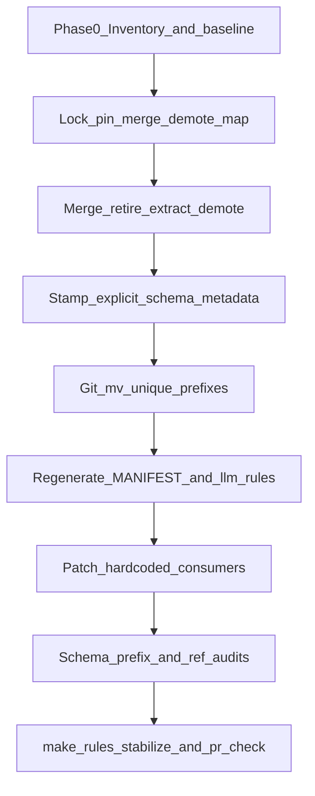

# Rules Corpus Re-org / Renumber / Tighten

## Metadata (canonical.schema.plan_document.v1)

- **plan_id:** `plan.rules-corpus-cleanup.v1`
- **name:** Rules corpus re-org, uniquify prefixes, tighten contracts
- **schema_version:** `1.0.0` (instance of [canonical.schema.plan_document.v1.yaml](WIP/Execution%20Schemas/environment/contracts/execution/schemas/canonical.schema.plan_document.v1.yaml))
- **status:** `draft` → executable after baseline re-verify at execution start
- **is_project:** `false`
- **plan_class:** `refactor_plan`
- **redesign_allowed:** `true` (numbering/bands + activation model; not a new governance SSOT root)
- **depth:** `deep` (multi-milestone, high blast if consumers miss a rename)
- **improved_by:** `kernels/Improve.md` v3 (plan-only passes; execution not started)

## Architect framing

- **planning_ssot:** this plan + band convention in [commands/rules.md](commands/rules.md) + tooling in `ops/scripts/{generate,validate}_rules_manifest.py`
- **Schema SSOT (must stay aligned — do not invent parallel contracts):**
  - Frontmatter: [`ops/schemas/rule-metadata.schema.json`](ops/schemas/rule-metadata.schema.json)
  - Generated register: [`ops/schemas/rule-manifest.schema.json`](ops/schemas/rule-manifest.schema.json) (`$schema: l9.cursor-rules-manifest/v2`)
  - Consumer delivery: [`ops/schemas/rule-selection.schema.json`](ops/schemas/rule-selection.schema.json) (`l9.cursor-rules-selection/v1`)
- **Identity law:** filename `NN-stem.mdc` is the human/sort/delivery basename (`rule-manifest` `file` pattern `^[^/]+\.mdc$`). Stable machine identity is frontmatter `id` matching `^[a-z0-9]+(?:[._-][a-z0-9]+)+$`. **Stamp explicit `id` before any `git mv`** so renames do not invent a new identity and so [`sync_selected_rules.py`](ops/scripts/sync_selected_rules.py) selectors keyed by `id` keep working (`index` keys = `id` ∪ stem ∪ `file`).
- **Renumber law (user constraint):** **pin** high-fanout stems/numbers; resolve collisions by moving/merging the **less-referenced** sibling.
- **Generated-artifact law:** never hand-edit `RULES-MANIFEST.*` or `environment/generated/llm-rules/**`; only regenerate via `generate_rules_manifest.py` / `project_llm_rules.py`.

## Immutable baseline (re-verify at execution start)

- **repository:** `Quantum-L9/Cursor-Governance` @ workspace `/Users/ib-mac/Cursor-Governance`
- **branch (now):** `feat/cursor-subagent-deployment`
- **commit_sha (now):** `6b7f3e4574dd709ac572a3c5f0556a48d11ce823` — re-capture at Phase 0; stop if tip moved underfoot without replan
- **dirty:** `true` (untracked `WIP/`, some `reports/`) — **overlap_policy:** `explicitly_allow_listed_paths` for those; stop if dirty overlaps `rules/`, `ops/scripts/*rules*`, `ops/config/llm_rules_projection.yaml`, `CANONICAL_LAW.md`, `AGENTS.md`, `ops/schemas/rule-*.schema.json`
- **artifact_hashes:** Phase 0 sha256 inventory of all `rules/*.mdc` + `RULES-MANIFEST.*`
- **on_drift:** stop and replan

## Current ground truth (audit snapshot)

- **64** `rules/*.mdc` on disk; **RULES-MANIFEST** still at **63** (missing [`87-l4-local-autonomy.mdc`](rules/87-l4-local-autonomy.mdc))
- **43** `alwaysApply: true` on disk (manifest summary stale at 42/63)
- **11 colliding prefixes:** `01,03,05,87×4,88,93(.md orphan),95,96×3,97×4,98,99×4`
- Topic debt:
  - Git triple: [`01-git-push-prohibition`](rules/01-git-push-prohibition.mdc) ≈ [`96-git-push-approval`](rules/96-git-push-approval.mdc) ≈ [`99-no-auto-commit`](rules/99-no-auto-commit.mdc) (99 alone carries autonomy waiver — keep it)
  - Deprecated [`03-mcp-memory`](rules/03-mcp-memory.mdc) still in tree
  - [`04-cursor-redis-session`](rules/04-cursor-redis-session.mdc) still alwaysApply while Graphiti is resume SSOT
  - Orphan [`93-perplexity-research-protocol.md`](rules/93-perplexity-research-protocol.md) (not `.mdc`, not in manifest)
  - Oversized always rules: `92` (778), `99-incident-report` (463), `60` (351), `00-global` (279)

### Pinned (do **not** rename)

| Stem | Why pinned |
|------|------------|
| `00-global` | docs/tests baseline |
| `02-slash-commands` | plugin + commands-index + AUTONOMY_MANIFEST |
| `03-graphiti-memory` | CANONICAL_LAW / memory stack |
| `23-l9-skill-routing` | Claude alias `l9-skill-routing.md` + validators |
| `45-pre-action-verification` | skill/docs refs |
| `84-cursor-governance-wiring` | wiring SSOT + `deny_stems` |
| `87-cursor-memory-kernel` | memory skills (winner of 87-collision) |
| `92-learned-lessons` | harvest pipeline |
| `97-graph-layer-boundary` | CANONICAL_LAW / ADR (winner of 97-collision among graph rules) |
| `98-graphiti-memory-gate` | Graphiti write gate |
| `99-no-auto-commit` | autonomy surface override + highest git-rule fanout |

### Stable `id` freeze (stamp before mv / merge)

Prefer existing explicit ids; otherwise assign once and never derive-from-stem after:

| Survivor file (final) | `id` |
|----------------------|------|
| `99-no-auto-commit.mdc` | `l9.rule.git.mutation-gate` (replace derived; update surface_profile prose to cite **filename** `99-no-auto-commit` + this id) |
| `03-graphiti-memory.mdc` | `l9.rule.graphiti.memory` |
| `87-cursor-memory-kernel.mdc` | `l9.rule.cursor.memory.kernel` |
| `88-l4-local-autonomy.mdc` (from 87-l4) | `l9.rule.l4.local-autonomy` |
| `98-graphiti-memory-gate.mdc` | `l9.rule.graphiti.memory.gate` |
| Already-explicit survivors | keep: `l9.rule.recursive-execution-kernel`, `l9.rule.cursor-governance-wiring`, `l9.rule.testing.integrity`, `l9.rule.configuration.no-hardcode`, `l9.rule.output-discipline`, `l9.rule.governance-ssot-paths`, `l9.rule.graph-layer-boundary`, `l9.rule.ide-profile-exceptions` |
| Every other edited rule | `l9.rule.<stable.slug>` matching metadata `id` pattern; record in rename-map |

## Chosen target model

### Band table (update [commands/rules.md](commands/rules.md))

| Prefix | Category |
|--------|----------|
| `00–09` | Core session / interaction / SSOT paths |
| `10–29` | Language + doc tools |
| `30–39` | Framework |
| `40–49` | Domain / execution kernels / patterns |
| `50–59` | QA |
| `60–69` | Security, secrets, anti-patterns, IDE policy |
| `70–79` | Workflow, CI, orchestration helpers |
| `80–84` | GMP + Cursor wiring |
| `85–89` | State bridge, autonomy, constellation |
| `90–99` | Protection, memory gates, lessons, git mutation SSOT |

**Invariant (new):** exactly one `rules/{NN}-*.mdc` per numeric prefix. Enforced in [`validate_rules_manifest.py`](ops/scripts/validate_rules_manifest.py) (validator extension; **does not** change `l9.cursor-rules-manifest/v2` const).

### Frontmatter / activation contract (rule-metadata.schema.json)

Every edited `.mdc` MUST emit schema-valid metadata. Cursor `alwaysApply` / `globs` remain the runtime knobs; manifest `activation` MUST stay consistent:

| Intent | `alwaysApply` | `activation` | Other required |
|--------|---------------|--------------|----------------|
| Persistent law | `true` | `always` | `description` (non-empty) |
| Path-triggered | `false` | `auto_attached` | **`globs` required** |
| On-demand | `false` | `agent_requested` | **`description` required** |
| Manual-only | `false` | `manual` | `description` |

Also on material edits: `scope` ∈ schema enum (default `global`); `domain` ∈ schema enum only; `authority` ∈ schema enum (`canonical_global` for kept shared law); optional `context_cost` / `version` (semver); if `deprecated: true` then `replacement` or `removal_plan` — **prefer hard delete** for this cleanup. Only `*.mdc` may live as register members.

### Git / autonomy precedence (resolves 99 vs L4 contradiction)

Encode in `99-no-auto-commit` (and keep mechanical enforcement elsewhere):

1. **Mechanical gates win:** `ops/autonomy/local_execution_gate.py` / L4 receipts / `merge_gate.py`
2. **`88-l4-local-autonomy`** (renamed from 87-l4): during an active L4 program — local commits authorized; mid-execution `git push` / `gh pr create` / `make pr` denied until `authorize-release`
3. **`99-no-auto-commit`:** Cursor default ask-first for commit/push; waived only when surface_profile + `L9_AUTONOMY_ENABLED` (adapters) or campaign / `make pr` remediation path applies
4. Force-push / hard-reset / admin-merge / secrets: never waived by 99 or L4

Do **not** leave three overlapping always rules after cleanup.

### Merge / retire / extract (dedupe)

| Action | Detail |
|--------|--------|
| **Merge → `99-no-auto-commit`** | Fold unique enforceable clauses from `01-git-push-prohibition` + `96-git-push-approval` into concise SSOT + precedence block above. **Delete** both sources. Update [`ops/autonomy/surface_profile.yaml`](ops/autonomy/surface_profile.yaml) + tests to cite **only** `99-no-auto-commit` (+ `88-l4-local-autonomy` for mid-exec push). |
| **Delete** | `03-mcp-memory.mdc` |
| **Merge → `03-graphiti-memory`** | Fold `99-graphiti-temporal.mdc`; delete temporal file |
| **Extract** | `92-learned-lessons`: body → [`learning/failures/`](learning/failures/) + [`learning/patterns/`](learning/patterns/) as appropriate; keep ≤80-line always index in `92-*.mdc`. `99-incident-report` → [`learning/failures/incidents/`](learning/failures/) (create dir); survivor becomes thin `59-incident-lessons.mdc` with `activation: agent_requested`. `60-anti-patterns`: extract examples to `learning/patterns/anti-patterns.md`; keep ≤120-line always MUST/MUST NOT. `00-global`: split non-law procedure into skills/commands refs; keep ≤120-line always core |
| **Orphan `.md`** | Fold useful bits of `93-perplexity-research-protocol.md` into `78-perplexity-run-harness.mdc`, then delete orphan |

### Collision renames (move the less-used)

| From | To | Notes |
|------|----|-------|
| `01-vps-rules.mdc` | `08-vps-ops.mdc` | demote (see roster) |
| `05-recursive-execution-kernel.mdc` | `46-recursive-execution-kernel.mdc` | keep existing explicit id |
| `87-cursor-subagent-orchestration.mdc` | `77-cursor-subagent-orchestration.mdc` | demote |
| `87-l4-local-autonomy.mdc` | `88-l4-local-autonomy.mdc` | autonomy cluster; stamp `l9.rule.l4.local-autonomy` |
| `87-wire-workflow-guard.mdc` | `76-wire-workflow-guard.mdc` | keep auto_attached+globs |
| `88-bounded-session-autonomy.mdc` | `75-bounded-session-autonomy.mdc` | frees 88 for L4 |
| `88-perplexity-run-harness.mdc` | `78-perplexity-run-harness.mdc` | demote; absorb research-protocol |
| `95-agent-pattern-activation.mdc` | `47-agent-pattern-activation.mdc` | demote; keep `95-test-fix-policy` |
| `96-env-no-hardcode.mdc` | `63-env-no-hardcode.mdc` | keep explicit id |
| `96-output-discipline.mdc` | `79-output-discipline.mdc` | keep explicit id |
| `97-governance-ssot-paths.mdc` | `06-governance-ssot-paths.mdc` | keep explicit id; patch ~3 doc refs |
| `97-graph-engine-architecture.mdc` | `41-graph-engine-architecture.mdc` | demote |
| `97-ide-profile-exceptions.mdc` | `69-ide-profile-exceptions.mdc` | keep explicit id |
| `98-make-pr-remediation.mdc` | `48-make-pr-remediation.mdc` | patch AGENTS.md |
| `99-execute-as-instructed.mdc` | `09-execute-as-instructed.mdc` | keep always (short behavioral law) |
| `99-incident-report.mdc` | `59-incident-lessons.mdc` | thin agent_requested after extract |

### alwaysApply demotion roster (evidence-backed path to ≤28)

Start: **43** always on disk.

| Step | Delta | Running |
|------|------:|--------:|
| Delete `01-git-push-prohibition`, `96-git-push-approval` | −2 | 41 |
| Merge-delete `99-graphiti-temporal` | −1 | 40 |
| Demote incident → `59` agent_requested | −1 | 39 |
| Demote roster below | −11 | **28** |

**Exact demotions (−11)** — each must set schema-valid `activation` (not bare `alwaysApply: false`):

| Final file | Target activation | Notes |
|------------|-------------------|-------|
| `08-vps-ops.mdc` | `agent_requested` | reference ops, not session law |
| `04-cursor-redis-session.mdc` | `agent_requested` | Graphiti is resume SSOT; Redis optional cache |
| `47-agent-pattern-activation.mdc` | `agent_requested` | pattern catalog |
| `41-graph-engine-architecture.mdc` | `agent_requested` | PlasticOS/graph-engine specific |
| `86-module-tier-mapping.mdc` | `agent_requested` | mapping reference |
| `89-constellation-gate-workspace-session.mdc` | `agent_requested` | niche gate |
| `78-perplexity-run-harness.mdc` | `agent_requested` | tool harness |
| `77-cursor-subagent-orchestration.mdc` | `agent_requested` | load when spawning subagents |
| `25-python-dora-header.mdc` | `auto_attached` + `globs: ["**/*.py"]` | language header, not global |
| `50-qa-testing.mdc` | `auto_attached` + testing globs (`**/*{test,spec}*` / project conventions verified at edit time) | |
| `70-tool-efficiency.mdc` | `agent_requested` | advisory efficiency, not irreversible-action gate |

**Stay always** after tighten/extract (non-exhaustive, pinned + safety): `00` (thinned), `02`, `03`, `05-ask-mode`, `09-execute`, `22-context7`, `23`, `45`, `60` (thinned), `62`, `80–84` GMP/wiring as currently always, `87-memory-kernel`, `88-l4`, `90`, `91`, `92` (thinned index), `93-c1`, `94`, `95-test-integrity`, `97-graph-layer-boundary`, `98-memory-gate`, `99-no-auto-commit`, plus remaining short always rules not listed for demotion. If count still &gt;28 after roster, demote next-largest non-safety always rule with justification in rename-map — **do not** demote pinned stems' always flag without evidence.

### Content size caps

- Surviving `activation: always`: prefer ≤120 lines; **hard fail** if any always rule &gt;300 lines after extract
- `context_cost: high` on always rules is a corpus-audit finding to clear



## Execution envelope

- **write_allow:** `rules/**`, `learning/failures/**`, `learning/patterns/**`, `ops/scripts/validate_rules_manifest.py`, `ops/scripts/audit_rules_corpus.py`, new `ops/scripts/audit_rule_references.py` (+ tests), `ops/config/llm_rules_projection.yaml` only if deny/aliases must track pins (keep `23`/`84`), `ops/autonomy/surface_profile.yaml`, `environment/generated/llm-rules/**` via generator only, `commands/rules.md`, law/docs/skills that hardcode moved stems, `capture_rules_cleanup_preflight.py`, `ops/scripts/tests/**`, `tests/ops/**`, `reports/rules-cleanup-*.{yaml,md,json}`, `CHANGELOG.md` (append)
- **write_deny:** `ops/scripts/_archived/**`; Dropbox path reintroductions; unrelated product code; **`ops/schemas/rule-*.schema.json` read-only** unless proven additive need (never loosen enums/consts)
- **Side effects:** regenerate manifests; project LLM rules; **no mid-exec push** (L4)

## Downstream consumers

Fragile hardcoded list:

- [`ops/config/llm_rules_projection.yaml`](ops/config/llm_rules_projection.yaml) — keep `23`/`84` pins
- [`.cursor-plugin/plugin.json`](.cursor-plugin/plugin.json), [`commands/commands-index.md`](commands/commands-index.md), [`skills/AUTONOMY_MANIFEST.yaml`](skills/AUTONOMY_MANIFEST.yaml) — `02-slash-commands`
- [`environment/claude-code/validate_skill_activation.py`](environment/claude-code/validate_skill_activation.py) — `23-l9-skill-routing`
- [`ops/autonomy/surface_profile.yaml`](ops/autonomy/surface_profile.yaml) + [`tests/ops/autonomy/test_surface_profile.py`](tests/ops/autonomy/test_surface_profile.py) — drop `96-git-push-approval`; cite `99` + L4
- [`ops/scripts/capture_rules_cleanup_preflight.py`](ops/scripts/capture_rules_cleanup_preflight.py) — update `MOVES_*`
- Skills: `l9-graphiti-memory`, `l9-end-session`, `l9-chat-extraction`, `l9-harvest-pipeline`, bounded-autonomy refs
- Law/docs: `CANONICAL_LAW.md`, `AGENTS.md` (`98-make-pr-remediation` → `48-…`)
- Regen-only: `generate_rules_manifest.py`, `project_llm_rules.py`, `sync_generated_artifacts.py`

### Selection contract (rule-selection.schema.json)

- Keep consts: `individual_symlink`, `fail_closed`, `preserve_unknown_files: true`
- Prefer **`id`** selectors; stem/`file` break on rename
- Update [`ops/scripts/tests/test_selected_rules_sync.sh`](ops/scripts/tests/test_selected_rules_sync.sh)
- Out-of-repo consumer `rules.yaml`: document migration in rename-map report; **not mutated** in this PR

## Tooling deliverables

1. Unique prefix check in `validate_rules_manifest.py`
2. Wire JSON Schema validation: frontmatter → `rule-metadata.schema.json`; `RULES-MANIFEST.json` → `rule-manifest.schema.json`; selection fixtures → `rule-selection.schema.json`
3. `ops/scripts/audit_rule_references.py` vs Phase 0 freeze (stale stems → exit nonzero)
4. Extend `audit_rules_corpus.py`: collisions, deprecated without replacement/removal_plan, `always_apply_true` threshold, always+high cost
5. Update `commands/rules.md`: bands + one-number law + schema pointers

## Success properties

| ID | Property | Proof |
|----|----------|-------|
| SP1 | Unique numeric prefixes | `validate_rules_manifest.py` PASS |
| SP2 | Manifest ↔ disk; `$schema` = `l9.cursor-rules-manifest/v2` | counts/digests/schema const |
| SP3 | No stale renamed/retired stem refs in-repo | `audit_rule_references.py` exit 0 |
| SP4 | Single git ask-first SSOT `99-no-auto-commit` + L4 precedence | `01-git-push*` / `96-git-push*` absent; surface_profile cites 99 (+88-l4) |
| SP5 | No `03-mcp-memory` | filesystem |
| SP6 | `summary.always_apply_true` ≤ 28; no always rule &gt;300 lines | manifest + corpus audit |
| SP7 | Claude projection: `23`→`l9-skill-routing.md`, deny `84` | `test_project_llm_rules.py` |
| SP8 | `make rules-stabilize` + `make pr-check` PASS | observed exit 0 |
| SP9 | Schema alignment | metadata + manifest + selection fixtures validate |

## Validation commands (execution)

```bash
python3 ops/scripts/generate_rules_manifest.py
python3 ops/scripts/validate_rules_manifest.py
python3 ops/scripts/project_llm_rules.py
python3 ops/scripts/audit_rules_corpus.py
python3 ops/scripts/audit_rule_references.py   # after added
make rules-stabilize
make pr-check
```

## Stress test

- **Disconfirming:** (1) Plugin loads all `.mdc` so renames do not break load — stale **prose** refs rot → ref audit blocking. (2) Merge 96→99 drops push phrases → fold before delete. (3) `97-governance-ssot-paths`→`06` misses law/prompts → consumer patch todo. (4) Demoting `50-qa-testing` / `25-python-dora` to globs misses files outside globs → verify glob coverage at edit time; widen globs rather than re-always.
- **Assumed false ifs:** out-of-repo consumers hardcode stems (document only); historical odoo/plasticos moves already done
- **Blast radius:** every agent always-context; Claude projection; autonomy waiver; Graphiti doctrine links
- **Rollback:** revert feature-branch commit(s); regenerate manifests; reverse via `reports/rules-cleanup-rename-map.yaml`

## Scope

- **In:** rules corpus, learning extract targets above, manifests/projection (generated), validators/audits, in-repo hardcoded consumers, band docs, changelog append
- **Out:** second rules tree; mutating out-of-repo consumer `rules.yaml`; rewriting CANONICAL_LAW symlink law; Graphiti infra; demoting pinned always rules without evidence; schema enum loosening; mid-exec push/PR

## Critical path

`inventory → freeze rename/demote/id map → merge/extract/demote → stamp metadata → git mv → regen → consumer patches → schema+prefix+ref audits → rules-stabilize → pr-check`

Todo order is strict: `phase0-inventory` → `merge-retire-extract` → `renumber-unique` → `tighten-content` → `regen-artifacts` → `patch-consumers` → `enforce-audits` → `drift-close` (enforce-audits may start in parallel with patch-consumers once regen exists, but drift-close waits for both).

## Doc / root surface impact

- Update: `commands/rules.md`, stem cites in `AGENTS.md` / `CANONICAL_LAW.md`, append `CHANGELOG.md`
- Regenerated: `rules/RULES-MANIFEST.*`, `environment/generated/llm-rules/*`
- Schemas: read-only by default

## Improve.md plan passes (already applied to this document)

| Pass | Finding → change |
|------|------------------|
| 1 inventory | Manifest/disk always count corrected (43/64); oversized `00`/`60` were listed as debt but lacked remediation |
| 2 discovery | Mermaid had `mv` before id stamp (contradicted critical path) → fixed; `04` demote omitted `activation` → fixed |
| 3 contracts | Added git/L4/99 precedence; stable id freeze table; selection/generated-artifact laws |
| 4 root cause | alwaysApply ≤28 was a quota without roster → exact −11 demotion table with activation targets; extract paths bound to existing `learning/failures` + `learning/patterns` |
| 5 entropy | Removed vague “etc.” demotions; collapsed contradictory pin-vs-merge language for `96` |
| 6 validation | Added concrete command block; SP wording tied to manifest summary fields |
| 7 convergence | Residual Unknowns below; no further plan pass unless execution baseline drifts |

### Known unknowns (explicit)

- Exact glob set for `50-qa-testing` auto_attach — finalize from current test layout at edit time
- Whether any out-of-repo consumer `rules.yaml` uses stem selectors for renamed files — out of mutation scope; document in rename-map
- Line-level split of `00-global` / `60-anti-patterns` — inspect at execution; caps are binding
