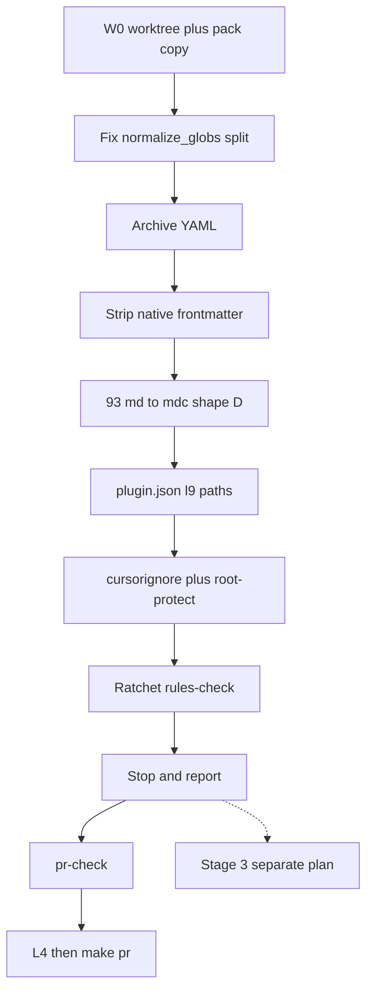

# PLAN: Execute rules-normalization pack (Stage 1–2)

> **Schema:** `canonical.schema.plan_document.v1` · **status:** `executable` after preflight SHA reverify
> **Execute:** [@environment/program-execution](environment/program-execution/) → Program Lock/Controller → [@autonomy](commands/autonomy.md) / `l9-bounded-autonomy` under a Program lease. Do not free-form mutate from this markdown.
> **Improve.md (2026-08-13):** plan-only remediation. Pack execute has not started.

## Execute via @environment/program-execution + autonomy (required)

```text
this .plan.md
  → @environment/program-execution  (Blueprint → Program Lock → Controller)
  → root autonomy/ + @autonomy (/autonomy → l9-bounded-autonomy)
  → PE adapter (default: cursor-foreground)
```

Program lease is authoritative. Autonomy must not widen Task Card ceilings or outlive the lease. `autonomous_merge: false`. Launching this plan / clicking Build is merge authorization for **this Stage 1–2 stack only** after green+mergeable (older open PRs first).

### Campaign packet stub

```yaml
authority: A4_CAMPAIGN_BOUNDED_EXTERNAL_WRITE
profile: pr-convergence
autonomous_merge: false
plan_id: plan.governance.rules-normalization-s1s2.v2
adapter_id: cursor-foreground
declared_branches: [chore/rules-normalization]
allowed_inside_packet:
  - execute_plan_todos_inside_envelope
  - commit_scoped_on_declared_branch
  - push_non_force_declared_branch   # only after L4 release_authorized
  - remediate_until_green
forbidden_inside_packet:
  - stage_3_retier_merge_or_alwaysApply_flip
  - cursor_rules_directory_symlink
  - force_push / admin_merge / expand_scope / weaken_gates
```

### Phase-0 ↔ PE Task Cards

| id | pe_task_id | wave | depends_on | mutation | isolation_key |
|----|------------|------|------------|----------|---------------|
| todo-01-baseline-preflight | TASK-001 | W0 | [] | false | preflight |
| todo-02-shared-parser | TASK-002 | W1 | [todo-01] | true | parser |
| todo-03-stage1-strip | TASK-003 | W1 | [todo-02] | true | frontmatter |
| todo-04-stage2-mechanical | TASK-004 | W1 | [todo-03] | true | stage2 |
| todo-05-report-stop | TASK-005 | W1 | [todo-04] | false | report |
| todo-06-prove | TASK-006 | W1 | [todo-05] | false | validate |
| todo-07-converge | TASK-007 | W2 | [todo-06] | true | pr |

**Stop / do not execute when:** worktree HEAD ≠ locked `origin/main` SHA; dirty overlap on `write_allow`; Stage 3 files appear in the diff; `alwaysApply` archive mismatch.

## Metadata

| Field | Value |
|-------|-------|
| plan_id | `plan.governance.rules-normalization-s1s2.v2` |
| schema_version | `1.0.0` |
| status | `draft` until SHA reverify on the worktree |
| owner | Cursor-Governance |
| created_at | `2026-08-13` |
| updated_at | `2026-08-13` (Improve.md pass) |

## Architect framing

| Field | Value |
|-------|-------|
| planning_ssot | [STANDARD.md](WIP/Cursor%20ToDo's/rules-normalization-pack/STANDARD.md) + [NORMALIZE_TASK.md](WIP/Cursor%20ToDo's/rules-normalization-pack/NORMALIZE_TASK.md) + [START-HERE-PROMPT.md](WIP/Cursor%20ToDo's/rules-normalization-pack/START-HERE-PROMPT.md) |
| plan_class | `bounded_execution_contract` |
| redesign_allowed | `false` |
| follow_on_schema_evolution_separate | `true` |
| framing_notes | Cursor-native frontmatter only. `rules/*.mdc` remains manifest SSOT. Stage 3 retiering is a separate plan. |

## Immutable baseline

| Field | Value |
|-------|-------|
| captured_at | `2026-08-13` |
| repository | `Quantum-L9/Cursor-Governance` |
| workspace_do_not_mutate | `/Users/ib-mac/Cursor-Governance` on `feat/wip-legal-defense-26cr-ingest` (WIP dirt) |
| mutate_in | **new git worktree** from `origin/main` |
| branch | `chore/rules-normalization` |
| commit_sha | `cb00181c7a29c20c137477fda8d35b1044913f17` |
| dirty | current clone `true` (unrelated WIP) — worktree must be `false` |
| overlap_policy | `require_clean_tree` on the worktree |
| on_drift | `stop_and_replan` |

**Pack source (untracked, not in origin/main):** `/Users/ib-mac/Cursor-Governance/WIP/Cursor ToDo's/rules-normalization-pack/`. Copy STANDARD + scripts from that path into the worktree. Do not mutate the legal-defense clone.

## Objective

Make every `rules/*.mdc` Cursor-native (three frontmatter fields, one glob shape) and fail-closed against reintroducing inert keys, without changing which rules are always-apply. Resurrect the ignored Perplexity protocol as **agent-selected**. Land a ratchet gate at the **measured** always-apply byte total. Stop before any retier/merge.

### Success properties

| id | property | evidence_type | proof | blocking |
|----|----------|---------------|-------|----------|
| SP-01 | Worktree HEAD equals locked SHA before first mutation | `repository_state` | `git rev-parse HEAD` == `cb00181c7a29c20c137477fda8d35b1044913f17` | true |
| SP-02 | No `alwaysApply` value differs from archive; Stage 1 bodies unchanged | `structural` | diff archive vs live `alwaysApply`; `git diff -U0 rules/*.mdc` shows frontmatter-only (except 93 rename) | true |
| SP-03 | `make pr-check` PASS on the worktree | `quality_gate` | `make pr-check` → PASS | true |
| SP-04 | No `.cursor/rules` symlink created | `filesystem` | `test ! -L .cursor/rules` | true |
| SP-05 | Comma-string globs round-trip as a list of patterns in `normalize_globs` | `structural` | unit test: `"a, b"` → `["a","b"]`; llm-rules `paths:` is a list not one joined string | true |
| SP-06 | `make rules-check` PASS at **remeasured** post-Stage-1 always-apply bytes; prefix/4k/500-line are warnings | `quality_gate` | checker stdout PASS; warnings listed | true |

## Capability preflight

| id | capability | command_or_action | pass_criteria | blocking |
|----|------------|-------------------|---------------|----------|
| CP-01 | `branch_and_HEAD_resolution` | `git fetch origin && git rev-parse origin/main` | equals locked SHA | true |
| CP-02 | `command_available` | `python3`, `git worktree` | both present | true |
| CP-03 | `pack_readable` | `test -f ".../rules-normalization-pack/STANDARD.md"` | file exists on main clone | true |
| CP-04 | `plugin_key_probe` | Inspect Cursor plugin examples + this repo `plugin.json` | do not add unverified Cursor-native `rules` key | true |

## Execution envelope

### Filesystem

- **write_allow:** `ops/scripts/lib/rule_frontmatter.py`, `ops/scripts/normalize_rules_frontmatter.py`, `ops/scripts/check_rules_standard.py`, `ops/scripts/tests/test_check_rules_standard.py`, `ops/scripts/tests/test_rule_frontmatter.py` (create if missing), `docs/rules-standard.md`, `docs/rules-frontmatter-archive.yaml`, `rules/*.mdc`, `rules/93-perplexity-research-protocol.md` (git mv), `rules/RULES-MANIFEST.{json,yaml,md}` (generator only), `environment/generated/llm-rules/**` (generator only), `.cursor-plugin/plugin.json`, `.cursorignore`, `ops/config/root-file-protection.json`, `Makefile` (append-only), `.pre-commit-config.yaml` (append-only)
- **write_deny:** `CANONICAL_LAW.md`, `ORG_INVARIANTS.yaml`, `CODEOWNERS`, `SECURITY.md`, `.claude/settings.json`, `.claude/hooks/**`, `rules/**` bodies except 93 frontmatter add, any Stage 3 merge targets
- **delete_allow:** none except `git mv` of `rules/93-perplexity-research-protocol.md`

### Commands

- **allow:** `git worktree add/lock`, pack copy, python normalizer/checker/sync, `make rules-check`, `make pr-check`, `make pr` after L4 release, `git commit` on declared branch after report
- **deny:** `git push --force`, hard-reset, `gh pr merge` outside L4 stack, Stage 3 retier commits, creating `.cursor/rules` symlink

### Network / secrets / merge

| Field | Value |
|-------|-------|
| network | `bounded_external_write` (GitHub only after L4 authorize-release) |
| secrets | `none` |
| autonomous_merge | `false` |

## Side effects and idempotency

| todo_id | side_effects | idempotency | compensation | irreversible |
|---------|--------------|-------------|--------------|--------------|
| todo-01-baseline-preflight | `filesystem_read` | `safe_to_repeat` | remove unused worktree | false |
| todo-02-shared-parser | `filesystem_mutation` | `safe_with_dedupe` | restore parser file | false |
| todo-03-stage1-strip | `filesystem_mutation` | `unsafe_blind_repeat` (archive must exist first) | restore from archive + git | false |
| todo-04-stage2-mechanical | `filesystem_mutation` | `safe_with_dedupe` | `git mv` back; revert plugin/ignore/gate | false |
| todo-05-report-stop | `none` | `safe_to_repeat` | n/a | false |
| todo-06-prove | `filesystem_read` | `safe_to_repeat` | n/a | false |
| todo-07-converge | `network_write` | `safe_with_dedupe` | abandon PR; no force-push | false |

**Commit contract (resolves START-HERE vs L4):** todos 02–05 do **not** commit. After the Stage 1–2 report is in-session, todo-07 may local-commit on the worktree branch. Push/`make pr` only after `python3 ops/autonomy/l4_local.py record-kernels && python3 ops/autonomy/l4_local.py authorize-release`.

## Architecture impact

| todo_id | bounded_context | layer | owning_contract | prohibited |
|---------|-----------------|-------|-----------------|------------|
| todo-02 | rules projection | `ops` | `ops/scripts/lib/rule_frontmatter.py` | second YAML parser |
| todo-03 | Cursor rules SSOT | `policy` | STANDARD.md Section 1–3 | alwaysApply flips; body edits |
| todo-04 | plugin + CI | `ops` | rule 84 v3.0.0; root-file-protection | `.cursor/rules` symlink; invert manifest generator to authored YAML |

## Live corpus (measured on current clone 2026-08-13; **re-measure on worktree**)

- 65 `.mdc` + 1 dead `.md`; 44 always-apply; **182,427 B** (~45,606 tok/turn)
- Dry-run strip: 60 files change; 0 unparseable; always-apply **182,427 → 181,169** (−1,258 B). Treat 181,169 as **hint only** until remeasured.
- Non-native keys on 8 files: `id, version, scope, domain, activation, authority, context_cost` (+ `supersedes` ×1)
- Prefix collisions: `01,03,05,87,88,95,96,97,98,99` — Stage 3; resurrecting 93 **adds** a second `93-` `.mdc`
- Missing descriptions (false + no globs + no description): **none** — skip Stage 1.5 invention

Stage 1 is hygiene. Token win is Stage 3 (out of scope).



## Grounded deviations (root-cause, not pack-literal)

1. **Do not invert `RULES-MANIFEST.yaml` to authored SSOT.** Generator already builds JSON+YAML+MD from `.mdc` ([ops/scripts/generate_rules_manifest.py](ops/scripts/generate_rules_manifest.py)). Keep that. Still `.cursorignore` JSON+MD (token intent).

2. **Gate path:** `ops/scripts/check_rules_standard.py`, not `tools/`.

3. **Ratchet, do not fail-closed on STANDARD §6 budgets in Stage 2.** Pack script at 12288 / 4096 / unique-prefix would fail now (13 always-apply files >4k; 10 collision groups; `92-learned-lessons` 807 lines). Hard-fail: native fields, no extra `.md` in `rules/`, glob string form, no `globs` when `alwaysApply: true`, `ALWAYS_BUDGET` = **remeasured** post-strip total (comment `target 12288`). Warn-only: prefix uniqueness, 4096, 500 lines.

4. **Discovery:** `l9-governance` plugin auto-discovers `rules/` under `~/.cursor/plugins/local/l9-governance` ([rules/84-cursor-governance-wiring.mdc](rules/84-cursor-governance-wiring.mdc)). **Do not** symlink `.cursor/rules`.

5. **plugin.json keys (Improve.md defect):** observed Cursor plugins (e.g. Vercel) use `"skills"`, `"agents"`, `"commands"` — **not** `"rules"`. Adding a speculative `"rules": "./rules"` can break plugin load (Unknown schema). Declare `"l9.rules_directory": "rules"` (and `"l9.skills_directory": "skills"`) on the existing `l9` object. Add Cursor-native `"skills": "skills"` only (verified). Add Cursor-native `"rules"` **only if** CP-04 finds it in Cursor’s schema; otherwise omit.

6. **Makefile / `.pre-commit-config.yaml` additive-only.** Append a **second** `.PHONY: rules-check` plus target. Do not rewrite the existing `.PHONY` line. Register new root `.cursorignore` in [ops/config/root-file-protection.json](ops/config/root-file-protection.json) as `managed`.

7. **Keep `93-perplexity-research-protocol.mdc` name** (second `93-` prefix). Do not retier the number in this wave.

8. **Shared glob parser (Improve.md P0).** Pack Stage 1 writes `globs: a, b`. Current [normalize_globs](ops/scripts/lib/rule_frontmatter.py) treats a string as **one** pattern, so Claude `llm-rules` `paths:` would become a single joined glob and path-scoped peers would misfire. Split on commas in `normalize_globs` **before** applying Stage 1. Emit frontmatter with YAML-safe quoting. Do **not** ship the pack’s naive line parser as a second SSOT parser — wrap `parse_rule()`.

## Wave 1 procedure

### todo-01 — worktree

```bash
git fetch origin
git worktree add -b chore/rules-normalization \
  "$HOME/.cursor-worktrees/cursor-governance-rules-norm" origin/main
# HEAD must be cb00181c7a29c20c137477fda8d35b1044913f17
```

Copy pack files from the main clone WIP path into the worktree working tree as inputs (not as a committed WIP tree).

### todo-02 — parser

Update `normalize_globs`: `str` → split on commas, strip, drop empties. Add a unit test. This is the highest-leverage change: one function, generator + llm-rules + future gate all correct.

### todo-03 — Stage 1

1. Land `docs/rules-standard.md` from pack STANDARD.md.
2. `python3 ops/scripts/normalize_rules_frontmatter.py --archive docs/rules-frontmatter-archive.yaml` **then** `--apply`.
3. Archive: one entry per `.mdc` (65). Preserve every removed key/value.
4. Frontmatter only: `description`, `globs` (omit if always-apply or empty), `alwaysApply`. Field order fixed. No body edits. No `alwaysApply` flips.
5. Stage 1.5: report empty missing-description list.

### todo-04 — Stage 2

1. `git mv rules/93-perplexity-research-protocol.md rules/93-perplexity-research-protocol.mdc`. Shape D: `alwaysApply: false` + trigger description (`Use when running Perplexity research after indexed docs are exhausted`). Append a note to the archive that 93 had no prior frontmatter. Grep leftover `.md` path refs.
2. plugin.json as deviation 5.
3. `.cursorignore`: `rules/RULES-MANIFEST.json` and `rules/RULES-MANIFEST.md`. Register `.cursorignore` in root-file-protection.
4. Append `make rules-check` + pre-commit hook (`files: ^(rules/|ops/scripts/check_rules_standard.py)`). Tests for native-field fail, budget ratchet, warn-vs-fail.
5. `python3 ops/scripts/sync_generated_artifacts.py` only — never hand-edit `RULES-MANIFEST.*` or `environment/generated/llm-rules/`.

### todo-05 — report then stop

Print: files changed; removed-field counts; always-apply bytes before/after (remeasured); unparseable; discovery mechanism; plugin.json keys actually added; ratchet integer; prefix-collision warnings including new `93-`; confirmation that 93 is **agent-selected not always-apply**. **Do not start Stage 3.**

### todo-06 / todo-07

`make rules-check` + `make pr-check`. Then kernels (`Recursive Alignment`, `Validate & Repair`), `l4_local.py begin` if needed → `record-kernels` → `authorize-release` → `make pr`.

## Stage 3 (follow-on plan — not this stack)

One rule per commit, largest bytes first. Do **not** use `10-write-authority.mdc` / `30-memory.mdc` (taken by `10-lang-typescript.mdc` / `30-framework-react.mdc`). Use free prefixes `11-` and `31-`. Promote warn-only checks to errors as retiering lands.

## Rollback

| domain | mode |
|--------|------|
| code | `git_restore_scoped_paths` / `revert_commit` on `chore/rules-normalization` |
| frontmatter | restore from `docs/rules-frontmatter-archive.yaml` |
| generated | `python3 ops/scripts/sync_generated_artifacts.py` |
| external | close/abandon PR; no force-push |

No irreversible ops. Automatic rollback not allowed.

## Complexity and uncertainty

| Field | Value |
|-------|-------|
| complexity | `medium` |
| uncertainty | `medium` (plugin `rules` key; worktree vs clone byte totals) |
| blast_radius | `medium` (global always-apply corpus; 93 newly discoverable) |
| architectural_boundaries_crossed | `1` (Cursor rules ↔ Claude llm-rules via shared parser) |
| unknown_dependency_count | `1` (Cursor plugin.json `rules` key) |

## Execution DAG

**Critical path:** `todo-01` → `todo-02` → `todo-03` → `todo-04` → `todo-05` → `todo-06` → `todo-07`

**Forbidden edges:** Stage 3 before report; commit before report; glob unification before `normalize_globs` split; push before L4 `authorize-release`.

## Property evidence matrix

| evidence_id | SP | method | command | expected_positive | status |
|-------------|----|--------|---------|-------------------|--------|
| EV-SP-01 | SP-01 | rev-parse | `git rev-parse HEAD` | locked SHA | `not_run` |
| EV-SP-02 | SP-02 | archive diff | compare `alwaysApply` per file | 0 flips | `not_run` |
| EV-SP-03 | SP-03 | pr-check | `make pr-check` | PASS | `not_run` |
| EV-SP-04 | SP-04 | test | `test ! -L .cursor/rules` | true | `not_run` |
| EV-SP-05 | SP-05 | pytest | `normalize_globs("a, b")` | `["a","b"]` | `not_run` |
| EV-SP-06 | SP-06 | rules-check | `make rules-check` | PASS + warnings | `not_run` |

## Stress and disconfirm

### Disconfirming questions

- If Cursor rejects unknown `plugin.json` keys, would `"rules": "./rules"` unload `l9-governance`? → **yes risk; do not add that key without CP-04.**
- If `normalize_globs` is left as “string = one pattern”, do glob-scoped Claude peers attach to the wrong files? → **yes; todo-02 is blocking.**
- If ALWAYS_BUDGET is hardcoded to 181,169 from this dirty clone, can `rules-check` fail on a clean `origin/main` worktree? → **yes; remeasure.**
- If Stage 2 enables unique-prefix fail-closed, is `make pr` impossible until Stage 3? → **yes; keep collisions as warnings.**

### Assumed false-ifs

- Pack WIP path remains readable on the main clone
- `origin/main` stays at `cb00181…` until worktree creation (reverify)
- Cursor still auto-discovers `rules/` under the local plugin root

### Blast radius

Wrong glob split: Claude path-scoped rules misfire. Wrong plugin key: governance plugin fails to load (all shared rules/skills/commands). Accidental alwaysApply flip: token budget and agent behavior. Accidental Stage 3: policy merges without approval.

## Out of scope

- Stage 3 retiering, merges (`31-memory` / `11-write-authority`), prefix renames, `00-global` trim
- Authored-YAML manifest inversion
- `.cursor/rules` symlink restoration
- Body edits, style rewrites, alwaysApply flips
- Touching START-HERE denylist files
- Committing the legal-defense WIP clone
- Weakening scanners to obtain PASS

## Convergence

| Field | Value |
|-------|-------|
| convergence_id | `conv.plan.governance.rules-normalization-s1s2.v2` |
| current_state | `execution_ready` after Improve.md (plan); pack execute not started |
| implementation_ready | `true` for Stage 1–2 given envelope + DAG |
| execute_via | `@environment/program-execution` → `@autonomy` under Program lease |
| broader_work_requires_separate_contract | `true` (Stage 3) |

This **plan** is improved and internally consistent. Pack execution remains unstarted until Build.

## Improve.md ledger (plan artifact only)

| Pass | Objective | Result |
|------|-----------|--------|
| 1 | Bind target | Plan file `~/.cursor/plans/rules_normalization_execute_941ed560.plan.md` |
| 2 | Discover | Missing PE contract; parser/glob split bug; unverified `rules` plugin key; hardcoded budget; commit-vs-START-HERE contradiction; worktree missing WIP pack |
| 3–5 | Remediate + entropy | Filled envelope/DAG/SP/stress; parser-first order; plugin.json fail-closed; remeasure budget; two-phase commit; copy pack into worktree |
| 6–7 | Validate | Structural only (plan markdown). Pack `make pr-check` = `not_run`. Runtime = `NotApplicable` |

- **status:** `Succeeded` for the plan artifact
- **pack execute:** `not_run`
- **convergence (plan):** `Converged` — further Improve passes on this markdown lack a high-value objective
- **residual:** Cursor native `rules` plugin key remains `Unknown` until CP-04 at execute
