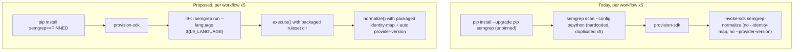

# Semgrep Identity Resolution, Global Ruleset, and Defect Remediation

## Objective

Close the dormant-capability gap identified in review: Semgrep identity resolution is fully built (`l9_ci/identity/resolver.py`, `_trusted_canonical_rule_id` in [l9_ci/providers/semgrep/provider.py](l9_ci/providers/semgrep/provider.py)) but never actually resolves anything today, because the 4 custom rule files use the wrong metadata shape, the identity map is an empty stub, and the downstream-facing workflows never pass `--identity-map`/`--provider-version`. On top of the 3 literal asks, this plan also collapses the ruleset-selection duplication across all 5 `l9-analysis*.yml` workflows into one SDK-owned, versioned global ruleset (Python + TypeScript) that ships with the SDK and needs zero per-consumer authoring, fixes the unpinned-Semgrep-version defect, corrects the governance README's stale "blocking" claims, and captures a real runtime fixture to close roadmap item P1's stated remainder.

This work is explicitly the next item on this repo's own `.l9/roadmap.yaml` (`P4: Semgrep shadow rollout`, currently `status: blocked` on `runtime-captured fixture required` + `live Core integration required`). The AGENTS.md "Phase 1: do not add Semgrep-specific code" text is stale/superseded -- `docs/source/phase-4.md` and the current `l9_ci/gates`, `l9_ci/execution`, `l9_ci/cli` packages show P0-P3 already shipped extensive new Semgrep-specific code since that text was written.

## Scope

**In (this repo, `l9-ci-sdk`, only):**
- Metadata shape fix in the 4 custom AST rule files (moved, not duplicated, into the new packaged ruleset location).
- Real entries in `.l9/semgrep-identity-map.yaml`, mirrored byte-for-byte into a packaged copy that ships with the SDK.
- A new global baseline security/quality ruleset -- one file set for Python, one for TypeScript -- authored with correct trusted metadata from day one.
- A new `l9-ci semgrep run` CLI command that wraps the SDK's already-built (but never CLI-exposed) `execute()` path, so every downstream workflow needs only `--language python|typescript` instead of duplicating `--config` blocks.
- Rewiring `l9-analysis.yml` + the 4 sibling workflows (`-merge`, `-nightly`, `-release`, `-supply-chain`) to use the new command, with an exact Semgrep version pin.
- Rewiring `l9-self-ci.yml`'s dogfood semgrep step to actually flow through SDK normalization (today it only uploads raw JSON telemetry, so the AST rules' identity resolution is currently never exercised even after the metadata fix).
- Governance README correction (Defect 3: doc says blocking default for merge/release/supply_chain; `execution-profiles.yaml` says advisory for all five profiles -- doc will be corrected to match the enforced reality, not the reverse, since flipping real enforcement without the 20-run/7-day evidence bar in `promotion-policy.yaml` would itself be a violation).
- Capturing one real, redacted, provenance-documented Semgrep fixture from an actual local run against this repo, replacing the synthetic `tests/fixtures/semgrep/results.json`.
- `.l9/roadmap.yaml`, `.l9/architecture.yaml`, `.l9/ownership.yaml` updates reflecting the new `l9_ci.rulesets` package and the closed P1 remainder.
- New/updated tests for every code path touched; a new ADR documenting the SDK-owned-execution decision.

**Out:**
- Anything in `Quantum-L9/l9-ci-core` (Defect 2, the "Core's template vs SDK's own workflow disagree" mismatch, is explicitly excluded -- Core will be realigned separately).
- `l9_ci/policy` / `sdk_policy` (`.l9/semgrep-policy.example.yaml`) population -- a separate, optional per-finding policy layer, not requested here.
- Flipping any `default_mode` in `execution-profiles.yaml`/`rule-modes.yaml` from advisory to blocking -- no observation-run evidence exists yet per `promotion-policy.yaml`.
- Adding a second provider (roadmap `P5` stays `deferred`).
- ESLint/tsc/vitest wiring (separate, ungoverned-by-SDK gates per the governance README's Node preset section).

## Architecture: before vs after

The packaged ruleset/identity-map live once, inside the SDK, and are resolved via `importlib.resources` at CLI runtime -- so a downstream consumer's only per-repo configuration is a single `L9_LANGUAGE` env line, replacing the governance README's current instruction to hand-edit `--config`.

## TODO Plan

0. **Pre-flight: protect the existing working tree**
   - Before touching anything, capture `git status --short`, `git diff --cached --stat`, `git diff --stat`, `git diff --cached`, `git diff` -- the branch already carries unrelated pending changes (`.gitignore`, `AGENTS.md`, `l9_ci/__init__.py`, `ruff.toml`, `pyproject.toml`, `README.md`, `.vscode/`, `.github/CODEOWNERS`, `memory-bank/*`).
   - This plan's diff must stay scoped to: `.semgrep/` (removed), `l9_ci/rulesets/**`, `l9_ci/commands/semgrep.py`, `.l9/semgrep-identity-map.yaml`, `.l9/roadmap.yaml`, `.l9/architecture.yaml`, `.l9/ownership.yaml`, `pyproject.toml` (packaging section only), the 5 `l9-analysis*.yml` + `l9-self-ci.yml` workflows, `.github/governance/README.md`, `docs/adr/0009-*.md`, and the tests listed in Task 10.
   - Explicitly do **not** fold in `.github/CODEOWNERS`, `.vscode/*`, or `memory-bank/*` -- those are pre-existing unrelated changes in the tree and are not required to restore identity resolution or ship the ruleset.
   - Effort: XS. Risk: Low -- purely a scoping/hygiene gate, no code change.

1. **Move + fix the 4 AST rule files' metadata shape**
   - Files: [.semgrep/l9-transport.yml](.semgrep/l9-transport.yml), [.semgrep/l9-routing.yml](.semgrep/l9-routing.yml), [.semgrep/l9-handler-signature.yml](.semgrep/l9-handler-signature.yml), [.semgrep/l9-logging.yml](.semgrep/l9-logging.yml) -> moved to new `l9_ci/rulesets/semgrep/python/`.
   - Change every rule's `metadata: {l9_rule_id: AST-X-00N, ...}` to `metadata: {l9: {canonical_rule_id: AST-X-00N}, ...}` (16 rules total), matching what [l9_ci/providers/semgrep/provider.py](l9_ci/providers/semgrep/provider.py) `_trusted_canonical_rule_id()` actually reads.
   - `.semgrep/` directory removed once empty; [.github/workflows/l9-self-ci.yml](.github/workflows/l9-self-ci.yml)'s `--config .semgrep/` reference updated to the new path.
   - Effort: S. Risk: Low (mechanical, covered by existing unit tests once updated).

2. **Author the new global baseline ruleset (Python + TypeScript)**
   - New files: `l9_ci/rulesets/semgrep/python/l9-baseline-security.yml`, `l9_ci/rulesets/semgrep/typescript/l9-baseline-security.yml`.
   - Each rule ships with correct trusted metadata (`l9.canonical_rule_id`) from creation, `mode: shadow` initially (per `promotion-policy.yaml`'s `disabled -> shadow -> advisory -> blocking` staged rollout -- nothing here is promoted to advisory/blocking without observation evidence).
   - Representative categories (exact rule bodies finalized during implementation against the real fixture from Task 8, not guessed): Python -- `exec`/`eval` use, `subprocess` with `shell=True`, unsafe `pickle.load`/`yaml.load`, SQL built via string formatting, hardcoded credential-looking assignments, TLS verification disabled, bare/broad `except`. TypeScript/JavaScript -- `child_process.exec` with untrusted input, `eval`/`Function` constructor, prototype pollution via unguarded `Object.assign`/deep-merge, JWT `alg: none` or hardcoded secret, CORS wildcard with credentials, string-concatenated SQL, unsanitized `path.join` traversal.
   - New `l9_ci/rulesets/semgrep/__init__.py` exposing `ruleset_dir(language)` / `default_identity_map_path()` via `importlib.resources`.
   - Effort: M. Risk: Medium (rule false-positive tuning; mitigated by shipping in shadow mode).

3. **Populate the identity map (real entries, no fabrication)**
   - [.l9/semgrep-identity-map.yaml](.l9/semgrep-identity-map.yaml) populated with curated `check_id -> canonical_rule_id` entries for the highest-confidence community `p/python`/`p/javascript`/`p/typescript` checks (e.g. the already-fixture-referenced `python.lang.security.audit.exec-used.exec-used`), verified against the real captured output from Task 8 rather than guessed IDs.
   - Packaged mirror at `l9_ci/rulesets/semgrep/identity-map.yaml`; a new test asserts the two files stay identical (single logical source of truth, two conventional paths).
   - Effort: S. Risk: Low.

4. **New `l9-ci semgrep run` command**
   - File: [l9_ci/commands/semgrep.py](l9_ci/commands/semgrep.py) -- add a `run` subcommand: `--language {python,typescript}`, `--root`, `--raw-output`, `--bundle-output`, `--snapshot-id`/`--derive-snapshot`, `--revision`, `--strict`, `--required`, `--policy`, optional `--identity-map`/`--extra-config` overrides.
   - Composes only existing building blocks -- `SemgrepProvider.validate_configuration()`, `.execute()`, `.execution_failure()`, and `run_semgrep_pipeline()` -- resolving the packaged ruleset dir + identity map automatically and threading `provider.detect_version()` into `provider_version` (closes the "`--provider-version` never passed" half of Defect 1 without any workflow change).
   - Before wiring this in as *the* interface: inspect `grep -nA20 -B5 '\[project.scripts\]' pyproject.toml` and `.l9/integration-contract.yaml` to confirm the existing declared entry point (e.g. `l9-ci`) and its existing subcommand contract, so `semgrep run` is added as a new subcommand under the actual declared console script -- not a second, undeclared interface.
   - Effort: M. Risk: Medium (first CLI exposure of the execute() path; mitigated -- it only recomposes already-tested primitives, no new provider logic).

5. **Package the rulesets as SDK data -- and prove it from a built wheel, not an editable install**
   - [pyproject.toml](pyproject.toml): confirm/add hatch wheel inclusion for `l9_ci/rulesets/**/*.yml` (verify at implementation time whether `packages = ["l9_ci"]` already carries non-`.py` files or needs an explicit `force-include`).
   - `pip install -e .` is not sufficient proof here -- an editable install still resolves resources from the source checkout even if the wheel manifest is wrong. Validate instead with a real build:
     - `rm -rf build dist && python -m build` (in the repo, isolated `.venv-build`).
     - `python -m zipfile -l dist/*.whl` (and `tar -tf dist/*.tar.gz`) -- confirm `l9_ci/rulesets/**/*.yml` and the identity-map file are actually present in the archive listing.
     - Install the wheel into a **separate venv outside the repo** (e.g. `/tmp/l9-sdk-wheel-test`), `cd /tmp`, then run `python -c "import l9_ci; print(l9_ci.__file__)"` and the new `l9-ci semgrep run --language python` command from that installed wheel -- proving `importlib.resources` resolution works when there is no source tree to silently fall back to.
   - This step gates Task 6 (workflow rewiring): the workflows will run `l9-ci semgrep run` against a `pip install`-ed SDK, so if resource resolution only works from an editable/source checkout it will fail identically in CI.
   - Effort: S (was XS -- the added build/install verification is real work, not a formality). Risk: Low once verified, Medium if skipped (silent resource-loading failure that only surfaces in CI, not locally).

6. **Rewire all 5 downstream-facing workflows**
   - [.github/workflows/l9-analysis.yml](.github/workflows/l9-analysis.yml), `-merge`, `-nightly`, `-release`, `-supply-chain` (all currently byte-identical in their semgrep step).
   - Pin `pip install "semgrep==<verified-latest-supporting-1.100.0-minimum>"` (exact value confirmed at implementation time, not guessed).
   - Reorder `provision-sdk` before the scan step; collapse "Run semgrep" + "Normalize provider report" into one `l9-ci semgrep run --language ${{ env.L9_LANGUAGE }}` shell step (direct executable call, not through Core's `invoke-sdk` composite action -- sidesteps any assumption about whether that action forwards `identity-map`/`provider-version` inputs, which cannot be verified since Core is out of scope).
   - New single-line-per-workflow `env: L9_LANGUAGE: python` replaces the current multi-line `--config` comment block; downstream `validate-bundle`/`route-artifacts`/`publish` steps are untouched.
   - Effort: M. Risk: Medium (5 files, mechanical once the pattern is proven on one; the "Core action input schema" risk is explicitly designed around, not assumed away).

7. **Rewire `l9-self-ci.yml`'s dogfood step**
   - Today it only runs `semgrep --config .semgrep/ ... --output semgrep.json` and uploads it as telemetry -- never normalized through the SDK, so the AST rules' identity resolution is currently unverified in practice even by this repo's own CI.
   - Add an `l9-ci semgrep normalize` (or `semgrep run`) call so the fixed metadata is continuously exercised.
   - Effort: S. Risk: Low.

8. **Capture a real runtime fixture**
   - Run Semgrep locally against this repo with the new packaged ruleset + `p/python`, redact per the exact schema in `docs/source/phase-4.md`'s "Fixture closure" section, write `tests/fixtures/semgrep/results.captured.json` + its provenance record.
   - Update `.l9/roadmap.yaml`: close P1's "remaining: replace representative fixture with runtime capture"; mark P4's "runtime-captured fixture required" blocker resolved (the "live Core integration required" blocker stays, out of scope).
   - Effort: M. Risk: Low (local-only, no Core dependency).

9. **Fix Defect 3 (governance README)**
   - [.github/governance/README.md](.github/governance/README.md): correct the "Resolved behavior of this pack" table (merge/release/supply_chain shown as `blocking`, actual `execution-profiles.yaml` says `advisory` for all 5 profiles) to match the enforced reality.
   - Update the "Python vs Node.js" table and "Wiring" section's step 2 to describe setting `L9_LANGUAGE` instead of hand-editing `--config`.
   - Effort: S. Risk: Low (docs-only).

10. **Tests, architecture metadata, ADR**
    - Update `tests/providers/semgrep/test_provider.py` (trusted-metadata resolution now succeeds for the fixed shape), `tests/pipeline/test_semgrep_pipeline.py`/`test_semgrep_release_path.py`, add `tests/commands/test_semgrep_run_cli.py`, `tests/rulesets/test_identity_map_parity.py`.
    - `.l9/architecture.yaml` + `.l9/ownership.yaml`: register the new `l9_ci.rulesets` layer (leaf package, no dependents), update `tests/architecture/test_dependency_boundaries.py`/`test_public_api.py`/`test_schema_inventory.py` accordingly.
    - New `docs/adr/0009-sdk-owned-semgrep-execution.md` documenting the decision to expose `execute()` via CLI and own the global ruleset centrally.
    - Effort: M. Risk: Low.

## Dependencies

- Task 0 (pre-flight scope guard) runs first and is re-checked before the final patch is assembled, so no unrelated pre-existing tree changes leak into this diff.
- Task 1 (metadata fix) blocks Task 3 (identity map parity test) and Task 7 (self-ci normalization becoming meaningful).
- Task 2 (new baseline rules) + Task 5 (packaging + clean-build proof) block Task 4 (`semgrep run` needs a resolvable ruleset dir) and Task 6 (workflows run against a `pip install`-ed SDK, so Task 5's wheel proof must pass first).
- Task 4 blocks Task 6 (workflows call the new command) and Task 8 (fixture capture uses the same execution path for consistency).
- Task 8's real check_ids feed back into Task 3's identity-map entries (sequence: 0, 1, 2, 5, 4, then 3 finalized, then 6, 7, 8, 9, 10 can run in parallel with 6-8).

## Exit criteria before this plan is considered done

- `python -m build` produces both a wheel and sdist with no errors.
- The wheel installs cleanly in a venv outside this repo (no `PYTHONPATH`/source-checkout access).
- `import l9_ci` and the new `l9-ci semgrep run` command resolve and execute from that installed wheel, not the source tree.
- `l9_ci/rulesets/**/*.yml` and the packaged identity-map file are present in the wheel per `python -m zipfile -l`.
- Every CLI path exercised is one already declared in `pyproject.toml`'s `[project.scripts]` / `.l9/integration-contract.yaml`, plus the new `semgrep run` subcommand added under that same declared entry point.
- `pytest -q`, `ruff check .`, `ruff format --check .` all pass against the source tree.
- The final diff matches Task 0's scoped file list -- no `.github/CODEOWNERS`, `.vscode/`, or `memory-bank/` changes folded in.
- `.l9/roadmap.yaml` P1 remainder and one P4 blocker are marked closed, with the repo at a single clean, immutable commit.

## Risks

- Core's `invoke-sdk` composite action's actual input schema is unverifiable from this repo -- mitigated by calling the SDK executable directly in the rewired step instead of relying on Core forwarding new `with:` inputs.
- New baseline rules may false-positive against real code -- mitigated by shipping `mode: shadow` only; no blocking/advisory promotion without `promotion-policy.yaml` evidence.
- `l9-ci semgrep run` is the first CLI exposure of the execute() path -- mitigated by pure composition of already-tested primitives (`execute`, `execution_failure`, `run_semgrep_pipeline`), no new provider behavior.
- Exact Semgrep version pin and exact new rule/identity-map IDs are deliberately left unspecified in this plan (would otherwise be guessed) -- resolved during implementation against a live `semgrep --version`/registry check and the Task 8 real fixture, not fabricated.
- An editable install (`pip install -e .`) can mask a broken wheel manifest -- mitigated by Task 5's requirement to build and install the actual wheel in a venv outside the repo before Task 6 proceeds.
- The dirty working tree already contains unrelated pending changes -- mitigated by Task 0's explicit scope list and a final `git diff --stat` check before considering the patch complete.

## Estimate

**Total:** ~1-2 focused implementation sessions (11 tasks, ~20 files touched, no Core dependency).
**GMPs:** Recommend 2 GMP runs -- one for Tasks 0-5 (scope guard + identity + ruleset + CLI + clean-build proof, `RUNTIME_TIER`/library code), one for Tasks 6-10 (workflow rewiring + fixture capture + docs, mixed `INFRA_TIER`/`UX_TIER`). Both are outside the protected-core list in `90-protected-core.mdc`.
