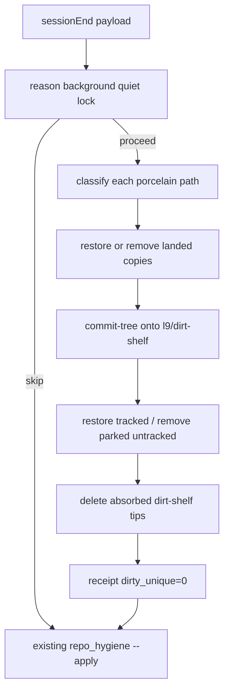

# SessionEnd dirt close (classify, clean, prune)

**Skill:** `l9-plan-simple` (Cursor Build). Do not run `make campaign`. Do not admit a Program Lock. Do not write `Lock: origin/main = <sha>`.

**Depth:** `deep` — `route_plan.py --risk high --evidence partial` prints `depth=deep`, `omit_gates=[]`.

**Hook catalog:** [`.pre-commit-config.yaml`](.pre-commit-config.yaml)

## Locked (supersedes earlier /ff and park-only-durable notes)

Hygiene **completes the loop**. It does not hand leftover dirt to `/ff`, harvest, or a human inventory of preserve refs.

- **Dirty file** = a porcelain path whose bytes are **novel**: not `origin/main`, not an open-PR blob at the same path, not generated noise, not a secret/Legal Defense leave-behind.
- After a completed sessionEnd, `dirty_files` is **0**. An agent asked "what dirty files are there" reports that number from `--status`, not `git status --porcelain`.
- Copies already on main or an open PR are **removed from the tree and not parked**. They are not "maybe missing work."
- Novel unique bytes go on **one rolling** `refs/heads/l9/dirt-shelf`. Not a new `worktree-dirt/<stamp>` per session.
- Absorbed parks (every path now on main or an open PR) are **deleted** after the tip SHA is written to the receipt. That is how the basement stays empty.
- `/ff` is unchanged and is **not** a dependency. `ff.sh` stays push-off. Do not add a worktree-dirt drain to the slash.

SSOT refuse-swap / write-gate stay out. SessionEnd still does not `make pr` or merge.



## Why today's tools fail the honest-zero test

[`repo_hygiene.py`](ops/scripts/repo_hygiene.py) **reports** porcelain and never classifies it. `git status --porcelain` on this checkout is ~22 untracked WIP/plans; many such piles are already on `origin/main` or an open PR ([`prune_open_pr_copies.py`](skills/l9-git-work-preserve/scripts/prune_open_pr_copies.py) already knows that blob test). Agents dump the porcelain list, so you chase a basement.

[`stop_dirt_at_source`](docs/plans/stop_dirt_at_source_f93621d0.plan.md) T3 parks without cleaning. Stamp-per-session refs become the basement.

`/ff` shelves leftover **untracked files still in the tree** and never revisits what it parked ([`l9-repo-sync/SKILL.md`](skills/l9-repo-sync/SKILL.md) handoff). It is a manual catch-up, not a dirt closer.

## Immutable baseline (workspace bind, not a Program Lock)

- Repo `/Users/ib-mac/Cursor-Governance`, branch `main` @ `19756329`, dirty (~22 untracked WIP/plans). Symptom, not a lock.
- Implement on `feat/session-end-dirt-close` from fetched `origin/main` in a dedicated worktree. Rule 49 isolation, not a Program Lock.

## Objective + success properties

**Objective:** After a completed (or idle `window_close` / `user_close`) sessionEnd, the session workspace has `dirty_files=0`. Landed copies are gone. Novel unique bytes exist only on `l9/dirt-shelf`. Absorbed parks are gone. `--status` is the honest answer.

- **SP-01** Unique modified + unique untracked → porcelain empty; both paths on `l9/dirt-shelf`; `dirty_unique=0`.
- **SP-02** Third path blob-equals `origin/main` → not on the shelf; gone from the worktree; no park.
- **SP-03** `WIP/Legal Defense/x` and `*credentials*.json` stay on disk; never temp-indexed.
- **SP-04** Second `--apply` on a clean tree: no new shelf commit if the tree sha is unchanged.
- **SP-05** `reason=aborted|error` or `is_background_agent=true`: zero mutations.
- **SP-06** Closable-path mtime inside quiet window (default 120s): skip.
- **SP-07** Repo-write lock held: skip.
- **SP-08** Tracked generated-only delta: restore HEAD, not parked.
- **SP-09** Untracked file whose sha256 equals an **open-PR** blob at the same path (reuse [`prune_open_pr_copies.py`](skills/l9-git-work-preserve/scripts/prune_open_pr_copies.py)): removed, not parked.
- **SP-10** Existing `l9/dirt-shelf` (or leftover stamp ref) whose every path now matches main or an open PR: ref deleted; tip SHA in receipt; `--status` does not list those paths as dirty or as novel parked.
- **SP-11** Fixture with 50 untracked paths all `already_on_baseline`: `--status` before apply reports `dirty_unique=0 already_landed=50`; after apply, tree empty of those 50 and `dirty_unique=0`. An agent dumping porcelain would have said 50. Hygiene must not.

## Mechanism (one hook, one module)

Keep [`ops/hooks/hooks.json.template`](ops/hooks/hooks.json.template) `sessionEnd` → `session-end-repo-hygiene.sh`. Call dirt-close **before** `repo_hygiene.py --apply`.

New [`ops/scripts/session_end_dirt_close.py`](ops/scripts/session_end_dirt_close.py):

```bash
python3 ops/scripts/session_end_dirt_close.py --workspace "$WS" --status
python3 ops/scripts/session_end_dirt_close.py --workspace "$WS" --apply
```

**Scope:** session workspace from the payload only. Not sibling worktrees.

**Gates:** `L9_HYGIENE_DIRT_CLOSE=0`; skip `aborted|error`; skip background agent; quiet 120s; skip if `repo_write_lock_holder` nonempty; fail-open.

**Classify** (reuse, do not copy sets):

- Noise / wiring: [`harvest_worktree_dirt.py`](skills/l9-git-work-preserve/scripts/harvest_worktree_dirt.py)
- Secrets / Legal Defense: same skip list as `/ff` execute.md — leave, never add
- Generated: [`ops/scripts/lib/dirtiness.py`](ops/scripts/lib/dirtiness.py)
- `already_on_baseline`: blob equals `origin/main`
- `already_on_open_pr`: sha256 equals an open-PR blob at the same path ([`prune_open_pr_copies.py`](skills/l9-git-work-preserve/scripts/prune_open_pr_copies.py) `sha256_file` / `sha256_blob` / `path_key`)
- Unique novel: everything else that is a real file

**Landed copies (`already_on_baseline` | `already_on_open_pr` | generated):** restore tracked from HEAD; remove untracked. No park.

**Novel unique:** temp `GIT_INDEX_FILE`, `add` those pathspecs only, `write-tree`, `commit-tree` with parent = current `l9/dirt-shelf` if it exists else `HEAD`, `update-ref refs/heads/l9/dirt-shelf`. Then restore/remove those paths only after `git cat-file -e <shelf>:<path>`.

One branch. No `worktree-dirt/<stamp>` spam. Dedupe: skip the new commit when the tree sha equals the current shelf tip.

**Prune absorbed:** for `l9/dirt-shelf` and any leftover `refs/l9/preserved/worktree-dirt/*`, if every path is now main or open-PR, write tip SHA to the receipt, `git update-ref -d`. If some paths remain novel, rewrite the shelf tree to only those paths (or keep the tip). Do **not** invoke `prune_execute.py` or require `L9_GIT_PRUNE_AUTHORIZED`.

**`--status` JSON** (this is the agent answer):

- `dirty_files`: novel unique porcelain paths (the only list that may be called "dirty")
- `already_landed`: porcelain paths that match main or an open PR
- `left_in_tree`: secrets / Legal Defense / noise (named, not dirty)
- `novel_parked`: paths still only on `l9/dirt-shelf`
- `absorbed_pruned`: refs deleted this run

`dirty_files=0` is the honest zero. `novel_parked` is a separate queue (unique work that has not landed). It must not be dumped as "dirty files." If `novel_parked>0`, say "N unique paths on l9/dirt-shelf" — not 100 dirty files.

Receipt: `<ws>/.l9/hygiene/dirt-close-<utc>.json`. Hook line: `dirt-close dirty_unique=0 already_landed=N novel_parked=N absorbed_pruned=N`.

Cap 200 novel paths per run; leftover unique stay in porcelain and appear in `dirty_files` (honest, not a silent drop).

## Doctrine (append only)

- [`AGENTS.md`](AGENTS.md): `<!-- L9_SESSION_END_DIRT_CLOSE_V1 -->` — sessionEnd dirt-close is the loop; `--status` is the dirty-files answer; `/ff` is not the closer; secrets left; kill switch `L9_HYGIENE_DIRT_CLOSE=0`.
- [`REPO_HYGIENE.md`](ops/scripts/REPO_HYGIENE.md): landed copies in the session workspace are removed; sibling dirty worktrees still untouched; absorbed dirt-shelf tips are deleted after receipt.
- [`session_end_repo_hygiene.sh`](ops/hooks/session_end_repo_hygiene.sh): gates + call site.
- [`rules/49-shared-worktree-isolation.mdc`](rules/49-shared-worktree-isolation.mdc): this session workspace only.

Do not edit `CANONICAL_LAW.md`. Do not change `l9-repo-sync` / `/ff` for this.

## Out of scope

- `/ff` drain, `/ff` publish, teaching triage `PRESERVE_PATTERNS` as the closer
- `make pr` / `git push` / merge from sessionEnd
- Auto-commit onto the current feature branch
- Cleaning sibling worktrees
- SSOT write-gate / activate refuse-swap
- `prune_execute.py` / deleting open-PR heads / `campaign/*`
- Installing a git commit hook

## Stress and disconfirm

- **Mid-edit sessionEnd:** reason + quiet + lock gates stay load-bearing (SP-05/06/07).
- **Park then rm loses the only copy:** forbidden unless `cat-file` proves the path on `l9/dirt-shelf`.
- **Open-PR match is wrong without fetch:** fail-open on `gh` error and leave those paths in porcelain (`dirty_files` may stay non-zero). Do not treat "gh failed" as "already landed."
- **Prune of a novel shelf:** only when **every** path is absorbed. Partial absorption rewrites the shelf down; it does not delete unique paths.
- **90s timeout:** classify is blob compares; cap 200; fail-open.
- **Assumed false if:** an agent answers "dirty files" from raw porcelain, or sets `L9_HYGIENE_DIRT_CLOSE=0` to hide dirt.

**Blast radius:** wrong open-PR match could drop a file that only looks like a PR blob (same path + sha256 is the same bytes — that is the shipped-copy definition already used). Wrong quiet-gate skip leaves dirt (honest `--status`). Rollback: `L9_HYGIENE_DIRT_CLOSE=0`; shelf tip SHA in receipts.

## Doc / root surface impact

- `AGENTS.md`: append fragment
- `CANONICAL_LAW.md`: N/A
- `ARCHITECTURE.md`: N/A
- Makefile / pyproject / requirements: N/A

## Convergence

- `kind: simple`, `execute_via: cursor-build`
- Ends at: fixture pytest PASS, scoped local commits, publish not taken
- On Build: emit PLAN_DOCUMENT + project `docs/plans/session_end_dirt_close_<8hex>.plan.md`

## Execute via Cursor Build

Press **Build**. Cut the clean branch from `origin/main`; all edits land there.

- Do not run `make campaign`.
- Do not admit a Program Lock or Controller lease.
- Do not write `Lock: origin/main = <sha>`.
- Do not push or open a PR; stop after the scoped commit and wait for the human to type `make pr`.
