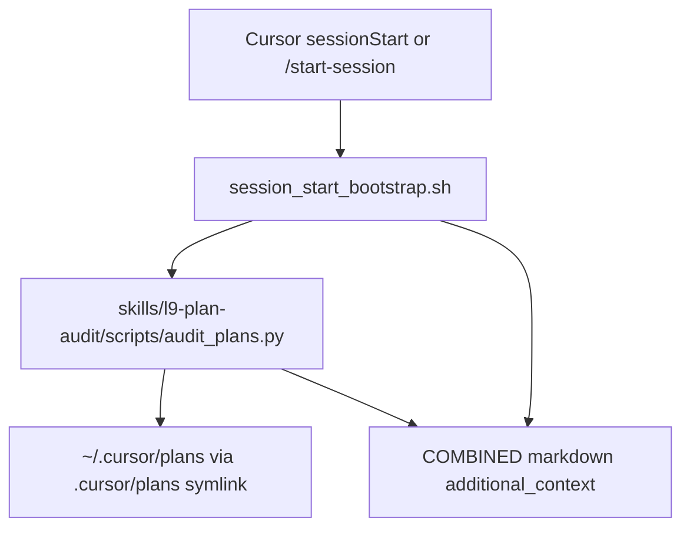

# Session-start plan audit skill

## Objective

Ship a tested `l9-plan-audit` skill whose CLI audits the machine-global Cursor plans directory, then wire that CLI into the sessionStart bootstrap so findings appear in `additional_context` after the session start script runs (automatic hook **and** `/start-session` → `make start`).

## Locked decisions (defaults)

- **Scan root:** resolve `<workspace>/.cursor/plans` if present (symlink to `~/.cursor/plans`), else `$HOME/.cursor/plans`. Plans are global; no per-workspace storage redesign.
- **Window:** filesystem mtime within last **7 days** (body `created_at` is almost never filled).
- **Unbuilt:** any frontmatter todo with `status` in `{pending, in_progress}`, **or** `todos: []` / missing todos. All-`completed`/`cancelled` → skip. Always exclude `_TEMPLATE.plan.md`.
- **Staleness flags** (additive labels on each unbuilt candidate):
  - `empty_todos` — no actionable todo list
  - `in_progress` — at least one `in_progress` todo
  - `baseline_drift` — body `immutable_baseline.commit_sha` present and ≠ open workspace `HEAD` (when git HEAD available)
  - `superseded` — body Metadata `status: superseded`, or a newer same-slug `*_XXXXXXXX.plan.md` exists
  - `missing_execute_section` — body lacks `## Execute via @environment/program-execution`
- **Agent behavior:** **display-only** in session context (no auto-Build). `/start-session` STATE_SYNC gains a Plan audit row; Ready For keeps `/ynp` as the optional next step.
- **Fail-open / budget:** audit never fails the hook; hard wall-clock ~2s; markdown budget ~1200 chars; top **5** plans by mtime desc; bootstrap always `exit 0`.
- **No unrelated remediation:** ignore out-of-band scanner noise and files not in this plan’s envelope (explicitly including any `openai_fixed_host.py` / urllib CWE-939 WARNING). Do not investigate, fix, or expand scope for that drift.

## Depth

**deep** — touches high-risk [`ops/hooks/session_start_bootstrap.sh`](ops/hooks/session_start_bootstrap.sh) (AGENTS.md §5.2) and session context contract. Baseline gates + rollback + denser unknowns.

## Architecture



Skill owns the deterministic scanner + tests; bootstrap only shells out and inserts a section (same pattern as hydrate/code-graph fields).

## Current ground truth (reuse)

| Piece | Path / fact |
|-------|-------------|
| Session findings emitter | [`ops/hooks/session_start_bootstrap.sh`](ops/hooks/session_start_bootstrap.sh) builds `## L9 session state` → JSON `additional_context` |
| Slash path | [`commands/start-session.md`](commands/start-session.md) → `make start` → **same** bootstrap |
| Installed hook copy | Real file `~/.cursor/hooks/session-start-bootstrap.sh`, refreshed by activate/symlink setup |
| Plan shape | YAML frontmatter `name` / `overview` / `todos[].status` / `isProject`; no `built` field |
| Template exclude | `_TEMPLATE.plan.md` (mirror of [`environment/contracts/execution/templates/canonical.template.executable_plan.v1.plan.md`](environment/contracts/execution/templates/canonical.template.executable_plan.v1.plan.md)) |
| Skill wire SSOT | [`skills/AUTONOMY_MANIFEST.yaml`](skills/AUTONOMY_MANIFEST.yaml) → `sync_generated_artifacts.py` |
| Exemplars | Pack shape: `l9-plan`; session lifecycle pairing: `l9-graphiti-memory` + `/start-session` |

## Implementation todos

### 1. Compile skill pack `l9-plan-audit`

Create [`skills/l9-plan-audit/`](skills/l9-plan-audit/) via `l9-skill-compiler` contract:

- `SKILL.md` — triggers: sessionStart findings, `/plan-audit`, “which plans are unbuilt/stale”
- `agents/meta.yaml`
- `references/staleness-rules.md` — window, unbuilt, flags (SSOT for humans + tests)
- `scripts/audit_plans.py` — CLI:
  - `--plans-dir`, `--window-days` (default 7), `--workspace` (for HEAD drift), `--format markdown|json`, `--budget-chars`, `--limit`
  - stdout only; stderr ignored by hook; exit 0 on soft failures (missing dir → “no plans dir”)
- `scripts/self_test.py` + `fixtures/` — synthetic `.plan.md` corpus covering: recent unbuilt, completed (excluded), old unbuilt (excluded by window), empty todos, baseline drift, superseded slug, missing execute section, `_TEMPLATE` ignored
- Validation block in SKILL.md lists the self-test commands

### 2. Wire skill into discovery

Run `l9-wire-skill-into-repo`:

- Tier: **`auto_invoke`** (agents may load when user asks about plans / after seeing the section)
- Add [`commands/plan-audit.md`](commands/plan-audit.md) — on-demand: run the same CLI against the open workspace, print findings (mirrors `/start-session` “run script, present output”)
- Sync: `python3 ops/scripts/sync_generated_artifacts.py --root "$(pwd)" --force`
- Do not hand-edit `ops/generated/skill-registry.json` or `commands/COMMANDS_MANIFEST.yaml`

### 3. Wire into sessionStart bootstrap (+ degraded path)

Edit [`ops/hooks/session_start_bootstrap.sh`](ops/hooks/session_start_bootstrap.sh):

1. After orchestrator hydrate/code-graph eval (~line 338), run:

```bash
PLAN_AUDIT_MD="plan audit: skipped"
AUDIT_PY="$GC/skills/l9-plan-audit/scripts/audit_plans.py"
if [ -f "$AUDIT_PY" ]; then
  PLAN_AUDIT_MD="$(
    python3 "$AUDIT_PY" \
      --workspace "${CURSOR_PROJECT_DIR:-$PWD}" \
      --window-days 7 \
      --format markdown \
      --budget-chars 1200 \
      --limit 5 \
      2>/dev/null || echo "plan audit: unavailable"
  )"
fi
```

2. Append to live `COMBINED` (and degraded no-SSOT stub for shape parity):

```text
### Plan audit
${PLAN_AUDIT_MD}
```

3. Constraints preserved: single JSON stdout, **`exit 0`**, no second `sessionStart` hook, no mid-hook network.

Optional micro-hardening (same PR): wrap with `python3 -c` deadline or `timeout 2` if available so a hung YAML parse cannot eat the 60s sessionStart budget.

### 4. Update `/start-session` projection

Edit [`commands/start-session.md`](commands/start-session.md) STATE_SYNC:

- Bootstrap table row: Plan audit | present / none / skipped (from context)
- Context bullets include the Plan audit lines when present
- Notes: findings are informational; do not invent plans the scanner did not list

### 5. Doc / root surface (append-only)

- Append a short note to [`AGENTS.md`](AGENTS.md) sessionStart section list: Plan audit section comes from `l9-plan-audit` CLI (managed/append tier — no overwrite of existing bullets; use append block if required by root-file protection).
- Touch [`TODO.md`](TODO.md) only if a known drift item is closed/opened; otherwise skip.

### 6. Prove

From skill pack root:

```bash
python3 scripts/self_test.py
```

From repo:

```bash
# dry-run audit against live plans (read-only)
python3 skills/l9-plan-audit/scripts/audit_plans.py --workspace "$(pwd)" --format json --limit 5
# bootstrap smoke (sync path renders for humans)
L9_BOOTSTRAP_SYNC=0 CURSOR_PROJECT_DIR="$(pwd)" \
  bash ops/hooks/session_start_bootstrap.sh | python3 -c 'import sys,json; d=json.load(sys.stdin); assert "### Plan audit" in d["additional_context"]'
make pr-check   # before any PR; changed-files gate
```

Hook install refresh is already covered by `governance_activate_fresh` / `setup_workspace_symlinks` copying bootstrap to `~/.cursor/hooks/session-start-bootstrap.sh`.

## Critical path

1. `audit_plans.py` + fixtures/self_test (logic correct without hook)
2. Skill pack + AUTONOMY_MANIFEST + `/plan-audit` + sync artifacts
3. Bootstrap COMBINED section (live + degraded)
4. `/start-session` STATE_SYNC
5. Bootstrap smoke assert + `make pr-check`

## Stress test (must remain true)

- **Disconfirming:** If Cursor later adds a real `built` flag, mtime+todos inference may false-positive — mitigate by documenting inference and preferring frontmatter if a future field appears.
- **Disconfirming:** Global plans dir may list plans for other repos — accept (global storage); flags like `baseline_drift` are workspace-relative only.
- **Disconfirming:** Slow home directories / huge plan bodies — mitigated by mtime prefilter, limit 5, 2s ceiling, fail-open.
- **Blast radius:** Bad bootstrap edit can break all session context — keep audit after hydrate, never `set -e` on audit, preserve JSON emitter.
- **Rollback:** Revert bootstrap section + leave skill inert; or `PLAN_AUDIT_MD` stub only. Skill can remain installed unused.

## Scope

**In**

- New skill pack, slash command, bootstrap section, start-session docs, generated registry sync, tests

**Out**

- Changing plan storage to per-workspace
- Auto-executing / Building plans at session start
- Graphiti writes of audit results
- Second sessionStart hook
- Rewriting `l9-plan` compiler or PE templates
- Unrequested drift: `openai_fixed_host.py` (or any non-envelope path) urllib/`file://` CWE-939 WARNING — not present in Cursor-Governance; do not chase or remediate under this plan

## Execute path (after plan approval)

`@environment/program-execution` + `/autonomy` under Program lease (L4 local: commit locally → kernels → `l4_local.py` authorize-release → `make pr` → remediation → merge per plan-Build doctrine). Skill creation should chain `l9-skill-compiler` then mandatory `l9-wire-skill-into-repo`.

## Success criteria

1. `python3 skills/l9-plan-audit/scripts/self_test.py` PASS
2. SessionStart / `make start` `additional_context` contains `### Plan audit` with either findings or an explicit none/skipped line
3. Unbuilt plans older than 7d and fully completed plans never listed
4. `/plan-audit` runs the same scanner on demand
5. `make pr-check` PASS on the change set; bootstrap still exits 0 when audit script missing or throws
