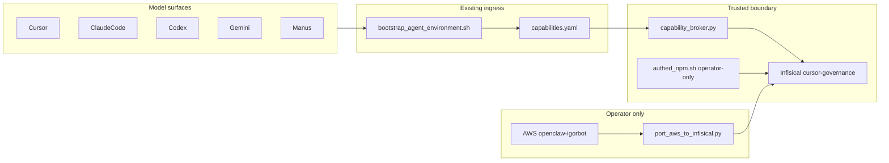

# Shared Infisical plane — probe-gated (Build this)

Kernels applied to this plan (not to product code): Diagnose First, Recursive Alignment, Validate & Repair, Improve, Recursive Leverage. Control-plane pack and Gold Nugget skipped (wrong target).

**Build button = execute Waves 0–2 on a new branch from `origin/main`.** Wave 3 is out of this PR. Do not re-run the vault/broker probe. Do not write Infisical. Do not deploy the broker.

## Probe receipt (2026-08-17 — closed; do not re-probe)

Operator path used locked interpreter `Cursor-Governance/.venv/bin/python`. Values were never printed. AWS chicken-egg refs all `--check` OK: `github#token`, `infisical-cursor-governance#{client_id,client_secret,project_id}`, `infisical-seo-bot#{client_id,project_id}`.

| Check | Result |
|---|---|
| `port_aws_to_infisical.py --dry-run` | PASS. AWS `42` secrets, `69` planned root keys, `42` structured folders. **No** AWS secret named graphiti / `GRAPHITI_MCP_TOKEN`. |
| `hydrate_infisical.py --check` (CG project, `viewSecretValue=false`) | PASS. `https://app.infisical.com` `env=prod` **73** keys. |
| Name delta (live Infisical vs [`ops/secrets/infisical-cursor-governance.yaml`](ops/secrets/infisical-cursor-governance.yaml) `root_env_keys`) | **Exactly one:** live has `GRAPHITI_MCP_TOKEN`; YAML does not (72 vs 73). YAML has **zero** names missing from the vault. |
| Capability refs in Infisical | `GITHUB_TOKEN`, `GH_TOKEN`, `SONAR_TOKEN`, `SEMGREP_APP_TOKEN`, `GRAPHITI_MCP_TOKEN`, `OPENAI_API_KEY` all **available**. |
| CG vs SEO Infisical `project_id` | **Different projects.** CG id matches committed YAML. |
| Sole PAT Packages | `x-oauth-scopes` includes `write:packages` and `delete:packages`. `GET npm.pkg.github.com/@quantum-l9/llm-router` **HTTP 200**. Org npm packages API **HTTP 200**. Do **not** mint a second PAT. |
| `L9_CAPABILITY_BROKER_URL` | **ABSENT** in this session. |
| `capability_client.py --check` | All five registered capabilities **DEGRADED** (`no broker configured`). |
| `bootstrap_agent_env.sh --check --surface cursor` | **DEGRADED** (exit 1). Correct refusal: do not paste UA / tokens. |
| `capability_broker.py preflight` | Import fails in this venv (`cryptography` ABI `_EVP_DigestSqueeze`). Even if it imported, posture would be **no workload identity** (no k8s/SPIFFE/OIDC; UA secret is refused). Manifest [`ops/secrets/deploy/broker-kubernetes.yaml`](ops/secrets/deploy/broker-kubernetes.yaml) is human-applied only. |
| U1 `CLIENT_SITE_*` | Sibling SEO-Bot: **only** `.env.example`. Absent from `src/`, workflows, and other tracked ts/js/yml/json/md. Vercel project env not probed (Wave 3 only). |

## Unknowns after probe

| ID | Status | Evidence |
|---|---|---|
| U-GRAPHITI-HOME | **CLOSED** | Live Infisical `/` already has `GRAPHITI_MCP_TOKEN`. Not in AWS. Not in YAML. Home = Infisical; YAML lags. |
| U-NPM-SCOPE | **CLOSED** | Sole PAT already has Packages scopes and fetches the private package (HTTP 200). |
| U-SEO-PROJECT | **CLOSED** | SEO-Bot and Cursor-Governance are **different** Infisical projects. Mobile 401 is not “wrong CG project on this operator path.” |
| U1 | **CLOSED for this Build** | Stale SEO-Bot `.env.example` names only. Does not block this PR. |
| U-BROKER | **KNOWN BLOCKER** (not unknown) | Broker URL unset; plane DEGRADED. Claude-cloud cannot go green from this PR. **This Build still proceeds** (desktop / shared-plane). Do not paste secrets to fake green. |

Value-staleness (Infisical vs AWS) was **not** compared — that requires secret values. Names already match. **Do not run a live port write.**

## Decision (locked)

The Mobile briefs are symptoms. This plan extends the **already-shared** ingress. It does not invent a second one.

```text
every LLM surface --(named capability)--> L9 broker --(workload identity)--> Infisical --> upstream
```

Verified callers of [`ops/scripts/bootstrap_agent_environment.sh`](ops/scripts/bootstrap_agent_environment.sh) (single ingress — already exists; do not add another):

| Caller | Surface |
|---|---|
| Cursor [`session_start_bootstrap.sh`](ops/hooks/session_start_bootstrap.sh) | `--surface cursor` |
| Claude [`install.sh`](environment/agents/adapters/claude-code/install.sh) | `--surface claude-code` |
| Codex / Gemini / Manus / generic | same script, `--surface <id>` (docs; only Claude has a vendor installer) |
| Step 3 of all of the above | [`ops/secrets/bootstrap_agent_env.sh`](ops/secrets/bootstrap_agent_env.sh) `--check` only |

MUST:

- New branch from `origin/main`. No mix with unrelated WIP.
- AWS = operator inventory + chicken-egg UA only. Model surfaces MUST NOT call `resolve_secret.py`.
- Capability `secret_refs` MUST exist in Infisical `root_env_keys` (vault already does; YAML must catch up).
- Wave 0 write = **manifest only**: add `GRAPHITI_MCP_TOKEN` to [`ops/secrets/infisical-cursor-governance.yaml`](ops/secrets/infisical-cursor-governance.yaml) `root_env_keys`. Do **not** create an AWS Graphiti secret. Do **not** run `port_aws_to_infisical.py` (even without `--dry-run`).

MUST NOT:

- Patch Claude as the gold-standard others copy
- Mint a second GitHub PAT / set `NODE_AUTH_TOKEN` in any model env
- Put AWS keys, Infisical UA, provider keys, or `GRAPHITI_MCP_TOKEN` in a model-controlled env
- Bypass the vault, promote WIP `variables.md` / `network.md`, or add `app.infisical.com` to agent egress
- Start `session-runtime-hydration-convergence-v1` or re-open PLAN-CLAUDE-MOBILE-ADAPTER-UNIFY
- Export a PAT into a process the model can read (that is still secret possession)
- Relocate `memory_state.py` as the first move
- Register DataForSEO / OpenRouter / Perplexity as capabilities unless a **fixed broker upstream** already exists (it does not — do not invent one)
- kubectl-apply the broker manifest from an agent
- Weaken gates to go green
- Re-probe vault/broker as the first Build step
- Implement Wave 3 / SEO-Bot in this PR



## Alignment repairs (this kernel pass)

| ID | Severity | Defect in prior plan | Repair now in this plan |
|---|---|---|---|
| V-SEC-1 | High | `authed_npm.sh` Infisical + call from shared bootstrap would put `GITHUB_TOKEN` in a model-spawned npm env | Packages has **one** path: `authed_npm.sh` is **trusted-operator only** (Infisical, no AWS fallback). Model surfaces use existing capability plane: add `github.packages_read` (`secret_refs: [GITHUB_TOKEN]`, host `npm.pkg.github.com`). If the broker cannot run the install, report `PRIVATE_REGISTRY_UNREACHABLE` — do not paste a PAT. |
| V-OWN-1 | High | Required lift of `memory_state.py` to a new home | Defect is `workspace_root()` when both workspace and subrepo have `.l9/memory`. **Patch in place.** Relocate only if in-place fix is proven insufficient (Validate & Repair: do not relocate without a path defect). |
| V-DUP-1 | Medium | Three Packages solutions (env PAT, Infisical authed_npm on all surfaces, plus a capability) | One path, above. |
| V-SCOPE-1 | Medium | Speculative provider/SEO broker capabilities; SEO-Bot on CG critical path | Product `process.env` stays `@quantum-l9/infisical-config` in the product repo. SEO-Bot T7–T14 is a **follow-on**, not a CG merge blocker. |
| V-PLAN-1 | Medium | Missing halt, Unknowns, assumed-false, PE envelope | Added; probe closed the unknowns. |

## Briefs vs architecture (keep / reject)

| Finding | Keep | Relocate |
|---|---|---|
| npm.pkg.github.com 403 | Yes | Sole PAT already in Infisical as `GITHUB_TOKEN`. Not a second PAT. Not Claude UI. Probe: PAT already has Packages scopes + HTTP 200. |
| Infisical UA 401 / placeholders | Yes | Live [`environment.env.example`](environment/agents/adapters/claude-code/web/environment.env.example) is correct (no UA). Shared bootstrap already WARNs if `INFISICAL_CLIENT_SECRET` / `GRAPHITI_MCP_TOKEN` are set. |
| Provider keys absent | Symptom only | Inventory in Infisical for **product** hydrate. No new broker APIs. |
| AWS `proxy-injected` | Expected | Operator (this Cursor machine) uses AWS only to port Infisical. |
| Lock cwd vs workspace | Yes | In-place `memory_state.py`. |
| Broad “conflict” facts | Yes | [`graphiti_memory_client.py`](ops/graphiti/graphiti_memory_client.py) `cmd_conflicts`. |
| `OPEN_PR=0` skips push | Yes | `PUSH_ONLY=1` on **existing** `make pr` / [`open_pr_after_gate.sh`](ops/scripts/open_pr_after_gate.sh). Not raw `git push`. |
| pydantic/pyyaml cold start | Yes | Fail-closed in shared bootstrap, not a Claude pip hack. |
| SEO-Bot assurance red | Follow-on | Other repo. Out of this Build. |
| Graphiti no-repo-match at `/home/user` | Yes | [`group_resolver.py`](ops/graphiti/group_resolver.py). |

## WIP `claude code environment/` — intake unchanged

8-12 receipt. Unify PLAN, symlink extinguishment, and PE `claude-web`/`claude-mobile` bindings **already landed**. `variables.md` / `network.md` are **regressive** vs live env.example and [`network-policy.md`](environment/agents/adapters/claude-code/web/network-policy.md) (agent MUST NOT reach `app.infisical.com`). Keep only: token-rotation receipt as historical evidence; add `npm.pkg.github.com` to **shared** [`environment/agents/docs/network-allowlist.md`](environment/agents/docs/network-allowlist.md) (live Claude policy is a projection).

## Wave 0 — manifest only (vault write skipped)

Probe already ran. **Do not** re-run dry-run / hydrate / broker preflight as a Build first step. **Do not** `port_aws_to_infisical.py` (write). **Do not** invent an AWS Graphiti secret. **Do not** re-rotate the bearer.

- Add `GRAPHITI_MCP_TOKEN` to [`ops/secrets/infisical-cursor-governance.yaml`](ops/secrets/infisical-cursor-governance.yaml) `root_env_keys`.
- Add a one-line note: live in Infisical `/`; not an AWS port source.
- Leave [`ops/secrets/openclaw-igorbot.registry.yaml`](ops/secrets/openclaw-igorbot.registry.yaml) without a fake AWS Graphiti id.
- Do not add `GRAPHITI_MCP_TOKEN` to `ENV_MAP` in [`ops/secrets/port_aws_to_infisical.py`](ops/secrets/port_aws_to_infisical.py) (there is no AWS source key).

## Wave 1 — extend existing secrets plane

- [`authed_npm.sh`](ops/secrets/authed_npm.sh): Infisical `GITHUB_TOKEN`, fail-closed, **trusted-operator only**. No AWS fallback. Shared bootstrap MUST NOT export a PAT into a model surface.
- [`capabilities.yaml`](ops/secrets/capabilities.yaml): add `github.packages_read` only (same pattern as `github.pr_read`; `secret_refs: [GITHUB_TOKEN]`, host `npm.pkg.github.com`).
- [`validate_capability_contract.py`](ops/secrets/validate_capability_contract.py): any `adapters/*` tree growing `resolve_secret(` / AWS bootstrap fails the build. `root_env_keys` must contain every `secret_ref` (including `GRAPHITI_MCP_TOKEN` after Wave 0).
- Scrub “script falls back to AWS” from **all** peer `environment.env.example` files.
- Allowlist: `npm.pkg.github.com` on shared [`environment/agents/docs/network-allowlist.md`](environment/agents/docs/network-allowlist.md) first.

## Wave 2 — patch shared modules in place

- [`memory_state.py`](environment/agents/adapters/claude-code/memory/memory_state.py): one state root when both workspace and subrepo have `.l9/memory` (prefer harness project dir, else active `git` toplevel).
- `cmd_conflicts`: scope to target `group_id` + paths.
- [`group_resolver.py`](ops/graphiti/group_resolver.py): do not collapse a multi-repo workspace root to `igor-workspace` when the active git toplevel is a child repo.
- Makefile / [`open_pr_after_gate.sh`](ops/scripts/open_pr_after_gate.sh): `PUSH_ONLY=1` still goes through `make pr` checkers; `OPEN_PR=0` alone remains gate-only.
- [`bootstrap_agent_environment.sh`](ops/scripts/bootstrap_agent_environment.sh): fail-closed if locked `.venv` cannot import `pydantic` / `yaml`.

## Wave 3 — follow-on (not this Build)

SEO-Bot T7–T12 (U1 default: rename `.env.example` to the names the code reads). T13–T14 after W1. T15 out. Website-Bot / LLM-Router source / PE-PE 1 / producer PR #56 out.

## Assumed-false / stop

- IF sole PAT lacks Packages scope — **false; probe closed.** Do not mint a second token.
- IF broker is down — **true.** Desktop operator path still proceeds; Claude cloud stays DEGRADED. Do not paste secrets to fake green.
- IF dry-run shows Infisical already complete — **true.** Skip port writes; add missing **manifest** name only (`GRAPHITI_MCP_TOKEN`).
- IF in-place `workspace_root` fix fails a cold-session probe, THEN consider a lift — not before.

Stop: invented secret values; model-env credentials; raw push; force-push; `--admin` merge; weakening scanners; `port_aws_to_infisical.py` write; kubectl broker.

## Validation (named gates)

- `make pr-check` (CG, changed-files)
- `make capability-contract-validate`
- Infisical YAML `root_env_keys` ⊇ every `capabilities.yaml` `secret_ref` (including `GRAPHITI_MCP_TOKEN`)
- Adapter grep: zero `resolve_secret` / AWS bootstrap on model surfaces
- `authed_npm.sh` refuses model-controlled surface
- Cold-session: lock acquired from a subrepo is visible to the gate
- `PUSH_ONLY=1 make pr` pushes; `OPEN_PR=0 make pr` does not
- SEO-Bot gates only on the follow-on PR (not this Build)

## Rollback

No Infisical upserts in this Build. CG: revert the branch. No vault values in git.

## Execute via @environment/program-execution + autonomy

```text
this .plan.md
  → @environment/program-execution  (Blueprint → Program Lock → Controller)
  → @autonomy (subordinate lease)
  → peer: cursor-foreground
```

`autonomous_merge: false`. After local finish: kernels already required by L4, then `PR_REMEDIATE=0 make pr`. Do not free-form mutate from this markdown.

**First action after Build:** create a new branch from `origin/main` (ff-only tip). Then Wave 0 manifest, then Waves 1–2. Do not mix unrelated WIP. Do not start with another vault probe.

## Kernel convergence

```yaml
convergence_status: ready
recursive_passes_run: 2
align_improve_cycles_run: 1
max_cycles: 3
cycles_exhausted: false
material_improvement_remaining: false
source_intent_preserved: true
scope_drift_detected: false
enforceability_improved: true
execution_readiness: desktop_go_cloud_blocked
single_ingress_evaluated: true
single_ingress_status: already_exists
unknowns_remaining: []
known_blockers: [U-BROKER]
w0_vault_write: skip
w0_manifest: add GRAPHITI_MCP_TOKEN to infisical-cursor-governance.yaml only
minimum_safe_next_action: Build → new branch from origin/main → Wave 0 manifest + Waves 1-2. Do not port_aws_to_infisical. Do not paste secrets. Do not implement Wave 3.
```
