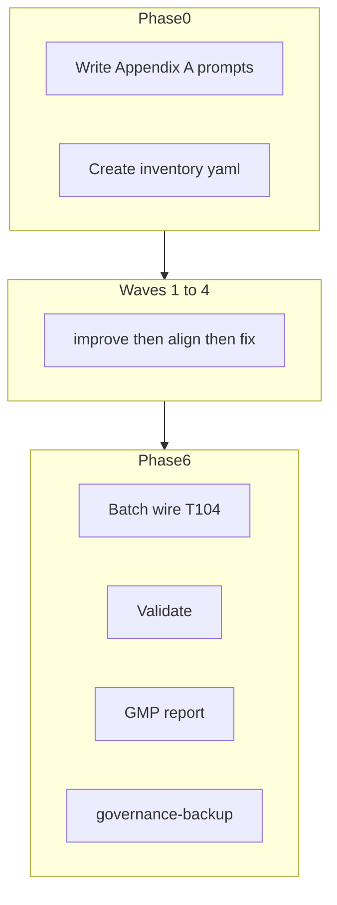

# Skill Hardening Batch — GMP Execution Plan (v2)

**Run ID:** `GMP-SKILL-HARDEN-001`
**Plan version:** 2 (improved + aligned against Recursive Improvement v3 / Recursive Alignment prompts)
**Protocol:** [l9-gmp-protocol](.cursor-commands/skills/l9-gmp-protocol/SKILL.md) phases 0–6
**Pack authority:** [skill-pack-contract.md](.cursor-commands/skills/l9-skill-compiler/references/skill-pack-contract.md), [meta-standard.md](.cursor-commands/skills/l9-skill-compiler/references/meta-standard.md), [validation-checklist.md](.cursor-commands/skills/l9-skill-compiler/references/validation-checklist.md)

---

## Plan meta: improvement + alignment applied to this build

This plan was run through **Recursive Improvement** then **Recursive Alignment** as a `build_plan` artifact. Corrections from alignment are incorporated below; full batch prompts are in **Appendix A** (ready to write to disk at Phase 0).

### Improvement convergence (plan artifact)

| Field | Value |
|-------|-------|
| convergence_status | converged |
| source_intent_preserved | true |
| enforceability_improved | true |
| execution_readiness | pass |
| key_changes | Full GMP phases 0–6; enumerated waves; executable prompt deliverables; skip criteria for Wave 2; mechanical validation |

### Alignment summary (plan artifact)

| Severity | Count | Resolution |
|----------|-------|------------|
| critical | 2 | Fixed: Phase 0 prompts were sketches not deliverables; missing GMP phases 1/3/5 |
| high | 3 | Fixed: Wave 2 skill list enumerated; batch prompt `extends` contract explicit; tracker schema defined |
| medium | 2 | Fixed: orchestrator stop conditions; SSOT backup step in Phase 6 |
| N/A | 5 | TransportPacket/Gate/node passes — not applicable to skill-batch GMP |

**minimum_safe_next_action:** Execute Phase 0 — write Appendix A files to [.cursor-commands/prompts/](.cursor-commands/prompts/), then Wave 1.

---

## Objective

| What | Why | Success |
|------|-----|---------|
| Harden 43 skill packs | Registry drift (12 manifest-only); structural debt (dual frontmatter, missing L9_META, stub gates) | 43/43 improved+aligned; registries synced; validation PASS; signed GMP report |

**First-order gates:** unblocks agent routing; next blocker; no fake-success (wire deferred); high leverage; no addon risk.

---

## Scope

| Tree | Path | Count |
|------|------|-------|
| Global L9 | [.cursor-commands/skills/l9-*](.cursor-commands/skills/) | 35 |
| Project | [.claude/skills/plasticos-*](.claude/skills/) | 8 |

**Do NOT edit** `~/.cursor/skills/` separately (symlink to same GlobalCommands tree).

**Registry gap (12):** `l9-chat-extraction`, `l9-ci-ops`, `l9-code-maintenance`, `l9-component-verification`, `l9-dag-authoring`, `l9-end-session`, `l9-forge`, `l9-governance-wiring`, `l9-harvest-pipeline`, `l9-inspect`, `l9-repo-index`, `l9-update-command`

**Out of scope:** rules (`.cursor/rules/`, `.cursor-commands/rules/`), addon code, CI workflows, per-skill registry edits before T-104.

---

## MODIFICATION LOCK

**May modify:** Appendix A prompt paths, skill packs, `reports/skill-hardening-inventory.yaml`, `reports/skill-alignment/*.md`, `reports/GMP-Report-017-skill-hardening-batch.md`; **Phase 6 only:** AGENTS.md, .claude/README.md, AUTONOMY_MANIFEST.yaml (tier sync only).

**Must NOT modify:** `plasticos_*/`, `tests/`, `ci/`, `.github/workflows/`, `.cursor/rules/`, `pipeline_v2.py`, originals [Recursive Improvement.md](.cursor-commands/prompts/Recursive%20Improvement.md) / [Recursive Alignment.md](.cursor-commands/prompts/Recursive%20Alignment.md).

---

## GMP phase map (complete)

| Phase | Name | This run |
|-------|------|----------|
| 0 | Plan lock | This document + Appendix A approved |
| 1 | Baseline | Verify 43 skill paths exist; anchors for Appendix A writes; tracker schema |
| 2 | Implementation | Prompts + per-skill improve/align/fix + batch wire |
| 3 | Enforcement | Per-skill: no `agents/openai.yaml`; modification lock respected |
| 4 | Validation | Mechanical checks (below) + wire checklist |
| 5 | Recursive verify | Diff vs locked TODOs; no scope creep |
| 6 | Finalize | GMP report + governance-backup |

---

## Architecture



---

## Locked TODO table

| ID | Phase | Target | Operation |
|----|-------|--------|-----------|
| T-001 | 2 | `prompts/Recursive Improvement — Skills Batch.md` | Create from Appendix A1 |
| T-002 | 2 | `prompts/Recursive Alignment — Skills Batch.md` | Create from Appendix A2 |
| T-003 | 2 | `prompts/Skill Hardening Batch Orchestrator.md` | Create from Appendix A3 |
| T-004 | 2 | `reports/skill-hardening-inventory.yaml` | Create 43 rows |
| T-005–T-010 | 2 | Wave 1 skills (6) | Improve → align → fix |
| T-011–T-033 | 2 | Wave 2 skills (23) | Light improve → align |
| T-034–T-039 | 2 | Wave 3 skills (6) | Improve → align → fix |
| T-040–T-047 | 2 | Wave 4 skills (8) | Improve → align |
| T-104 | 2 | AGENTS.md, .claude/README.md, AUTONOMY_MANIFEST | Batch wire |
| T-106 | 4 | All 43 packs | Mechanical validation |
| T-107 | 6 | `reports/GMP-Report-017-skill-hardening-batch.md` | Evidence report |

---

## Per-skill micro-loop

1. **Improve** — load T-001; target `{skill-path}/`; write files; bump `version`/`updated` if content changed.
2. **Align** — load T-002; report-only → `reports/skill-alignment/{name}.md`.
3. **Fix** — critical/high from correction_roadmap only (unless Wave 1).
4. **Tracker** — update row; set `registry_sync_needed: true` if `description` changed.
5. **Skip (Wave 2 only)** — if prior pass `converged` AND zero critical/high violations AND no file changes needed → mark `skipped_light_pass`.

---

## Wave skill lists (complete)

### Wave 1 — high drift (6)

`l9-ci-ops`, `l9-code-maintenance`, `l9-forge`, `l9-governance-wiring`, `l9-update-command`, `l9-component-verification`

### Wave 2 — registered in AGENTS.md (23)

`l9-api-smoke-testing`, `l9-architecture-decision-records`, `l9-auditing-performance`, `l9-auditing-security`, `l9-code-analysis`, `l9-code-graph-rag-mcp`, `l9-context7-docs`, `l9-gap-analysis`, `l9-gmp-protocol`, `l9-incident-response`, `l9-kubernetes-deploying`, `l9-monitoring-terminal-errors`, `l9-plan`, `l9-pr-analysis`, `l9-prompt-engineering`, `l9-python-tdd-with-uv`, `l9-setting-up-ci`, `l9-setting-up-terraform`, `l9-skill-compiler`, `l9-structured-reasoning`, `l9-update-agent-docs`, `l9-wire-skill-into-repo`, `l9-ynp`

Reference model: [l9-gmp-protocol/SKILL.md](.cursor-commands/skills/l9-gmp-protocol/SKILL.md)

### Wave 3 — explicit-only remainder (6)

`l9-chat-extraction`, `l9-dag-authoring`, `l9-end-session`, `l9-harvest-pipeline`, `l9-inspect`, `l9-repo-index`

### Wave 4 — project (8)

`plasticos-final-touches`, `plasticos-new-model-field`, `plasticos-new-odoo-module`, `plasticos-odoo-sh-deploy`, `plasticos-pr-review-kernel`, `plasticos-repo-review-kernel`, `plasticos-static-audit-kernel`, `plasticos-xml-view`

**Checkpoint:** Stop after Wave 1 for human approval.

---

## Batch wire (T-104)

Load [l9-wire-skill-into-repo](.cursor-commands/skills/l9-wire-skill-into-repo/SKILL.md) + [plasticos-repo-wiring.md](.claude/adapters/plasticos-repo-wiring.md):

1. Read final `description` from each improved SKILL.md
2. Sync `.claude/README.md` + AGENTS.md (12 missing + deltas)
3. AUTONOMY_MANIFEST — tier only if `disable-model-invocation` changed
4. [validation-checklist.md](.cursor-commands/skills/l9-wire-skill-into-repo/references/validation-checklist.md) MUST PASS

SSOT backup: `make governance-backup` (GlobalCommands, not PlasticOS `make push`).

---

## Mechanical validation (T-106)

Per skill:

- `SKILL.md` exists; exactly one frontmatter block (`grep -c '^---$' SKILL.md` == 2)
- No `agents/openai.yaml`
- All `references/*.md` have L9_META (or SKILL_META) comment block
- Resource Map links resolve
- Frontmatter `name` == directory name

Post wire: 35/35 l9-*in manifest + AGENTS + README; 8/8 plasticos-* in AGENTS + README.

If AGENTS.md changed: `make pr-check` (doc-only expected).

---

## Agent kickoff

```text
Execute GMP-SKILL-HARDEN-001 v2. Phase 0 approved.

Write Appendix A prompts (T-001–T-003) and inventory (T-004).
Run Wave 1: improve → align → fix criticals for all 6 skills.
Stop; show inventory + reports/skill-alignment/l9-ci-ops.md.
Do not edit AGENTS.md until T-104.
```

---

# Appendix A — Phase 0 deliverables (improved prompts)

Base prompts preserved as generic SSOT. Batch variants **extend** them via `extends` + skill-batch overlay.

---

## A1 — `Recursive Improvement — Skills Batch.md`

```yaml
compiled_prompt:
  id: recursive_l9_improvement_skills_batch_v1
  role: l9_recursive_improvement_agent
  extends: Recursive Improvement.md

  objective: >
    Recursively improve and harden ONE skill pack folder per invocation.
    Inherit all passes from recursive_l9_improvement_prompt_v3.
    Apply skill-pack-contract as the structural authority.

  input_contract:
    required:
      - skill_path: absolute or repo-relative path to ONE skill folder
    optional:
      - scope: global | project  # inferred from l9- vs plasticos- prefix if omitted

  hard_rules_additions:
    - MUST NOT edit AGENTS.md, .claude/README.md, or AUTONOMY_MANIFEST.yaml
    - MUST NOT duplicate L9 packs into .claude/skills/
    - MUST NOT create agents/openai.yaml
    - MUST preserve disable-model-invocation if present in source SKILL.md
    - MUST label Unknown when repo-specific gate tables cannot be verified

  authority_order:
    1: provided skill pack (source of truth for intent)
    2: l9-skill-compiler/references/skill-pack-contract.md
    3: l9-skill-compiler/references/meta-standard.md
    4: l9-skill-compiler/references/file-contract.md
    5: l9-skill-compiler/references/validation-checklist.md
    6: CANONICAL_LAW.md naming and GlobalCommands SSOT

  skill_pack_improvement_contract:
    SKILL_md:
      MUST_have_single_yaml_frontmatter: true
      MUST_have_fields: [name, description, skill_schema, layer, role, tags, owner, status, version, updated]
      MUST_have_sections: [Purpose, "Core Contract or compact workflow", "Authority Order", "Resource Map", "Validation", "Failure Handling"]
      MUST_NOT_have: [embedded slash-command frontmatter blocks, duplicate --- name: blocks, SKILL_META HTML comment]
      router_rule: SKILL.md is control plane; workflows longer than 40 lines MUST move to references/
    references:
      MUST_have_L9_META: true  # every references/*.md
      MUST_be_linked_from_SKILL: true
    global_l9:
      prefix: l9-
      location: .cursor-commands/skills/
    project_plasticos:
      prefix: plasticos-
      location: .claude/skills/
      MUST_NOT: [AUTONOMY_MANIFEST entry, duplicate under .cursor-commands/skills/]

  recursive_pass_additions:
    pass_7_relocate:
      extract_targets:
        - embedded /ci or /command blocks in SKILL.md → references/{name}-workflow.md
        - duplicate gate tables → references or repo-detection section

  validation_gates_additions:
    - single_frontmatter_block_verified
    - all_references_have_metadata
    - resource_map_links_resolve
    - no_agents_openai_yaml
    - description_has_explicit_triggers

  output_requirements:
    must_return:
      - complete_revised_skill_pack_all_files
      - convergence_block
      - skill_inventory_row:
          name: string
          scope: global | project
          files_changed: [paths]
          version_bumped: true | false
          execution_readiness: pass | partial | fail
      - per_file_summary: max_one_line_per_changed_file
    must_not_edit: [AGENTS.md, .claude/README.md, AUTONOMY_MANIFEST.yaml]

  convergence_block:
    required: true
    inherit_fields_from: recursive_l9_improvement_prompt_v3
```

---

## A2 — `Recursive Alignment — Skills Batch.md`

```yaml
compiled_prompt:
  id: recursive_l9_alignment_skills_batch_v1
  role: l9_recursive_alignment_auditor
  extends: Recursive Alignment.md

  objective: >
    Audit ONE improved skill pack against skill-pack-contract and L9 control-plane rules.
    Report only — do NOT edit files unless user explicitly says "implement alignment fixes".

  input_contract:
    required:
      - skill_path: path to skill folder (post-improvement)
      - improvement_convergence_block: from prior improve pass

  mode: report_only

  source_authority:
    highest:
      - l9-skill-compiler/references/skill-pack-contract.md
      - l9-skill-compiler/references/meta-standard.md
      - l9-skill-compiler/references/validation-checklist.md
      - CANONICAL_LAW.md
    not_applicable:
      - TransportPacket inter-node wire format
      - Gate-only egress / peer URLs
      - node build protocol / microservice pipeline phases
      - packet invariant tests / PacketEnvelope scans

  skill_alignment_passes:
    pass_skill_structure:
      verify:
        - single YAML frontmatter on SKILL.md
        - L9_META on every references/*.md
        - allowed folders only: references/, scripts/, assets/
        - no agents/ directory
        - Resource Map links resolve
    pass_skill_metadata:
      verify:
        - name matches directory
        - description lowercase with explicit when-triggers
        - version semver; updated date if content changed
        - disable-model-invocation consistent with intended tier
    pass_skill_executability:
      verify:
        - input and output contracts present or inherited from workflow
        - stop conditions explicit
        - no unverified gate/command tables (repo ground truth required)
        - failure handling section present
    pass_skill_coherence:
      verify:
        - no duplicate workflows in SKILL.md and references/
        - SKILL.md is lean control plane
        - zero stubs, TODO-as-deliverable, placeholder paths
    pass_registry_readiness:
      verify:
        - note if missing AGENTS.md or .claude/README.md row
        - note if AUTONOMY_MANIFEST tier matches disable-model-invocation
        - do NOT fix registries in this pass

  output_contract:
    write_to: "reports/skill-alignment/{skill-name}.md"
    sections:
      - alignment_summary
      - source_authority_used
      - critical_violations
      - high_violations
      - medium_violations
      - skill_structure_compliance
      - skill_metadata_compliance
      - skill_executability_compliance
      - skill_coherence_compliance
      - registry_readiness  # note only
      - overbuilt_vs_underbuilt
      - correction_roadmap
      - implement_fixes_needed: true | false
      - registry_sync_needed: true | false
      - minimum_safe_next_action
      - convergence_block

  violation_format:
    id_prefix: "SKILL-{skill-name}-"
    fields: [id, severity, rule_broken, evidence, impact, correction, owner_layer, blocks_release]

  correction_roadmap_rules:
    - fix structure and metadata before cosmetics
    - fix stubs and fake gates before packaging verdict
    - registry sync deferred to batch wire phase
    - no implementation unless explicitly requested
```

---

## A3 — `Skill Hardening Batch Orchestrator.md`

```yaml
compiled_prompt:
  id: skill_hardening_batch_orchestrator_v1
  role: gmp_skill_batch_executor

  objective: >
    Execute GMP-SKILL-HARDEN-001 per-skill loop for one skill at a time.
    Load improvement prompt then alignment prompt in sequence.

  modification_lock:
    may_modify: [.cursor-commands/skills/l9-*/, .claude/skills/plasticos-*/, reports/skill-hardening-inventory.yaml, reports/skill-alignment/]
    must_not_modify: [AGENTS.md, .claude/README.md, AUTONOMY_MANIFEST.yaml, plasticos_*/, tests/, ci/]

  per_skill_sequence:
    1_load: "Recursive Improvement — Skills Batch.md"
    1_apply: "Improve {skill_path}; write all files"
    2_load: "Recursive Alignment — Skills Batch.md"
    2_apply: "Align; write reports/skill-alignment/{name}.md only"
    3_conditional: "If implement_fixes_needed and severity critical/high → apply correction_roadmap to skill pack"
    4_tracker: "Update reports/skill-hardening-inventory.yaml row"

  wave_skip_rule:
    applies_to: wave_2_only
    skip_when: [improvement converged, zero critical/high violations, no file changes required]

  stop_conditions:
    - protected path would be modified
    - skill_path does not exist
    - ambiguous scope (multiple skills in one invocation)
    - Wave 1 complete and checkpoint not approved (unless user says continue)

  batch_wire:
    deferred_until: all 43 skills complete
    skill: l9-wire-skill-into-repo
    adapter: .claude/adapters/plasticos-repo-wiring.md
```

---

## A4 — Tracker schema (`reports/skill-hardening-inventory.yaml`)

```yaml
run_id: GMP-SKILL-HARDEN-001
updated: null  # set on each row update
skills:
  - name: l9-ci-ops
    scope: global
    path: .cursor-commands/skills/l9-ci-ops
    wave: 1
    in_manifest: true
    in_agents_md: false
    improve_status: pending  # pending|converged|partial|blocked|skipped_light_pass
    align_status: pending
    implement_fixes: pending   # pending|done|not_needed
    wire_status: pending       # pending|synced|skipped
    registry_sync_needed: false
    execution_readiness: null
```

Pre-populate all 43 skills with `wave` assigned per wave lists above. Set `wire_status: pending` for the 12 manifest-only skills; `skipped` for others until `description` changes.

---

## Effort estimate

| Unit | Sessions |
|------|----------|
| Phase 0 (write Appendix A + tracker) | 1 |
| Wave 1 + checkpoint | 1–2 |
| Wave 2 (23; many skip-eligible) | 2–4 |
| Wave 3 + 4 | 2–3 |
| Batch wire + validation + report | 1 |
| **Total** | **7–11** |
