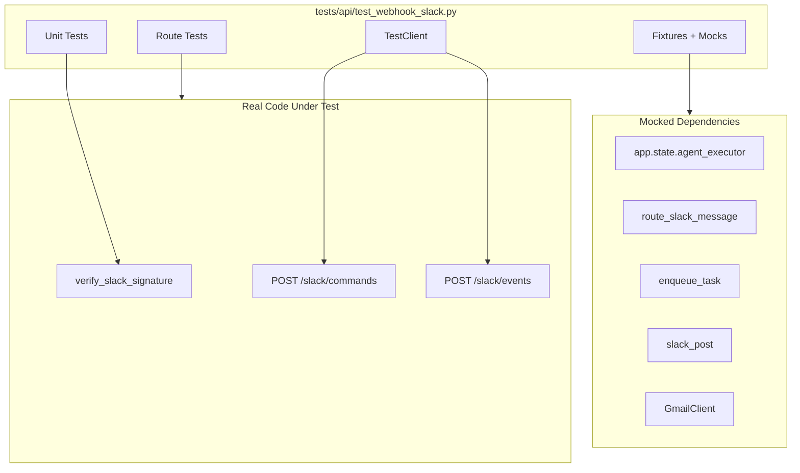

# Slack Webhook API Test Suite Implementation

## Objective

Create API-level tests for [`api/webhook_slack.py`](api/webhook_slack.py) using FastAPI's `TestClient`, mocking heavy dependencies (`agent_executor`, `route_slack_message`, `enqueue_task`, `slack_post`, `GmailClient`) while testing real HTTP routing and signature verification.---

## Architecture



---

## Files to Create/Modify

| File | Action | Purpose |

|------|--------|---------|

| [`tests/api/test_webhook_slack.py`](tests/api/test_webhook_slack.py) | **CREATE** | New test file for webhook route tests |

| [`tests/conftest.py`](tests/conftest.py) | **MODIFY** | Add Slack-specific fixtures (signing secret, signature helpers) |---

## Test Categories

### 1. Unit Tests for `verify_slack_signature` (Pure Function)

| Test | Expected Behavior |

|------|-------------------|

| `test_verify_signature_valid` | Correct HMAC + fresh timestamp returns `True` |

| `test_verify_signature_invalid_hash` | Wrong hash returns `False` |

| `test_verify_signature_stale_timestamp` | Timestamp >300s old returns `False`, logs warning |

| `test_verify_signature_missing_timestamp` | Empty/None timestamp returns `False` |

| `test_verify_signature_missing_signature` | Empty/None signature returns `False` |

| `test_verify_signature_no_secret` | Missing `signing_secret` returns `False` |

### 2. API Tests for POST /slack/commands

| Test | Setup | Expected |

|------|-------|----------|

| `test_commands_disabled_returns_503` | `SLACK_APP_ENABLED=false` | HTTP 503 |

| `test_commands_do_subcommand` | Mock `route_slack_message`, `enqueue_task` | HTTP 200, JSON contains task ID |

| `test_commands_email_search` | Mock `GmailClient.list_messages` | HTTP 200, results in response |

| `test_commands_unknown_returns_help` | Unknown subcommand | HTTP 200, help text |

### 3. API Tests for POST /slack/events

| Test | Setup | Expected |

|------|-------|----------|

| `test_events_disabled_returns_503` | `SLACK_APP_ENABLED=false` | HTTP 503 |

| `test_events_bad_signature_returns_403` | Invalid HMAC | HTTP 403 "Invalid signature" |

| `test_events_url_verification` | `type: url_verification` + valid sig | HTTP 200, challenge echoed |

| `test_events_app_mention_legacy_router` | `L9_ENABLE_LEGACY_SLACK_ROUTER=true` | Mock `slack_post` called |

| `test_events_app_mention_l_agent_router` | `L9_ENABLE_LEGACY_SLACK_ROUTER=false` | Mock `handle_slack_with_l_agent` called |

| `test_events_bot_message_ignored` | `subtype: bot_message` | HTTP 200, no processing |

| `test_events_mac_command` | Text starts with `!mac` | Mock `enqueue_mac_task` called |---

## Key Implementation Details

### Signature Generation Helper

```python
def generate_slack_signature(body: str, timestamp: str, secret: str) -> str:
    sig_basestring = f"v0:{timestamp}:{body}"
    signature = hmac.new(
        secret.encode(), sig_basestring.encode(), hashlib.sha256
    ).hexdigest()
    return f"v0={signature}"
```


### Environment Patching Strategy

```python
@pytest.fixture
def slack_enabled(monkeypatch):
    monkeypatch.setenv("SLACK_APP_ENABLED", "true")
    monkeypatch.setenv("SLACK_SIGNING_SECRET", "test_secret")
```


### App State Override

```python
@pytest.fixture
def mock_agent_executor():
    mock = AsyncMock()
    mock.start_agent_task = AsyncMock(return_value=ExecutionResult(...))
    return mock

@pytest.fixture
def client_with_mocked_executor(mock_agent_executor):
    app.state.agent_executor = mock_agent_executor
    yield TestClient(app)
    app.state.agent_executor = None
```

---

## Diff Preview (New File)

The new test file will be created at `tests/api/test_webhook_slack.py` with approximately 350-400 lines covering:

1. **Imports and setup** (~30 lines)
2. **Fixtures** for signature generation, env patching, mock dependencies (~80 lines)
3. **TestVerifySlackSignature** class with 6 unit tests (~80 lines)
4. **TestSlackCommands** class with 4 route tests (~80 lines)
5. **TestSlackEvents** class with 7 route tests (~120 lines)

---

## Validation Criteria

- [ ] All tests pass with `pytest tests/api/test_webhook_slack.py -v`
- [ ] No real Slack API calls made (all mocked)
- [ ] No real Redis/database calls (all mocked)
- [ ] Test coverage for `verify_slack_signature` function
- [ ] Test coverage for `/slack/commands` endpoint
- [ ] Test coverage for `/slack/events` endpoint
- [ ] Signature verification tested at HTTP layer

---

## Risk Assessment

| Risk | Probability | Impact | Mitigation |

|------|------------|--------|------------|

| Import cycles from server.py | Medium | Blocks tests | Use dynamic import pattern from existing tests |

| Environment variable leakage | Low | Flaky tests | Use `monkeypatch` for isolation |
