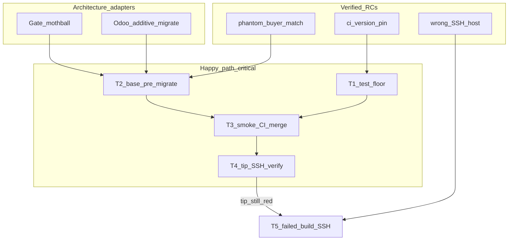

# Staging green load (Build plan)

**Cursor plan (operator Build UI):** this file
**Machine PLAN_DOCUMENT (GMP Phase 0 lock / validator SSOT):** `IB-Odoo_19/reports/plans/PLAN-2026-08-07-staging-security-base-green.json`
**Human projection of JSON:** `reports/plans/PLAN-2026-08-07-staging-security-base-green.md`
**Branch / PR:** `feat/staging-version-align` → [#146](https://github.com/cryptoxdog/IB-Odoo_19/pull/146) → `Staging`
**Execute with:** `l9-gmp-protocol` only after Build. On execute, keep this Cursor plan and the JSON **content-aligned** (same T1–T5 contracts); do not fork a third plan.

## Recursive alignment status

| Domain | Verdict | Notes |
|--------|---------|-------|
| Intent / scope | Aligned | Staging tip green + Gate mothball; Production out |
| Routing / integration | Aligned | Odoo→Gate→EIE→Gate→Odoo; no local matcher restore |
| Ownership | Aligned after this pass | Cursor plan = Build UI; JSON = validator/GMP lock; yaml = module order |
| Structure / placement | Aligned | Migration in `plasticos_base` (early graph); tests in `tests/` |
| Config / SSOT | PartiallyAligned→Aligned | Staging SSH host from `.env.local`; rule 98 synced in T4 only |
| Security / mothball | Aligned | Additive uninstall mark; no DROP; coordinator stays non-destructive |
| Validation | Aligned | Docker smoke + CI + SSH tip; failed-build log Unknown until T5 |
| Dual-plan drift | Fixed this pass | Critical path ends at T4; T5 contingency off happy path |

**Architecture adapters (Applied):**

- PlasticOS Gate / mothball: ADR-002, ADR-003-single, `docs/runbooks/MOTHBALL_LOCAL_INTELLIGENCE.md`, `ci/check_no_local_intelligence.py`
- Odoo 19 module lifecycle: additive migrations; `ir_module_module` state ownership
- Repo skills: `plasticos-odoo-docker-testing`, `plasticos-odoo-sh-deploy`, `l9-gmp-protocol`, `l9-pr-remediation` (CI threads only)

## Root cause (verified — consolidated)

| ID | Cause | Evidence | Forbidden remediation |
|----|-------|----------|----------------------|
| RC1 | Phantom `plasticos_buyer_match_engine` still `installed` | Staging `35033335` SSH: DB installed, disk absent; continuous odoo.log ERROR | Restore deleted addon |
| RC2 | Mothball CI exact-version pin | `#146` CI: test expects `19.0.3.0.0`, manifest `19.0.3.0.1` | Skip test / weaken ratchet |
| RC3 | Diagnose host ≠ tip failure host | Tip cards blame `security_base`; live host still `#140` stale update.log | Treat green-host log as tip traceback |

Fresh-DB Docker smoke on #146 **PASSED**. Tip merges fail Staging dump path until RC1 cleared.



## Ownership boundaries (do not blur)

| Concern | Owner | Not owner |
|---------|-------|-----------|
| Build button / operator todos | This Cursor `.plan.md` | Ad-hoc chat checklists |
| Validator / GMP lock fields | `reports/plans/...green.json` | Cursor frontmatter alone |
| Module install order | `config/odoo_module_order.yaml` | Manifest comments / stale excluded lists |
| Staging SSH endpoint | `.env.local` `ODOO_SH_STAGING_SSH` + T4-updated `98-odoo-sh-staging.mdc` | Hardcoded build IDs in new Python |
| Match result models | `plasticos_matching` Gate shell | Deleted `buyer_match_engine` |
| Intelligence authority | Gate / CEG external | Odoo-local matcher/IE |

## Skill / asset map (mandatory)

| Step | Load / run |
|------|------------|
| Lock | `l9-gmp-protocol` — JSON `gmp_handoff` may_modify / must_not_modify |
| Load gate | **`plasticos-odoo-docker-testing`**: `ci/check_xml_module_ref_deps.py` → `ODOO_ENTERPRISE_MODULES=none make install-smoke` |
| Order SSOT | [config/odoo_module_order.yaml](config/odoo_module_order.yaml) (Gate shells in; deleted engines excluded — already on #146) |
| Staging | **`plasticos-odoo-sh-deploy`** + `.env.local` |
| Mothball | [docs/runbooks/MOTHBALL_LOCAL_INTELLIGENCE.md](docs/runbooks/MOTHBALL_LOCAL_INTELLIGENCE.md) |
| CI threads | `l9-pr-remediation` only if new review/CI noise after push |
| Fence | `make no-local-intelligence` — never reintroduce deleted engines |

## Implementation

### T1 — CI unblock (stdlib)

File: [tests/test_mothball_migration.py](tests/test_mothball_migration.py)

```python
def _manifest_version(src: str) -> tuple[int, ...]:
    import ast
    data = ast.literal_eval(src)
    return tuple(int(p) for p in data["version"].split("."))

def test_matching_version_bumped_for_migration():
    ver = _manifest_version(MANIFEST.read_text(encoding="utf-8"))
    assert ver >= (19, 0, 3, 0, 0)
```

Validate: `pytest tests/test_mothball_migration.py -q`

### T2 — phantom clear (additive)

- [plasticos_base/__manifest__.py](plasticos_base/__manifest__.py): `19.0.1.1.5` → `19.0.1.1.6`
- Create `plasticos_base/migrations/19.0.1.1.6/pre-migrate.py`
- One short note in mothball runbook pointing at this migration

`migrate(cr, version)`:

1. `UPDATE ir_module_module SET state='uninstalled' WHERE name IN ('plasticos_buyer_match_engine','plasticos_inference_engine') AND state IN ('installed','to upgrade','to remove','to install')`
2. `DELETE FROM ir_module_module_dependency WHERE name IN (...)`
3. Log rowcounts; **no** DROP TABLE; **no** mutation of retained `plasticos_match_*` / enrichment run tables

Idempotent after first apply.

### T3 — smoke + ship

On `feat/staging-version-align`:

1. `python3 ci/check_xml_module_ref_deps.py`
2. `ODOO_ENTERPRISE_MODULES=none make install-smoke`
3. `pytest tests/test_mothball_migration.py -q`
4. Commit + push; CI Gate + Baseline Ratchet green
5. Squash-merge #146 → `Staging`

### T4 — tip verify (happy-path end)

After tip rebuild, via **plasticos-odoo-sh-deploy**:

```bash
# Host from .env.local ODOO_SH_STAGING_SSH
ssh <host> 'cd /home/odoo/src/user && git rev-parse HEAD && git log -1 --oneline'
ssh <host> 'timeout 60 odoo-bin shell -d <db> --no-http'  # module states
ssh <host> 'grep "ERROR.*plasticos_buyer_match" ~/logs/odoo.log | tail -5'
```

Pass: tip SHA = merge; buyer_match not installed; no new buyer_match ERROR after rebuild.

Sync observed build ID into [.cursor/rules/98-odoo-sh-staging.mdc](.cursor/rules/98-odoo-sh-staging.mdc) + ssh-diagnose note.

### T5 — contingency only (off happy-path critical path)

**Enter iff** tip card still `failed` (e.g. `plasticos_security_base`) after T3 merge + time for T2 migration to run.

SSH **failed build ID** from card (≠ last-green), scrape `~/logs/update.log`, fix with version bump, re-smoke, push.

If T4 green → set T5 **cancelled** (NotApplicable). Do not leave T5 blocking convergence.

## Critical path (aligned)

`T1 → T2 → T3 → T4`
`T5` depends on T4 failure evidence only.

## Out of scope

- Restore deleted local intelligence modules
- Production promote
- Destructive mothball coordinator uninstall / table drops
- Broad refactors / formatter churn
- Treating Cursor plan and JSON as competing unrelated plans

## Validation matrix

| Check | When | Pass |
|-------|------|------|
| pytest mothball migration | After T1 | all PASSED |
| xml module ref deps | Before smoke | OK |
| install-smoke | After T1+T2 | PASSED |
| CI Gate + Ratchet #146 | After push | success |
| Staging SSH inventory | After tip rebuild | buyer_match not installed |
| Odoo.sh Staging card | After tip rebuild | build 19.0 success |
| Failed-build update.log | T5 only | Unknown until red card |

## Rollback

- Revert T2 if upgrade aborts on migration (unlikely).
- Keep last-green Staging until tip succeeds; no Production promote.
- Never restore deleted engines as remediation.

## Residual unknowns

- **U1:** Tip `security_base` ParseError text — probe via T5 if still red (resolution: probe).
- **U2:** Dump vs empty Staging rebuild — T2 required either way for live `35033335` continuity (resolution: probe).

## Alignment delta (this Recursive Alignment pass)

- Declared **dual-SSOT ownership** (Cursor Build UI vs JSON GMP lock) — eliminates competing-plan ambiguity.
- **Critical path ends at T4**; T5 explicitly off happy path (was incorrectly listed as required path end).
- Added **architecture adapter** table (Gate/mothball + Odoo migrate + skills).
- Added **ownership boundaries** so module-order yaml / SSH env / matching shell stay correct owners.
- Bound execute rule: keep Cursor plan ↔ JSON content-aligned; no third plan fork.

## Success criteria

1. #146 CI Gate + Baseline Ratchet green
2. Staging SSH: buyer_match not installed; no buyer_match ERROR after tip rebuild
3. Odoo.sh Staging **build 19.0 success** on tip SHA
4. Local install-smoke PASS
5. No restored local matching / inference modules
6. T5 cancelled or completed with failed-build traceback evidence
