# State Transition Infrastructure Plan

## Purpose

Enable crons and system processes to safely transition transaction states by:

1. Adding new logistics-related states to the state selection
2. Creating dedicated `action_*` methods for each new state
3. Updating `_validate_state_transition` to respect a bypass context for system operations

---

## Current State Machine Analysis

### Existing States (transaction.py lines 406-422)

```
draft → active → pending_supplier → supplier_ready → in_progress → in_transit → delivered → invoiced → closed
                                                                                                    ↓
                                                                                               cancelled
```

### Existing Action Methods


| Method              | Target State | Bypass Mechanism                                |
| ------------------- | ------------ | ----------------------------------------------- |
| `action_activate()` | `active`     | Hardcoded allow in `_validate_state_transition` |
| `action_close()`    | `closed`     | Hardcoded allow (with `commission_locked=True`) |


### Current Guard Logic (lines 783-790)

```python
def _validate_state_transition(self, rec, vals):
    if "state" in vals:
        allow = vals.get("state") == "active" or (
            vals.get("state") == "closed" and vals.get("commission_locked") is True
        )
        if not allow:
            raise UserError("State can only be changed via action methods.")
```

**Problem:** Only `active` and `closed` are allowed. All other states are blocked.

---

## New States Required


| State        | Purpose                             | Triggered By                        |
| ------------ | ----------------------------------- | ----------------------------------- |
| `do_created` | Delivery order has been created     | `_cron_auto_create_delivery_orders` |
| `dispatched` | Load has been dispatched to carrier | `action_mark_dispatched` on load    |


**Note:** These states fit into the existing flow after `supplier_ready`:

```
supplier_ready → do_created → dispatched → in_transit → delivered → ...
```

---

## Architecture

```mermaid
flowchart TD
    subgraph current [Current States]
        draft --> active
        active --> pending_supplier
        pending_supplier --> supplier_ready
        supplier_ready --> in_progress
        in_progress --> in_transit
        in_transit --> delivered
        delivered --> invoiced
        invoiced --> closed
    end

    subgraph new [New States - This Plan]
        supplier_ready2[supplier_ready] --> do_created
        do_created --> dispatched
        dispatched --> in_transit2[in_transit]
    end

    subgraph bypass [Bypass Context]
        cron[Cron Job] -->|"bypass_state_guard=True"| action_method
        action_method -->|"with_context"| write
        write --> state_change
    end
```




---

## Phase 1: Update State Selection

**Modify:** [plasticos_transaction/models/transaction.py](plasticos_transaction/models/transaction.py)

### Step 1.1: Add New States to Selection

**Location:** Lines 406-422

**Before:**

```python
state = fields.Selection(
    [
        ("draft", "Draft"),
        ("active", "Active"),
        ("pending_supplier", "Pending Supplier"),
        ("supplier_ready", "Supplier Ready"),
        ("in_progress", "In Progress"),
        ("in_transit", "In Transit"),
        ("delivered", "Delivered"),
        ("invoiced", "Invoiced"),
        ("closed", "Closed"),
        ("cancelled", "Cancelled"),
    ],
    default="draft",
    tracking=True,
    index=True,
)
```

**After:**

```python
state = fields.Selection(
    [
        ("draft", "Draft"),
        ("active", "Active"),
        ("pending_supplier", "Pending Supplier"),
        ("supplier_ready", "Supplier Ready"),
        ("do_created", "DO Created"),  # NEW: Delivery order created
        ("dispatched", "Dispatched"),  # NEW: Load dispatched to carrier
        ("in_progress", "In Progress"),
        ("in_transit", "In Transit"),
        ("delivered", "Delivered"),
        ("invoiced", "Invoiced"),
        ("closed", "Closed"),
        ("cancelled", "Cancelled"),
    ],
    default="draft",
    tracking=True,
    index=True,
)
```

**Acceptance Criteria:**

- Two new states added: `do_created`, `dispatched`
- States are in logical order (after `supplier_ready`, before `in_progress`)
- No existing state values changed

---

## Phase 2: Update State Transition Guard

**Modify:** [plasticos_transaction/models/transaction.py](plasticos_transaction/models/transaction.py)

### Step 2.1: Add Bypass Context Support

**Location:** Lines 783-790

**Before:**

```python
def _validate_state_transition(self, rec, vals):
    """Enforce that state changes only happen via dedicated action methods."""
    if "state" in vals:
        allow = vals.get("state") == "active" or (
            vals.get("state") == "closed" and vals.get("commission_locked") is True
        )
        if not allow:
            raise UserError("State can only be changed via action methods.")
```

**After:**

```python
def _validate_state_transition(self, rec, vals):
    """Enforce that state changes only happen via dedicated action methods.

    System processes (crons, automated workflows) can bypass this guard by
    setting context key 'bypass_state_guard' to True. This should only be
    used by action_* methods, never by direct write() calls.
    """
    if "state" in vals:
        # Allow system/cron state changes via context bypass
        if self.env.context.get("bypass_state_guard"):
            return

        # Allow explicit transitions to active or closed (existing behavior)
        allow = vals.get("state") == "active" or (
            vals.get("state") == "closed" and vals.get("commission_locked") is True
        )
        if not allow:
            raise UserError("State can only be changed via action methods.")
```

**Acceptance Criteria:**

- Bypass context check added BEFORE existing logic
- Existing `active` and `closed` behavior preserved
- Docstring updated to explain bypass mechanism
- Bypass only works when `bypass_state_guard=True` in context

---

## Phase 3: Create Action Methods

**Modify:** [plasticos_transaction/models/transaction.py](plasticos_transaction/models/transaction.py)

### Step 3.1: Add action_mark_do_created Method

**Location:** After `action_close` method (around line 887)

```python
def action_mark_do_created(self):
    """Mark transaction as having a delivery order created.

    Called by cron or system process after DO is linked.
    Uses bypass_state_guard context to allow state transition.
    """
    for rec in self:
        if rec.state != "supplier_ready":
            raise UserError(
                f"Cannot mark DO created: transaction must be in 'Supplier Ready' state (current: {rec.state})."
            )
        if not rec.delivery_order_id:
            raise UserError("Cannot mark DO created: no delivery order linked.")
        rec.with_context(bypass_state_guard=True).write({"state": "do_created"})
```

**Acceptance Criteria:**

- Method validates preconditions (state, delivery_order_id)
- Uses `with_context(bypass_state_guard=True)` for write
- Raises `UserError` with clear message on failure

### Step 3.2: Add action_mark_dispatched Method

**Location:** After `action_mark_do_created`

```python
def action_mark_dispatched(self):
    """Mark transaction as dispatched (load sent to carrier).

    Called when the linked load transitions to dispatched state.
    Uses bypass_state_guard context to allow state transition.
    """
    for rec in self:
        if rec.state not in ("do_created", "supplier_ready"):
            raise UserError(
                f"Cannot mark dispatched: transaction must be in 'DO Created' or 'Supplier Ready' state (current: {rec.state})."
            )
        load = getattr(rec, "load_id", False)
        if load and load.state not in ("dispatched", "picked_up", "delivered", "closed"):
            raise UserError("Cannot mark dispatched: load has not been dispatched yet.")
        rec.with_context(bypass_state_guard=True).write({"state": "dispatched"})
```

**Acceptance Criteria:**

- Method validates preconditions (state, load state)
- Allows transition from either `do_created` or `supplier_ready` (flexible workflow)
- Uses `with_context(bypass_state_guard=True)` for write

### Step 3.3: Add action_mark_in_transit Method

**Location:** After `action_mark_dispatched`

```python
def action_mark_in_transit(self):
    """Mark transaction as in transit (carrier picked up load).

    Called when the linked load transitions to picked_up state.
    Uses bypass_state_guard context to allow state transition.
    """
    for rec in self:
        if rec.state not in ("dispatched", "do_created", "in_progress"):
            raise UserError(
                f"Cannot mark in transit: invalid current state (current: {rec.state})."
            )
        rec.with_context(bypass_state_guard=True).write({"state": "in_transit"})
```

**Acceptance Criteria:**

- Flexible entry points (dispatched, do_created, in_progress)
- Uses bypass context

### Step 3.4: Add action_mark_delivered Method

**Location:** After `action_mark_in_transit`

```python
def action_mark_delivered(self):
    """Mark transaction as delivered.

    Called when the linked load transitions to delivered state.
    Uses bypass_state_guard context to allow state transition.
    """
    for rec in self:
        if rec.state != "in_transit":
            raise UserError(
                f"Cannot mark delivered: transaction must be in 'In Transit' state (current: {rec.state})."
            )
        rec.with_context(bypass_state_guard=True).write({"state": "delivered"})
```

**Acceptance Criteria:**

- Validates in_transit state
- Uses bypass context

---

## Phase 4: Update Cron Handlers (Optional Enhancement)

If the logistics plan's cron stubs are upgraded to real logic, they should call these action methods:

### Example: Upgraded _cron_auto_create_delivery_orders

```python
@api.model
def _cron_auto_create_delivery_orders(self):
    """Create delivery orders for ready transactions and update state."""
    ready = self.search([
        ("is_supplier_confirmed", "=", True),
        ("delivery_order_id", "=", False),
        ("state", "=", "supplier_ready"),  # Only supplier_ready state
    ])

    for tx in ready:
        # TODO: Create stock.picking here
        # do = self.env["stock.picking"].create({...})
        # tx.delivery_order_id = do.id

        # After DO is linked, transition state
        if tx.delivery_order_id:
            tx.action_mark_do_created()
        else:
            _logger.info(
                "Transaction ready for DO: %s (supplier confirmed %s)",
                tx.name,
                tx.supplier_confirmation_received,
            )

    return True
```

**Note:** This is shown for reference. The current plan keeps stubs as logging-only per user request.

---

## Phase 5: Validation

### Step 5.1: Pre-commit Validation

```bash
pre-commit run --all-files
```

### Step 5.2: Docker Test

```bash
docker-compose down && docker-compose up -d
docker-compose logs -f odoo | head -200
```

### Step 5.3: Module Upgrade

```bash
docker-compose exec odoo odoo -d odoo -u plasticos_transaction --stop-after-init
```

### Step 5.4: Functional Test

1. Create a transaction, activate it
2. Set state to `supplier_ready` via existing flow
3. Call `action_mark_do_created()` via shell or test
4. Verify state changes to `do_created`
5. Call `action_mark_dispatched()`
6. Verify state changes to `dispatched`

---

## Risk Mitigation


| Risk                        | Likelihood | Impact | Mitigation                                     |
| --------------------------- | ---------- | ------ | ---------------------------------------------- |
| Bypass context misuse       | Medium     | High   | Only use in action_* methods, document clearly |
| State ordering confusion    | Low        | Medium | Clear docstrings, logical selection order      |
| Breaking existing flows     | Low        | High   | Existing active/closed logic unchanged         |
| Missing precondition checks | Medium     | Medium | Each action validates current state            |


---

## Definition of Done

### Code Quality

- All Python files pass `ruff check`
- All Python files pass `ruff format --check`
- All files pass `pre-commit run --all-files`
- All new methods have docstrings
- Bypass context documented in `_validate_state_transition`

### Functional

- Two new states appear in state selection dropdown
- `action_mark_do_created()` transitions from `supplier_ready` to `do_created`
- `action_mark_dispatched()` transitions to `dispatched`
- `action_mark_in_transit()` transitions to `in_transit`
- `action_mark_delivered()` transitions to `delivered`
- Bypass context works (crons can transition states)
- Direct write without bypass still blocked

### Testing

- Docker build succeeds
- Module upgrade succeeds
- Manual state transition test passes

---

## Comprehensive Checklist

### Pre-Implementation

- Read current `_validate_state_transition` logic
- Verify existing action methods pattern
- Backup current state (git stash or branch)

### Phase 1: State Selection

- Add `("do_created", "DO Created")` to state selection
- Add `("dispatched", "Dispatched")` to state selection
- Verify order: after `supplier_ready`, before `in_progress`

### Phase 2: Guard Update

- Add bypass context check to `_validate_state_transition`
- Preserve existing `active`/`closed` allow logic
- Update docstring with bypass explanation

### Phase 3: Action Methods

- Add `action_mark_do_created()` with precondition checks
- Add `action_mark_dispatched()` with precondition checks
- Add `action_mark_in_transit()` with precondition checks
- Add `action_mark_delivered()` with precondition checks
- All methods use `with_context(bypass_state_guard=True)`

### Phase 4: Validation

- Run `pre-commit run --all-files`
- Run `docker-compose down && docker-compose up -d`
- Run module upgrade command
- Test state transitions manually

### Post-Implementation

- Commit with descriptive message
- DO NOT push (wait for explicit request)
- Document any deviations from plan

---

## Files Summary


| File                                          | Action | Phase   |
| --------------------------------------------- | ------ | ------- |
| `plasticos_transaction/models/transaction.py` | Modify | 1, 2, 3 |


**Total:** 1 file modified
