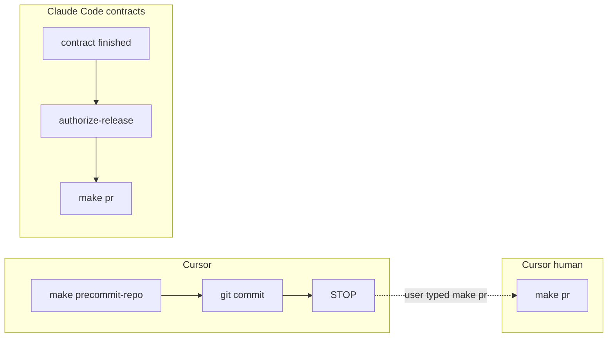

# PLAN: Stop after catalog commit (Cursor) / make pr (Claude Code)

## Improve finding

The first draft treated every agent the same. That would break Claude Code coding contracts, whose terminal step is `make pr` ([skills/l9-claude-coding-contract-compiler](skills/l9-claude-coding-contract-compiler/scripts/validate_chain.py) `TERMINAL_DELIVERY_MISMATCH`).

Root cause of Cursor overshoot is **unsplit teachers**, not `.pre-commit-config.yaml`:

- [ops/autonomy/surface_profile.yaml](ops/autonomy/surface_profile.yaml) `session_start_block` is injected verbatim (Claude SessionStart; this Cursor session also received it). It still says “Only then: `PR_REMEDIATE=0 make pr`”.
- `when.L9_GOVERNANCE_SURFACE` already lists `claude-code` / `codex` / `gemini` / `manus` and **not** `cursor`, but the block text does not say Cursor must stop.
- Always-on [rules/88-l4-local-autonomy.mdc](rules/88-l4-local-autonomy.mdc) and [rules/48-make-pr-remediation.mdc](rules/48-make-pr-remediation.mdc) command `make pr` with no surface predicate. Cursor and Claude both load them (Cursor `.mdc`; Claude via [ops/scripts/project_llm_rules.py](ops/scripts/project_llm_rules.py)).

## Locked outcome



**Cursor** (`L9_GOVERNANCE_SURFACE` is `cursor` or unset):

```text
make precommit-repo
git commit   # pathspecs
STOP
```

No `make pr`, `make pr-check`, `OPEN_PR=0 make pr`, catalog-wide pytest, or L4 `authorize-release` unless the human typed `make pr` this turn.

**Claude Code** (`L9_GOVERNANCE_SURFACE=claude-code`): finished contract still `authorize-release` then `make pr`. Leave [environment/agents/adapters/claude-code/settings.template.json](environment/agents/adapters/claude-code/settings.template.json) `Bash(make pr:*)` and [validate_claude_env.py](environment/agents/adapters/claude-code/validate_claude_env.py) allow-list assertion. Other adapters (`codex` / `gemini` / `manus`) keep today’s adapter publish path.

Makefile `pr: pr-preflight pr-check` and [`.pre-commit-config.yaml`](.pre-commit-config.yaml) stay.

## Trigger inventory (no silent omit)

### Cursor must stop (add surface predicate; do not delete `make pr` as a word)

| Teacher | Today | Change |
|---|---|---|
| [CANONICAL_LAW.md](CANONICAL_LAW.md) §6.2.5 item 3 | “If the work is done and committed, `make pr`.” | Append surface-split section. Do not rewrite old lines. |
| `session_start_block` in [surface_profile.yaml](ops/autonomy/surface_profile.yaml) | “Only then: `PR_REMEDIATE=0 make pr`” | Cursor paragraph: catalog + commit + stop. Claude Code paragraph: keep finish → `make pr`. |
| `llm_rules_override` same file → generated [zz-autonomy-surface-override.md](environment/generated/llm-rules/zz-autonomy-surface-override.md) | Item 2 all adapters `make pr`; item 5 Cursor ask-first | Item 5 becomes Cursor **stop**. Item 2 stays Claude Code (and other adapters). Regenerate; do not hand-edit zz. |
| [rules/88-l4-local-autonomy.mdc](rules/88-l4-local-autonomy.mdc) | MUST `authorize-release` + `make pr` | Cursor stop. Claude Code keep the publish block. |
| [rules/48-make-pr-remediation.mdc](rules/48-make-pr-remediation.mdc) | “Agents MUST: Use `make pr`” | Cursor MUST NOT as finish. Claude Code MUST on contract finish. Happy-path line 117. |
| [rules/99-no-auto-commit.mdc](rules/99-no-auto-commit.mdc) | ask-first except L4 standing publish | Cursor: no standing publish. Claude Code: L4 publish stays. |
| [rules/42-no-abandoned-work.mdc](rules/42-no-abandoned-work.mdc) | finish via `make pr` / `l9 pr` | Cursor finish is commit. Claude Code keep `make pr`. |
| [commands/gmp.md](commands/gmp.md) + [gmp-autonomy-bounds.md](skills/l9-gmp-protocol/references/gmp-autonomy-bounds.md) + [l9-gmp-protocol/SKILL.md](skills/l9-gmp-protocol/SKILL.md) | finalize = `make pr` | Cursor finalize = catalog + commit + stop. Claude Code finalize keeps `make pr`. |
| [AGENTS.md](AGENTS.md) `PR_CHECK_FOLDED_V1` | `make pr` owns ceremony | Append surface-split. Historical blocks stay. |

### Keep (Claude Code / sanctioned verb — not a Cursor finish trigger)

| Teacher | Why keep |
|---|---|
| `when.L9_GOVERNANCE_SURFACE` + `post_push.required_command: make pr` | Claude Code / adapter publish path |
| `authorize: create_update_pr_via_make_pr` | Gated on L4 release for adapters |
| Claude `settings.template.json` `Bash(make pr:*)` + `validate_claude_env.py` | Adapter allow-list; tests fail if removed |
| [memory-enforcement.contract.json](environment/agents/adapters/claude-code/memory/memory-enforcement.contract.json) `publication` | Claude memory contract |
| [l9-claude-coding-contract-compiler](skills/l9-claude-coding-contract-compiler) terminal `make pr` | User caveat |
| [ops/autonomy/local_execution_gate.py](ops/autonomy/local_execution_gate.py) | Brake until release; Claude still authorize-releases |
| Rules 49 / 53 / 54 / 55 / 96 | Name `make pr` as the publish *verb* when someone publishes. Do not turn them into a Cursor finish command. Leave unless a line says Cursor must publish now. |

### Do not touch

- [Makefile](Makefile), [`.pre-commit-config.yaml`](.pre-commit-config.yaml), [ops/scripts/run_pr_gate.sh](ops/scripts/run_pr_gate.sh)
- Hand-edits under `environment/generated/llm-rules/` (projector only)
- Foreign `docs/plans/dag_authoring_convert_4d8d80c4.plan.md`

## Implementation

1. **Inventory todo** — paste this table into the PR body so review can see keep vs split.
2. **CANONICAL_LAW append** — Cursor catalog+commit+stop. Claude Code finished contracts `make pr`. Supersedes §6.2.5 item 3 **for Cursor only**. Protected-root stamp. No `ALLOW-ROOT-DELETION`.
3. **surface_profile** — split `session_start_block` and `llm_rules_override`. Then `python3 ops/scripts/project_llm_rules.py --root "$(pwd)"` so zz + rule companions match. Update [ops/autonomy/acceptance_dry_run.py](ops/autonomy/acceptance_dry_run.py) / [tests/ops/autonomy/test_surface_profile.py](tests/ops/autonomy/test_surface_profile.py) if they require the old unsplit “Only then: make pr” string in the Cursor-visible block.
4. **Rules 88 / 48 / 99 / 42** — one predicate: `L9_GOVERNANCE_SURFACE=claude-code` (and other adapters as today) keep finish → `make pr`. Cursor or unset: stop after catalog+commit.
5. **`/gmp`** — same predicate in finalize. Do not make `/gmp` Cursor-only or Claude-only.
6. **AGENTS append** — same split. Additive only.
7. **Reentry** — fail unnegated Cursor finish strings (`Only then: PR_REMEDIATE=0 make pr`, rule-88 publish block, `/gmp` finalize `make pr`) **unless** the same line or immediately preceding sentence names `claude-code` / `L9_GOVERNANCE_SURFACE`. Allow Claude compiler fixtures that require terminal `make pr`.

## Prove (this Build is Cursor — do not `make pr`)

- `pytest tests/ops/scripts/test_ceremony_ownership.py`
- `python3 ops/scripts/project_llm_rules.py --root "$(pwd)" --check`
- `git diff -- .pre-commit-config.yaml Makefile` empty
- Pathspecs only

## Out of scope

- Speeding `make pr` / `run_pr_gate.sh`
- Installing a git commit hook
- Narrowing adapter publish to Claude Code only (codex/gemini/manus stay)
- Remediator `git push` when the user invoked `/l9-pr-remediation`
- PE campaign packets
