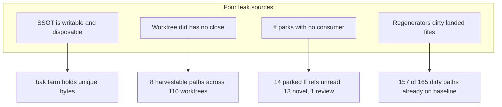

# Stop dirt and split commits at the source

**Skill:** `l9-plan-simple` (Cursor Build). Do not run `make campaign`. Do not admit a Program Lock. Do not write `Lock: origin/main = <sha>`.

**Depth:** `deep` — measured: `route_plan.py --risk high --evidence sufficient` prints `depth=deep`, `omit_gates=[]`. Gate files are high-risk (`AGENTS.md` §12.2).

**Hook catalog:** [`.pre-commit-config.yaml`](.pre-commit-config.yaml)

## Architect framing

The census found zero novel work in the live SSOT and a large pile in the workspace clone. That is not two products; it is four missing closes:



Numbers come from the parked census receipts, not from recall: [`harvest-ws.json`](WIP/8-28-26/novel-remainder-harvest/harvest-ws.json) (`counts: harvestable 8, skipped 157, worktrees 110`; every skip reason is `already_on_baseline`) and [`triage-ws.json`](WIP/8-28-26/novel-remainder-harvest/triage-ws.json) / [`triage-ssot.json`](WIP/8-28-26/novel-remainder-harvest/triage-ssot.json) (14 refs against 0).

The shape that matters: **most apparent dirt is not work.** 157 of 165 classified paths hold bytes already on `origin/main`. Only 8 are novel. So the volume problem is L4 and the value problem is L2, and they need different fixes.

Fix each close, not the pile. Content landing stays the separate remainder-harvest plan; this plan stops growth.

## Immutable baseline (workspace bind, not a Program Lock)

- Repo `/Users/ib-mac/Cursor-Governance`, branch `feat/pr-train-pack-overlap` @ `3986a0a1`, dirty (plans shelf + prompt moves)
- SSOT `~/.cursor-governance`: clean shallow `main` @ `37363dd5` (`git status --porcelain` returns 0 lines)
- Workspace HEAD is **not load-bearing**: T0 cuts from **fetched** `origin/main` in a dedicated worktree ([`ops/scripts/agent_worktree_start.sh`](ops/scripts/agent_worktree_start.sh)), so drift on this branch does not invalidate the plan. Recorded for attribution only.
- Gate work must not mix onto the residue branch — an execution step under rule 49, not a planning lock.

## Objective + success properties

**Objective:** Make it structurally impossible to (a) accumulate commits in the SSOT clone, (b) discard or prune an SSOT tree that still holds unpushed bytes, (c) end a session with unique worktree dirt that has no named ref, or (d) grow preserve refs nobody re-judges.

- **SP-01** New fixture test: `git commit` / `git add` / `git branch` issued with cwd inside the live SSOT is denied by [`ops/autonomy/local_execution_gate.py`](ops/autonomy/local_execution_gate.py); `L9_SSOT_WRITE_AUTHORIZED=<reason>` allows it. `--status` prints `model: governed_gate`.
- **SP-02** Fixture: live SSOT dirty-or-ahead **and** unique bytes still present after `pre_swap_backup` ⇒ `STATUS action=degraded detail=...ssot_unpushed_refuse_swap`, `ls ~/.cursor-governance.bak.*` count **unchanged**, live tree untouched, exit 0.
- **SP-02b** Fixture: backup script present and exiting **0 without pushing** (the gated-skip case) with a dirty live tree ⇒ same refusal as SP-02. This is the case the exit code cannot see.
- **SP-03** Fixture: worktree with one modified and one untracked unique path ⇒ exactly one new `refs/l9/preserved/worktree-dirt/*` ref whose tree contains both paths, `git status --porcelain` in that worktree **byte-identical before and after**, worktree not removed, branch not deleted.
- **SP-03b** Same fixture plus a third dirty path whose blob equals `origin/main` ⇒ that path is **absent** from the parked tree. This is the property that keeps the 157 already-on-baseline paths out of parked refs.
- **SP-04** Re-running hygiene on an unchanged dirty worktree creates **zero** additional refs (dedupe by tree sha).
- **SP-05** `preserved_queue.py --json` reports `deletes_performed: 0`, buckets every ref matched by the three `PRESERVE_PATTERNS` plus `refs/backup/*`, and prints prune commands only for `prune_candidate` or `archive_ref` + `redundancy_basis: patch_id`.
- **SP-06** Fixture: a `.bak` clone whose unique commits live on a **non-HEAD** local branch survives `prune_baks`; the receipt records why it was kept.

## Capability preflight

- `git fetch origin` in the workspace; SSOT read-only.
- Reuse, do not fork: [`diagnose_ref_value.py`](skills/l9-git-work-preserve/scripts/diagnose_ref_value.py) (`diagnose(repo, ref, baseline, do_fetch)`), [`triage_preserved_refs.py`](skills/l9-git-work-preserve/scripts/triage_preserved_refs.py) (`PRESERVE_PATTERNS`, `BUCKETS`, `_bucket`), [`prune-policy.md`](skills/l9-git-work-preserve/references/prune-policy.md).
- Existing tests to extend: [`ops/scripts/tests/test_governance_activate_fresh.sh`](ops/scripts/tests/test_governance_activate_fresh.sh), [`tests/ops/scripts/test_repo_hygiene.py`](tests/ops/scripts/test_repo_hygiene.py).

## T1 — SSOT write gate (hard deny)

New [`ops/autonomy/ssot_write_gate.py`](ops/autonomy/ssot_write_gate.py). Two different modules supply two different shapes, and conflating them was a defect in the first draft:

- **Command parsing** follows [`worktree_isolation_gate.py`](ops/autonomy/worktree_isolation_gate.py): it imports `command_parse` (line 41) and descends segments via `_git_command_segments` (line 272). It exposes **no** CLI.
- **`--status`** follows [`verification_bypass_gate.py`](ops/autonomy/verification_bypass_gate.py) (lines 465-466), which is where that convention actually lives.

Deny when the resolved git common dir of the command's cwd is the **live** `$HOME/.cursor-governance` and the git subcommand mutates: `commit`, `add`, `stash` (push/save), `branch` (create/delete), `merge`, `rebase`, `cherry-pick`, `reset`, `revert`, `apply`, `am`, `push`.

Not denied:

- `ssot_checkout` and `consumer` workspaces — classify with [`ops/scripts/lib/workspace_kind.sh`](ops/scripts/lib/workspace_kind.sh) semantics (identity files, not path prefix), as `CANONICAL_LAW.md` §1.1 already defines them.
- A machine that designates SSOT as its working clone: stamp `$HOME/.cursor/l9-ssot-writable`. This reuses the established machine-local stamp mechanism `$HOME/.cursor/l9-plans-store` (`AGENTS.md` `CURSOR_PLANS_REPO_STORE_V1`) rather than introducing a new kind of marker.
- Read-only git (`status`, `log`, `diff`, `fetch`, `for-each-ref`, `rev-parse`).
- Hook-internal git. The gate only sees agent-issued commands, so `bash ops/scripts/backup_to_github.sh` and `governance_activate_fresh.sh` internals stay allowed — this is the load-bearing exemption and SP-01 must assert it.

Escape: `L9_SSOT_WRITE_AUTHORIZED=<reason>`; new kill switch `L9_SSOT_WRITE_GATE=0`. Wire the import beside `command_violates_worktree_isolation` (imported at `local_execution_gate.py` line 82, called at 536 and 837) for both `main_claude()` (line 677) and `main_cursor_shell()` (line 812).

Tests: `tests/ops/autonomy/test_ssot_write_gate.py`.

## T2 — Activate refuses to discard or prune unpushed bytes

### What the code does today

[`ops/scripts/governance_activate_fresh.sh`](ops/scripts/governance_activate_fresh.sh) declares its contracts C1-C7 in the header (lines 5-11). `do_swap` (lines 244-304) calls `pre_swap_backup` (line 281), then moves the live tree to `.bak.<stamp>` (lines 282-288) regardless of the outcome.

`pre_swap_backup` (lines 187-204) sets `BAK_UNPUSHED=1` in exactly two situations: the push returned non-zero, or no backup script is executable and the tree is dirty-or-ahead. It does **not** set the flag when the push script returns 0.

That is the hole. `backup_to_github.sh` exits **0** on a gated skip (lines 23, 85, 109), and `backup_gate.sh` signals SKIP with exit **10** — a skip, not a failure. This session's own bootstrap line reads `backup: SKIPPED — .governance-build-lock present`. So a live SSOT holding unique bytes can be swapped into a bak while `BAK_UNPUSHED` still reads 0.

`prune_baks` (lines 206-235) then measures each bak's uniqueness only as `origin/$BRANCH..HEAD`, so a bak whose unique commits sit on a non-HEAD local branch is deleted with no record.

### Change

1. **Refuse the swap from measured state, not from an exit code.** After `pre_swap_backup`, re-measure the live tree: `tree_clean` plus `rev-list --count origin/$BRANCH..HEAD` plus any local ref holding commits absent from its remote. When unique bytes remain, return without swapping. Main sets `ACTION=degraded`, `DETAIL=ssot_unpushed_refuse_swap`, still calls `heal_wiring`, `write_receipt`, `emit_status`, exits 0 — the existing fallthrough at lines 471-476 already provides that path. Remove the staging tree; never touch the live tree.
2. **Widen `prune_baks` uniqueness to all local refs**, not `HEAD` alone, and record the keep reason in `DETAIL` the way `bak_kept_unpushed` already does.
3. **Update the header contract block** so the file's declared contracts match its behavior: C4 moves from "pre-swap backup when dirty/ahead" to "swap only when no unique bytes remain"; C6 moves from HEAD-only retention to all-local-refs retention. C1, C2, C3, C5, and C7 are unchanged.

Override for a genuinely disposable tree: `GOVERNANCE_ACTIVATE_ALLOW_UNPUSHED_SWAP=1`.

Emit one loud sessionStart line naming the recovery: park into the checkout git dir or push, then re-run activate. Tests extend the existing `.sh` fixture suite additively (SP-02, SP-02b, SP-06).

## T3 — Auto-park unique worktree dirt at sessionEnd

Measured 2026-08-29T07:16Z: 88 worktrees, **24** dirty, 109 local branch refs. These counts drift between sessions; they size the problem and are not a lock.

[`ops/scripts/repo_hygiene.py`](ops/scripts/repo_hygiene.py) `classify_worktree` returns `dirty` and stops (lines 274-279); `REPO_HYGIENE.md` promises a dirty worktree is never touched. Keep that promise for **files** and add a ref.

For each `dirty` worktree, using a **temporary index** so the worktree's real index and files are never touched:

```bash
GIT_INDEX_FILE=<tmp> git -C <wt> add -- <explicit unique pathspecs>   # includes untracked
GIT_INDEX_FILE=<tmp> git -C <wt> write-tree
git -C <wt> commit-tree <tree> -p <wt HEAD> -m "park: worktree dirt <label>"
git -C <wt> update-ref refs/l9/preserved/worktree-dirt/<stamp>-<label> <commit>
```

- Pathspecs reuse the existing no-regression classifier: include a path when its blob differs from `origin/main` or the path is absent there; skip noise and generated prefixes. Noise is already defined — `is_skip_noise()` / `NOISE_PARTS` in [`harvest_worktree_dirt.py`](skills/l9-git-work-preserve/scripts/harvest_worktree_dirt.py) (lines 18, 47, 109) — so import that rather than restating the set. Never `git add` into the real index (rule 49).
- **This rule is what makes auto-park cheap.** 157 of the 165 classified dirty paths hold bytes already on baseline, so they are excluded by construction and the parked trees stay near the 8 genuinely novel paths. SP-03b asserts it.
- **Dedupe (SP-04):** skip when an existing `worktree-dirt` ref already has this tree sha. Without this, every sessionEnd adds a ref per dirty worktree.
- Cap parks per run at 8, matching the plans/WIP archive cap in [`audit_pipeline.py`](skills/l9-pipeline-audit/scripts/audit_pipeline.py) (`archive_landed_wip` line 325, `archive_spent_plans` line 386), and skip while the repo-write lock is held.
- Worktree status stays `dirty` with `action: park`; files, branch, and worktree all survive. Reuse `preserve()` (line 368) for the ref write and receipt list; `PRESERVE_NS` is already `refs/l9/preserved` (line 49).
- Correct the "never touched" section of [`ops/scripts/REPO_HYGIENE.md`](ops/scripts/REPO_HYGIENE.md): files still never touched, a recovery ref is now always created.

New kill switch `L9_HYGIENE_AUTOPARK=0`, alongside the existing `L9_REPO_HYGIENE=0` ([`session_end_repo_hygiene.sh`](ops/hooks/session_end_repo_hygiene.sh) line 21). Tests extend `tests/ops/scripts/test_repo_hygiene.py`.

## T4 — Drain the queue (parked means queued)

New [`ops/scripts/preserved_queue.py`](ops/scripts/preserved_queue.py) that widens the ref set, re-diagnoses against fetched `origin/main` via `diagnose_ref_value.diagnose`, and writes `<workspace>/.l9/preserved/queue.json` beside the existing `.l9/hygiene` receipts.

**Ref set** — keep all three of `triage_preserved_refs.PRESERVE_PATTERNS` (`refs/l9/preserved/ff/*`, `refs/l9/preserved/ff-dirty/*`, `refs/heads/l9/ff-preserve-*`; the glob form is deliberate per that file's comment), add `refs/l9/preserved/*` to catch `worktree-dirt` and any future namespace, and add `refs/backup/*` — one such ref exists in this clone today.

Today's queue, measured: `triage-ws.json` holds 14 refs (13 `novel`, 1 `review`), `triage-ssot.json` holds 0. Nothing reads those receipts on a schedule, which is the gap this unit closes.

- Buckets and evidence are the skill's, unchanged (`BUCKETS`, `_bucket`). `deletes_performed: 0` — prune still requires explicit user auth plus `L9_GIT_PRUNE_AUTHORIZED` (`prune-policy.md` line 17), and `content_superset` never authorizes a delete.
- `keep_push` count is surfaced so the pile cannot grow silently.
- sessionStart emits a short `### Preserved work` section (fail-open, ~2s budget, same shape as `### Plan audit`). [`session_start_bootstrap.sh`](ops/hooks/session_start_bootstrap.sh) enumerates the section list **twice** — the no-SSOT degraded `COMBINED` (lines 141-157) and the main `COMBINED` (lines 432-450). Both need the new heading, and the degraded path needs a placeholder line the way `- pipeline audit: skipped (no SSOT)` does. Display-only; no auto-prune, no auto-push.

Tests: `tests/ops/scripts/test_preserved_queue.py`.

## T5 — Stop generating dirt that is not work

This is the volume unit. Every one of the 157 skipped paths in the census carries reason `already_on_baseline`: the bytes are identical to what `origin/main` already tracks, so the dirt is noise, not work.

Generalize the rule `AGENTS.md` §19 already states for the `AGENTS.md` formatter block: after a reconciler runs, when the only delta is inside a generated region or under a generated prefix, restore that path from HEAD.

Read the prefix list from its declared owner rather than copying it: `sync_generated_artifacts.py --print-generated-prefixes` exists for exactly this (lines 637-642, "single SSOT for merge-driver attributes and overlap-gate exemptions").

Scope honestly: restore-from-HEAD covers the **generated** subset of those 157 paths, not all of them. The remainder are handled by omission — T3's pathspec rule never parks a path whose blob matches baseline, so they stop propagating even without being cleaned.

The stale-copy staging advisory is **not** in this plan. It would need a new turn-start observer on two surfaces — a Claude `UserPromptSubmit` wrap plus a `settings.template.json` entry, and a Cursor `beforeSubmitPrompt` registration — and [`root_file_advisory.py`](ops/autonomy/root_file_advisory.py) cannot absorb it because `advisory()` is scoped to protected root files. See Follow-on.

## T6 — Doctrine (append only)

- [`AGENTS.md`](AGENTS.md) is `additive_only`: append one named fragment `<!-- L9_SSOT_READ_ONLY_V1 -->` covering SSOT read-only, refuse-swap, prune-keep, auto-park, and the queue. Do not rewrite §11, §17, or §19.
- [`rules/49-shared-worktree-isolation.mdc`](rules/49-shared-worktree-isolation.mdc): add the SSOT clause and the auto-park close.
- [`CANONICAL_LAW.md`](CANONICAL_LAW.md): append a new dated section **`## 1.2 SSOT is a load surface, not a mutation surface (2026-08-29)`** directly after `## 1.1 SSOT-family checkouts are not consumers (2026-08-17)` (line 689), following that file's established dated-append convention. §1.1 already defines workspace kind `ssot` as the live clone and makes SSOT dirty/unpushed WARN-only on `ssot_checkout`; the new clause states that `ssot` accepts loads and not agent mutations unless designated. **Do not append to §11** — that section is "Diagnose-First Execution Discipline" (line 345), an unrelated subject. High-risk file: smallest possible append, no existing line rewritten, no `ALLOW-ROOT-DELETION` needed.

## Execution envelope

- fs: new gate/script modules, three edited scripts, tests, doctrine appends — all in the new worktree
- commands: git (pathspecs only), `make precommit-repo`, targeted `pytest <paths>`
- network: `git fetch` only
- secrets: none
- `autonomous_merge: false`

**Publish is ask-first.** This is the Cursor surface: after `make precommit-repo` and a scoped local commit, **stop**. Do not `authorize-release`, `make pr`, `make pr-check`, or `OPEN_PR=0 make pr` unless the human types `make pr`. Pressing Build is not push authorization.

## Side effects + idempotency

- T1/T5 are pure decision logic — re-running changes nothing.
- T2 only ever refuses an action or keeps a directory; it deletes nothing new.
- T3 is idempotent through the tree-sha dedupe; it only ever adds refs.
- T4 is read-only.
- Landing T3 before the remainder harvest is safe and helpful: it parks the 24 currently dirty worktrees to named refs without moving a byte, so the harvest reads refs instead of live dirt.

## Rollback

- Revert the commits; each unit is independent.
- Kill switches restore prior behavior without a revert: `L9_SSOT_WRITE_GATE=0`, `GOVERNANCE_ACTIVATE_ALLOW_UNPUSHED_SWAP=1`, `L9_HYGIENE_AUTOPARK=0`, `L9_REPO_HYGIENE=0`.
- Auto-park adds only refs; `git update-ref -d` reverses it with no content loss.

## Stress and disconfirm

- **Does the write gate break sessionEnd backup?** `backup_to_github.sh` commits in the SSOT. The gate runs at `beforeShellExecution` / PreToolUse and sees agent commands, not script internals, so the hook path survives. SP-01 must assert `bash ops/scripts/backup_to_github.sh` is allowed while a bare `git -C ~/.cursor-governance commit` is denied. If that assertion fails, T1 is wrong.
- **Does the refuse-swap predicate misfire when the backup genuinely succeeded?** No — it re-measures after the push, so a real push leaves nothing unique and the swap proceeds. The predicate is strictly more accurate than the exit code it replaces.
- **Does refusing the swap strand a stale tip?** Yes, deliberately — degraded plus a named recovery beats a silent bak. Wiring heal and exit 0 must still run.
- **Does auto-park cause ref bloat?** Two guards, and the numbers say both are needed: dedupe by tree sha (SP-04) and the differs-from-baseline pathspec rule (SP-03b) that excludes 157 of 165 paths.
- **Is a person's Cursor workspace ever the SSOT?** `CANONICAL_LAW.md` §1.1 defines workspace kind `ssot` as the live clone. The `$HOME/.cursor/l9-ssot-writable` stamp keeps a designated writable SSOT legal; without it, SSOT is load-only.
- **Assumed false if:** an agent sets its own `L9_SSOT_WRITE_AUTHORIZED` (forbidden — human/ops only), or a reconciler writes into a worktree without the repo-write lock.

**Blast radius:** a wrong deny blocks legitimate governance commits or breaks sessionEnd backup; a wrong refuse-swap freezes governance at a stale tip. Both are behind kill switches and fixture-tested.

## Out of scope

- Landing the existing leftover content — that stays [`docs/plans/novel_remainder_no-regress_0429bc04.plan.md`](docs/plans/novel_remainder_no-regress_0429bc04.plan.md)
- Deleting any branch, ref, stash, worktree, or bak clone
- Prune-execute (still auth-gated per `prune-policy.md`)
- Merging SSOT and workspace into one directory
- Installing a git commit hook (forbidden here)
- Weakening rule 49, the verification-bypass gate, or the merge gate
- Any push, PR, or merge
- Repairing the `mv staging to live` failure window in `do_swap` (line 289) — pre-existing, unrelated to unpushed bytes
- Cleaning the 157 already-on-baseline paths that are not generated — T3 stops them propagating; deleting them is the remainder-harvest plan's call

## Follow-on (separate plan)

| priority | change | why |
|----------|--------|-----|
| P1 | Stale-copy staging advisory | Needs a turn-start observer on two surfaces plus a new module; `root_file_advisory.advisory()` is scoped to protected root files. Unmeasured risk, so it does not ride along with T5. |
| P2 | Triage and prune the parked queue | `preserved_queue.py` reports; prune-execute stays auth-gated per `prune-policy.md`. 14 refs are waiting today. |

## Doc / root surface impact

- `AGENTS.md`: append `L9_SSOT_READ_ONLY_V1` fragment (T6)
- `CANONICAL_LAW.md`: one appended §1.2 section after §1.1 (T6)
- `rules/49-shared-worktree-isolation.mdc`: SSOT + auto-park clauses (T6)
- `ops/scripts/governance_activate_fresh.sh`: C4 + C6 header contract lines (T2)
- `ops/scripts/REPO_HYGIENE.md`: correct the dirty-worktree promise (T3)
- `Makefile`, `pyproject.toml`, `requirements.txt`: N/A — no new dependency, no new target

## Convergence

- `kind: simple`, `execute_via: cursor-build`
- Both kernel passes are recorded in `kernel_pass`; `validate_plan_kernel_receipt.py` returns PASS against this exact file
- Plan-artifact convergence: **Converged**. Implementation validation is T7 and is `not_run` by design
- Ends at: green `make precommit-repo`, targeted pytest PASS, scoped local commits on the new branch, publish **not** taken

## Execute via Cursor Build

Press **Build**. Work starts from the current checkout only to cut the clean branch; all edits land there.

- Do not run `make campaign`.
- Do not admit a Program Lock or Controller lease.
- Do not write `Lock: origin/main = <sha>`.
- Do not push or open a PR; stop after the scoped commit and wait for the human to type `make pr`.
