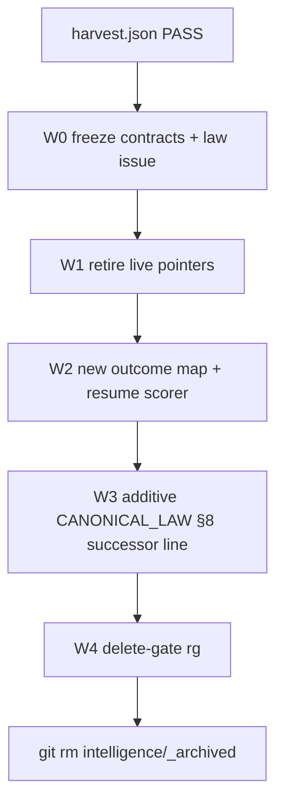

# PLAN: Complete Suite-6 intelligence archive cut-over

**kind:** `simple` · **execute_via:** `cursor-build` · **skill:** `l9-plan-simple`
**plan_id:** `plan.intelligence.suite6_archive_cutover.v1` · **schema_version:** `1.0.0` · **status:** `executable`
**plan_class:** `retirement_plan` · **redesign_allowed:** `false`

Planning SSOT: [WIP/8-28-26/intelligence-harvest/archived-suite6/harvest.json](WIP/8-28-26/intelligence-harvest/archived-suite6/harvest.json) (receipt PASS; highest-leverage nugget `c-cutover-seam-closure`). Prior YNP locked the wave order. Do not re-harvest.

Depth from `route_plan.py --risk high --evidence partial` is **deep**. Baseline gates stay. Do not write `Lock: origin/main = <sha>`.

## Execute via Cursor Build

Press **Build**. Work in the **current checkout**.

- Do not run `make campaign`.
- Do not admit a Program Lock or Controller lease.
- Do not write `Lock: origin/main = <sha>`.
- Do not open a new worktree from tip as a planning requirement.

Hook catalog for code in scope: [.pre-commit-config.yaml](.pre-commit-config.yaml). Cursor surface: `make precommit-repo`, scoped-commit, **STOP**. Do not `make pr` unless the human types it.

## Architect framing

Finish the 2026-07-19 Suite-6 archive (`268608be`) so live owners are SessionStart + Graphiti only. Extract two hardened semantics as **new** contracts and tests. Then delete [intelligence/_archived/](intelligence/_archived/) (TODO A5). Donor files are evidence, never authority. Do not restore or execute them.

## Immutable baseline

Bind at Build start (do not invent a Program Lock):

- Repository: `Quantum-L9/Cursor-Governance`
- Workspace: current checkout
- Overlap policy: `stop_if_dirty_overlaps_may_modify`
- Allowed local dirt: existing harvest WIP under `WIP/8-28-26/intelligence-harvest/archived-suite6/`; do **not** scoop foreign plan moves or the dirty `Makefile` (+9 −1, no `ALLOW-ROOT-DELETION`)
- On drift: stop and replan
- Verification: reverify `git status` / `git rev-parse HEAD` before first mutate

## Mission

Residual defect: nine Suite-6 intelligence files were archived, but live wrappers, docs, config, and `CANONICAL_LAW.md` §8 still name them. Two portable semantics were never landed: implicit outcome labels, and a fail-open keep/drop for **derived** resume episodes.

Success is falsifiable: no live caller of the nine archived paths; two new modules with harvest acceptance tests green; S3 `archive_transcript` still all-words; `intelligence/_archived/` gone; law §8 has an additive successor sentence (no overwrite unless a GitHub issue already exists).

## Success properties

- **SP-01** Baseline dirt does not overlap `write_allow` except listed harvest WIP. Proof: `git status --porcelain`.
- **SP-02** Cutover packet exists and names the outcome map, six resume signals, fail-open, and delete-gate. Proof: file present with those four sections.
- **SP-03** Live `rg` for the nine archived basenames has no caller under live ops/intelligence/skills except CHANGELOG / TODO / SETUP_QUICK_START historical mentions.
- **SP-04** Outcome helper writes a Graphiti lesson/outcome only for the six declared pairs, requires a decision episode id, and never writes a registry or threshold file.
- **SP-05** Resume scorer fail-open still emits `SessionHydrationPacket`; low-signal optional episode may drop; `archive_transcript` still writes the closed-chat document.
- **SP-06** `intelligence/_archived/` is absent. Proof: `test ! -d intelligence/_archived`.
- **SP-07** Targeted tests for the two new modules PASS. Catalog: `.pre-commit-config.yaml` via `make precommit-repo`.

## Capability preflight

- **CP-01** `git rev-parse HEAD` and `git status --porcelain` recorded.
- **CP-02** `launchctl list | grep -E 'tenx|context.processor'` — if a job is loaded, Wave 1 retires git pointers only; do not delete `process_context.sh` until unload is evidenced (U1).
- **CP-03** Harvest receipt still PASS at [WIP/8-28-26/intelligence-harvest/archived-suite6/harvest-receipt.json](WIP/8-28-26/intelligence-harvest/archived-suite6/harvest-receipt.json).
- **CP-04** `gh` available for the §8 issue. If not, Wave 3 is blocked; Waves 0–2 and the delete-gate grep still run; delete waits.

## Execution envelope

**write_allow**

- `WIP/8-28-26/suite6-cutover/`
- `ops/scripts/process_context.sh`
- `ops/scripts/show_context.sh`
- `ops/scripts/session_init.sh`
- `ops/feedback_loop_config.yaml`
- `intelligence/context-memory/` (README, INSTALLATION, `graphiti_sink.py` move-to-archive or delete)
- `learning/graphiti-episodes/manifest.json`
- `ops/graphiti/hydration/` (scorer + tests + `promotion_rules.yaml` declared constants only)
- `ops/graphiti/` new outcome-label module + tests (not a copy of `feedback_collector.py`)
- `TODO.md` A5/B7/B8/C3 rows
- `intelligence/workspace/SETUP_QUICK_START.md` (pointer refresh only)
- `CHANGELOG.md` (historical note only)
- `CANONICAL_LAW.md` **append-only** one successor sentence under §8 after the GitHub issue exists
- `intelligence/_archived/` delete in Wave 4 only

**write_deny**

- `Makefile` (already dirty protected-root; do not mix)
- `AGENTS.md`
- `intelligence/_archived/**` except the Wave 4 `git rm`
- `foundation/_archived/` (TODO A7 signatures)
- `foundation/logic/` (do not revive `probabilistic_engine` or `rule-registry.json`)
- `telemetry/`
- ECE / `/reasoning` / `l9-structured-reasoning` confidence policy
- `ops/scripts/RETIRED_export_chats_and_learning_processor.md` policy (all-words S3 stays)

**commands allow:** `gh issue create`, targeted pytest on new tests, `make precommit-repo`, scoped `git add` pathspecs, `git rm -r intelligence/_archived`

**commands deny:** execute any file under `intelligence/_archived/`, `make campaign`, `make pr` unless the human typed it, force-push, hard-reset, `pre-commit install`

**network:** `named_services_only` — GitHub for the §8 issue and Graphiti write tests if they hit the tunnel; no new secrets

**autonomous_merge:** `false`

## What to extract (tables, not code)

Copy these into the Wave 0 packet. Implement in Wave 2 as new YAML + Python. Never `import` `_archived`.

**Outcome map** (only these six rows; any other pair is no-op):

- `WARN_AND_LOG` + `edited_file` → `CORRECT`
- `WARN_AND_LOG` + `said_fine` → `TOO_STRICT`
- `BLOCK_OR_REQUIRE_REVIEW` + `added_header` → `CORRECT`
- `BLOCK_OR_REQUIRE_REVIEW` + `overrode` → `TOO_STRICT`
- `LOG_ONLY` + `error_occurred` → `TOO_LENIENT`
- `LOG_ONLY` + `no_issues` → `CORRECT`

Hardening: require an existing Graphiti decision episode id; stamp `agent_id`; write `--kind lesson` (or outcome) on that episode; do not port `_parse_feedback` text heuristics; do not port threshold/temperature mutation.

**Resume signals** (declared weights; incidental numbers, not a Bayesian engine):

- actions `min(n/3,1)` weight 0.25
- files `min(n/5,1)` weight 0.20
- decisions `min(n/2,1)` weight 0.20
- message volume `min(n/10,1)` weight 0.15
- code present 1/0 weight 0.10
- completion 1 or 0.3 weight 0.10

Hardening: apply only to **optional derived Graphiti episode writes** in [ops/graphiti/hydration/close_session.py](ops/graphiti/hydration/close_session.py) / inject. Always still emit [SessionHydrationPacket](ops/graphiti/hydration/session_hydration_packet.schema.yaml) from [compile_session_packet.py](ops/graphiti/hydration/compile_session_packet.py). Never filter [archive_transcript.py](ops/graphiti/hydration/archive_transcript.py). Scorer exception → fail-open (write). Extend [promotion_rules.yaml](ops/graphiti/hydration/promotion_rules.yaml) with named constants; do not create a second confidence SSOT.

Already-owned (record in packet only; no new features): `make improve` = observe-compare-patch; Graphiti/L4 = audit log; lessons corpus + rules 70/91 = surgical edits; wrapper-must-resolve = Wave 1 proof.

## Todos / DAG

Critical path: `todo-01-baseline` → `todo-02-freeze` → `todo-03-law-issue` → `todo-04-leaks-scripts` → `todo-05-leaks-docs` → `todo-06-outcome` → `todo-07-resume-scorer` → `todo-08-law-append` → `todo-09-delete-gate` → `todo-10-delete-archive` → `todo-11-prove`

Forbidden edges: delete before freeze; delete before delete-gate `rg`; law overwrite (delete/replace existing §8 lines); implement by copying archive files; point `process_context.sh` at `_archived` or at the new scorer.

**todo-01-baseline** (preflight, low) — Record HEAD, porcelain, LaunchAgent probe, harvest receipt. Stop if dirty overlaps `write_allow` except listed WIP.

**todo-02-freeze** (Create, high, leverage 1) — Write [WIP/8-28-26/suite6-cutover/CUTOVER_INVARIANTS.md](WIP/8-28-26/suite6-cutover/CUTOVER_INVARIANTS.md) with the two tables, fail-open, S3 all-words, wrapper-must-resolve, and the delete-gate command. This is the leverage primitive. Do not delete the archive in this todo.

**todo-03-law-issue** (Create, medium) — `gh issue create` on `Quantum-L9/Cursor-Governance`: §8 still names [intelligence/context-memory/graphiti_sink.py](intelligence/context-memory/graphiti_sink.py); live owner is [ops/graphiti/graphiti_memory_client.py](ops/graphiti/graphiti_memory_client.py) + hydration; CHANGELOG says sink never wired. Ask for append-only successor sentence. Do not edit the law here.

**todo-04-leaks-scripts** (Replace/Delete, high) — Retire or fail-closed-stub [ops/scripts/process_context.sh](ops/scripts/process_context.sh) (it still calls missing `intelligence/context-memory/context-extractor.py`). Same cluster: [show_context.sh](ops/scripts/show_context.sh), [session_init.sh](ops/scripts/session_init.sh) if unused by hooks (TODO B8). Remove `feedback_collector.script` from [ops/feedback_loop_config.yaml](ops/feedback_loop_config.yaml) (TODO B7). Move or delete live `graphiti_sink.py` (never wire it to the new scorer). If CP-02 shows a loaded LaunchAgent, leave the script as a retired stub that exits 1 and does not exec Python.

**todo-05-leaks-docs** (Replace, medium) — Rewrite [intelligence/context-memory/README.md](intelligence/context-memory/README.md) and [INSTALLATION.md](intelligence/context-memory/INSTALLATION.md) to Graphiti hydrate / `archive_transcript`. Fix [learning/graphiti-episodes/manifest.json](learning/graphiti-episodes/manifest.json) if it names `emit_session`. Refresh TODO A5/B7/B8/C3 and [SETUP_QUICK_START.md](intelligence/workspace/SETUP_QUICK_START.md). Keep CHANGELOG historical mentions.

**todo-06-outcome** (Create, high) — New YAML map + `ops/graphiti` helper + tests. Uses `graphiti_memory_client` write. No archive import. Acceptance from harvest `c-implicit-outcome-label`.

**todo-07-resume-scorer** (Create, high) — New scorer + tests next to hydration; declared constants in `promotion_rules.yaml`. Acceptance from harvest `c-resume-episode-threshold` plus an explicit test that `archive_transcript` still writes a low-signal session.

**todo-08-law-append** (Insert, high, blocked on issue) — Append one successor sentence under `CANONICAL_LAW.md` §8. Do not delete or rewrite the existing `graphiti_sink.py` row unless the issue authorizes `ALLOW-ROOT-DELETION`. If `gh` failed, skip and leave delete gated.

**todo-09-delete-gate** (preflight, medium) — Run the packet’s `rg` command. No-go if any live caller remains. Historical CHANGELOG/TODO/SETUP_QUICK_START hits are allowed.

**todo-10-delete-archive** (Delete, irreversible) — `git rm -r intelligence/_archived`. Do not delete `execution-governance/`, `foundation/_archived/`, or other A-tier shells. Update TODO A5 to ABSENT.

**todo-11-prove** (validate, medium) — Targeted pytest for the two new modules; `make precommit-repo`; SP-03 and SP-06 re-check.

## Checkpoints

- **C1** after freeze: packet has both tables + delete-gate. No-go: stop; do not touch leaks.
- **C2** after leaks: `process_context.sh` no longer execs `context-extractor.py`. No-go: do not start Wave 2.
- **C3** after semantics: both test files PASS; archive_transcript all-words test PASS. No-go: do not delete.
- **C4** after delete-gate `rg`: only historical mentions. No-go: do not `git rm`.

## Doc / root surface

- `AGENTS.md`: n_a (SessionStart already owns activation)
- `CANONICAL_LAW.md`: update only via todo-08 append after issue
- `TODO.md`: update A5/B7/B8/C3
- `Makefile`: n_a — do not touch
- `INVARIANTS.md`: n_a

## Stress and disconfirm

Disconfirming questions:

- Is SessionStart already a keep/drop (char budget) so a second scorer is duplicate? If yes, land **declared constants only** and skip a second scoring algorithm; still keep fail-open + S3 all-words tests.
- Would omitting `SessionHydrationPacket` on low signal break sessionStart? Yes — forbidden. Packet always emits.
- Does a loaded LaunchAgent still call `process_context.sh`? Probe first (U1).
- Would deleting `_archived` before the packet lose the map? Yes — C1 forbids it.

Assumed false ifs:

- Harvest receipt remains the semantic SSOT
- S3 all-words policy is intentional
- ECE stays forbidden as a gate
- Foreign dirty `Makefile` is not this plan

Blast radius: broken sessionStart hydrate, accidental transcript filter, poisoned Graphiti lessons, protected-root fail on law overwrite, leftover hourly sqlite if a LaunchAgent is ignored.

Rollback: `git restore --staged --worktree` on `write_allow` pathspecs; do not force-push. After `git rm`, restore from the commit before todo-10. Graphiti writes are append-only — compensating lesson if a bad outcome was written.

## Side effects

- todo-02: filesystem create, safe to repeat
- todo-03: network write (GitHub issue), safe with dedupe (search existing issue first)
- todo-04/05: filesystem mutation
- todo-06/07: filesystem mutation + optional Graphiti write in tests (mock client; no live write in unit tests)
- todo-08: filesystem mutation on protected root (append-only)
- todo-10: destructive filesystem mutation, irreversible without git history

## Out of scope

- Restoring or executing archive Python
- Dropbox / `.suite6-config.json` / n8n kit / `com.tenx.*` reinstall
- ECE, `auto_calibrator.py`, `rule-registry.json`, `probabilistic_engine.py`
- Regex-chat-to-FOL
- Deleting other TODO A-tier trees
- `Makefile` / `AGENTS.md` rewrites
- `make campaign`, Program Lock, merge
- Filtering S3 transcripts

## Follow-on (separate plan)

- Unload machine LaunchAgents if CP-02 found them
- Cold-export decision for `foundation/_archived/signatures` (A7)
- Optional later: law row overwrite after human issue approval

## Convergence

- **status:** `converged` for planning (waves and owners are locked)
- **remaining_unknown_ids:** `U1`
- **next_skill:** none — user presses Build
- **stop_reason:** none
- **execute_via:** `cursor-build`
- **U1:** LaunchAgent still loaded? Resolution: `probe` at todo-01; accept_bounded = retire pointers, delay script delete
- **U2:** `gh` missing? Resolution: `accept_bounded` — skip todo-08, hold todo-10 until issue exists or human waives law append

## GMP / Build handoff

**may_modify:** envelope `write_allow`

**must_not_modify:** `Makefile`, `AGENTS.md`, archive contents except Wave 4 delete, foundation archived signatures, S3 archive policy

**preserved_contracts:** SessionStart is the only activation; Graphiti is resume SSOT; archive_transcript all-words; ECE is not a gate; donor is not authority; protected-root append-only

**validation_commands:**

- `"$HOME/.cursor-governance/.venv/bin/python" -m pytest ops/graphiti/hydration/test_hydration.py ops/graphiti/hydration/test_archive_transcript.py` plus the new outcome-label tests
- `make precommit-repo`
- delete-gate `rg` from the packet
