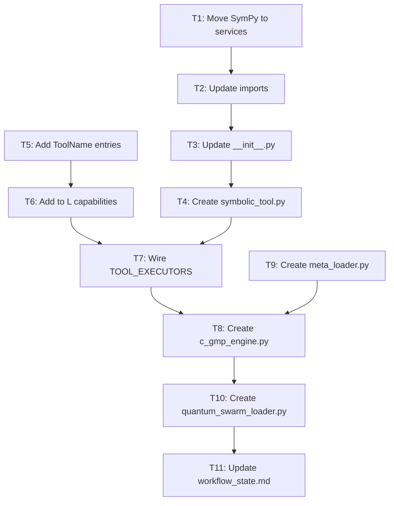

# SymPy Initialization Plan for L9 Quantum AI Factory

This plan initializes the existing `codegen/sympy/` module into L9's service architecture, creating the symbolic computation backbone for the Quantum AI Factory.

## Scope

**In Scope:**

- Move SymPy module to `services/symbolic_computation/`
- Create L9 Tool wrapper with proper async patterns
- Wire into `runtime/l_tools.py` TOOL_EXECUTORS
- Add ToolName entries and capabilities
- Create `c_gmp_engine.py` with SymPy integration
- Create `quantum_swarm_loader.py` for parallel generation

**Deferred (add to workflow_state.md):**

- Perplexity SuperPrompt Enrichment loop
- Self-evolution loop (CGA regenerates CGA)

## Tier Classification

All files are **RUNTIME_TIER** - no KERNEL_TIER gates required.---

## Phase 1: Move and Adapt SymPy Module

### T1: Create services/symbolic_computation/ directory structure

Copy files from `codegen/sympy/` to `services/symbolic_computation/` with L9 naming:

```javascript
services/symbolic_computation/
  __init__.py              <- from symbolic_computation_init.py
  core.py                  <- from symbolic_computation_core.py
  models.py                <- from symbolic_computation_models.py
  config.py                <- from symbolic_computation_config.py
  exceptions.py            <- from symbolic_computation_exceptions.py
  logger.py                <- from symbolic_computation_logger.py
  utils.py                 <- from symbolic_computation_utils.py
```


### T2: Update imports in copied files

Fix all internal imports to use new paths:

- `from .models import ...` (already correct)
- `from .exceptions import ...` (already correct)
- `from .logger import ...` (already correct)

### T3: Update **init**.py exports

Ensure [services/symbolic_computation/__init__.py](services/symbolic_computation/__init__.py) exports:

- `SymbolicComputation`
- `ExpressionEvaluator`
- `CodeGenerator`
- `ComputationRequest`, `ComputationResult`
- `CodeGenRequest`, `CodeGenResult`

---

## Phase 2: Create L9 Tool Wrapper

### T4: Create core/tools/symbolic_tool.py

New file following L9 patterns from [runtime/l_tools.py](runtime/l_tools.py):

```python
# Key components:
# - SymbolicComputationTool class
# - async compute(expression, variables, backend) method
# - async generate_code(expression, variables, language) method
# - async health_check() method
# - Error handling with structlog
```


### T5: Add ToolName entries to capabilities.py

Add to [core/schemas/capabilities.py](core/schemas/capabilities.py) ToolName enum:

- `SYMBOLIC_COMPUTE = "symbolic_compute"`
- `SYMBOLIC_CODEGEN = "symbolic_codegen"`

### T6: Add to DEFAULT_L_CAPABILITIES

Add Capability entries for L to use symbolic tools:

```python
Capability(tool=ToolName.SYMBOLIC_COMPUTE, allowed=True),
Capability(tool=ToolName.SYMBOLIC_CODEGEN, allowed=True),
```

---

## Phase 3: Wire into TOOL_EXECUTORS

### T7: Add tool executors to l_tools.py

Add to [runtime/l_tools.py](runtime/l_tools.py):

```python
# Import at top
from core.tools.symbolic_tool import SymbolicComputationTool

# Add executor functions
async def symbolic_compute(expression: str, variables: dict, ...) -> dict:
    ...

async def symbolic_codegen(expression: str, variables: list, ...) -> dict:
    ...

# Add to TOOL_EXECUTORS dict
"symbolic_compute": symbolic_compute,
"symbolic_codegen": symbolic_codegen,
```

---

## Phase 4: CGA Integration

### T8: Create agents/codegen_agent/c_gmp_engine.py

New file that uses SymPy for code expansion:

```python
# Key components:
# - CGMPEngine class
# - async expand_code_blocks(meta: dict) method
# - Detection of "mathematical" sections
# - SymPy generate_code for math expressions
# - Template expansion for non-math sections
```

Wire to use `services/symbolic_computation/` for any code section with `type: mathematical`.

### T9: Create agents/codegen_agent/meta_loader.py stub

Minimal YAML parsing stub that `c_gmp_engine.py` depends on:

```python
# Key components:
# - load_meta(path: str) -> dict
# - Basic YAML loading with structlog
```

---

## Phase 5: Quantum Swarm Loader

### T10: Create orchestration/quantum_swarm_loader.py

Parallel generation with SymPy cache acceleration:

```python
# Key components:
# - load_quantum_swarm(capsule_path: str) async function
# - Pre-compile common expressions for cache warmup
# - Parallel generation via asyncio.gather
# - Integration with CodeGenAgent
```

---

## Phase 6: Update workflow_state.md

### T11: Add deferred items to workflow_state.md

Add to "Next Steps" or new section for Quantum AI Factory roadmap:

```markdown
### Future: Quantum AI Factory Advanced Features
- [ ] Perplexity SuperPrompt Enrichment loop (`runtime/perplexity/`)
- [ ] Self-evolution loop - CGA regenerates CGA (`agents/codegen_agent/evolution_loop.py`)
```

---

## Dependency Graph



---

## Files Modified Summary

| File | Action | Lines Est. ||------|--------|-----------|| services/symbolic_computation/**init**.py | Create | ~45 || services/symbolic_computation/core.py | Copy + adapt | ~415 || services/symbolic_computation/models.py | Copy | ~165 || services/symbolic_computation/config.py | Copy | ~105 || services/symbolic_computation/exceptions.py | Copy | ~40 || services/symbolic_computation/logger.py | Copy | ~70 || services/symbolic_computation/utils.py | Copy | ~180 || core/tools/symbolic_tool.py | Create | ~120 || core/schemas/capabilities.py | Edit | +10 || runtime/l_tools.py | Edit | +40 || agents/codegen_agent/c_gmp_engine.py | Create | ~150 || agents/codegen_agent/meta_loader.py | Create | ~50 || orchestration/quantum_swarm_loader.py | Create | ~80 || workflow_state.md | Edit | +10 |**Total: ~1,480 lines across 14 files**---

## Validation Checklist

- [ ] All imports resolve (run `python -c "from services.symbolic_computation import SymbolicComputation"`)
- [ ] Tool health check passes