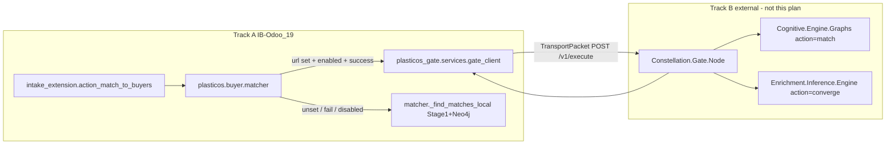

# Track A: Odoo Gate Client + Matcher Fallback

## Architecture (what Track A does vs Track B)

Track A is **Odoo-only**. It does not implement Gate hub, CEG, or EIE workers.



**EIE vs CEG (your clarification, reflected in design):**

| Worker | Core job | Odoo calls it? |
|--------|----------|----------------|
| **EIE** | CRM field backfill via Perplexity + inference | **No** — only as Gate worker for `action=converge` (Track B, deferred in Odoo) |
| **CEG** | Graph-based buyer matching | **No** — only as Gate worker for `action=match` (Track B) |

Optional EIE→CEG collaboration for CRM graph field determination happens **inside Track B workers**, not in Odoo. Odoo sends one `match` packet; Gate decides routing. Same SDK, same `/v1/execute` — different `action` values.

**Binding authority:** [docs/adr/ADR-002-gate-hub-phased-autonomy.md](docs/adr/ADR-002-gate-hub-phased-autonomy.md), [docs/GATE_AUTONOMY_ROADMAP.md](docs/GATE_AUTONOMY_ROADMAP.md)

**Source to port (v3, not v2 surgery pack):** [Current Work - IGNORE/Odoo - Deployment Work/Odoo - Gate Integration/odoo_gate_v3_pack/shared/](Current Work - IGNORE/Odoo%20-%20Deployment%20Work/Odoo%20-%20Gate%20Integration/odoo_gate_v3_pack/shared/)

---

## PR 1 — `plasticos_gate` addon + SDK pin

### 1.1 New module layout

Create [plasticos_gate/](plasticos_gate/) following [plasticos-new-odoo-module](.claude/skills/plasticos-new-odoo-module/SKILL.md) and [plasticos_geolocalize](plasticos_geolocalize/) ICP pattern:

```text
plasticos_gate/
  __init__.py
  __manifest__.py
  services/
    __init__.py
    gate_client.py      ← port gate_client_v3.py; preserve _run() async bridge (see 1.5)
    gate_contracts.py   ← port gate_contracts_v3.py
    gate_builders.py    ← port gate_request_builders_v3.py
    gate_mappers.py     ← port gate_response_mappers_v3.py
    gate_allowlists.py  ← port gate_allowlists_v3.py
    gate_config.py      ← NEW: ICP helpers, no UserError on fallback path
  data/gate_icp_seed.xml
```

**Manifest contract** ([81-ci-manifest-contract](.cursor/rules/81-ci-manifest-contract.mdc)):

- `depends`: `["base", "plasticos_base"]` only (Layer 2 infra; no match/enrichment deps)
- `external_dependencies`: `{"python": ["constellation_node_sdk"]}` — **import name** (underscore), not pip package name; Odoo checks `importlib.import_module()`
- `version`: `19.0.1.0.0`
- `installable`: `True`
- No custom models → no `ir.model.access.csv` required (no `_name` models)

**Install order:** add `plasticos_gate` to [config/odoo_module_order.yaml](config/odoo_module_order.yaml) after `plasticos_base`, before `plasticos_buyer_match_engine`.

### 1.2 Pin SDK in Odoo runtime

Add to [requirements.txt](requirements.txt) (Odoo.sh reads this):

```text
constellation-node-sdk @ git+https://github.com/cryptoxdog/Gate_SDK.git@ab9df5f15c1ba433c3f072a1ca01052584682758
```

Pin SHA from `Gate_SDK` main at implementation time; re-verify if main moves.

**Do not** vendor SDK source into the repo.

**Staging validation (SDK dependency conflicts):** after updating `requirements.txt`, run inside the Docker/Odoo image:

```bash
pip install -r requirements.txt && pip check
```

Gate_SDK pulls `fastapi`, `starlette`, `prometheus-client`, and `pyyaml` as hard deps. Conflicts with Odoo's pinned env are possible but unknown until tested. If `pip check` fails, contingency only: slim client extra or fork excluding server-only deps — not a Track A design change upfront.

### 1.3 ICP seed (Phase 1 matching only)

[plasticos_gate/data/gate_icp_seed.xml](plasticos_gate/data/gate_icp_seed.xml) — `noupdate="1"`, keys from roadmap:

| Key | Default | Notes |
|-----|---------|-------|
| `plasticos.gate.url` | *(empty)* | Unset → local matcher only |
| `plasticos.gate.local_node` | `odoo` | Transport source node |
| `plasticos.gate.matching_enabled` | `1` | Try Gate when URL set |
| `plasticos.gate.matching_action` | `match` | Gate routes to CEG |
| `plasticos.gate.timeout_seconds` | `30` | SDK client timeout |
| `plasticos.gate.org_id` | *(empty)* | Fallback to `env.cr.dbname` in client |

**Do not seed** Phase 3 keys: `plasticos.gate.webleads_*`, `plasticos.gate.auto_writeback`, enrichment flags.

### 1.4 `gate_config.py` — fallback-safe helpers

Port v3 client but **change error semantics** for matcher fallback:

- `gate_matching_enabled(env) -> bool` — returns `False` (never raises) when: URL blank/non-http(s), ICP flag off, or SDK not importable. **Must not** construct `GateClientConfig` or `GateOdooClient` during this check — blank URL would raise `ValueError` on config build.
- `build_gate_client_config(env) -> GateClientConfig` — only called from `_find_matches_via_gate` / `send_match_action` after enabled guard passes. Set `allowed_gate_destination="gate"` explicitly (matches Constellation.Gate `GATE_LOCAL_NODE`).
- `GateIntegrationError(Exception)` — catchable; used when Gate call fails (not `UserError`)
- Matcher uses thin `send_match_action(env, ...)` wrapper; defer `GateOdooClient` class for explicit UI actions later

Skeleton:

```python
def gate_matching_enabled(env) -> bool:
    icp = env["ir.config_parameter"].sudo()
    url = (icp.get_param("plasticos.gate.url") or "").strip()
    if not url.startswith(("http://", "https://")):
        return False
    if (icp.get_param("plasticos.gate.matching_enabled", "1") or "").strip() == "0":
        return False
    try:
        import constellation_node_sdk  # noqa: F401
        return True
    except ImportError:
        return False
```

Validate SDK import path on first run (`constellation_node_sdk` top-level exports per [Gate_SDK README](https://github.com/cryptoxdog/Gate_SDK)); adjust imports if package surface differs (v3 audit noted `constellation_node_sdk.gate` submodules).

### 1.5 `gate_client.py` — sync Odoo context + tenant + transport creation

**Odoo workers are synchronous.** SDK `GateClient.send_to_gate()` is `async`. Port v3's `_run()` bridge (`asyncio.run()` when no loop; thread fallback when loop exists) — **do not drop it**. Do not call `send_to_gate()` without `_run` (would return an un-awaited coroutine silently).

**Do not** replace SDK `GateClient` with raw sync `httpx` POST only — that bypasses SDK outbound validation/signing. If a sync transport path is added later, it must still call SDK helpers (`validate_outbound_gate_packet`, `sign_transport_packet`, `validate_transport_packet` on response).

**Tenant + packet construction live here, not in `gate_builders`:** `create_transport_packet()` requires `tenant`. Resolve in `send_match_action()` / `_tenant()`:

```python
tenant = icp.get_param("plasticos.gate.org_id") or env.cr.dbname  # ensure_tenant_context accepts str
```

`gate_builders.build_match_request()` only builds the **payload DTO** (`MatchRequest.to_dict()`); client wraps it into `create_transport_packet(action=..., payload=..., tenant=..., source_node=..., destination_node="gate", ...)`.

---

## PR 2 — Matcher seam: Gate primary, local fallback

### 2.1 Manifest wiring

[plasticos_buyer_match_engine/__manifest__.py](plasticos_buyer_match_engine/__manifest__.py):

- Add `plasticos_gate` to `depends` (after `plasticos_base`, before intake per layer order test)
- Keep `neo4j` in `external_dependencies`; SDK stays on `plasticos_gate`

### 2.2 Refactor [plasticos_buyer_match_engine/models/matcher.py](plasticos_buyer_match_engine/models/matcher.py)

**Preserve signature and return contract** (required by [intake_extension.py](plasticos_buyer_match_engine/models/intake_extension.py) and [match_result_writer.py](plasticos_buyer_match_engine/models/match_result_writer.py)):

```python
list[dict] with keys: buyer_id, buyer_name, total_score, gates_passed,
gates_failed, match_details, facility_profile_id, typical_price, reason
```

**Structure (strict call order — stub must stay first):**

```python
def find_matches_for_supplier(self, supplier_partner_id, intake_id=None, max_results=20, mode="strict"):
    if self._matching_stub_enabled():
        return []  # existing stub path — unchanged, must run before Gate try

    if self._should_try_gate_matching():  # wraps gate_matching_enabled(env)
        try:
            return self._find_matches_via_gate(...)
        except Exception as exc:
            _logger.warning("Gate match failed; falling back to local matcher: %s", exc, exc_info=True)

    return self._find_matches_local(...)  # current method body, renamed unchanged
```

**`_find_matches_via_gate` implementation:**

- Lazy import inside function ([CLAUDE.md](CLAUDE.md) cross-addon rule):

```python
from odoo.addons.plasticos_gate.services.gate_builders import build_match_request
from odoo.addons.plasticos_gate.services.gate_client import send_match_action
from odoo.addons.plasticos_gate.services.gate_mappers import map_match_response
```

- Read action from ICP `plasticos.gate.matching_action` (default `match`)
- Map response → existing dict shape via `map_match_response` / `match_line_vals` logic from v3
- Audit metadata from **`response_packet.header`**, not flat payload — add `extract_audit_metadata()` in `gate_mappers.py`:

```python
def extract_audit_metadata(response_packet) -> dict:
    return {
        "gate_packet_id": str(response_packet.header.packet_id),
        "gate_correlation_id": response_packet.header.correlation_id,
    }
```

- Attach on each match dict: `match_source="gate"`, plus header-derived IDs above

**Do not** apply [odoo_gate_v3_pack/target_patches/plasticos_buyer_match_engine_matcher_v3.patch](Current Work - IGNORE/Odoo%20-%20Deployment%20Work/Odoo%20-%20Gate%20Integration/odoo_gate_v3_pack/target_patches/plasticos_buyer_match_engine_matcher_v3.patch) verbatim — it replaces local path entirely.

### 2.3 Audit fields (ROAD-GATE-012)

Extend [plasticos_buyer_match_engine/models/match_result_writer.py](plasticos_buyer_match_engine/models/match_result_writer.py) `score_breakdown` JSON (minimal schema change):

```python
score_breakdown = {
    ...
    "match_source": m.get("match_source", "local"),
    "gate_packet_id": m.get("gate_packet_id"),
    "gate_correlation_id": m.get("gate_correlation_id"),
}
```

Optional follow-up: dedicated fields on [plasticos_matching/models/match_result.py](plasticos_matching/models/match_result.py) — defer unless broker UI needs filtering by source.

### 2.4 UI entry point — no change

Keep [intake_extension.action_match_to_buyers](plasticos_buyer_match_engine/models/intake_extension.py) as-is; it already calls `matcher.find_matches_for_supplier()`. Gate vs local is transparent to the button.

**Out of scope (explicit):**

- `web_lead_gate_bridge` / Gate triage
- Enrichment `converge` wrapper
- `pipeline_v2.py`
- Direct Odoo→EIE HTTP (`plasticos_enrichment` async_executor path) — superseded by ADR-002 for primary path

---

## PR 3 — Tests + validation

### 3.1 Pure-Python contract tests (CI Tier 3)

Add [tests/test_gate_match_contract.py](tests/test_gate_match_contract.py):

- `build_match_request` field mapping aligned to real intake fields (`polymer_id`, `quantity_per_load_lbs`, etc.) — no Odoo runtime required if builders accept mocked record stubs; otherwise use `PlasticosTestCase`
- `map_match_response` maps CEG-shaped payload → matcher dict keys
- `gate_matching_enabled` returns False when URL empty (fallback path)

### 3.2 Matcher fallback test

Add [tests/test_gate_matcher_fallback.py](tests/test_gate_matcher_fallback.py):

- Patch `send_match_action` to raise → assert `_find_matches_local` behavior (non-empty fixture or stub path)
- Patch `gate_matching_enabled` False → assert local path only, no SDK import required
- Patch `_matching_stub_enabled` True → assert `[]` returned without Gate call (ordering guard)

Follow [80-plasticos-testing-rules](.cursor/rules/80-plasticos-testing-rules.mdc): create fixtures, never `skipTest`.

### 3.3 Pre-push gates

```bash
ruff check --fix . && ruff format .
python3 scripts/check_module_wiring.py
python3 ci/check_circular_deps.py
pre-commit run --all-files
make pr-check
# PR1 only: pip install -r requirements.txt && pip check  (in Docker/Odoo image)
```

---

## Operational notes (Track B parallel — not blocking PR merge)

Track A merges and runs in production with **local fallback always available** until Track B is live:

| Track B item | Repo | Needed for primary Gate match |
|--------------|------|-------------------------------|
| Gate hub deployed | Constellation.Gate.Node | Yes |
| Route `match` → CEG | Gate config + CEG | Yes |
| CEG handler accepts `MatchRequest` shape | Cognitive.Engine.Graphs | Yes at runtime |
| EIE / `converge` | Enrichment.Inference.Engine | **No** for this plan |

Smoke test (manual, post-deploy): set `plasticos.gate.url`, run Match to Buyers, verify `score_breakdown.match_source == "gate"` and `gate_packet_id` populated; unset URL → `match_source == "local"`.

---

## Roadmap status updates (post-merge)

Mark complete in [docs/roadmap/registry.yaml](docs/roadmap/registry.yaml):

- `ROAD-GATE-010` Gate client seam
- `ROAD-GATE-011` try Gate → fallback local
- `ROAD-GATE-012` correlation IDs in audit
- `ROAD-GATE-014` ICP seed
- `ROAD-GATE-015` external_dependencies

Leave pending: `ROAD-GATE-013` (enrichment), all Phase 3 items.

---

## Risk controls

| Risk | Mitigation |
|------|------------|
| SDK import fails on Odoo.sh | `gate_matching_enabled` checks import; fallback to local |
| Async `send_to_gate` in sync Odoo worker | Preserve v3 `_run()` bridge; never call coroutine without it |
| Wrong `external_dependencies` name | Manifest uses `constellation_node_sdk`; pip pin uses hyphenated package |
| `GateClientConfig` raised on blank URL | Enabled-check never constructs config; build only inside Gate path |
| SDK dep conflicts (fastapi/starlette) | `pip check` in Docker staging; slim fork contingency only if needed |
| Gate down in prod | try/except in matcher; existing intake_extension already catches matcher errors |
| Stub bypassed by Gate try | `_matching_stub_enabled()` runs before `_should_try_gate_matching()` |
| v3 patch overwrites local matcher | Explicit rename-to-`_find_matches_local`; code review gate |
| Layer violation (enrichment→match) | Shared client only in `plasticos_gate` |
| `pipeline_v2` guard | No touch to `plasticos_inference_engine/pipeline_v2.py` |
