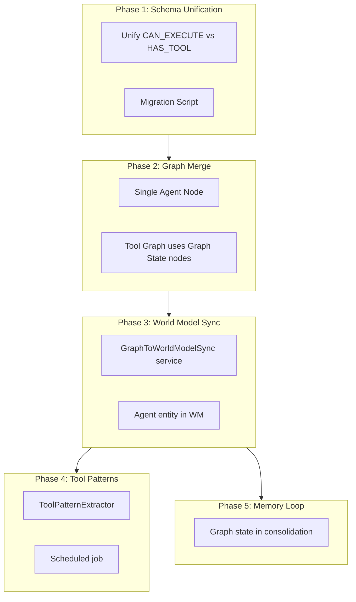

# Unified Knowledge Graph Integration Plan

## Architecture Overview

---

## GMP-UKG-1: Schema Unification

**Tier:** RUNTIME_TIER
**Risk:** LOW
**Effort:** 1 hour
**Depends On:** None

### Variable Bindings

| Variable | Value |
|----------|-------|
| TASK_NAME | ukg_schema_unification |
| EXECUTION_SCOPE | Align relationship types across Graph State and Tool Graph |
| RISK_LEVEL | Low |

### TODO Plan

| ID | File | Action | Change |
|----|------|--------|--------|
| T1 | [`core/tools/tool_graph.py`](core/tools/tool_graph.py) | Replace | Change `HAS_TOOL` to `CAN_EXECUTE` in all queries |
| T2 | [`core/tools/tool_graph.py`](core/tools/tool_graph.py) | Add | Add deprecation warning for legacy queries |
| T3 | [`scripts/neo4j_unify_relationships.py`](scripts/neo4j_unify_relationships.py) | Create | Migration script: `HAS_TOOL` to `CAN_EXECUTE` |
| T4 | [`tests/core/tools/test_tool_graph_unified.py`](tests/core/tools/test_tool_graph_unified.py) | Create | Test both relationship names work |

### Success Criteria

- Neo4j has only `CAN_EXECUTE` relationships for agent-tool links
- Old `HAS_TOOL` queries still work (deprecated)
- Migration script is idempotent

---

## GMP-UKG-2: Graph Merge

**Tier:** RUNTIME_TIER
**Risk:** MEDIUM
**Effort:** 2 hours
**Depends On:** GMP-UKG-1

### Variable Bindings

| Variable | Value |
|----------|-------|
| TASK_NAME | ukg_graph_merge |
| EXECUTION_SCOPE | Tool Graph and Graph State share the same Agent nodes |
| RISK_LEVEL | Medium |

### TODO Plan

| ID | File | Action | Change |
|----|------|--------|--------|
| T1 | [`core/tools/tool_graph.py`](core/tools/tool_graph.py) | Modify | `register_tool()` queries existing Agent, doesn't create |
| T2 | [`core/tools/tool_graph.py`](core/tools/tool_graph.py) | Add | `ensure_agent_exists()` check before tool registration |
| T3 | [`core/agents/graph_state/schema.py`](core/agents/graph_state/schema.py) | Add | Export `ENSURE_AGENT_QUERY` for Tool Graph |
| T4 | [`scripts/neo4j_merge_agent_nodes.py`](scripts/neo4j_merge_agent_nodes.py) | Create | Merge duplicate Agent nodes |
| T5 | [`tests/integration/test_unified_graph.py`](tests/integration/test_unified_graph.py) | Create | Test single agent node has all relationships |

### Success Criteria

- Only ONE `Agent:L` node in Neo4j
- Node has both responsibilities AND tool relationships
- `bootstrap_l_graph()` and `register_tool()` work together

---

## GMP-UKG-3: World Model Sync

**Tier:** RUNTIME_TIER
**Risk:** LOW
**Effort:** 2 hours
**Depends On:** GMP-UKG-2

### Variable Bindings

| Variable | Value |
|----------|-------|
| TASK_NAME | ukg_world_model_sync |
| EXECUTION_SCOPE | World Model has real-time view of L's graph state |
| RISK_LEVEL | Low |

### TODO Plan

| ID | File | Action | Change |
|----|------|--------|--------|
| T1 | [`core/integration/__init__.py`](core/integration/__init__.py) | Create | New integration package |
| T2 | [`core/integration/graph_to_wm_sync.py`](core/integration/graph_to_wm_sync.py) | Create | `GraphToWorldModelSync` service |
| T3 | [`world_model/runtime.py`](world_model/runtime.py) | Modify | Add graph state listener in `run_once()` |
| T4 | [`api/server.py`](api/server.py) | Modify | Initialize sync service in lifespan |
| T5 | [`docker-compose.yml`](docker-compose.yml) | Modify | Add `L9_GRAPH_WM_SYNC` feature flag |
| T6 | [`tests/integration/test_graph_wm_sync.py`](tests/integration/test_graph_wm_sync.py) | Create | Test sync accuracy |

### Success Criteria

- World Model has `agent:L` entity
- Entity attributes match Neo4j Graph State
- Changes via `AgentSelfModifyTool` appear in WM

---

## GMP-UKG-4: Tool Pattern Extraction

**Tier:** RUNTIME_TIER
**Risk:** LOW
**Effort:** 2 hours
**Depends On:** GMP-UKG-3

### Variable Bindings

| Variable | Value |
|----------|-------|
| TASK_NAME | ukg_tool_patterns |
| EXECUTION_SCOPE | Tool audit data feeds back as World Model insights |
| RISK_LEVEL | Low |

### TODO Plan

| ID | File | Action | Change |
|----|------|--------|--------|
| T1 | [`core/integration/tool_pattern_extractor.py`](core/integration/tool_pattern_extractor.py) | Create | `ToolPatternExtractor` class |
| T2 | [`core/integration/tool_pattern_extractor.py`](core/integration/tool_pattern_extractor.py) | Create | `run_extraction()` scheduled job |
| T3 | [`api/server.py`](api/server.py) | Modify | Add scheduled job in lifespan (every 6h) |
| T4 | [`docker-compose.yml`](docker-compose.yml) | Modify | Add `L9_TOOL_PATTERN_EXTRACTION` flag |
| T5 | [`tests/integration/test_tool_patterns.py`](tests/integration/test_tool_patterns.py) | Create | Test pattern extraction |

### Success Criteria

- Scheduled job runs every 6 hours
- World Model has `agent:L:tool_patterns` entity
- Patterns update as tool usage changes

---

## GMP-UKG-5: Memory Consolidation Loop

**Tier:** RUNTIME_TIER
**Risk:** LOW
**Effort:** 1 hour
**Depends On:** GMP-UKG-3

### Variable Bindings

| Variable | Value |
|----------|-------|
| TASK_NAME | ukg_memory_loop |
| EXECUTION_SCOPE | Graph state included in memory consolidation cycle |
| RISK_LEVEL | Low |

### TODO Plan

| ID | File | Action | Change |
|----|------|--------|--------|
| T1 | [`memory/consolidation_service.py`](memory/consolidation_service.py) | Modify | Add `consolidate_graph_state()` method |
| T2 | [`memory/consolidation_service.py`](memory/consolidation_service.py) | Modify | Call graph consolidation in main loop |
| T3 | [`tests/memory/test_consolidation_graph.py`](tests/memory/test_consolidation_graph.py) | Create | Test graph state consolidation |

### Success Criteria

- Graph state snapshots in consolidation output
- Consolidation includes agent directives count
- Recovery path documented

---

## Execution Strategy

| Session | GMP | Duration | Deliverable |
|---------|-----|----------|-------------|
| 1 | GMP-UKG-1 | 1h | Schema unified, migration tested |
| 2 | GMP-UKG-2 | 2h | Single agent node, graph merged |
| 3 | GMP-UKG-3 + GMP-UKG-5 | 3h | WM sync + memory loop (complementary) |
| 4 | GMP-UKG-4 | 2h | Tool pattern learning active |

**Total:** 8 hours across 4 sessions

---

## Feature Flags

| Flag | Default | Phase |
|------|---------|-------|
| `L9_UNIFIED_RELATIONSHIPS` | true | 1 |
| `L9_GRAPH_MERGE` | false | 2 |
| `L9_GRAPH_WM_SYNC` | false | 3 |
| `L9_TOOL_PATTERN_EXTRACTION` | false | 4 |

---

## Rollback Strategy

Each phase can be rolled back independently:
1. **Phase 1:** Old queries still work (deprecated)
2. **Phase 2:** Set `L9_GRAPH_MERGE=false`
3. **Phase 3:** Set `L9_GRAPH_WM_SYNC=false`
4. **Phase 4:** Set `L9_TOOL_PATTERN_EXTRACTION=false`
5. **Phase 5:** Disable in consolidation config

---

## Files to Create

| File | Phase | Purpose |
|------|-------|---------|
| `scripts/neo4j_unify_relationships.py` | 1 | Migration script |
| `scripts/neo4j_merge_agent_nodes.py` | 2 | Merge script |
| `core/integration/__init__.py` | 3 | Package init |
| `core/integration/graph_to_wm_sync.py` | 3 | Sync service |
| `core/integration/tool_pattern_extractor.py` | 4 | Pattern extractor |

## Files to Modify

| File | Phases | Changes |
|------|--------|---------|
| `core/tools/tool_graph.py` | 1, 2 | Relationship types, agent lookup |
| `core/agents/graph_state/schema.py` | 2 | Export queries |
| `world_model/runtime.py` | 3 | Graph listener |
| `api/server.py` | 3, 4 | Lifespan init |
| `docker-compose.yml` | 3, 4 | Feature flags |
| `memory/consolidation_service.py` | 5 | Graph consolidation |
