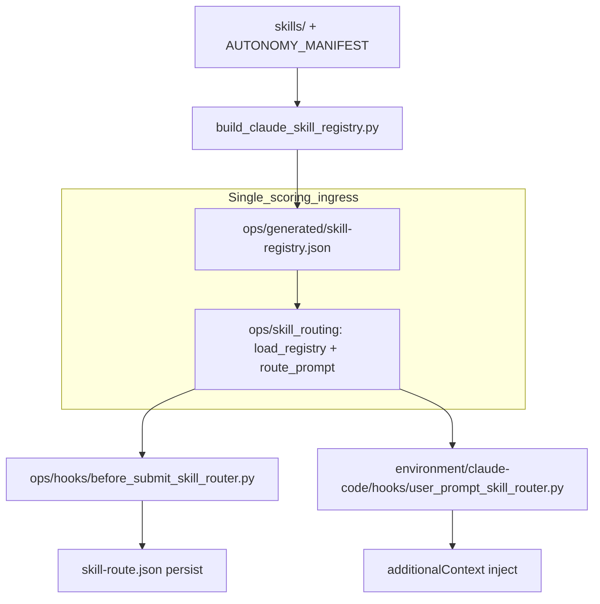

## PLAN: Unravel Claude-owned skill routing → Cursor-primary ownership

**Kernels applied (plan iteration only — not executed):**
- [`kernels/Leverage.md`](.cursor-commands/kernels/Leverage.md) v1.0 — **primary this revision** (maximize compounding value, cut entropy/churn)
- [`kernels/Recursive Alignment.md`](.cursor-commands/kernels/Recursive%20Alignment.md) v1.0 — ownership findings
- [`kernels/Improve.md`](.cursor-commands/kernels/Improve.md) v3.0 — root-cause, no dual-path, convergence honesty

**Authorized target:** `~/.cursor-governance` (`Quantum-L9/Cursor-Governance`)
**Mode:** plan refinement only

### First-order leverage move (do this, not ten things)

**One shared scoring ingress under `ops/skill_routing/`** that both surfaces call. That single extraction:
- closes inverted ownership (F-OWN-001)
- makes registry path ownership coherent (F-SSOT-002)
- gives Codex/Gemini a free future thin-wrapper slot (reuse, not rewrite)
- lets one ownership guard prevent the yarn ball forever (compounding validation)

Everything else is retarget, delete old path, or doc alignment. No new frameworks. No speculative layers.

### Objective
Align skill routing with **CANONICAL_LAW §2.1**: Cursor-primary/`ops/` owns the brain; Claude/Cursor hooks are thin adapters.

**Success (falsifiable):**
1. Shared scoring API exists only in `ops/skill_routing/` (`load_registry`, `route_prompt`).
2. No `ops/` code loads `environment/claude-code/hooks/` for scoring.
3. Registry artifact only at `ops/generated/skill-registry.json` (generator-owned).
4. Claude + Cursor hooks are I/O-only adapters over that ingress.
5. Ownership guard fails closed on inverted load direction.
6. Active docs match code; §2.1 “known debt” removed after fix.
7. `make pr-check` + skill-activation validation + `ops/skill_routing` unit tests PASS.

### Leverage evaluation

| Dimension | Decision for this cut |
|-----------|------------------------|
| Max leverage | Extract shared ingress once; automate ownership guard |
| Max reuse | Domain-neutral `ops/skill_routing` (prompt + registry in → recommendation out); surface adapters only |
| Max determinism | Single `REGISTRY_REL`; builder is sole writer; stable recommendation schema preserved |
| Max traceability | Finding IDs → code change → guard/test → gate |
| Max validation | Prefer existing `validate_skill_activation` + pytest + `make pr-check`; add one ownership assert that can fail meaningfully |
| Max efficiency | **No builder file rename**; **no** reconcile script rename; **no** relocating `validate_skill_activation.py` this cut; **no** historical `reports/` rewrites; **no** multi-file package split |
| Entropy to remove | Dual ownership of scorer; Claude-homed generated registry; stale `RULE_REL`; “Cursor reuses Claude” docs |

### Single-ingress evaluation (Leverage kernel)

| Field | Result |
|-------|--------|
| Status | **Applicable** for scoring path only |
| Evidence | Two consumers (Claude `UserPromptSubmit`, Cursor `beforeSubmitPrompt`) duplicate registry path + scorer load; Cursor currently imports Claude |
| Apply | Shared library ingress: `load_registry(root)` + `route_prompt(prompt, registry)` in `ops/skill_routing/` |
| Do **not** apply | HTTP/gateway “ingress service”, unified hook binary, or merging Claude/Cursor hook schemas |
| NotApplicable reason (full prompt lifecycle) | Hook I/O contracts differ (inject context vs persist `skill-route.json`); forcing one process entrypoint would violate surface ownership |

Canonical scoring contract (library-level):
- inputs: governance `root`, raw `prompt`, loaded `registry`
- normalize prompt once inside `route_prompt`
- authorize/route policy already encoded in registry + `explicit_only` tiers
- output: recommendation dict or `None` (unchanged schema)
- fail-open remains at **adapter** boundary (hooks catch and continue), not inside scorer pure logic

### Architecture adapter

| Field | Value |
|-------|-------|
| Adapter | `l9-cursor-primary-ownership` |
| Source | [`CANONICAL_LAW.md`](CANONICAL_LAW.md) §2.1 + §7 |
| Mandatory | Build shared capability in `ops/` first; wrap outward |
| Prohibited | Shared brain under `environment/claude-code/` imported by Cursor |
| Validation | Ownership guard + router tests + generator sync |

### Findings ranked by severity × leverage

| Rank | ID | Sev | Leverage | Correction | Notes |
|------|----|-----|----------|------------|-------|
| 1 | F-OWN-001 | High | **Max** — one fix unblocks all surfaces | `ops/skill_routing` shared ingress | Root cause |
| 2 | F-SSOT-002 | High | **High** — stops dual registry homes | `ops/generated/skill-registry.json`; delete old | Generator path only; keep `build_claude_skill_registry.py` filename |
| 3 | F-GUARD | High* | **Compounding** — prevents recurrence | Fail if ops loads Claude hooks for scoring | *New required control derived from §2.1 |
| 4 | F-VAL-004 / F-COV-007 | Med | Necessary | Retarget tests/validators/reconcile consumers | Broken gates = false readiness |
| 5 | F-DOC-003 / F-PATH-005 | Med | Alignment | Docs + `RULE_REL` after code | After L1–L3 |
| 6 | F-ENT-006 | Low | Anti-leverage if overbuilt | Single-module package | No `normalize.py` split |

**Deferred (low leverage / churn — do not do in this GMP):**
- Rename `build_claude_skill_registry.py` → `build_skill_registry.py`
- Rename `reconcile_claude_l9_skills.py`
- Move `validate_skill_activation.py` into `ops/`
- Rewrite `reports/**` archaeology
- Autonomy / memory hook relocation

### Target architecture



**Locked minimum structure:**
- [`ops/skill_routing/__init__.py`](ops/skill_routing/__init__.py) + [`route_prompt.py`](ops/skill_routing/route_prompt.py) only
- Export: `REGISTRY_REL`, `load_registry(root)`, `route_prompt(prompt, registry)`
- Builder filename **unchanged**; `DEFAULT_OUT` → `ops/generated/skill-registry.json`
- Claude hook path in `settings.template.json` **unchanged** (thin internals)
- Hard cut: delete `environment/claude-code/generated/skill-registry.json`; no shim re-export

### Scope
**In:** L1–L6 above; §2.1 doctrine already drafted (land with code).
**Out:** Deferred list; Gate_SDK protocol; multi-adapter redesign; permanent dual-path.

### Pre-Validation
| Check | Command | Pass | Baseline |
|-------|---------|------|----------|
| P0 Target | `~/.cursor-governance` | Bound | Bound |
| P1 Inventory | consumer grep | Includes validate_claude_env, reconcile tests, skill-adapters README | Done |
| P2 Gate | `make pr-check` | PASS before claim ready | FAIL — dirty §2.1 docs; fold into same change set |
| P3 Wiring | `check_governance_wiring.sh` | PASS/WARN | PASS + dirty WARN |

### TODO Plan (leverage order)

| # | Leverage tier | Task | Files | Effort | Risk |
|---|---------------|------|-------|--------|------|
| 1 | L1 Max | Create shared scoring ingress | New `ops/skill_routing/` from body of Claude hook scorer | M | Med |
| 2 | L2 Unlock | Thin both adapters; land doctrine | Claude hook, Cursor hook, `CANONICAL_LAW.md`, `AGENTS.md`, Claude README | M | Med |
| 3 | L3 SSOT | Retarget builder/sync output; delete old registry | [`build_claude_skill_registry.py`](ops/scripts/build_claude_skill_registry.py), [`sync_generated_artifacts.py`](ops/scripts/sync_generated_artifacts.py) | S | Med |
| 4 | L4 Compound | Ownership regression guard | `validate_skill_activation.py` and/or `check_governance_wiring.sh` | S | Low |
| 5 | L5 Necessary | Retarget tests + validators + `RULE_REL` + `validate_claude_env` | `ops/skill_routing/tests/`, Claude smoke tests, reconcile, PR gate | M | Med |
| 6 | L6 Align | Docs + residual `rg` (exclude `reports/`) + clear known-debt + full gates | rules, doctrine-map, skill-adapters README | S | Low |

### Depth
**Root cause:** Claude-first shared brain, Cursor wrapped as importer.
**Leverage rejection:** docs-only fix, permanent shim, builder rename ceremony, new ingress service.
**Contracts preserved:** fail-open adapters; recommendation schema; Cursor state path; Claude settings command path; `explicit_only`; skills SSOT + symlinks.

### Doc / Root Surface Impact
| Surface | Action | Notes |
|---------|--------|-------|
| `CANONICAL_LAW.md` | Update | Land §2.1; clear known-debt after L1–L3 |
| `AGENTS.md` | Update | Already drafted ownership pointer |
| `environment/claude-code/README.md` | Update | Remove “Cursor reuses Claude scorer” |
| `rules/l9-skill-routing.md` + `23-*.mdc` | Update | Scorer/registry → ops |
| `doctrine-map.md` | Update | Hooks = thin adapters |
| `environment/skill-adapters/README.md` | Update | Registry path |
| `README.md` | N/A | No router ownership claims |
| `reports/**` | N/A | Historical |
| Generated registry | Generator only | Never hand-edit |

### Dependencies
```
L1 → L2 → L3 → L4 → L5 → L6
```
L4 may run as soon as L2 lands (guard the new boundary early). L6 always last.

### Milestones
| Milestone | Outcome | Unlocks |
|-----------|---------|---------|
| M1 Shared ingress | `ops/skill_routing` + thin adapters + doctrine | Ownership fixed |
| M2 SSOT + guard | Registry under ops; guard fails closed | Recurrence prevented |
| M3 Converge | Tests/docs/gates green; no active inverted refs | Merge-ready |

### Leverage recursive passes (execution protocol)
| Pass | Name | Objective | Stop if |
|------|------|-----------|---------|
| 1 | bind_authority | Target + §2.1 adapter locked | Target ambiguous |
| 2 | extract_ingress | Shared API extracted; golden scores match baseline fixtures | Score drift |
| 3 | cut_old_ssot | Registry only under ops; adapters thin | Dual path remains |
| 4 | guard_and_validate | Ownership guard + retargeted tests PASS | Guard false-negative |
| 5 | entropy_and_converge | Docs/residual sweep; `make pr-check` | Another High finding remains |

Min 2 passes, max 8; skip ceremonial empties. Convergence = Leverage definition (no Critical/High left, mandatory validation PASS, no high-value next pass).

### Checkpoints
| CP | After | Evidence | No-go |
|----|-------|----------|-------|
| CP1 | L2 | Cursor hook does not reference Claude hook path; both call shared API | Revert |
| CP2 | L4 | Guard fails a deliberate inverted-import fixture or static check | Do not merge |
| CP3 | L6 | Residual active-tree `rg` clean; `make pr-check` PASS | Fix first |

### Checklist
- [ ] L1 shared ingress
- [ ] L2 thin adapters + doctrine
- [ ] L3 registry SSOT (builder name kept)
- [ ] L4 ownership guard
- [ ] L5 tests/validators retargeted
- [ ] L6 docs + residual + gates
- [ ] Deferred rename/move list untouched
- [ ] Pre-Validation recorded
- [ ] Final Validation PASS
- [ ] No commit/push unless user asks

### Risks
| Risk | Mitigation |
|------|------------|
| Hook break on Claude surfaces | Keep settings command path; thin internals only |
| Missed consumer | L6 residual sweep + known consumer list |
| Import fragility | Governance-root `importlib` load pattern; adapter fail-open |
| Rename temptation | Explicitly deferred — path change is enough leverage |
| Scope creep | Autonomy/memory stay out |

### Estimate
**Total:** ~0.5 day (rename deferral + single-module extract shortens vs prior plan)
**GMPs:** 1

### Final Validation
| Check | Command | Pass |
|-------|---------|------|
| V1 Leverage justified | Review diff | No speculative layers; shared ingress has ≥2 consumers |
| V2 Scanners | `make pr-check` | PASS |
| V3 Skill activation | `validate_skill_activation.py` | PASS |
| V4 Ownership | Cursor hook must not load Claude hooks | Zero hits |
| V5 Registry SSOT | Only `ops/generated/skill-registry.json` active | Old path gone |
| V6 Unit tests | `pytest ops/skill_routing/tests -q` | PASS |
| V7 Residual | `rg` active trees | No inverted ownership strings except historical reports |
| V8 Honesty | Report actual results | Passed/Failed/Skipped/N/A/Unknown |

### Convergence (all three kernels)
- **Leverage:** Converged as a *plan* when deferred churn is cut and L1 is the unique max-leverage move — **yes this revision**.
- **Alignment:** Target Pass after L1–L6; current High blockers remain until execution.
- **Improve:** No further plan pass warranted unless execution reveals new High finding.

### YNP
**Primary:** Execute L1→L6 via `l9-gmp-protocol` on `~/.cursor-governance`.
**Confidence:** 93%
**Do not:** start with renames, docs-only, or memory/autonomy moves.
