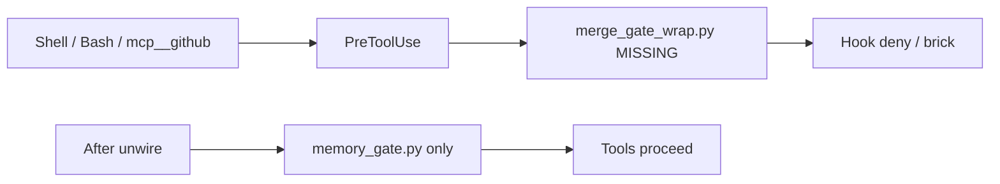

# Restore agent Shell/MCP + Graphiti PICKUP

## Root cause (confirmed)

[`Gate_SDK/.claude/settings.json`](.claude/settings.json) wires PreToolUse for `Bash|mcp__github__.*` to:

```text
python3 "$HOME/.cursor-governance/environment/claude-code/hooks/merge_gate_wrap.py"
```

That file **does not exist** under governance (`environment/claude-code/hooks/` only has memory/skill hooks). Live Shell attempts fail with:

```text
can't open file '.../merge_gate_wrap.py': [Errno 2] No such file or directory
```

Canonical template [`settings.template.json`](/Users/ib-mac/.cursor-governance/environment/claude-code/settings.template.json) has **no** `merge_gate_wrap` block — only `memory_gate.py`. Local stub [`.claude/hooks/merge_gate_wrap.py`](.claude/hooks/merge_gate_wrap.py) would call `ops/autonomy/merge_gate.py`, which is also **missing**. Restoring the wrap without inventing a new autonomy merge gate is not viable.

**Chosen fix: unwire** (align consumer settings with governance template).



## Phase 1 — Unwire (Gate_SDK)

1. Edit [`.claude/settings.json`](.claude/settings.json): delete the entire PreToolUse matcher block for `Bash|mcp__github__.*` → `merge_gate_wrap.py` (lines 53–62). Leave the `memory_gate.py` matcher intact.
2. Delete dead stub [`.claude/hooks/merge_gate_wrap.py`](.claude/hooks/merge_gate_wrap.py) so nothing re-points at a phantom ops gate.
3. Smoke-check: run a trivial Shell command (e.g. `echo ok`). If Cursor still caches the old hook, reload the window / new agent turn once.

No change to `~/.cursor/hooks.json` (it does not reference merge_gate). Do **not** invent `ops/autonomy/merge_gate.py` in this pass.

## Phase 2 — Manual Graphiti PICKUP (`group_id=gate-sdk`)

Once Shell works, use the locked governance venv per `l9-graphiti-memory` (never bare `python3`):

```bash
GOV="${HOME}/.cursor-governance"
GRAPHITI_PY="${GOV}/.venv/bin/python"
CLIENT="${GOV}/ops/graphiti/graphiti_memory_client.py"

"$GRAPHITI_PY" "$CLIENT" resolve
"$GRAPHITI_PY" "$CLIENT" health
"$GRAPHITI_PY" "$CLIENT" write \
  "PICKUP|date=2026-08-06|task=Unwire merge_gate_wrap; Graphiti-only resume rules|files=.claude/settings.json,.claude/hooks/merge_gate_wrap.py,rules/03|85|87|97|next=Confirm Shell/MCP; optional governance PR for rule sync|blocker=none|gmps=n/a|outcome=tools restored via unwire" \
  --kind pickup_context \
  --group-id gate-sdk
```

`gate-sdk` is already registered in [`ops/graphiti/group_registry.yaml`](/Users/ib-mac/.cursor-governance/ops/graphiti/group_registry.yaml). Prefer CLI over MCP: `user-graphiti-memory` is currently in discovery error; L9 HTTP memory is degraded (`L9_MEMORY_HTTP_URL` unset).

## Phase 3 — Align stale rules (governance SSOT)

Edit sources under `~/.cursor-governance/rules/` to match [`MEMORY_BANK_POLICY.md`](/Users/ib-mac/.cursor-governance/ops/graphiti/MEMORY_BANK_POLICY.md) (2026-08-06: memory-bank deprecated; resume SSOT = Graphiti inject/PICKUP):

| Rule | Change |
|------|--------|
| [`03-graphiti-memory.mdc`](/Users/ib-mac/.cursor-governance/rules/03-graphiti-memory.mdc) | Mark T0/`memory-bank/` deprecated/archival; state resume SSOT = Graphiti `inject` / PICKUP; CLI note → locked `.venv` |
| [`85-workflow-state-bridge.mdc`](/Users/ib-mac/.cursor-governance/rules/85-workflow-state-bridge.mdc) | Resume SSOT → Graphiti PICKUP/inject; demote `memory-bank/` + `workflow_state.md` to legacy/archival |
| [`87-cursor-memory-kernel.mdc`](/Users/ib-mac/.cursor-governance/rules/87-cursor-memory-kernel.mdc) | Drop “Read T0 SSOT: memory-bank/…`; session start = health + inject + search PICKUP; remove fake `--scope` write guidance if present |
| [`97-graph-layer-boundary.mdc`](/Users/ib-mac/.cursor-governance/rules/97-graph-layer-boundary.mdc) | Resume row: Graphiti PICKUP (not `memory-bank/`) |

Then regenerate projections:

```bash
python3 ops/scripts/project_llm_rules.py --root "$HOME/.cursor-governance"
# or sync_generated_artifacts / setup_workspace_symlinks so Gate_SDK `.claude/rules` remounts
```

Consumer `.claude/rules/*.md` are generated (`<!-- generated-from -->`) — do not hand-edit them in Gate_SDK.

## Out of scope

- Re-implementing A4 autonomy `merge_gate.py` (separate product work if merge gating is still desired).
- Fixing `user-graphiti-memory` MCP discovery / `L9_MEMORY_HTTP_URL` (PICKUP uses CLI).
- Committing/pushing unless you ask.
