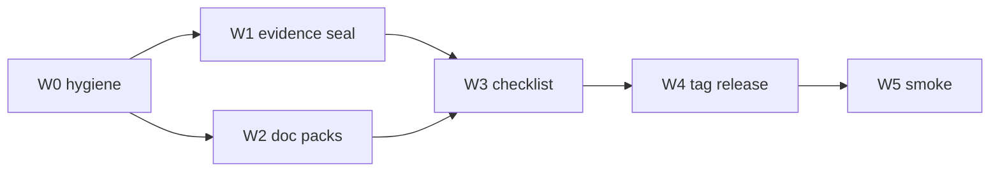

# Path A: W0–W5 unblocking plan

Base tip: `origin/main` @ `64bd142` (local clone is dirty and ~20 behind — work only from a fresh worktree). Semgrep remains **experimental** in notes and [`.l9/release-policy.yaml`](.l9/release-policy.yaml). Path B (shadow→supported) is out of scope.

Existing outline to refine/execute: [`docs/release/v1.0.0-unblocking-plan.md`](docs/release/v1.0.0-unblocking-plan.md) (untracked locally; commit it in PR-A1 or A2).

**PR slicing (locked):**
1. **PR-A1** — W1 evidence seal (+ include unblocking-plan.md if not already on main)
2. **PR-A2** — W2 doc packs + W3 checklist
3. **Tag ops** — W4–W5 on green `main` (no feature PR)

---

## W0 — Hygiene

1. Leave dirty operator clone alone; `git fetch origin` then `git worktree add <path> origin/main`.
2. Branch: `docs/v1-release-unblock` (one branch only).
3. Bootstrap toolchain; **gate:** `make check` exit 0 before edits.
4. Do not touch README unless install/release surface requires it (docs ownership §13) — prefer [`docs/release/`](docs/release/) + notes file.

---

## W1 — Evidence seal (PR-A1)

**Seal set (zero `{{…}}` when done):**
- [`.l9/audit-findings.md`](.l9/audit-findings.md)
- [`docs/release/blocker-closure.md`](docs/release/blocker-closure.md)
- [`.l9/roadmap.yaml`](.l9/roadmap.yaml) P4 `evidence`
- [`.l9/release-policy.yaml`](.l9/release-policy.yaml) Semgrep `evidence`

**New SSOT:** [`docs/release/evidence-map.yaml`](docs/release/evidence-map.yaml) with each of 13 keys → `{ value, status: resolved|waived, reason, resolved_at, approver? }`. Render into all four seal files from this map only.

| Key | Default resolution |
|---|---|
| `CORE_ANALYZE_SHA` | Live pin `c3f04e1268364e3623fc57f963937e2a0665e0e0` (five thin callers) |
| `SDK_CODE_SHA` | Commit that landed `tests/fixtures/semgrep/runtime/` (cross-check provenance.yaml) |
| `SDK_WORKFLOW_SHA` | Thin-caller / self-validation CI landing commit |
| `SDK_S1_SHA` | Public-API / CLI / version-policy contract commit (PR #17 series or successor) |
| `SDK_VALIDATION_ARTIFACT_URL` | Artifact URL from latest green `SDK self-validation` run on tip |
| `CORE_ACTIONS_SHA` / `CORE_PUBLISH_SHA` | Resolve from history **or** `waived: superseded by thin analyze-semgrep` + date |
| `CORE_GATE_*` / `AUD_008_*` | Resolve via `gh` if present; else **dated waiver** (never invent URLs) |

**Gate:** `rg '\{\{[A-Z0-9_]+\}\}'` over the four seal files → empty. blocker-closure assertion “no placeholder” must be true.

---

## W2 — Doc drift (PR-A2)

| File | Concrete edits |
|---|---|
| [`AGENTS.md`](AGENTS.md) §3 | P1→`complete`; P3→`complete`; P4→`ready_for_promotion` (match roadmap); Semgrep stays experimental, P4 observation not claimed |
| [`ALIGNMENT.md`](ALIGNMENT.md) | Rewrite gaps #1–#3 (MANIFEST 317 + manifest CLI; pyproject exists / #9 closed; #5 closed + action-pins); keep #4–#5 |
| [`VALIDATION.md`](VALIDATION.md) | Drop/mark absent `VALIDATION_REPORT.json`; MANIFEST current; local regen = `make check` + manifest CLI; freshness = W1 not missing generator |
| [`docs/release/known-limitations.md`](docs/release/known-limitations.md) | Runtime fixture truth; version range `>=1.100.0,<2.0.0`; **remove** `network_allowed` section (DWA-008) |
| [`.l9/public-api.yaml`](.l9/public-api.yaml) | Fix “11 packages” comment vs `public_surface` / rulesets note |
| [`docs/PUBLISHING.md`](docs/PUBLISHING.md) | Exact runtime pins; Trusted Publisher prerequisite before tag |

---

## W3 — Checklist truthing (PR-A2)

Edit [`docs/release/checklist.md`](docs/release/checklist.md):

- Path A → `[x]` with footnote cites (test paths / commands): Contracts; Fixture provenance (runtime fixture present — fix HTML comment that still says harness SKIPS until capture); Security/Determinism/Operational covered by existing suites.
- Path B leave `[ ]` and label: shadow upload; entire **Promotion** section.
- Integration Core example: run or dated waiver note.

---

## W4–W5 — Tag, release, smoke (after A1+A2 merged)

1. Confirm PyPI Trusted Publisher for `l9-ci` / `publish.yml` / `pypi` env ([`docs/PUBLISHING.md`](docs/PUBLISHING.md)).
2. `workflow_dispatch` publish.yml (build+twine only) — must succeed.
3. Release notes: contract freeze; Semgrep **experimental**; link known-limitations; non-claims (no GA/supported, no fake evidence).
4. Annotated tag `v1.0.0` at merge tip; `gh release create`; never force-push.
5. Observe tag `publish.yml` (success or fail-closed OIDC — fix publisher, don’t fake).
6. Smoke: `pip install l9-ci==1.0.0` → `l9-ci providers list` shows experimental; version triad `1.0.0`; dogfood CI green; `l9-ci manifest check --tracked-only --exclude-dir memory-bank`.

---

## Acceptance (Path A done)

- Seal set has no `{{…}}`
- `make check` green on both PRs
- AGENTS phases match [`.l9/roadmap.yaml`](.l9/roadmap.yaml)
- known-limitations matches code (version policy; no network flag)
- Checklist Path A checked with cites; Promotion unchecked
- `v1.0.0` tag + GitHub Release exist; install smoke passes
