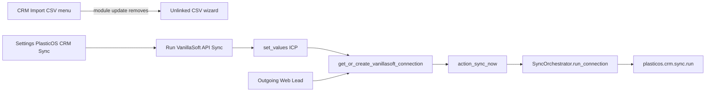

## PLAN: Move VanillaSoft lead import to Settings (API)

### Objective

Operators must not use the CRM-root CSV wizard for VanillaSoft leads. A single, low-prominence control under **Settings → PlasticOS CRM Sync** must trigger the **live API** path (`SyncOrchestrator.run_connection`), not CSV upload.

**Success (falsifiable):**

1. After upgrade, CRM root and PlasticOS root menus have **no** “Import CRM Leads” / “Import CRM Leads (VanillaSoft)” items.
2. Settings → PlasticOS CRM Sync shows a system-only button that, with valid ICP credentials, creates/finds a VanillaSoft `plasticos.crm.connection` and produces a `plasticos.crm.sync.run` (same mechanical path as Connections → Sync Now).
3. cieTrade partner CSV import menus/wizards remain unchanged.
4. Button help text states the **≤31-day contact list** API limit (not a full historical census).

### Scope

**In:**

- Remove CSV menuitems in [`plasticos_partner_import/views/crm_lead_import_wizard_views.xml`](plasticos_partner_import/views/crm_lead_import_wizard_views.xml).
- Settings button + Python action in [`plasticos_crm_sync`](plasticos_crm_sync/).
- Shared find-or-create connection helper (dedupe webhook + settings).
- Runbook + partner_import docs that still describe CSV as the primary CRM path.
- Manifest version bumps for touched modules.
- Regression test for settings action.

**Out:**

- Full historical contact census (Search / ContactID enumeration).
- Deleting CSV wizard model/service/ACL (remain unlinked for emergency Technical access).
- cieTrade / partner CSV wizard.
- Enabling cron by default.
- Staging deploy / commit / push (unless separately authorized).

### Target binding

| Item | Value |
|------|--------|
| Artifact type | Execution plan (plan iteration — Improve + l9-plan) |
| Write roots (on execute) | `plasticos_crm_sync/`, `plasticos_partner_import/`, `docs/runbooks/CRM_SYNC_VANILLASOFT.md`, partner_import READMEs |
| Authority | User objective > repo patterns (`84` XML, `81` manifest) > existing sync contracts |
| Delivery state | Implementation-ready plan; next skill `l9-gmp-protocol` or direct Agent execute on user approval |

### Pre-Validation (mandatory)

| Check | Command / action | Pass criteria |
|-------|------------------|---------------|
| P0 Target bind | Resolve menus in partner_import + settings/webhook in crm_sync | Single authorized write set |
| P1 Baseline inventory | Confirm menuitems, Settings app block, `action_sync_now`, webhook create pattern | Gap list = menus wrong path; Settings missing action |
| P2 Clean gate | `make pr-check` before first edit (**no commit, no push**) | PASS or document baseline FAIL / quarantine unrelated dirty tree |
| P3 Module presence | `plasticos_crm_sync` + `plasticos_partner_import` installable locally | PASS or Skipped if Docker down (record reason) |

Planning-only note: Pre-Validation **commands are scheduled**; results recorded at execution start. Status now: **Unknown** (not run in this plan pass).

### Issue inventory (Improve / evidence)

| ID | Severity | Evidence | Root cause | Remediation |
|----|----------|----------|------------|-------------|
| I1 | High | Menuitems seq 100/91 open CSV wizard | Primary UX still CSV | Delete both `<menuitem>`s |
| I2 | High | Settings only stores ICP; no sync action | Import affordance not on API SSOT | Add Settings button → orchestrator |
| I3 | Med | Webhook duplicates find-or-create connection | Divergent create logic if Settings adds a copy | Extract `get_or_create_vanillasoft_connection` on connection model |
| I4 | Med | Docs/README still describe VS CSV as CRM load path | Stale operator guidance | Update runbook + partner_import READMEs |
| I5 | Low | Label “Import” implies full dump / CSV | Misleading contract | Button string: **Run VanillaSoft API Sync** + 31-day help |

### TODO Plan

| # | Task | Files | Effort | Risk |
|---|------|-------|--------|------|
| 1 | Pre-Validation | — | S | Dirty tree false FAIL |
| 2 | Shared helper `get_or_create_vanillasoft_connection` | [`crm_connection.py`](plasticos_crm_sync/models/crm_connection.py), [`webhook.py`](plasticos_crm_sync/controllers/webhook.py) | S | Behavior change if search domain differs |
| 3 | Settings action + XML button | [`res_config_settings.py`](plasticos_crm_sync/models/res_config_settings.py), [`res_config_settings_views.xml`](plasticos_crm_sync/views/res_config_settings_views.xml), bump [`__manifest__.py`](plasticos_crm_sync/__manifest__.py) → `19.0.1.0.1` | M | Long-running sync from Settings UI timeout |
| 4 | Remove CSV menus + banner | [`crm_lead_import_wizard_views.xml`](plasticos_partner_import/views/crm_lead_import_wizard_views.xml), bump partner_import manifest | S | Leftover menu if noupdate ghost (unlikely — menuitems not noupdate) |
| 5 | Regression test | `plasticos_crm_sync/tests/test_settings_import_action.py` (+ `__init__`) | S | Needs TransactionCase / mock |
| 6 | Docs surfaces | Runbook, [`plasticos_partner_import/README.md`](plasticos_partner_import/README.md), [`docs/README_plasticos_partner_import.md`](docs/README_plasticos_partner_import.md) | S | Drift if only one README updated |
| 7 | Final Validation | `make pr-check`, `make update m=…` | M | Docker env Unknown |

### Depth — contracts preserved

**Behavioral contract (Settings button):**

1. `ensure_one()` on settings record; call `self.set_values()` so ICP fields persist before sync.
2. Require non-empty `plasticos_crm_sync.vanillasoft_api_key` and project id (settings field or ICP); else `UserError`.
3. `connection = env["plasticos.crm.connection"].get_or_create_vanillasoft_connection()` — search `provider=vanillasoft` + `active=True`, else create name/project/`enabled=False` (match webhook).
4. Optionally sync `connection.project_id` from ICP when creating or when blank.
5. Invoke `connection.action_sync_now()` (reuse notification + error mapping); prefer returning `ir.actions.act_window` on latest `plasticos.crm.sync.run` for that connection when a run exists, else keep notification.
6. **Do not** call CSV `plasticos.crm.lead.import.service`.
7. ACL: Settings app already `groups="base.group_system"` — button stays admin-only.

**Shared helper contract:**

```python
@api.model
def get_or_create_vanillasoft_connection(self):
    # search active vanillasoft; create with ICP project_id or "139705"; enabled=False
```

Webhook replaces inline create with this helper (sudo remains on webhook controller).

**UI copy:**

- Button: `Run VanillaSoft API Sync`
- Help: manual/one-shot; ongoing = CRM Sync → Connections + cron; contacts modified within ~30 days only.

**Timeout risk mitigation:** Document that large first sync may be slow; Sync Now on connection form remains available. No background job in this change (out of scope). If UI request timeout is observed in smoke, follow-up = queue/cron-only (flag in Risks).



### Doc / Root Surface Impact (mandatory)

| Surface | Action | Files / notes |
|---------|--------|---------------|
| `README.md` (repo root) | N/A | No CRM import UX described |
| `AGENTS.md` | N/A | Module inventory unchanged; no new addon |
| `CLAUDE.md` | N/A | Imports AGENTS only |
| `ARCHITECTURE.md` | N/A | No layer/topology change |
| `INVARIANTS.md` | N/A | No new invariant |
| `CHANGELOG.md` | N/A | Not required for this scoped UX fix unless release process demands |
| `.claude/README.md` | N/A | No skill/registry change |
| `docs/runbooks/CRM_SYNC_VANILLASOFT.md` | **Update** | Settings button primary; CSV menus removed; 31-day limit |
| `plasticos_partner_import/README.md` | **Update** | VS CRM CSV deprecated / unlinked; point to Settings API sync |
| `docs/README_plasticos_partner_import.md` | **Update** | Same as module README if duplicate |

### Dependencies

```text
pre-validate → shared-connection-helper → settings-api-button → regression-test
pre-validate → remove-csv-menus
settings-api-button + remove-csv-menus → docs-surfaces → final-validate
```

### Milestones

| Milestone | Outcome | Unlocks |
|-----------|---------|---------|
| M1 Contract | Shared helper + Settings action wired | Safe UI cutover |
| M2 UX cutover | CSV menus gone; Settings button live | Operator path correct |
| M3 Evidence | Test + docs + pr-check green | Ready to commit when authorized |

### Checkpoints

| CP | After | Evidence required | No-go action |
|----|-------|-------------------|--------------|
| CP1 | M1 | Helper used by webhook + settings; no CSV call in settings method | Revert settings method; fix helper domain |
| CP2 | M2 | Menu search in DB/UI shows 0 Import CRM Leads under CRM/PlasticOS | Fix leftover menuitem / upgrade module |
| CP3 | M3 | `make pr-check` PASS; sync.run created in smoke or mocked test asserts call | Do not claim ready; fix failures |

### Checklist

- [ ] Pre-Validation recorded (P0–P3)
- [ ] Shared `get_or_create_vanillasoft_connection` + webhook switched
- [ ] Settings button + `action_plasticos_crm_sync_run_vanillasoft` (name final)
- [ ] CSV menuitems removed; banner points to Settings
- [ ] Manifest bumps `plasticos_crm_sync`, `plasticos_partner_import`
- [ ] Regression test added and collected
- [ ] Doc / Root Surface Impact Updates done (or N/A justified)
- [ ] Final Validation (`make pr-check`) PASS
- [ ] No commit/push unless user explicitly requested

### Risks

| Risk | Mitigation |
|------|------------|
| Operators expect full VS dump from “Import” | Button wording + help: API sync, ≤31-day modified contacts |
| Settings HTTP timeout on large sync | Smoke timing; keep Connections → Sync Now; defer job queue |
| Duplicate connections if search omits inactive | Match webhook: `active=True` only; document |
| CSV still reachable via Technical → Actions | Acceptable emergency; do not advertise |
| Unrelated dirty tree fails pr-check | Quarantine / document baseline FAIL |

### Estimate

**Total:** ~1–2 hours implementation + validation
**GMPs:** 1 small GMP (or single Agent pass after plan approval)

### Final Validation (mandatory)

| Check | Command | Pass criteria |
|-------|---------|---------------|
| V1 Plan completeness | Review vs l9-plan template | Pre-Validation, Doc surface, Milestones, Checkpoints, Checklist, Final Validation present |
| V2 Scanners | `make pr-check` | PASS; **no commit, no push** |
| V3 Module upgrade | `make update m=plasticos_crm_sync,plasticos_partner_import` (or Docker equivalent) | Modules upgrade without ERROR |
| V4 Behavioral | Settings button → sync.run; menus absent | Observed or test-mocked + menu XML grep |
| V5 Honesty | Report only checks run | Passed / Failed / Skipped / N/A / Unknown |

### Improve / recursive passes (plan artifact)

| Pass | Objective | Result |
|------|-----------|--------|
| 1 | Bind target + inventory | Verified CSV menus vs API Sync Now / Settings gap |
| 2 | Issue discovery | I1–I5 ranked; root cause = wrong UX ownership |
| 3 | Contract harden | Settings button semantics + shared helper; 31-day honesty |
| 4 | Entropy | Dedupe connection create; drop optional/ambiguous returns |
| 5 | l9-plan compliance | Added Pre/Final Validation, doc surfaces, milestones, checkpoints |
| 6 | Convergence | No further high-value plan pass; ready for user execute approval |

**Convergence:** Converged as **implementation-ready plan**. Code changes **not applied** (plan mode).

### Recommend next

On approval: execute under Agent / `l9-gmp-protocol` (single bounded change set). Then `l9-ynp` if prioritization of full census vs go-live is needed (out of scope here).

### Residual / Known unknowns

- Exact Settings UI timeout under full 30-day contact+call volume on local Docker: **Unknown** until smoke.
- Whether Odoo.sh Staging has `plasticos_crm_sync` installed yet: **Unknown** (local-only historically).
