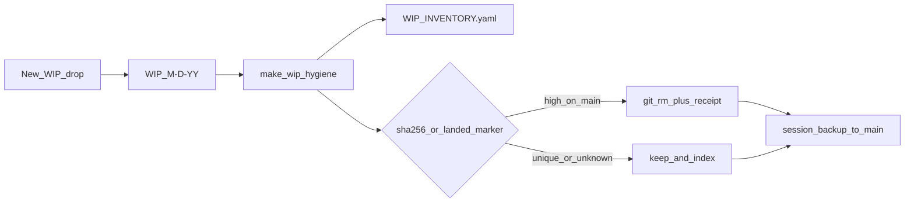

# WIP Corpus on Main

## Decision

WIP is **not** a side archive. It is tracked on `main`, organized the way the tree already is (dated buckets plus a few named series), inventoried by a machine file, and pruned automatically only when evidence is high that the same bytes already live outside `WIP/`. Git history is the undo.

```yaml
task_kind: architecture
reasoning_depth: standard
evidence_quality: high
decision_risk: guarded
action: proceed_with_validation
```

**Decisive evidence**

- [`.gitignore`](.gitignore) already says do **not** blanket-ignore `WIP/` — the tree is commit-eligible.
- [`rules/15-work-tracking.mdc`](rules/15-work-tracking.mdc) + [`.cursorignore`](.cursorignore) (`WIP/`) are what hide it from agents and caused #181 to be treated as “keep off main.”
- Your existing shape (from `wip/preserve-local-2026-08-16` / #181): `WIP/8-14-26/`, `WIP/8-15-26/`, named series like `WIP/CG/`, plus a few root notes.
- [`skills/l9-git-work-preserve/`](skills/l9-git-work-preserve/) inventories **git refs/stashes**, not folder corpus. Do not overload it. New WIP corpus scripts sit beside it.
- Scanners already exclude `WIP/**` ([`.pre-commit-config.yaml`](.pre-commit-config.yaml), CodeQL, lint). Keep that so scratch never fails CI.

**Assumptions**

- Date folders stay `M-D-YY` (`8-16-26`), not ISO.
- `WIP/Legal Defense/` stays untracked ([`.gitignore`](.gitignore) lines 114–118).
- Credential globs under WIP stay denylisted.

**Trade-off**

Auto-prune (your choice) vs propose-then-ask: we auto-delete **only** high-evidence landed files and write a receipt. Unique or unmatched WIP is never deleted. Revert the prune commit if a receipt was wrong.

**Reconsideration:** if a prune receipt ever removes something you still wanted as a working copy, we switch that class to `move WIP/_retired/<date>/` instead of `git rm`.

## Layout (honor what you have)

```text
WIP/
  INVENTORY.yaml          # SSOT index (generated, committed)
  _receipts/              # prune/land receipts (tracked)
  8-14-26/                # dated bucket
  8-15-26/
  CG/                     # named series — allowed, inventoried
```

Rules for new drops:

- Prefer `WIP/<M-D-YY>/<topic>/…`
- Named series (`CG`, packs) stay; inventory marks `kind: series`
- Loose files at `WIP/*.md` get filed into **today’s** date folder on the next hygiene run
- Never create `current_work/` (still retired)

## System (smallest reusable primitive)

One contract + one CLI, not a campaign.



**CLI** — [`ops/scripts/wip_corpus.py`](ops/scripts/wip_corpus.py) (new):

| Mode | Mutates | Does |
|------|---------|------|
| `inventory` | writes `WIP/INVENTORY.yaml` only | Walk `WIP/**` (skip Legal Defense + secret globs); record path, date bucket or series, sha256, status |
| `file-loose` | yes | Move `WIP/*` files (not dirs) into `WIP/<today>/` |
| `prune` | yes | `git rm` files whose sha256 matches a tracked **non-WIP** path on `HEAD`, or that carry an explicit `landed:` marker in inventory; write `WIP/_receipts/prune-<UTC>.json` |
| `hygiene` | yes | `file-loose` + `inventory` + `prune` |

Prune evidence (all required for auto):

1. Candidate is under `WIP/` and not Legal Defense / secret glob
2. A tracked path **outside** `WIP/` has the same sha256, **or** inventory has `landed: {path, pr, sha}`
3. Receipt records before-sha, wip path, landed path, action `removed`

Low/medium match (similar name, different hash) → `status: active` + `note: possible-landed` — **keep**.

**Make**

```make
wip-hygiene:
	python3 ops/scripts/wip_corpus.py hygiene
```

Hygiene is local. This repo’s session backup already pushes the SSOT clone, so committed WIP rides to `main` without a second publish path.

**Do not** auto-prune from GitHub Actions (no silent main mutation from CI). Nightly may run `inventory --check` only (drift WARN).

## Doctrine changes (required)

Rewrite [`rules/15-work-tracking.mdc`](rules/15-work-tracking.mdc):

- WIP is tracked corpus on `main`, dated + inventoried
- Agents **may** read/write WIP for hygiene, filing, and high-evidence prune
- Agents **must not** park WIP under `/tmp` or `.l9/scratch-hold/` (already in [`ops/autonomy/surface_profile.yaml`](ops/autonomy/surface_profile.yaml))
- Stage WIP with **pathspecs only** (rule 49)
- `TODO.md` stays the agent task queue; WIP is the scratch corpus

Also:

- Remove blanket `WIP/` from [`.cursorignore`](.cursorignore); keep `WIP/Legal Defense/`
- Update [`.gitignore`](.gitignore) comment (agents now hygiene WIP; still no blanket ignore)
- Append a short correction block to [`AGENTS.md`](AGENTS.md) (append-only)
- Leave scanner excludes in place
- Optional: drop `**/WIP/**` from [`environment/ide/settings.base.json`](environment/ide/settings.base.json) `files.watcherExclude` so the tree is visible (keep if `world.model.md`-scale files hurt the watcher — then exclude only `WIP/**/*.md` over a size cap, not the whole tree)

`l9-git-work-preserve` **unchanged**: it still never auto-deletes branches. WIP file prune is a different contract.

## Seed (respect the closed #181 tree)

On a **new branch from `origin/main`** (kernel-pack / architecture default):

1. Bring in `wip/preserve-local-2026-08-16` @ `c8566f00` **path-limited** (`WIP/**` only; no secrets).
2. Run `hygiene` so loose root notes land in `WIP/8-16-26/` (or their original dates if reconstructable).
3. Commit inventory + any high-evidence prunes (e.g. campaign YAML that already exists under `environment/program-execution/campaigns/`).
4. `PR_REMEDIATE=0 make pr` against `main`.

That is the dignity fix for treating #181 as “keep off main.”

## Tests

[`ops/scripts/tests/test_wip_corpus.py`](ops/scripts/tests/test_wip_corpus.py):

- Date-bucket naming `M-D-YY`
- Loose file filing
- Same-hash non-WIP → pruned + receipt
- Unique bytes → kept
- `WIP/Legal Defense/` never walked
- Secret globs never staged

## Out of scope

- Changing CodeQL/ruff to lint WIP
- Tracking Legal Defense
- Auto-deleting git branches/worktrees (preserve skill)
- Rewriting `make clean` / workspace-clean routing
