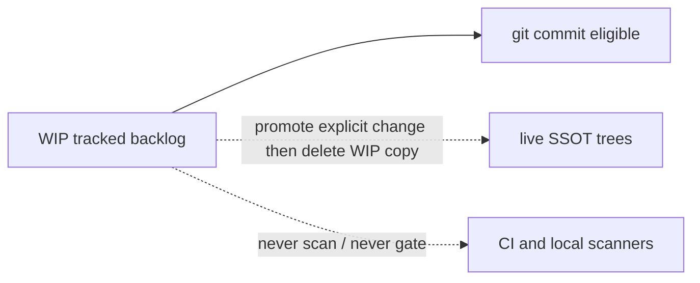

# WIP sacred tracked unscanned

## Decision record (structured reasoning — no further asks)

| Ambiguity | Resolution | Why |
|---|---|---|
| Commit untracked WIP now vs later | **Commit present WIP trees in this change** | User framing: sacred, tracked, read, respected — leaving backlog untracked contradicts the request |
| Scratch vs sacred | **Tracked draft backlog, not ignore-me junk** | Still non-runtime SSOT; still never CI-gated |
| README scope | **Rewrite as policy + accurate layout** | Current README is stale (“backlog only”) vs actual trees |
| Scanner work | **Gap-close + audit; do not re-architect** | Most excludes already exist |

Route: `task_kind=plan+decision`, `risk=guarded`, `action=proceed_with_validation`.

## Objective

Make `WIP/` a first-class committed glorified todo corpus that agents must read and respect, while ensuring no local/CI scanner can fail the gate on WIP content.

## Ground truth (already true)

- Tracked today: only [`WIP/claude code environment/*`](WIP/claude%20code%20environment/) (7 files).
- Untracked present: `README.md`, `backlog/`, `Execution Schemas/`, `out-of-scope-hold/`, `quantum_animation_spec_pack_v3/` (~33 files).
- Already exclude WIP: [`.pre-commit-config.yaml`](.pre-commit-config.yaml), [`.gitleaks.toml`](.gitleaks.toml), [`pyproject.toml`](pyproject.toml) (ruff/mypy/pytest), [`sonar-project.properties`](sonar-project.properties), [`.github/codeql/codeql-config.yml`](.github/codeql/codeql-config.yml), workflow `paths-ignore`, [`ops/scripts/resolve_changed_files.sh`](ops/scripts/resolve_changed_files.sh), [`ops/scripts/run_pr_security.sh`](ops/scripts/run_pr_security.sh).
- Real CI gap: conflict-marker `git grep` in [`l9-lint-test.yml`](.github/workflows/l9-lint-test.yml) excludes archives but **not** `WIP/**`.



## Implementation (after Build approval)

### 1. Rewrite [`WIP/README.md`](WIP/README.md)

Replace “active backlog only” with sacred-todo framing. Required sections:

- **Purpose** — expanded glorified todo / design backlog; tracked; agents must read and respect; not disposable scratch.
- **Authority** — not a second SSOT; live authority remains `environment/`, `skills/`, `ops/`, `kernels/`, etc.
- **Git policy** — tree is committed; only credential-shaped filenames denied (point at `.gitignore`).
- **CI / scanner policy** — intentionally excluded from pre-commit, ruff/mypy/pytest, gitleaks PR scans, CodeQL, Sonar, `make pr` changed-file filters, and workflow `paths-ignore`; note that `paths-ignore` alone is insufficient for mixed PRs (conflict-marker pathspec closes that).
- **Agent rules** — do not “clean up” by deleting/ignoring WIP; do not treat paths as runtime imports; promote with explicit live-tree change and delete the WIP copy in the same change.
- **Layout** — accurate tree for what exists now:

```text
WIP/
├── README.md
├── backlog/                    # program-execution, plan-schema, kernels, memory
├── Execution Schemas/          # draft execution contract schemas
├── claude code environment/    # cloud/mobile Claude pack drafts + receipts
├── out-of-scope-hold/          # parked items (e.g. governance_activate_fresh.sh, schemas)
└── quantum_animation_spec_pack_v3/
```

- Keep a short **Deliberately removed / superseded** table (existing content, trimmed if needed).
- Keep **Promotion rule**.

### 2. Clarify [`.gitignore`](.gitignore)

Replace the WIP credential block comment so it states:

- `WIP/` is intentionally tracked sacred backlog.
- Do **not** add a blanket `WIP/` ignore.
- Keep only: `WIP/*oauth*.json`, `WIP/*credentials*.json`, `WIP/*client_secret*.json`.

### 3. Close CI gap in [`.github/workflows/l9-lint-test.yml`](.github/workflows/l9-lint-test.yml)

On the conflict-marker step, extend pathspec excludes to:

`:!**/WIP/**` `:!**/current_work/**` `:!**/C_GOV_FILES/**` `:!**/reports/**`

(aligned with pre-commit / scratch prefixes).

### 4. Scanner audit (touch only if drifted)

Confirm WIP exclude still present in the files listed under Ground truth. Prefer no edits to [`pyproject.toml`](pyproject.toml) (append-only protected) unless an exclude is actually missing.

### 5. Stage WIP corpus (this change)

`git add` present WIP paths (README + all current subtrees), relying on `.gitignore` for `.DS_Store` and credential denylist. Do **not** stage unrelated dirty trees (`ops/graphiti/distill_queue/`, hydration, transcript_distiller, `TODO.md`, etc.).

Pre-stage secret scrub: re-run filename probe for oauth/credentials/client_secret/`.env` under WIP (already empty today).

### 6. Validate

- `git check-ignore -v WIP/README.md` → not ignored
- Conflict-marker pathspec contains `:!**/WIP/**`
- `rg WIP` across scanner configs still hits excludes
- `make pr-check` against the staged WIP+config set (isolate from unrelated dirt)

## Out of scope

- Unrelated distill/hydration/TODO dirty work
- Doctrine files (`CANONICAL_LAW.md`, `AGENTS.md`, `ORG_INVARIANTS.yaml`)
- Weakening WIP secret denylist
- Promoting any WIP item into live trees in this change

## Rollback

Revert the single config+README+WIP-add commit; prior scanner excludes remain harmless if left in place.
