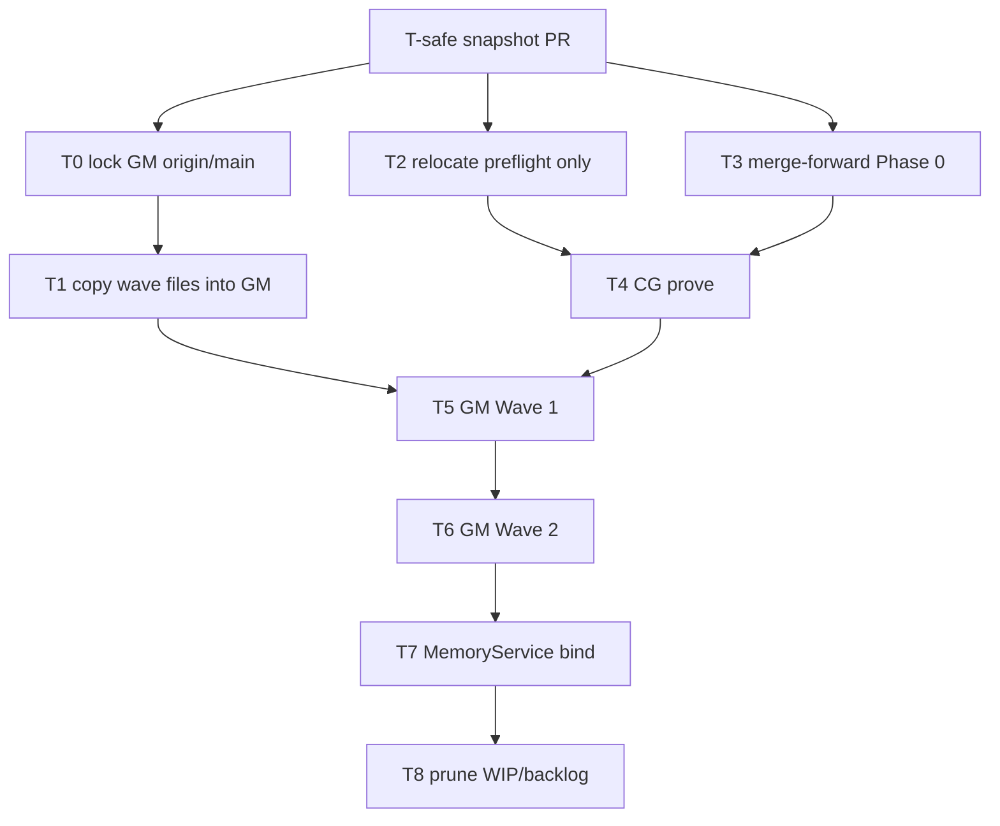

# Land remaining WIP value, then prune backlog

Operator update: Diagnose First is **already** at [kernels/Diagnose First Kernel.md](kernels/Diagnose%20First%20Kernel.md) (untracked; old WIP path is a working-tree delete). **Do not move it back.** First action is a **safety PR** of current WIP plus that relocated file, before Phase 0 merge, preflight relocate, or prune.

Prune gate remains hard: delete `WIP/backlog/` only after `l9-graphiti-memory` Wave 1+2+MemoryService bind has a `CODE_COMPLETE` receipt.

## Improve-kernel defects fixed in the draft

- Ambiguous prune timing (T8 after T1+T4 vs T7) — **resolved: after T7 only**.
- “Overwrite vs merge” left implicit — **merge-forward algorithm** below; never replace live `GATE-001+` or `pec/*.py`.
- Stale `LEARNED_LESSONS.md` “already promoted” claim would have been copied as truth — **do not promote that sentence**.
- Two-repo work mixed onto dirty current branches — **new branch from each `origin/main`**; current CG tip is `fix/ci-required-contexts-wip-only`, GM tip is `fix/issue-20-local-write-namespace-acl`.
- Missing MANIFEST reseal after core file adds.
- Missing concrete `CODE_COMPLETE` receipt path.
- Kernel relocate treated as optional chatter — Diagnose First is already moved; only preflight remains to relocate after the safety PR.

## Target binding

Two write roots, one prune:

- [Cursor-Governance](https://github.com/Quantum-L9/Cursor-Governance) — new branch from `origin/main` @ `7ebf331837dfa6f30dd61537e68a8f86e9451b6f` (re-verify at execute).
- [l9-graphiti-memory](https://github.com/Quantum-L9/l9-graphiti-memory) — new branch from **that** repo’s `origin/main` (re-resolve SHA at execute). Local clone has **no** `deployment/generated-data/`.

Do not land later mutation on `fix/ci-required-contexts-wip-only` (dirty; includes unrelated Legal Defense deletions). Stop and replan on SHA drift.



T-safe is a hard gate. No Phase 0 edit, no preflight `git mv`, no prune, until that PR exists. T2 and T3 may run in parallel after T-safe. T5 waits for T1 and T4.

## What is valuable vs already-live vs do-not-touch

**Already done (do not undo):**

- Diagnose First is at [kernels/Diagnose First Kernel.md](kernels/Diagnose%20First%20Kernel.md). Old path `WIP/backlog/kernels/diagnose-first/` is gone. Record this move only in T-safe. Never copy it back into WIP.

**Land after T-safe (unique, still pending):**

- [WIP/backlog/kernels/preflight/Pre-flight.md](WIP/backlog/kernels/preflight/Pre-flight.md) and [Preflight 2.md](WIP/backlog/kernels/preflight/Preflight%202.md) → `kernels/`
- Phase 0 rail under [WIP/backlog/program-execution/phase0-autonomy-rail/](WIP/backlog/program-execution/phase0-autonomy-rail/) into [environment/program-execution/core/](environment/program-execution/core/)
- Wave prompts [wave 1.md](WIP/backlog/memory/graphiti-memory-integration-waves/wave%201.md), [wave 2.md](WIP/backlog/memory/graphiti-memory-integration-waves/wave%202.md), [handoff.md](WIP/backlog/memory/graphiti-memory-integration-waves/handoff.md) → execute in GM

**Do not copy (duplicates / lies):**

- `WIP/backlog/kernels/control-plane-stages/` — already [kernels/L9 Coding Control Plane/ai-control-plane/](kernels/L9%20Coding%20Control%20Plane/ai-control-plane/) per that pack’s [MANIFEST.md](kernels/L9%20Coding%20Control%20Plane/MANIFEST.md)
- `For Cursor Governance.md` / `For Cursor Governance 2.md` — producers already live at [environment/agents/generated-data/](environment/agents/generated-data/)
- `completed work errors.md` — unrelated ruff log
- `LEARNED_LESSONS.md` “promoted to core” line — false; keep as history only or drop with the folder

**Never delete:** `WIP/Legal Defense/`, `WIP/quantum_animation_spec_pack_v3/`, `WIP/Execution Schemas/`, `WIP/8-14-26/Web SEO LLM Trio/`

## T3 merge-forward algorithm (do not overwrite live core)

Live [CONVERGENCE_GATES.yaml](environment/program-execution/core/program-execution-blueprint-template/CONVERGENCE_GATES.yaml) starts at `GATE-001`. Live [ERROR_TAXONOMY.yaml](environment/program-execution/core/shared/ERROR_TAXONOMY.yaml) has no `PHASE0_INCOMPLETE` / `ADVISORY_CI_NOISE`. Live [RUNBOOK.md](environment/program-execution/core/program-execution-blueprint-template/RUNBOOK.md) has no Phase 0 section.

For each WIP rail file:

- **Absent in live** — add: `PHASE0_USER_CONFIG.yaml`, `schemas/phase0-user-config.schema.json`, `references/AUTONOMY_BRIDGE.md`, `tests/test_autonomy_rail.py`
- **Present in live** — three-way merge: insert Phase 0 keys/sections; keep live `GATE-001+`, live pec Python, live `test_pair_alignment.py`, live extra controller refs
- **Insert `GATE-000`** (`phase0_user_config_complete`) **before** `GATE-001` in the live gates file
- **Append** error codes; do not renumber existing codes
- **Insert** RUNBOOK “Phase 0 — dial the rail” as a new §2 and renumber live sections, or add as §1.5 — do not replace the instantiate/authority steps
- **Do not** overwrite `program-execution-controller-template/scripts/pec/*.py` (not even in the WIP rail, but overlapping policy YAML still merge-only)
- After accepted core edits, regenerate [environment/program-execution/core/MANIFEST.yaml](environment/program-execution/core/MANIFEST.yaml) the same way the blueprint runbook already requires

## T-safe — snapshot PR before any further touch

New CG branch from `origin/main` (not the dirty `fix/ci-required-contexts-wip-only` tree). Commit **only**:

- Remaining `WIP/backlog/**` as it exists now (phase0 rail, memory waves, preflight, control-plane-stages, README)
- `kernels/Diagnose First Kernel.md` as **add**
- Record the already-done delete of `WIP/backlog/kernels/diagnose-first/Diagnose First Kernel.md`

Do **not** stage Legal Defense deletions or other dirty-branch noise. Then `make pr` so GitHub holds a recoverable snapshot.

Forbidden in T-safe: Phase 0 merge, preflight relocate, law rewrite, prune, moving Diagnose First back to WIP.

## T2 kernel leftover (after T-safe only)

Diagnose First stays at `kernels/Diagnose First Kernel.md`.

```text
git mv "WIP/backlog/kernels/preflight/Pre-flight.md" "kernels/Pre-flight.md"
git mv "WIP/backlog/kernels/preflight/Preflight 2.md" "kernels/Preflight 2.md"
```

Append-only [CANONICAL_LAW.md](CANONICAL_LAW.md) block: §11 SSOT is `kernels/Diagnose First Kernel.md` (supersedes the 2026-08-14 WIP path). Retarget [skills/l9-git-work-preserve/references/diagnose-first-binding.md](skills/l9-git-work-preserve/references/diagnose-first-binding.md). Digest at `prompts/10X Kernels/Diagnose First Kernel.md` stays a digest.

## T1 / T5–T7 Graphiti bind

Copy the three wave files first to `l9-graphiti-memory/docs/generated-data-waves/` so CG prune cannot destroy them.

Then in the GM checkout, follow those prompts: Wave 1 installer → Wave 2 tests (no weakened asserts) → handoff surgical bind. Abort if preflight finds a second write path or cannot identify `MemoryService.write`. CG producers stay read-only contract.

**CODE_COMPLETE receipt (prune key):** write `l9-graphiti-memory/.l9/generated-data-bind-receipt.yaml` with `activation_state: CODE_COMPLETE`, SHAs, Wave 2 test command + result, and “candidate ingress reaches MemoryService.write exactly once”. T8 is forbidden until that file exists and is committed on the GM branch.

## T8 prune (last)

Only after the receipt:

- Delete entire [WIP/backlog/](WIP/backlog/)
- Update [WIP/README.md](WIP/README.md) layout (drop backlog/kernels/memory/program-execution entries)

## Validation

Cursor-Governance: `make program-execution-core-validate` then `make pr-check`.

l9-graphiti-memory: Wave 2 focused pytest as specified in `wave 2.md`; full-repo tests if the handoff requires them; label live MCP/Cursor loop Unknown unless actually run.

## Rollback

- Primary restore: the T-safe snapshot PR (WIP tree + Diagnose First at `kernels/`)
- CG later commits: revert stacked commits; law append is additive-revertible
- GM: revert Wave 1/2/bind commits; keep `docs/generated-data-waves/` if still needed
- If T8 already ran: restore `WIP/backlog` from T-safe, not from the dirty Legal Defense working tree
- Never force-push; never move Diagnose First back to WIP

## Execute path

`.plan.md` → `@environment/program-execution` (instantiate under `$HOME/.l9/programs/`, do not mutate sealed core templates in place except the T3 merge-forward) → Program Lock → `@autonomy` (`autonomous_merge: false`). Two declared repos, two declared branches. L4 local commits until `authorize-release`, then one PR per repo; merge this stack after green+mergeable, older open PRs first.

## Out of scope

Legal/quantum/Execution Schemas/Web SEO; staging Legal Defense deletions into the safety PR; moving Diagnose First back to WIP; DeepSeek PE provider; re-running the CG generated-data producer installer; copying control-plane-stages; overwriting live pec Python; claiming Wave 1 already exists in GM.
