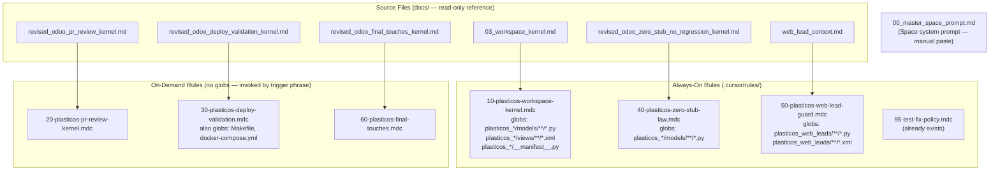

# Wire PlasticOS Kernel and Prompt Packs into Cursor

## What is Being Fixed

The packs live in `docs/` as inert markdown. Nothing loads them automatically. The result: every new Cursor session starts cold, with no module map, no hard rules, no deferred-item awareness, and no PR-state knowledge.

## Architecture After This Change



## Files to Create

### `.cursor/rules/10-plasticos-workspace-kernel.mdc`

- **Source:** [`docs/plasticos_prompt_pack_v1_2026_05_26/03_workspace_kernel.md`](docs/plasticos_prompt_pack_v1_2026_05_26/03_workspace_kernel.md)
- **Activation:** Auto-attaches whenever any `plasticos_*/models/**/*.py`, `plasticos_*/views/**/*.xml`, or `plasticos_*/__manifest__.py` file is in context
- **Effect:** Pre-code reconciliation checklist (git-first, Odoo 19 compliance, layer boundary enforcement, pipeline_v2 HARD ABORT) runs before any edit to a model or view
- **Frontmatter:**
```
---
description: PlasticOS pre-code execution kernel — repo reconciliation, Odoo 19 compliance, layer boundary enforcement, pipeline_v2 hard abort
globs: plasticos_*/models/**/*.py, plasticos_*/views/**/*.xml, plasticos_*/__manifest__.py
alwaysApply: false
---
```

### `.cursor/rules/20-plasticos-pr-review-kernel.mdc`

- **Source:** [`docs/plasticos_kernel_pack_v1_2026_05_26/revised_odoo_pr_review_kernel.md`](docs/plasticos_kernel_pack_v1_2026_05_26/revised_odoo_pr_review_kernel.md)
- **Activation:** Manually invoked by typing `REVIEW PR #<number>` or `PR_REVIEW_MODE`
- **Effect:** Loads the 10-step PR review protocol with hard reject conditions, base branch topology, migration assessment, zero-stub validation, output contract
- **Frontmatter:**
```
---
description: PlasticOS PR review kernel — base branch topology, pipeline_v2 guard, migration assessment, zero-stub validation
alwaysApply: false
---
```

### `.cursor/rules/30-plasticos-deploy-validation.mdc`

- **Source:** [`docs/plasticos_kernel_pack_v1_2026_05_26/revised_odoo_deploy_validation_kernel.md`](docs/plasticos_kernel_pack_v1_2026_05_26/revised_odoo_deploy_validation_kernel.md)
- **Activation:** Auto-attaches for `Makefile` / `docker-compose.yml`; also invoked by `DEPLOY_VALIDATION_MODE`
- **Effect:** Step-by-step deploy validation (preflight, upgrade, log validation, registry checks, ICP params, rollback path)
- **Frontmatter:**
```
---
description: PlasticOS deploy validation kernel — Docker/make-based deploy steps, ICP param checks, rollback path
globs: Makefile, docker-compose.yml, docker-compose*.yml
alwaysApply: false
---
```

### `.cursor/rules/40-plasticos-zero-stub-law.mdc`

- **Source:** [`docs/plasticos_kernel_pack_v1_2026_05_26/revised_odoo_zero_stub_no_regression_kernel.md`](docs/plasticos_kernel_pack_v1_2026_05_26/revised_odoo_zero_stub_no_regression_kernel.md)
- **Activation:** Auto-attaches alongside workspace kernel for any `plasticos_*/models/**/*.py` file
- **Effect:** Zero-stub law (no `pass`, `return []`, `NotImplementedError` in business logic), zero-regression law (hotspot table for web_lead, write guards, HOT/COLD), module boundary map for all 29 modules
- **Frontmatter:**
```
---
description: PlasticOS zero-stub and zero-regression laws — stub detection, regression hotspots, module boundary map
globs: plasticos_*/models/**/*.py
alwaysApply: false
---
```

### `.cursor/rules/50-plasticos-web-lead-guard.mdc`

- **Source:** [`docs/plasticos_kernel_pack_v1_2026_05_26/web_lead_context.md`](docs/plasticos_kernel_pack_v1_2026_05_26/web_lead_context.md)
- **Activation:** Auto-attaches when any `plasticos_web_leads/**` file is open
- **Effect:** Full web lead architecture context, both agent trap zones, partner-deferral rationale, write/unlink guard explanations, test references — prevents the two most common mis-fixes
- **Frontmatter:**
```
---
description: PlasticOS web lead architecture guard — HOT/COLD pipeline, partner deferral, write guard, agent trap zones
globs: plasticos_web_leads/**/*.py, plasticos_web_leads/**/*.xml
alwaysApply: false
---
```

### `.cursor/rules/60-plasticos-final-touches.mdc`

- **Source:** [`docs/plasticos_kernel_pack_v1_2026_05_26/revised_odoo_final_touches_kernel.md`](docs/plasticos_kernel_pack_v1_2026_05_26/revised_odoo_final_touches_kernel.md)
- **Activation:** Manually invoked by `FINAL_TOUCHES_MODE`
- **Effect:** 10-gate pre-go-live checklist (dev tools fence, audit-quick, Odoo19 XML, ACL, cron safety, pipeline_v2 guard, orphan refs, ORM safety, XPath stability, module wiring)
- **Frontmatter:**
```
---
description: PlasticOS final-touches kernel — 10 pre-go-live gates, scoped to cleanup/hardening only, no new features
alwaysApply: false
---
```

## File to Update

### [`docs/plasticos_prompt_pack_v1_2026_05_26/00_master_space_prompt.md`](docs/plasticos_prompt_pack_v1_2026_05_26/00_master_space_prompt.md)

Add a **Session Invocation Triggers** section after the existing `## Role` block. This tells any agent reading the Space prompt which phrases activate which kernels:

```
## Session Invocation Triggers

| Phrase | Activates |
|---|---|
| AUDIT_MODE = "TIER_1" | 01_code_review_audit_prompt.md — startup blockers |
| AUDIT_MODE = "TIER_3" | 01_code_review_audit_prompt.md — data & flow integrity |
| AUDIT_MODE = "BUILDER_VALIDATOR_GATE" | 01_code_review_audit_prompt.md — Phase 8 PR gate |
| AUDIT_MODE = "FULL" | 01_code_review_audit_prompt.md — all 12 phases |
| REVIEW PR #<number> | .cursor/rules/20-plasticos-pr-review-kernel.mdc |
| DEPLOY_VALIDATION_MODE | .cursor/rules/30-plasticos-deploy-validation.mdc |
| FINAL_TOUCHES_MODE | .cursor/rules/60-plasticos-final-touches.mdc |
| Walk me through the 10-block chain for: | 04_meta_reasoning_chain.md |
| Onboard for this session | 02_coding_agent_handoff.md |
```

## Manual Step (User Action Required — Cannot Be Automated)

After the files are created, open Cursor and paste the full contents of [`docs/plasticos_prompt_pack_v1_2026_05_26/00_master_space_prompt.md`](docs/plasticos_prompt_pack_v1_2026_05_26/00_master_space_prompt.md) into the Space system prompt:

**Cursor → Command Palette → "Cursor: Open Space Settings" → System Prompt field**

This is the only step that cannot be done by the agent.
