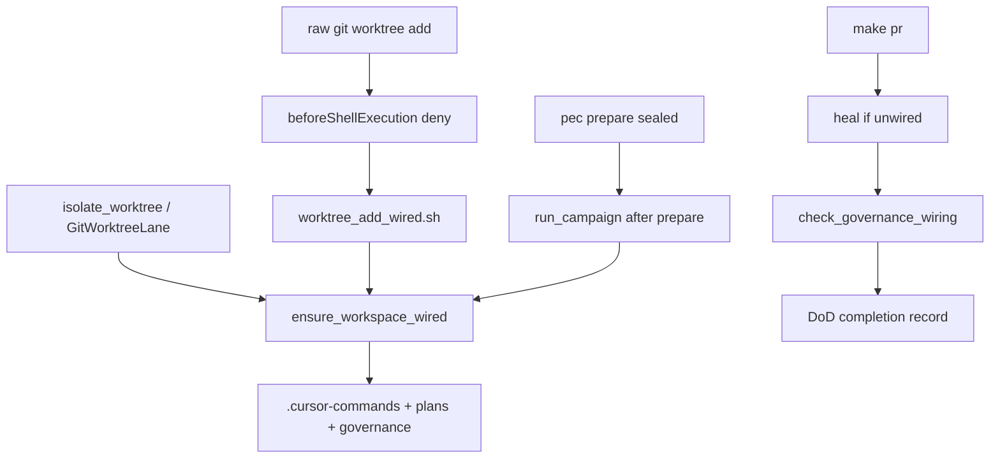

# Wire worktrees at creation

> **PLAN_DOCUMENT** `plan.governance.wire-worktree-on-create.v1` · schema `1.0.0` · status `draft` (executable only after Program Lock + baseline re-verify)
> **Execute:** `@environment/program-execution` then subordinate `@autonomy` under a Program lease. Do not free-form mutate from this markdown.
> **Branch:** new `feat/wire-worktree-on-create` from `origin/main` (KERNEL / PE overlay default). Do not mix unrelated WIP.
> **Target:** [Quantum-L9/Cursor-Governance](https://github.com/Quantum-L9/Cursor-Governance) at `$HOME/.cursor-governance` (not `l9-ci-core`).

## Execute via @environment/program-execution + autonomy

```text
this .plan.md
  → @environment/program-execution  (Blueprint → Program Lock → Controller)
  → @autonomy / l9-bounded-autonomy  (subordinate lease)
  → cursor-foreground
```

Live run: `make -C "$HOME/.cursor-governance" campaign INTENT=<brief.md|activate.yaml>`. `autonomous_merge: false`. If the runner exits nonzero, stop.

## Architect framing

| Field | Value |
|-------|-------|
| planning_ssot | [rules/49-shared-worktree-isolation.mdc](/Users/macm2/.cursor-governance/rules/49-shared-worktree-isolation.mdc) + [ops/scripts/setup_workspace_symlinks.sh](/Users/macm2/.cursor-governance/ops/scripts/setup_workspace_symlinks.sh) |
| plan_class | `bounded_execution_contract` |
| redesign_allowed | `false` |
| framing_notes | Root cause is unwired **folders**, not missing sessionStart. Do not teach agents to `/start-session` on every branch. |

## Immutable baseline

| Field | Value |
|-------|-------|
| repository | `Quantum-L9/Cursor-Governance` |
| workspace | `$HOME/.cursor-governance` |
| branch | `main` → `feat/wire-worktree-on-create` |
| commit_sha | `6189bf1ed650d11dd3db8ccb83acece662dce879` |
| overlap_policy | `stop_if_dirty_overlaps_may_modify` |
| on_drift | `stop_and_replan` |

SSOT clone is currently dirty (unrelated WIP). Execution must isolate to the new worktree and not scoop primary dirty files.

## Objective

A new `git worktree add` path starts without gitignored `.cursor/` / `.vscode/`. `sessionStart` never sees that folder. `make pr` then fails `check_governance_wiring.sh`.

Fix once: **wire at create**, **heal in the PR gate**, **deny raw add**. Do not change sessionStart semantics.

### Success properties (DoD-bound)

Terminal acceptance is [@.cursor-commands/kernels/L9 Coding Control Plane/ai-control-plane/DEFINITION_OF_DONE.md](/Users/macm2/l9-ci-core/.cursor-commands/kernels/L9%20Coding%20Control%20Plane/ai-control-plane/DEFINITION_OF_DONE.md) (SSOT twin: [`kernels/L9 Coding Control Plane/ai-control-plane/DEFINITION_OF_DONE.md`](/Users/macm2/.cursor-governance/kernels/L9%20Coding%20Control%20Plane/ai-control-plane/DEFINITION_OF_DONE.md)).

Claim `completion_state: Done` only when every applicable DoD area and `validation_gates.*` is `Passed` or `NotApplicable`. No `Failed` or `Unknown` on a mandatory gate. Delivered state must equal validated state.

| id | property | evidence_type | proof | DoD gate |
|----|----------|---------------|-------|----------|
| SP-01 | Baseline SHA still matches at execute start | `repository_state` | `git rev-parse HEAD` == locked SHA | `target_and_scope_verified` |
| SP-02 | After sanctioned worktree create, `.cursor-commands`, `.cursor/plans`, `.cursor/governance/CANONICAL_LAW.md` exist and resolve to SSOT | `filesystem` | helper + creator tests | `implementation_complete`, `root_causes_resolved` |
| SP-03 | Unwired worktree + `make pr` heals then `check_governance_wiring.sh` PASS; still FAIL if heal cannot repair | `quality_gate` | gate fixture | `mandatory_checks_green` |
| SP-04 | Bare `git worktree add` denied by `beforeShellExecution` unless wrapper or `L9_WORKTREE_ADD_AUTHORIZED` | `runtime_behavior` | isolation-gate unit tests | `security_preserved`, `no_regression_detected` |
| SP-05 | `make pr-check` PASS on the feature worktree; IDE WARN is not a gate | `quality_gate` | `make pr-check` | `mandatory_checks_green`, `validation_honest` |
| SP-06 | DoD YAML completion record exists; `overall_definition_of_done: Passed`; `lifecycle_readiness` is `ReviewReady` or `CommitReady` only if those prerequisites were evaluated | `proof_receipt` | DoD `output_contract` fields | `handoff_verified`, `convergence_verified` |

## Capability preflight

| id | capability | pass_criteria | blocking |
|----|------------|---------------|----------|
| CP-01 | HEAD resolution | equals locked SHA or stop_and_replan | true |
| CP-02 | `setup_workspace_symlinks.sh` present | executable in SSOT | true |
| CP-03 | write_allow writable in isolated worktree | path exists | true |

## Execution envelope

- **write_allow:** `ops/scripts/ensure_workspace_wired.sh` (new), `ops/scripts/worktree_add_wired.sh` (new), `ops/scripts/setup_workspace_symlinks.sh` (call only), `ops/scripts/run_pr_gate.sh`, `ops/autonomy/worktree_isolation_gate.py`, `ops/autonomy/local_execution_gate.py`, `environment/program-execution/scripts/run_campaign.py`, `environment/program-execution/peer_execution/autonomy/worker_lane.py`, matching tests, `rules/49-shared-worktree-isolation.mdc`, `AGENTS.md` §2, `ops/graphiti/docs/MACHINE-ENV-POLICY.md`
- **write_deny:** sealed `environment/program-execution/core/**`, `l9-ci-core` product code, sessionStart redesign, secrets, unrelated WIP
- **commands allow:** helper, unit tests, `make pr-check`
- **commands deny:** force-push, hard-reset, admin merge, `L9_WORKTREE_ISOLATION=0` as the success path
- **network:** `none` for implement/prove; `bounded_external_write` only at authorized L4 publish
- **autonomous_merge:** `false`

## Side effects

| todo | side_effects | idempotency | irreversible |
|------|--------------|-------------|--------------|
| T1 helper | `filesystem_mutation` | `safe_to_repeat` | false |
| T2 creators | `filesystem_mutation` | `safe_with_dedupe` | false |
| T3 heal | `filesystem_mutation` | `safe_to_repeat` | false |
| T4 deny | `filesystem_mutation` | `safe_to_repeat` | false |
| T5 prove | `filesystem_read` | `safe_to_repeat` | false |

## Architecture impact

Control-plane only. SessionStart stays workspace-open / Graphiti hydrate. pec `prepare_worktree` in sealed core is **not** edited; the campaign runner calls the helper **after** prepare.



## Rollback

Supported. Automatic rollback false. Approval required. Code: `git_restore_scoped_paths` / revert the feature commit. Verify: isolation-gate tests + `make pr-check` on restored SHA. No data/external irreversible ops.

## Complexity and uncertainty

`complexity: medium` · `uncertainty: low` · `blast_radius: medium` · boundaries crossed: 0 · migration: false

## Execution DAG / PE Task Cards

| id | pe_task | wave | depends_on | mutation | isolation |
|----|---------|------|------------|----------|-----------|
| T1 | TASK-001 | W1 | [] | true | `mutate` |
| T2 | TASK-002 | W1 | [T1] | true | `mutate` |
| T3 | TASK-003 | W1 | [T1] | true | `mutate` |
| T4 | TASK-004 | W1 | [T1] | true | `mutate` |
| T5 | TASK-005 | W2 | [T2, T3, T4] | false | `validate` |

Critical path: `T1 → T2 → T3 → T4 → T5`. T2/T3/T4 may run in parallel after T1.

## Stress and disconfirm

- If agents keep using raw `git worktree add` and the deny-list misses a spelling, heal in `make pr` is the backstop — does the fixture prove both paths?
- If heal runs during the repo-write lock, does it deadlock or skip? Heal must run **inside** the existing `make-pr-gate` lock, not via sessionStart reconcilers.
- If deny-list blocks CI / pec / `workspace_clean.py`, those callers must use the wrapper or the authorized env escape — sealed pec is not rewritten.
- Blast radius: every local `make pr` and every agent shell `git worktree add` on a Cursor machine.
- Assumed false if: sessionStart is retargeted at sibling worktrees; IDE WARN is treated as FAIL; sealed pec core is edited.

## Out of scope

- Making `sessionStart` / `workspaceOpen` / `subagentStart` fire on sibling worktrees
- `/start-session` as a per-branch ritual
- Editing sealed `environment/program-execution/core/**` (`pec/controller.py` `prepare_worktree`)
- `l9-ci-core` product/orchestration changes
- Weakening `check_governance_wiring.sh` or skipping it
- Auto-merge

## Doc / root surface

- Update: `AGENTS.md` §2, `rules/49-shared-worktree-isolation.mdc`, `MACHINE-ENV-POLICY.md` — worktree create ⇒ wire; sessionStart remains session-open only
- N/A: `l9-ci-core` `AGENTS.md` — Core does not own this gate
- N/A: DoD kernel text — bind it; do not rewrite the kernel

## Convergence

`status: partial` · next skill: `@environment/program-execution` + `/autonomy` · stop_reason: plan only; implementation not run; DoD record not yet produced

## Definition of Done (terminal — do not skip)

Before any Ready/Done claim, the execute agent fills the DoD YAML `output_contract` from the kernel. Applicable areas for this change:

| DoD area | Expected |
|----------|----------|
| context_and_scope | Passed — target is Cursor-Governance isolated worktree |
| requirements_and_contracts | Passed — wire-at-create + heal + deny; sessionStart unchanged |
| implementation | Passed — helper + three call sites + gate heal + deny-list; no stubs |
| scope_integrity | Passed — no sealed-core, no Core-repo, no sessionStart redesign |
| contract_integrity | Passed — wiring check still fail-closed after heal |
| correctness | Passed — create, heal, deny, authorized-escape, already-wired no-op |
| security | Passed — no privilege widen; escape is explicit env only |
| reliability | Passed — helper idempotent; heal under existing PR lock |
| tests_and_validation | Passed — unit tests + `make pr-check` on exact final SHA |
| documentation_and_operability | Passed — AGENTS / rule 49 / machine-env match behavior |
| change_hygiene | Passed — no WIP scoop, no lock-file residue |
| regression_protection | Passed — existing isolation denies still hold |
| convergence | Passed — no remediable High remains |
| handoff | Passed — branch + evidence + DoD YAML exist |

`completion_state` ∈ {Done, PartiallyDone, Blocked, Failed} per kernel. Do not equate implementation with MergeReady.

## Campaign packet stub

```yaml
packet_id: autonomy-2026-08-16-wire-worktree
authority: A4_CAMPAIGN_BOUNDED_EXTERNAL_WRITE
profile: pr-convergence
autonomous_merge: false
plan_id: plan.governance.wire-worktree-on-create.v1
declared_branches: [feat/wire-worktree-on-create]
forbidden_inside_packet:
  - mutate_sealed_pec_core
  - weaken_wiring_check
  - merge_outside_l4_plan_build_stack
  - force_push
```
