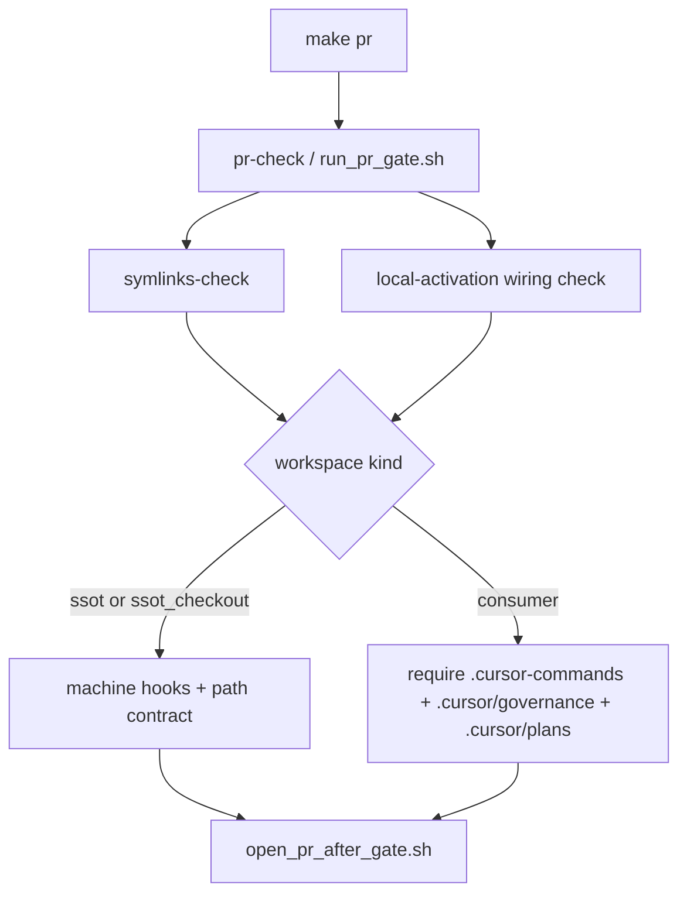

# Unblock make pr on gov worktrees

## Objective

`make pr` / `make pr-check` from a Cursor-Governance git worktree (for example `~/.l9/gov-worktrees/pe-pipeline-fixes-clean`) must not fail because that folder lacks consumer IDE wiring (`.cursor-commands`, `.cursor/plans`, `.cursor/governance`, IDE profile stamp). Push must be allowed to run when the real PR gates pass.

This is a governed activation-gate change. Land on a **new branch from `origin/main`**. Do not mix into `pe-pipeline-fixes-clean` or other WIP.

## Why it failed (one sentence)

[`check_governance_wiring.sh`](ops/scripts/check_governance_wiring.sh) and [`validate_governance_symlinks.sh`](ops/scripts/validate_governance_symlinks.sh) treat any workspace whose realpath is not `~/.cursor-governance` as a **consumer**, then require gitignored Cursor links that SessionStart never creates on a worktree. The IDE-profile line is warn-only and is not the gate. `make pr` is `pr-check` then [`open_pr_after_gate.sh`](ops/scripts/open_pr_after_gate.sh); a failed `pr-check` never pushes.

The same wiring check runs twice: pre-commit `symlinks-check`, then again in [`run_pr_gate.sh`](ops/scripts/run_pr_gate.sh) `local-activation` (line 268). Both must use the new classification.

## Decision (do not auto-wire as a consumer)

Do **not** paper this over with `setup_workspace_symlinks.sh` on every worktree. A worktree of this repo is still the governance tree, not a product consumer. Auto-creating `.cursor-commands` there is the wrong category.

Shared root cause: missing workspace kind. Add one classifier and use it in both checkers.

Kinds:

- `ssot` — `realpath(workspace) == realpath(~/.cursor-governance)`
- `ssot_checkout` — workspace root has this repo’s identity files and is not the live SSOT path (worktree or second clone)
- `consumer` — everything else (unchanged law)

Identity files (all required): `CANONICAL_LAW.md`, `skills/AUTONOMY_MANIFEST.yaml`, `rules/RULES-MANIFEST.yaml`, `ops/scripts/check_governance_wiring.sh`. Do not key off `~/.l9/gov-worktrees/` alone.

## What each kind must do

- `ssot`: keep today’s rules. `.cursor-commands` must be **absent**. Machine hooks stay fail-closed.
- `ssot_checkout`: do **not** require `.cursor-commands`, `.cursor/plans`, `.cursor/governance`, or IDE stamp. If `.cursor-commands` exists, it must point at the SSOT (optional, not required). Machine hooks, plugin, no-legacy `~/.cursor/{skills,commands,rules}`, and hardcoded-path contract stay fail-closed. SSOT dirty / not-at-tip / unpushed becomes **WARN**, not FAIL (the worktree is what is being published; rule 49 exists because the primary clone is often dirty or locked).
- `consumer`: unchanged. Missing `.cursor-commands` still FAIL.

## Message crease

- Print `RESULT` before non-blocking WARNs, or put WARNs in a `non-blocking:` footer. Never leave `IDE profile not yet applied` as the last line before `RESULT: FAIL`.
- Replace the wrapper `governance wiring or sessionEnd hook incomplete` with `check_governance_wiring.sh failed — see FAIL lines above`. Only mention sessionEnd when that check is the one that failed.

## Files

Create:

- [`ops/scripts/lib/workspace_kind.sh`](ops/scripts/lib/workspace_kind.sh) — `classify_workspace_kind`
- [`ops/scripts/tests/test_workspace_kind.sh`](ops/scripts/tests/test_workspace_kind.sh) — kinds + both checkers on fixtures
- [`learning/failures/worktree-make-pr-wiring.md`](learning/failures/worktree-make-pr-wiring.md) — short incident note

Edit:

- [`ops/scripts/check_governance_wiring.sh`](ops/scripts/check_governance_wiring.sh)
- [`ops/scripts/validate_governance_symlinks.sh`](ops/scripts/validate_governance_symlinks.sh)
- [`ops/scripts/run_pr_gate.sh`](ops/scripts/run_pr_gate.sh) — same classifier; keep calling the checker (do not skip the hook)
- [`ops/scripts/tests/test_workspace_rules_overlay.sh`](ops/scripts/tests/test_workspace_rules_overlay.sh) only if SSOT self-alias cases drift
- [`rules/49-shared-worktree-isolation.mdc`](rules/49-shared-worktree-isolation.mdc) — one MUST: `make pr` from a gov worktree must not require consumer wiring
- [`CANONICAL_LAW.md`](CANONICAL_LAW.md) — **append-only** clarification: `.cursor-commands` is the consumer entry; a checkout of this repo is SSOT-family and must not be forced through consumer wiring. Do not rewrite §1–3.
- [`AGENTS.md`](AGENTS.md) — append-only (root additive_only). Name the three kinds and the `make pr` rule.

## Out of scope

- Finishing or publishing the `pe-pipeline-fixes-clean` PR
- Auto-running `/wire` or `install_ide_profile.sh` on worktree add
- Weakening ruff, security, hardcoded-paths, or the merge gate
- Removing machine-global hook / plugin checks
- Skipping `symlinks-check` on local governance clones

## Validation

- Classifier fixture: `ssot` / `ssot_checkout` / `consumer`
- Unwired `ssot_checkout` fixture (no `.cursor*`, no IDE stamp) → both checkers exit 0 when machine hooks are healthy (or machine section stubbed in the unit test)
- Consumer fixture without `.cursor-commands` → exit 1
- SSOT fixture with `.cursor-commands` self-alias → exit 1
- `make pr-check` named in final validation
- After land: `PR_REMEDIATE=0 make pr` from an unwired gov worktree must not die on `symlinks-check`

## Execute via Program Execution + autonomy

When Build is clicked: new branch from `origin/main` → `@environment/program-execution` (Program Lock / Controller) → subordinate `@autonomy`. `autonomous_merge: false`. Human merge only.

## Stress

- Disconfirm: would a consumer that happens to contain `CANONICAL_LAW.md` be skipped? Mitigation: require all four identity files, including this repo’s checker script.
- Disconfirm: would a broken machine (no sessionEnd hook) now pass `make pr` from a worktree? No — machine checks stay fail-closed.
- Blast radius: local `make pr` / `symlinks-check` on this repo and any second clone. CI already skips the hook. Consumers unchanged.
- Rollback: revert the branch. Checkers return to realpath-only consumer treatment.

## Depth

`standard` (gate change, evidence sufficient). Rollback included. `code_in_scope: true`.
