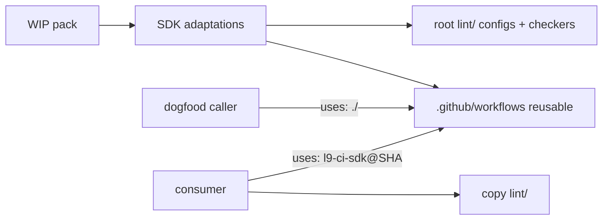

# PLAN: SDK YAML Governance (SAST) Activation

### Objective

Port [`.cursor-commands/WIP/l9-yaml-governance/`](.cursor-commands/WIP/l9-yaml-governance/) into [Quantum-L9/l9-ci-sdk](https://github.com/Quantum-L9/l9-ci-sdk) so YAML/workflow static checks are **installed, dogfooded, and consumable downstream** via a pinned SDK reusable workflow. Biome is out of scope (concurrent session).

### Success criteria (exit when all true)

1. Reusable workflow exists at `l9-ci-sdk/.github/workflows/l9-yaml-governance.yml` with `on: workflow_call`.
2. Dogfood caller runs on PR/push/main via `uses: ./.github/workflows/l9-yaml-governance.yml`.
3. All four jobs green on this repo: `yamllint`, `governance-json`, `actionlint`, `zizmor` (zizmor advisory: findings warn, job exits 0).
4. `pytest tests/yaml -q` green, including SDK-specific skip/allowlist cases.
5. Downstream contract documented: pin `Quantum-L9/l9-ci-sdk@<40-char-sha>` + copy root `lint/*`.
6. No files landed in [Quantum-L9/.github](https://github.com/Quantum-L9/.github); no Core host for this capability.
7. No Biome / `biome.json` touches.
8. Tool configs/checkers live under root `lint/` (same convention as `ruff.toml` at root) — **not** under `.github/lint/`.

### Scope

**In:**
- Four CI jobs / six checks: yamllint infra, yamllint data, governance-JSON, action-pins, actionlint, zizmor
- SDK-local `.github/workflows/` for GHA only; tool configs/checkers at root `lint/`
- Checker adaptations required for SDK hybrid governance
- SHA-pin baseline for floating Actions refs that would fail the pack’s own pin gate
- Tests, pre-commit merge, ADR/architecture/AGENTS/README, MANIFEST refresh

**Out:**
- Biome / formatter CI
- [Quantum-L9/.github](https://github.com/Quantum-L9/.github) org repo
- `l9-ci-core` ownership of this workflow
- Semgrep provider / execution-profile entries
- SARIF / `security-events: write`
- Assurance / finding-bundle wiring
- Changing self-CI `yaml.safe_load` step (leave; weaker; optional later cleanup)
- PR #22 scope beyond incidental MANIFEST regeneration

---

### Locked packaging decision

**Owner: `l9-ci-sdk` product repository only.**

| Path | Meaning | Plan |
|---|---|---|
| https://github.com/Quantum-L9/.github | Separate **org** repo | Forbidden |
| `l9-ci-sdk/.github/workflows/` | Required GHA discovery inside SDK | Required — workflows only |
| `l9-ci-sdk/.github/governance/` | Analysis/self-CI governance pack (existing) | Unchanged home; validated by checker |
| `l9-ci-sdk/lint/` | Yamllint configs + stdlib checkers | **Locked** — matches root tool-config convention (`ruff.toml`, `pyproject.toml`, `.pre-commit-config.yaml`) |

**Why not `.github/lint/` (WIP default):** This repo does not stash tool configuration under `.github/`. Ruff lives at root `ruff.toml`; mypy/pytest live in `pyproject.toml` / `requirements-ci.txt`; pre-commit at root. `.github/` here is for Actions workflows, issue templates, and the governance JSON/YAML pack — not formatter/linter config. WIP’s `.github/lint/` was pack-author convenience aimed at Core; reject it for SDK.



- Dogfood: `uses: ./.github/workflows/l9-yaml-governance.yml` with `config-root: lint` and `tools-root: lint`
- Consumer: pin SDK SHA + copy `lint/*` (same relative paths)
- Forbidden pins: `Quantum-L9/.github/...`, `Quantum-L9/l9-ci-core/...yaml-governance...`
- Activation: `enforce-actionlint: true`, `enforce-zizmor: false`

---

### Critical SDK adaptations (WIP is not drop-in)

These are the failure modes that make a naive copy red on day one.

#### 1. Hybrid governance tree (blocker for governance-JSON)

Canonical pack files under `.github/governance/` are **JSON with `.yaml` extension** (good). Two self-CI files are **real YAML with comments**:

- [`.github/governance/rule-modes.selfci.yaml`](.github/governance/rule-modes.selfci.yaml)
- [`.github/governance/l9-ci-shared-spec.yaml`](.github/governance/l9-ci-shared-spec.yaml)

WIP `check_governance_json.py` runs `json.loads` on **every** `*.yaml` under governance. `SKIP_SCHEMA_CHECK` only skips the `schema` key check **after** a successful parse — it does **not** skip the parse. Those two files will fail closed.

**Locked fix:** change the checker so named self-CI YAML docs are **fully skipped** (no `json.loads`), with an explicit allowlist constant and a unit test. Do not convert them to JSON in this PR (would churn self-CI). Do not move them out of governance without a separate decision.

JSON pack files remain strict (duplicate-key reject, profile/waiver invariants).

#### 2. Floating Action refs (blocker for action-pins)

`check_action_pins.py` requires every non-local `uses:` to be a full 40-char SHA. Analysis callers already comply. These do **not**:

- [`l9-self-ci.yml`](.github/workflows/l9-self-ci.yml) — many `actions/checkout@v6`, `actions/setup-python@v6`, `actions/upload-artifact@v4`
- [`l9-manifest-reconcile.yml`](.github/workflows/l9-manifest-reconcile.yml) — same pattern

**Locked fix:** SHA-pin those refs in the same PR (match analysis style: pin + optional version comment). Do **not** weaken the pin checker. Prefer immutable SHAs from the same major line already used elsewhere (`upload-artifact` already pinned in analysis workflows).

#### 3. Path defaults (noise / false paths)

Verified in this tree:

- `.l9/` exists (real YAML — include in infra yamllint)
- `tests/fixtures/` exists (enable data profile)
- `.semgrep/` **absent** — omit from dogfood defaults
- `presets/` **absent** — omit from defaults and ignore lists unless/until present
- Add `memory-bank/` to yamllint ignore

Dogfood caller inputs (locked):

```yaml
infra-paths: '.github/ .l9/'
data-paths: 'tests/fixtures/'
config-root: 'lint'
tools-root: 'lint'
enforce-actionlint: true
enforce-zizmor: false
```

#### 4. Permissions model

Reusable + dogfood: `permissions: contents: read` only. No write scopes. No SARIF upload. Matches WIP security model and Core’s no-write posture for this class of gate.

---

### Source → landing map

| WIP source | Land at | Notes |
|---|---|---|
| `config/yamllint-infra.yml` | `lint/yamllint-infra.yml` | Optimize ignores; keep governance excluded |
| `config/yamllint-data.yml` | `lint/yamllint-data.yml` | Structural-only |
| `tools/check_governance_json.py` | `lint/check_governance_json.py` | **Adapt skip list** |
| `tools/check_action_pins.py` | `lint/check_action_pins.py` | Keep fail-closed SHA rule |
| `.github/workflows/l9-yaml-governance.yml` | `.github/workflows/l9-yaml-governance.yml` | Host comments → SDK only; default `config-root`/`tools-root` → `lint` |
| `docs/templates/...-caller.yml` | dogfood workflow + `docs/templates/...` | Distinct filenames in-repo |
| `tests/yaml/*` | `tests/yaml/` | TOOLS → `lint/`; add skip tests |
| `.pre-commit-config.yaml` block | merge into root `.pre-commit-config.yaml` | Paths point at `lint/…`; keep ruff hooks |

Dogfood filename (locked): `.github/workflows/l9-yaml-governance-dogfood.yml` (avoids colliding with the reusable file name). Consumer template may still be named `l9-yaml-governance.yml` in docs (single caller file in consumer repos).

---

### Implementation sequence (fail-closed order)

1. **Land root `lint/` assets + adapted checkers** (so local validation works).
2. **SHA-pin baseline** in self-ci + manifest-reconcile.
3. **Land reusable + dogfood workflows** (`config-root`/`tools-root`: `lint`).
4. **Port/extend tests + pre-commit** (hooks reference `lint/…`).
5. **Run full local suite; fix yamllint/actionlint residuals** (fix workflow YAML, do not blanket-ignore).
6. **Docs + ADR 0010 + MANIFEST.md refresh**.
7. Open PR from `feat/yaml-governance-sast` → `main` on Quantum-L9/l9-ci-sdk only (rebase onto updated `main` if #22 merges first).

### Validation commands (must all pass before merge claim)

```bash
pytest tests/yaml -q
python3 lint/check_governance_json.py .
python3 lint/check_action_pins.py .
python3 -m pip install --quiet 'yamllint==1.38.0'
yamllint --strict --format github -c lint/yamllint-infra.yml .github/ .l9/
yamllint --format github -c lint/yamllint-data.yml tests/fixtures/
# actionlint + zizmor locally if available; else rely on dogfood Actions run
```

PR CI evidence: dogfood workflow green; zizmor may emit warnings without failing.

### Docs / downstream contract

- ADR `docs/adr/0010-yaml-governance-static-checks.md`: SDK owns; not org `.github`; not Core; hybrid governance skip rationale; pin+copy contract; promote zizmor later via promotion-policy evidence bar.
- `docs/architecture/yaml-governance.md`: inputs table, install checklist, dogfood vs consumer pin.
- `docs/templates/l9-yaml-governance-caller.yml`: `<SDK_SHA>` placeholder only.
- `AGENTS.md` + `README.md`: short consumer section (mirror manifest docs style).
- Explicit: reusable workflow checks out the **caller** repo — `lint/` must exist there (copy from SDK). Missing config → job `::error` and fail (already in WIP workflow).
- Document the convention: workflows under `.github/workflows/`; tool configs under root `lint/` (like `ruff.toml`), never under `.github/lint/`.

### Branch + repo isolation (locked)

**Yes — this can run while the Cursor-Governance agent works**, because the deliverable is a different GitHub repository and a different branch.

| Item | Locked value |
|---|---|
| Remote | `git@github.com:Quantum-L9/l9-ci-sdk.git` only |
| Base | `origin/main` (fetch first; do **not** branch off `feat/repository-manifest-auto-fix`) |
| Feature branch | `feat/yaml-governance-sast` (create fresh at execution start) |
| Cursor-Governance | **Read-only.** Concurrent agent owns that repo. No commits, pushes, checkouts, or file edits there. |

**Symlink hazard (must not contaminate governance):**

In this workspace, `.cursor-commands` → `$HOME/.cursor-governance` ([Quantum-L9/Cursor-Governance](https://github.com/Quantum-L9/Cursor-Governance)). The WIP pack path `.cursor-commands/WIP/l9-yaml-governance/` therefore lives **inside Cursor-Governance**, not inside l9-ci-sdk.

| Action | Allowed? |
|---|---|
| **Read** WIP pack as copy source | Yes |
| **Write/edit/delete** anything under `.cursor-commands/` | **No** |
| Land copies into SDK `lint/`, `.github/workflows/`, `tests/`, `docs/`, etc. | Yes |
| `git` operations in `$HOME/.cursor-governance` | **No** |
| Commit/push on SDK feature branch only | Yes (when user asks) |

### Concurrent-work fences

| Surface | Rule |
|---|---|
| Cursor-Governance / `.cursor-commands/**` | Read-only; never mutate (concurrent agent) |
| Biome / `biome.json` / JS formatter CI | Do not touch (concurrent SDK session if any) |
| Org `Quantum-L9/.github` | Do not touch |
| `feat/repository-manifest-auto-fix` / PR #22 | Do not continue that branch; leave alone |
| Analysis Core pin `f7a4ee8c…` | Do not bump unless required for consistency inside one file |
| `l9_ci/` Python product code | Do not touch unless a test import path forces it (prefer not) |
| Manifest engine | Only regenerate `MANIFEST.md` if inventory drifts on the new branch |

### Risks

| Risk | Mitigation |
|---|---|
| Governance-JSON fails on self-ci YAML | Full skip allowlist + tests (locked) |
| action-pins fails on `@v6`/`@v4` | SHA-pin baseline in same PR (locked) |
| actionlint flags existing workflows | Fix workflows; no rule weakening |
| Consumer forgets to copy `lint/` | Fail-closed missing-config check + docs checklist |
| WIP habit of `.github/lint/` | Rejected; root `lint/` locked to match `ruff.toml` convention |
| Host drift in comments/templates | Strip Core/org examples; ADR forbids |
| Branch conflict with #22 / Biome | Fresh branch from `origin/main`; narrow file touch list |
| Accidental Cursor-Governance edits via `.cursor-commands` symlink | Read WIP only; never Write/StrReplace under `.cursor-commands/` |
| Pre-commit zizmor heavy for local | Keep; document `pre-commit run` optional for contributors |

### Estimate

**Total:** ~1 day (baseline SHA-pin + hybrid governance adaptation dominate)
**Delivery mode after approval:** `l9-gmp-protocol` (multi-file CI + permission-sensitive workflows)
