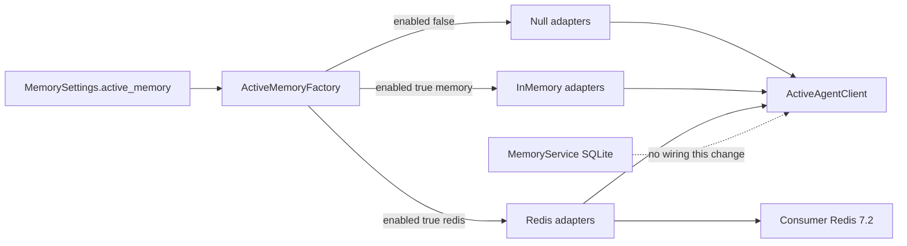

# Active Memory Factory, Settings, Redis Conformance

## Architect framing

This change completes a deferred constructor. It does not add a second memory SSOT, does not wire Redis into MemoryService/MCP, and does not join the PE campaign. Redis remains an optional working-state backend behind ports that already exist.

## Immutable baseline

- Repo: `Quantum-L9/l9-graphiti-memory`
- Bind execution to **`origin/main` @ `9647c4b2a95e9f33e4791b5d67b7f6d185eddc58`** (re-verified this pass)
- Local checkout `HEAD` `f690d3f` is behind 19 and dirty. Do not implement on that clone.
- Exclusive worktree from `origin/main`. Do not use the CG campaign worktree.
- Do not land on `canonical-memory-lifecycle-convergence-v1`.
- **This repo has no Makefile.** Mandatory gate is `bash scripts/validate_release.sh` ([AGENTS.md](AGENTS.md), [scripts/validate_release.sh](scripts/validate_release.sh), CI). `make pr-check` is a broken path here (imported from CG plan habit).
- V-001 on that SHA expects **`487 passed`** (`git show origin/main:tools/assurance/generate_validation_evidence.py`). The dirty clone’s `282 passed` is stale local churn. Do not copy it.

## Recommendation (locked)

**Skip Redis unless `L9_ACTIVE_MEMORY_REDIS_URL` is set.** Do not add a required CI Redis service.

That env var is both the conformance collection-time opt-in and the default `RedisCredentialSettings.url_env` **name** (the settings object stores the variable name, not the URL). Do not also default to `ACTIVE_MEMORY_REDIS_URL`.

Default `pytest` / `validate_release.sh` stay green without Redis. An extra CI job that starts Redis 7.2+ is a later ops choice.

## Objective

Consumers obtain `ActiveAgentClient` only from `ActiveMemoryFactory` using process settings. They never import Redis adapter classes. Disabled deployments fail closed via null adapters. Opt-in Redis runs the existing conformance files unmodified.

## Success properties (evidence-typed)

| ID | Property | Evidence |
|---|---|---|
| P1 | Default settings: `active_memory.enabled is False`; `build_runtime()` construct path unchanged | unit test + no `runtime.py` diff |
| P2 | `enabled=false` ignores backend/creds/deployment_id; client uses null adapters; `open_session` raises `ActiveMemoryUnavailableError` | factory unit test |
| P3 | `enabled=true` + `backend=null` is `ConfigurationError` | factory/settings unit test |
| P4 | `enabled=true` + `backend=memory` + `environment=production` is `ConfigurationError` | factory unit test |
| P5 | `enabled=true` + `backend=memory` + non-production: existing session behavior via factory | factory or external-runtime test |
| P6a | `enabled=true` + `backend=redis` + two+ credential sources → `AmbiguousCredentialSourceError` (or wrap as `ConfigurationError` that names the ambiguity) | factory unit test |
| P6b | `enabled=true` + `backend=redis` + default `url_env` set but env empty → `CredentialResolutionError` | factory unit test |
| P6c | `enabled=true` + `backend=redis` + missing `redis` extra → `ActiveMemoryUnavailableError`; no in-memory fallback | factory unit test |
| P7 | `RedisActiveStore` / `RedisAwarenessBus` stay out of `l9_graphite_memory.active.__all__`; `ActiveMemoryFactory` is in it | `check_active_memory_public_api.py` |
| P8 | No Redis URL: conformance collects only in-memory and passes | targeted pytest, URL unset |
| P9 | URL set: same conformance files pass against Redis | operator/opt-in; Unknown until a Redis URL exists |
| P10 | `bash scripts/validate_release.sh` PASS on the feature worktree; V-001 matches the observed pytest count | T5; Unknown until executed |

## Why this is not MemoryService Redis



Verified gaps (reads + `git show origin/main`, not assumed from docs):

- `[adapters/factory.py](src/l9_graphite_memory/adapters/factory.py)` builds only SQLite + projections. No `ActiveMemoryFactory`.
- `[active/client.py](src/l9_graphite_memory/active/client.py)` documents that class.
- `[MemorySettings](src/l9_graphite_memory/config/models.py)` has no active-memory fields (`extra=forbid`).
- `[tests/conformance/active/conftest.py](tests/conformance/active/conftest.py)` still says Redis is a follow-up.
- `[check_active_memory_public_api.py](tools/assurance/check_active_memory_public_api.py)` does not yet require `ActiveMemoryFactory`.
- No `Makefile` in this repo. `make pr-check` cannot be the gate.

## Contracts (hardened)

`enabled` is the master switch. `backend` is only consulted when enabled.

`environment` values are the existing enum only: `development` | `test` | `staging` | `production` (`DeploymentEnvironment` in [deployment.py](src/l9_graphite_memory/active/deployment.py)).

| enabled | backend | environment | Result |
|---|---|---|---|
| false | any / omitted | any | Null adapters. Do not require deployment_id or creds. |
| true | null or omitted | any | `ConfigurationError` |
| true | memory | production | `ConfigurationError` (in-memory is not a shared presence plane) |
| true | memory | development/test/staging | In-memory adapters + required `ActiveDeployment` |
| true | redis | any | Credential resolution as below; Redis adapters internal; valid `ActiveDeployment` |

Redis credential resolution when `enabled=true` and `backend=redis`:

1. If the operator set two or more of `url_file` / `password_file` / `secret_provider_reference` / `url_env` → `AmbiguousCredentialSourceError`.
2. If none of those are set → factory injects `url_env="L9_ACTIVE_MEMORY_REDIS_URL"` (the name, not the URL).
3. `resolve_redis_credential` then runs. Empty/missing URL → `CredentialResolutionError`.
4. Missing `redis` extra → `ActiveMemoryUnavailableError` from the existing lazy import. Never fall back to in-memory.

Other fail-closed rules:

- Factory module import must not import `redis` (lazy, same as `redis_adapters._redis_modules`).
- Diagnostics use `ResolvedRedisCredential.redacted_summary()` only. Never log `redis_url`.
- Production placeholder `deployment_id` / `trust_domain` still rejected by existing `ActiveDeployment` validation.
- Nested YAML `active_memory:` maps to `ActiveMemorySettings`. Do not flatten a raw Redis URL onto `MemorySettings`.
- New config field **names** live only in `config/models.py` and `config/loader.py` (`check_config_drift.py` allowlist).
- Implement factory in `[src/l9_graphite_memory/active/factory.py](src/l9_graphite_memory/active/factory.py)`. Re-export `ActiveMemoryFactory` from `adapters/factory.py`. Do **not** add it to `[adapters/__init__.py](src/l9_graphite_memory/adapters/__init__.py)` `__all__`. Add it to `active.__all__` and `_REQUIRED_PUBLIC_SYMBOLS`.
- Constructor: `ActiveMemoryFactory.build(settings: MemorySettings) -> ActiveAgentClient`.

### Env table (explicit)

| Env | Nested field | Notes |
|---|---|---|
| `L9_ACTIVE_MEMORY_ENABLED` | `enabled` | bool |
| `L9_ACTIVE_MEMORY_BACKEND` | `backend` | `null` / `memory` / `redis` |
| `L9_ACTIVE_MEMORY_DEPLOYMENT_ID` | `deployment_id` | required only if enabled |
| `L9_ACTIVE_MEMORY_TRUST_DOMAIN` | `trust_domain` | required only if enabled |
| `L9_ACTIVE_MEMORY_ENVIRONMENT` | `environment` | enum strings above |
| `L9_ACTIVE_MEMORY_REDIS_URL_FILE` | `url_file` | path |
| `L9_ACTIVE_MEMORY_REDIS_PASSWORD_FILE` | `password_file` | path |
| `L9_ACTIVE_MEMORY_REDIS_HOST` | `host` | with password_file only |
| `L9_ACTIVE_MEMORY_REDIS_PORT` | `port` | with password_file only |
| `L9_ACTIVE_MEMORY_REDIS_URL` | not a MemorySettings field | value read when `url_env` name is this string |

### Redis conformance isolation (no KEYS / FLUSHALL)

ADR-068 prohibits `KEYS` and `FLUSHALL`.

- Build the pytest param list **at collection time**. If `L9_ACTIVE_MEMORY_REDIS_URL` is empty, do not append a Redis param. Do not use `importorskip` as the collection gate (`--strict-markers` + empty URL must not try to import redis).
- If the Redis param is collected, `pytest.importorskip("redis")` may run inside that fixture only.
- Mark Redis cases with the existing **`live`** marker ([pyproject.toml](pyproject.toml) already defines it). Do not add `active_redis` (would fail `--strict-markers` unless registered; prefer the existing pattern).
- Each Redis session uses a unique `deployment_id`.
- Teardown: `close()`; no SCAN. Isolation is unique hash + TTLs (presence 30s, context 60s). Own-key UNLINK only if a test must delete. Never `FLUSHALL` / `FLUSHDB` / `KEYS`.

## Design

**Settings** — nest under `MemorySettings.active_memory` (keep `extra=forbid` on the parent). Defaults off in [resources/defaults.yaml](src/l9_graphite_memory/resources/defaults.yaml).

**Factory** — as in the contract table. Do not attach the client to [MemoryRuntime](src/l9_graphite_memory/runtime.py) or MCP.

**Docs** — [docs/ACTIVE_MEMORY_SDK.md](docs/ACTIVE_MEMORY_SDK.md) becomes the constructor SSOT (remove “factory deferred”). Short accepted note on ADR-067. README only if the existing “works without Redis” sentence would be wrong (it should remain true).

## Out of scope

- PE campaign Releases B–I; CG hydration/close
- Wiring into MCP `memory.*`, `MemoryRuntime`, or `MemoryService.promote`
- Required GitHub Actions Redis service
- C1 / shared `l9-redis`
- Active-context → canonical ingest (ADR-065 promotion join)
- ACL command-tracing harness (ADR-068 deferred)
- Changing `RedisCredentialSettings` precedence or existing credential unit-test env names
- Adding a Makefile or adopting CG `make pr-check`

## Execution envelope

- Filesystem write: listed T1–T4 paths on the **new worktree only**
- Commands: pytest subsets, `check_active_memory_public_api.py`, `bash scripts/validate_release.sh`
- Network: none required for default gates; Redis only if operator exports the URL
- Secrets: never commit a Redis URL; fixture reads env
- `autonomous_merge: false`
- `validate_release.sh` rewrites `validation/**`, `manifest.json`, and `MANIFEST.md` in the worktree. That regeneration is in-scope **on the feature worktree only**. Still forbidden on the dirty primary clone.

### Side effects / idempotency

| Todo | Mutates | Idempotent? |
|---|---|---|
| T1 | config models/loader/defaults + unit tests | yes — re-apply same fields |
| T2 | new factory module + re-export/API list edits | yes — file create/replace |
| T3 | conformance conftest only | yes |
| T4 | SDK + ADR-067 note | yes |
| T5 | validation logs + manifests on the worktree; V-001 count if pytest count changes from 487 | update to **observed** count; do not weaken the regex |

## Execution DAG / Phase-0

1. **T1 settings** — nested model + env table + defaults + [tests/unit/test_config.py](tests/unit/test_config.py) and/or `tests/unit/active/test_settings.py`.
2. **T2 factory** — `active/factory.py`, adapters re-export, `active/__init__.py` + public-API required set, unit tests for P2–P6c.
3. **T3 fixture** — collection-time params in [tests/conformance/active/conftest.py](tests/conformance/active/conftest.py); `live` marker; unique deployment_id.
4. **T4 docs** — SDK + ADR-067 after T2.
5. **T5 gates** — `pytest tests/unit/test_config.py tests/unit/active tests/conformance/active tests/external_runtime` (URL unset) + `check_active_memory_public_api.py` + `bash scripts/validate_release.sh`.

Critical path: T1 → T2 → T3 → T5. T4 after T2.

## Architecture impact

- New optional process settings. Default off: no behavior change for MemoryService/MCP.
- New public symbol `ActiveMemoryFactory` on the active SDK (additive, ADR-067 compatible).
- Adapters package import path documented; adapters `__all__` unchanged.
- Layer boundaries: `active.factory` may import `active.redis_adapters` lazily. Core MemoryService modules must not import the factory.

## Rollback

Revert the feature branch. Defaults remain disabled. No schema/migration. Redis test keys expire via TTL if an opt-in run is interrupted.

## Stress and disconfirm

- If redis requested and factory falls back to in-memory, consumers believe presence is shared. Fail closed (P6c).
- If teardown uses `FLUSHALL`/`KEYS`, a shared Redis is destroyed or the ACL contract is violated.
- If `enabled` and `backend` both act as switches, implementations diverge. Master switch is `enabled`.
- If factory is added to `adapters.__all__`, the record-store package exports working-state. Do not.
- If T5 uses `make pr-check`, the command does not exist. Use `validate_release.sh`.
- If V-001 is copied from the dirty clone (282), origin/main (487) will fail. Start from 487; end at observed.
- If implemented on the dirty primary clone, campaign/validation files get scooped.

## Complexity and uncertainty

- Depth: standard. Reversible. No production Redis in this change.
- Unknown: P9 (live Redis) cannot be claimed Passed without an operator URL. Not a default-gate blocker.
- Unknown: exact V-001 count **after** new tests (will be ≥ 487). Observe in T5.

## Capability preflight

- Repo gate script exists: Passed (`scripts/validate_release.sh`).
- `redis` extra: not required for T1–T5 default gates.
- Live Redis: optional. **Unknown** unless the operator exports `L9_ACTIVE_MEMORY_REDIS_URL`.

## Pre-validation (honest)

| ID | Action | Status |
|---|---|---|
| PV1 | Bind `origin/main` SHA | Passed — `9647c4b2a95e9f33e4791b5d67b7f6d185eddc58` |
| PV2 | Confirm factory/settings/conformance gaps by read | Passed |
| PV3 | Confirm repo gate command | Passed — `bash scripts/validate_release.sh`; **no Makefile** |
| PV4 | Read V-001 on origin/main | Passed — `487 passed` |
| PV5 | `validate_release.sh` run on a clean worktree | **Unknown** — not executed this pass |
| PV6 | Live Redis probe | **NotApplicable** to default gates |

`status: executable` means the **plan** is ready to execute, not that product validation has Passed.

## Final validation (to run in T5)

| ID | Command | Pass criteria | Status |
|---|---|---|---|
| FV1 | pytest unit/active + conformance + external_runtime, URL unset | all collected tests pass; Redis param absent | pending |
| FV2 | `python3 tools/assurance/check_active_memory_public_api.py` | exit 0; factory required; Redis classes forbidden | pending |
| FV3 | `bash scripts/validate_release.sh` on the feature worktree | exit 0; V-001 matches observed pytest count | pending |
| FV4 | pytest conformance with URL set | same files pass on Redis | Unknown unless URL present |

## Isolation / writable paths

- Writable: `src/l9_graphite_memory/config/models.py`, `config/loader.py`, `resources/defaults.yaml`, `active/factory.py` (create), `active/__init__.py`, `adapters/factory.py` (re-export only), `tools/assurance/check_active_memory_public_api.py`, `tools/assurance/generate_validation_evidence.py` (V-001 observed count only), `tests/unit/test_config.py` and/or `tests/unit/active/test_factory.py`, `tests/conformance/active/conftest.py`, `docs/ACTIVE_MEMORY_SDK.md`, `docs/adr/ADR-067-active-memory-public-sdk-and-lifecycle.md`, worktree `validation/**` + `manifest.json` + `MANIFEST.md` only as `validate_release.sh` output, README only if required.
- Forbidden: campaign YAML, running `validate_release.sh` on the dirty primary clone, `runtime.py` / MCP wiring, protected infra, C1, push, merge, inventing a Makefile.

## Execute via @environment/program-execution + autonomy

```text
.plan.md
  → exclusive worktree from origin/main @ 9647c4b
  → @environment/program-execution (optional Program lease; NOT campaign canonical-memory-lifecycle-convergence-v1)
  → @autonomy / l9-gmp-protocol on Quantum-L9/l9-graphiti-memory only
  → PE adapter cursor-foreground
  → gate: bash scripts/validate_release.sh
```

Do not free-form mutate from this markdown. `autonomous_merge: false`. Next skill after approval: `l9-ynp`.

Campaign packet stub: none.

## Validate & Repair result (plan artifact)

Target: this plan file. Mode: bounded_repair. Product code not modified.

| ID | Type | Severity | Confidence | Evidence | Repair | Status |
|---|---|---|---|---|---|---|
| VR-001 | execution_blocker / alignment | High | Confirmed | No Makefile; AGENTS.md + CI call `scripts/validate_release.sh` | Replace every `make pr-check` with that script | Resolved in plan |
| VR-002 | alignment / fake_validation risk | High | Confirmed | Dirty tree V-001 is `282 passed`; origin/main is `487 passed` | Bind T5 to 487, then observed count | Resolved in plan |
| VR-003 | contract | Medium | Confirmed | P6 lumped three failures as one error type | Split P6a/P6b/P6c | Resolved in plan |
| VR-004 | validation_quality | Medium | Confirmed | `importorskip` is not a collection gate; `--strict-markers` | Collection-time params; use existing `live` marker | Resolved in plan |
| VR-005 | incomplete_behavior | Medium | Confirmed | Env mapping named but not specified | Explicit env table | Resolved in plan |
| VR-006 | alignment | Low | Confirmed | Inventing `active_redis` would fail strict markers | Use `live` | Resolved in plan |
| VR-007 | incomplete_behavior | Low | Confirmed | PLAN_DOCUMENT JSON never run through `validate_plan_document.py` | Out of this kernel’s product scope; plan remains Cursor `.plan.md` SSOT | Deferred |

**Validation this pass:** structural reads + `git show origin/main` + path inventory. Runtime `validate_release.sh`: **Unknown** (not run; would mutate the dirty clone).

**Convergence of the plan:** Converged for execution readiness. No remediable High finding remains in the plan. Another V&R pass on the plan has no objective unless `origin/main` moves or someone reintroduces `make pr-check`.

**Readiness:** PartiallySucceeded — plan repaired; product implementation and FV3 remain unexecuted.
