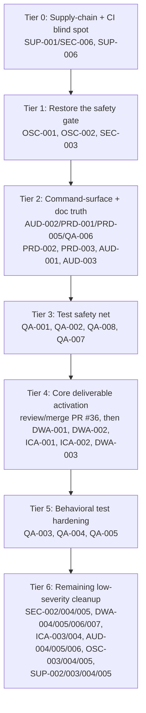

# Audit Validation and Remediation Order — Website-Bot

## What's in the folder

10 files, all analyzing the same commit (`73bd934`, which **is** current `HEAD` — repo hasn't moved):

- [finding_schema.yaml](docs/WIP/Website audits/finding_schema.yaml) — canonical machine-readable schema + a **subset** example of 7 findings (AUD-001/002, SEC-006, SEC-003, DWA-001, ICA-001, OSC-001) and one convergence block. It is not the full finding set.
- [website-bot-audit-01.md](docs/WIP/Website audits/website-bot-audit-01.md) — Architecture Conformance (AUD-001..006)
- [website-bot-audit-02-security.md](docs/WIP/Website audits/website-bot-audit-02-security.md) — Security & Data-Flow (SEC-001..006)
- [SUP-audit-website-bot.md](docs/WIP/Website audits/SUP-audit-website-bot.md) — Supply-Chain & License (SUP-001..006)
- [QA-audit-website-bot.md](docs/WIP/Website audits/QA-audit-website-bot.md) — Quality & Test-Effectiveness (QA-001..008)
- [website-bot-audit-08-dead-wiring.md](docs/WIP/Website audits/website-bot-audit-08-dead-wiring.md) — Dead-Wiring & Latent-Capability (DWA-001..007)
- [website-bot-audit-09-interface.md](docs/WIP/Website audits/website-bot-audit-09-interface.md) — Interface & Contract-Coupling (ICA-001..005)
- [website-bot-audit-10-observability.md](docs/WIP/Website audits/website-bot-audit-10-observability.md) — Observability & Signal-Coverage (OSC-001..005)
- [PRD-audit-website-bot.md](docs/WIP/Website audits/PRD-audit-website-bot.md) — Production-Readiness/Stub Detection (PRD-001..005)
- [FUP-audit-website-bot.md](docs/WIP/Website audits/FUP-audit-website-bot.md) — Follow-up re-verification of SUP+QA findings only (confirms all 14 still unresolved, 0 regressions, because zero commits landed between runs)

Total: **~42 unique findings** across 8 dimensions (SUP-001 and SEC-006 are the same drizzle-orm CVE, counted once).

## Validation already performed (spot-checked against live tree, not just trusted)

I re-read the actual current source for every category and confirmed the audits are accurate, with one important nuance:

- Confirmed still-broken: `package.json` has only `pipeline`, `pipeline:dry`, `typecheck`, `validate` — none of the ~19 `verify:*` scripts `Makefile`/`justfile` reference (AUD-002/PRD-001/QA-006). No Astro dependency anywhere (AUD-001). `drizzle-orm` is still `^0.30.10`/`0.30.10` in the lockfile (SEC-006/SUP-001). Zero `*.test.ts` files exist anywhere (QA-001/002/008). `VisualQAStage.ts` still checks `output.includes('CRITICAL')` against a script whose only output is `STATUS: PASS|FAIL` (OSC-001). `contracts/design_contract.yaml` still declares `colors/typography/spacing` against `DesignIntelligenceStage.ts`'s real `primary/secondary/accent/...` output (ICA-001). All CI workflows still run `npm ci --no-audit --no-fund` with no separate audit step (SUP-006).
- **Important correction to the audit set:** `SEC-001` (SchemaGeneratorStage FAQ JSON-LD, "no subsequent validation of parsed object's keys/types") is **already substantially fixed** — a prior merged PR (`WF-002`, squashed into main history before these audits ran) added exactly the shape/type filtering the finding asks for (`src/stages/SchemaGeneratorStage.ts` lines 84-97). Likewise `WF-004` already added the color/font token validation that `SEC-002` discusses, and `WF-005` already normalizes the deployment URL scheme relevant to `AUD-005`. These findings are low-severity/non-blocking either way, so this doesn't change the remediation order, but it means Phase 0 below (re-verify before opening any fix) will resolve a few items as `wont_fix`/already-closed for free.
- **Critical context the audits didn't have:** the repo's own [TODO.md](TODO.md) ("Build the core factory capability") already independently describes the exact same root problem as `DWA-001`/`DWA-002`/`AUD-001` ("pipeline generates copy into an in-memory map and never materializes a site") and there is an **open, unmerged PR #36** (`docs/factory-upgrade-build-plan.md`, docs-only) laying out a phased P-A→P-F plan for a `SiteAssemblerStage` that consumes `ctx.generatedContent`, a client-neutral `astro_template/`, and per-client Vercel deploy. **This PR is the plan of record for the biggest structural finding cluster — remediation should review/merge it and execute its phases rather than inventing a parallel fix.**

## Remediation order (tiered by dependency + leverage, not just severity)

### Tier 0 — Supply-chain fix + restore CI's own vulnerability detection (blocks_release, ~1 PR)
- `SUP-001` / `SEC-006` / `FUP-001`: bump `drizzle-orm` to `>=0.45.2`, regenerate lockfile, validate `BuildDB.ts`/`PipelineRunner.ts` against the new API.
- `SUP-006` / `FUP-006`: add a non-suppressed `npm audit --audit-level=high` step to `build-and-validate.yml` (the `--no-audit` on `npm ci` is why this CVE went undetected in the first place).
- Rationale: single highest-CVSS finding, smallest diff, and fixing it without also fixing the audit gap (SUP-006) means the next CVE goes undetected again.

### Tier 1 — Restore the pipeline's only automated pre-deploy safety gate (1 critical blocks_release + 2 related, ~1 PR)
- `OSC-001`: fix `VisualQAStage.ts`'s `output.includes('CRITICAL')` check — it can never match real output (`STATUS: PASS|FAIL`). Best fix per the audit: read `validation/visual_qa_report.json` directly instead of stdout-grepping.
- `OSC-002`: while touching this file, thread the structured per-page/per-viewport `issues[]` into the thrown `BuildError` (same file, same PR, near-zero extra cost).
- `SEC-003`: fix the sibling shell-interpolated `execSync` curl call in `scripts/verify-visual-qa.mjs` (CWE-78) — same file family, natural to bundle.
- Rationale: this is the single critical, fully-in-repo, cheapest fix (per `OSC-001`'s own minimum-safe-next-action) and it's illogical to build more automation on top of a QA gate that structurally cannot fire.

### Tier 2 — Command-surface and doc-vs-code truth (3 blocks_release findings collapse to ~1-2 PRs)
- `AUD-002` / `PRD-001` / `PRD-005` / `QA-006`: add the missing `verify:*` npm scripts to root `package.json` and wire them into `build-and-validate.yml`. This is foundational — every subsequent "did my fix work" check in later tiers depends on `make verify`/`npm run verify:*` actually running.
- `PRD-002`: delete or regenerate the stale `validation/validation_report.md`/`.yaml` that references a nonexistent `website_pack/astro_supplementalinsurancepros` path — remove fabricated-looking evidence before anyone trusts it.
- `PRD-003`: fix `UNKNOWN_CLOSURE_VALIDATION.md`'s false "`package.json` includes `verify:launch-env`" claim (trivial, same PR as above).
- `AUD-001`: resolve the Astro architecture-doc mismatch. Given `TODO.md`/PR #36 confirm Astro generation is intentionally per-client (not in this repo's own `src/`), correct `ARCHITECTURE.md` accordingly rather than trying to add Astro to the root repo.
- `AUD-003`: regenerate `MANIFEST.md` from `git ls-files` instead of hand-maintaining it.
- Rationale: until the documented command surface actually runs, no one can verify any other fix the "L9 way" (`make verify`), and the fake validation report actively misleads anyone assessing repo health.

### Tier 3 — Build the test safety net before the big structural change (blocks_release, new dependency)
- Introduce a minimal test runner (repo has zero test framework — recommend `vitest`, ESM/TS-native, lowest-friction for this stack).
- `QA-001`: unit tests for `PipelineRunner.run()` success/`partial`/`failed` branching.
- `QA-002`: unit tests for `validateDomainSpec.ts` malformed-input rejection.
- `QA-008`: injected-failure tests for `llm.ts`'s `BudgetExhaustedError`/`LLM_CALL_FAILED` paths.
- `QA-007`: replace the 7 `any`/`as any` in `scripts/normalize-spec.ts` — this file is both the CI spec-drift guard and the one file with real behavioral assertions, so its type holes are disproportionately risky.
- Rationale: per the repo's own testing/refactor discipline, land characterization tests for the orchestration core *before* Tier 4's structural rewire, not after — otherwise `DWA-001`'s new stage ships with the same "zero coverage on critical path" problem `QA-001` just flagged.

### Tier 4 — Activate the pipeline's core deliverable (the biggest cluster, already has a plan of record)
- Review and merge **PR #36** (`docs/factory-upgrade-build-plan.md`) — it is the authoritative, already-written plan for this entire cluster.
- Execute its phases, which directly resolve:
  - `DWA-001`: `ctx.generatedContent` never reaches a deployable artifact (the `SiteAssemblerStage` PR #36 proposes).
  - `DWA-002`: `ctx.generatedSchemas` JSON-LD bodies never persisted (same assembler stage).
  - `ICA-001`: reconcile `contracts/design_contract.yaml` token keys with `DesignIntelligenceStage.ts`'s actual output — do this *before* or *during* the assembler work since the assembler will consume these tokens too.
  - `ICA-002`: add the missing `schema_generation` entry to `contracts/llm_router_integration.yaml`.
  - `DWA-003`: decide contracts/*.yaml fate (wire a contract-enforcement step now that `ICA-001` makes it possible, or explicitly deprecate the unread files).
- Rationale: this is not a "smallest safe fix" tier — it's the repo's actual stated purpose. Doing it after Tiers 0-3 means it ships onto a codebase with working CI verification, a real safety gate, and test coverage on the orchestration core it depends on.

### Tier 5 — Upgrade grep-theater checks to real behavioral tests
- `QA-003` (`verify-source.mjs` NOSTUB grep), `QA-004` (`verify-form.mjs` regex-only form check), `QA-005` (`verify-smoke.mjs` no retry/backoff, flake-prone).
- Rationale: these are non-blocking and best done once Tier 4 produces an actual rendered site to test against (a runtime form-submit test needs a real deployed page).

### Tier 6 — Remaining low-severity, independent cleanup (batch opportunistically, no fixed order needed)
- Security hardening: `SEC-002` (font regex comment+test), `SEC-004` (`client_id` charset allowlist), `SEC-005` (error-message redaction).
- Dead-wiring cleanup: `DWA-004` (remove unused `recordUsage`), `DWA-005` (add a `report:usage`/`db-report` script), `DWA-006` (wire or remove 4 unused `BuildErrorCode` values), `DWA-007` (`'info'` severity branch).
- Interface polish: `ICA-003` (log SEO-Bot rejection responses; vendor its Zod schema if possible — currently UNKNOWN from this repo alone), `ICA-004` (single `SCHEMA_VERSION` constant).
- Doc/architecture polish: `AUD-004` (drop unused `VERCEL_ORG_ID` from required-launch-env), `AUD-005`/`OSC-005` (replace `visualQaPassed: boolean` with a `visualQaStatus` enum — same fix serves both findings), `OSC-003` (`logger.child({buildId, clientId})` for correlation), `OSC-004` (add an `llm_usage` aggregation report script).
- Governance/policy docs (no code): `SUP-002` (INDEX_POLICY for GitHub Packages), `SUP-003` (ALLOWED_LICENSES carve-out for proprietary first-party deps), `SUP-005` (PIN_POLICY or exact-pin decision). `SUP-004` (dep-drift dedupe) needs no action.

## How to track validation + status as you go

Don't create a new tracking doc — the audit authors already built one: use `finding_schema.yaml`'s own `status` field (`open → in_progress → resolved | wont_fix | unknown_unresolved`) as the live ledger, and extend it with the full finding set from all 7 reports (it currently only has the 7-finding example subset). Mark `SEC-001`/`SEC-002`(partially)/`AUD-005`(partially) as already-largely-addressed by the pre-existing `WF-002`/`WF-004`/`WF-005` merges during Phase 0 re-verification, rather than re-fixing what's already fixed.

For the two genuinely unresolvable-from-this-repo UNKNOWNs (`ICA-003`'s SEO-Bot Zod schema, `OSC-004`'s external dashboard consumer of `llm_usage`), don't chase them — log them as `unknown_unresolved` and cross-reference the `Quantum-L9/SEO-Bot` repo if/when that becomes available.

## Suggested PR grouping (respects "one concern per commit/PR")

1. `drizzle-orm` bump + `npm audit` CI gate (Tier 0)
2. `VisualQAStage.ts` + `verify-visual-qa.mjs` gate fix (Tier 1)
3. `package.json` verify scripts + CI wiring + stale-report cleanup + doc corrections (Tier 2)
4. Test framework bootstrap + critical-path unit tests (Tier 3)
5. PR #36 review/merge, then its own per-phase PRs (Tier 4 — largest, expect multiple PRs)
6. Behavioral-test upgrades for `verify-*.mjs` (Tier 5)
7. Batched low-severity cleanup, can be split further by owner_layer (Tier 6)
