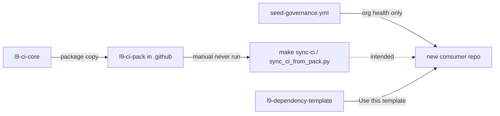
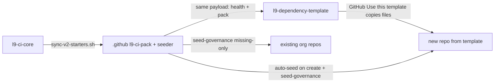

# Autonomous Core-pack + seeder

## Answer: the Cursor-Governance exclude is not a live GitHub UI setting

[`rulesets/org-required-analysis.json`](https://github.com/Quantum-L9/.github/blob/main/rulesets/org-required-analysis.json) is a **declared** ruleset in the `.github` repo. It excludes `.github` and `Cursor-Governance`, is `evaluate` (advisory), and points at `.github/workflows/l9-analysis.yml` with `repository_id: 0` (placeholder) and Core pin SHA `f881165…`.

**It is not applied on the org.** Live org rulesets today:

- `L9 advisory — branch hygiene` (evaluate)
- `L9 advisory — pull request hygiene` (evaluate)
- `Quantum AI Policy` (disabled)

[`rulesets/README.md`](https://github.com/Quantum-L9/.github/blob/main/rulesets/README.md) does not even list the analysis file. `ops/apply-rulesets.sh` is documented in the org README but is **not** in `ops/` on `main`. If that JSON were applied later, it would appear under org **Settings → Rulesets** — that is the UI. Right now the exclude is only a file.

Do **not** apply that ruleset as the inheritance mechanism. `repository_id: 0` is broken, and required-workflow injection is the wrong primary path. Inheritance must be **files in the tree**.

## What is broken today

Two jobs were split, then only one was automated:

- Seeder payload ([`ops/build-seed-payload.js`](https://github.com/Quantum-L9/.github/blob/main/ops/build-seed-payload.js)) has no `l9-ci-pack` category. Auto-seed uses the same payload, so new repos also miss Core.
- [`docs/BOUNDARIES.md`](https://github.com/Quantum-L9/.github/blob/main/docs/BOUNDARIES.md) still says this repo must never write CI callers — that blocked the hub path. Correct split: `.github` **distributes** the pack; Core **executes**.
- [`Constellation.PackageTemplate`](https://github.com/Quantum-L9/Constellation.PackageTemplate) is GitHub-aliased to [`l9-dependency-template`](https://github.com/Quantum-L9/l9-dependency-template). It only has a homemade [`.github/workflows/ci.yml`](https://github.com/Quantum-L9/l9-dependency-template/blob/main/.github/workflows/ci.yml). No `l9-analysis.yml`, no `.github/governance/*`.
- [`l9-repo-template`](https://github.com/Quantum-L9/l9-repo-template) already has the pack (PAT pilot). That is the exception, not the system.
- You chose: **also seed the pack into Cursor-Governance** (missing-only; do not overwrite this repo’s existing `l9-lint-test.yml`).

## Target flow

One payload. Health files and Core pack always travel together. `make sync-ci` remains the optional refresh path, not the install path.

## Implementation (Quantum-L9/.github first)

New branch from `origin/main` in `.github` (not Cursor-Governance).

1. **Add category `l9-ci-pack` to the shared payload** in [`ops/build-seed-payload.js`](https://github.com/Quantum-L9/.github/blob/main/ops/build-seed-payload.js), default-on with the other categories:
   - `l9-ci-pack/workflows/l9-analysis.yml` → `.github/workflows/l9-analysis.yml`
   - `l9-ci-pack/governance/*.yaml` → `.github/governance/`
   - `l9-ci-pack/workflows/l9-lint-test.yml` and `l9-lint-test-node.yml` → `.github/workflows/` (missing-only; Python template keeps `ci.yml` until a later cleanup)
2. **Mirror the category** in [`ops/sync-org-files.sh`](https://github.com/Quantum-L9/.github/blob/main/ops/sync-org-files.sh) and the `categories` input help on [`seed-governance.yml`](https://github.com/Quantum-L9/.github/blob/main/.github/workflows/seed-governance.yml).
3. **Rewrite the “no CI workflows” lines** in seeder / auto-seed PR bodies. Those sentences are why the hub was left behind.
4. **Correct BOUNDARIES / DISTRIBUTION / templates README:** this repo ships the pack; it does not run ruff/pytest/semgrep itself.
5. **Create-time trigger:** `auto-seed-new-repo.yml` only fires on `repository_dispatch` / `workflow_dispatch`. Confirm what (if anything) sends `repo_created`. If nothing does, add an org-app or `repository` webhook so a new repo always gets the same payload without a human. Template copy is the first inherit; auto-seed is the backfill if someone creates a blank repo.
6. **Do not apply `org-required-analysis.json` in this change.** Optionally delete the Cursor-Governance exclude in that file so the declaration matches “every consumer,” but keep enforcement `evaluate` and do not push it live until `repository_id` is a real source repo.

## Then land the pack on the birth template

After `.github` PR is green and merged:

- Dispatch `seed-governance.yml` `mode=seed` `repo_filter=l9-dependency-template` (and Cursor-Governance, missing-only).
- Merge the template seed PR so **Use this template** copies `l9-analysis.yml` + governance YAMLs into every new constellation package.
- Leave `ci.yml` in place (missing-only). A follow-up can retire homemade lint once Core lint/analysis is proven on that template.

## Validation

- Local: `buildSeedPayload` includes pack paths; `hasRootCodeowners` still skips `.github/CODEOWNERS`.
- Actions dry-run: Cursor-Governance would seed `l9-analysis.yml` + `.github/governance/*`, not overwrite `l9-lint-test.yml`.
- Live canary: `l9-dependency-template` PR contains the pack; a dry “would inherit” check lists those files on the template default branch.
- No `make sync-ci` required for first install.
