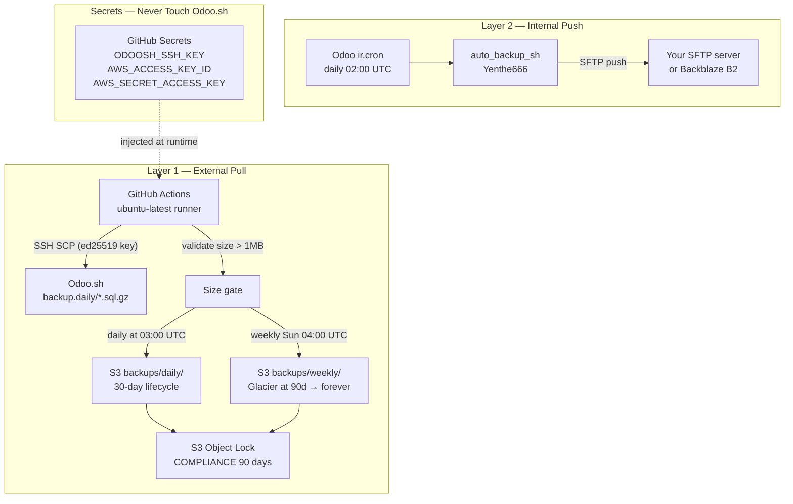

# Belt-and-Suspenders Disaster Recovery — Full Implementation Plan

## Threat Model

| Threat | Layer 1 (External Pull) | Layer 2 (Internal Push) |
|---|---|---|
| Odoo.sh fully compromised | Protected — Actions runs on GitHub infra, S3 creds never touch Odoo.sh | Compromised — attacker can disable SFTP cron |
| Ransomware encrypts Odoo.sh disk | Protected — S3 is off-site, COMPLIANCE Object Lock blocks deletion | Protected — SFTP is off-site |
| Attacker gets AWS write keys | Write-only IAM policy — can't read/list/delete existing objects | N/A |
| Attacker gets AWS root | COMPLIANCE Object Lock — 90-day physical deletion block, even root | N/A |
| Corrupt backup uploaded silently | Size validation gate rejects < 1MB before S3 write | N/A |
| Silent workflow failure | GitHub Actions emails on failure | N/A |
| Accidental deletion by you | Versioning + Object Lock | N/A |

## Architecture



---

## Step 1 — AWS S3 Setup (One-time, AWS Console or CLI)

**Critical:** Object Lock must be enabled at bucket creation time. You cannot add it to an existing bucket.

### 1a. Create bucket `plasticos-disaster-recovery`

```bash
aws s3api create-bucket \
  --bucket plasticos-disaster-recovery \
  --region us-east-1 \
  --object-lock-enabled-for-bucket

aws s3api put-bucket-versioning \
  --bucket plasticos-disaster-recovery \
  --versioning-configuration Status=Enabled

aws s3api put-object-lock-configuration \
  --bucket plasticos-disaster-recovery \
  --object-lock-configuration '{
    "ObjectLockEnabled": "Enabled",
    "Rule": {
      "DefaultRetention": {
        "Mode": "COMPLIANCE",
        "Days": 90
      }
    }
  }'
```

**COMPLIANCE mode:** Not even the AWS root account can delete or overwrite objects for 90 days. This is your ransomware kill-switch.

### 1b. Block all public access

```bash
aws s3api put-public-access-block \
  --bucket plasticos-disaster-recovery \
  --public-access-block-configuration \
    "BlockPublicAcls=true,IgnorePublicAcls=true,BlockPublicPolicy=true,RestrictPublicBuckets=true"
```

### 1c. Enable server-side encryption (SSE-S3)

```bash
aws s3api put-bucket-encryption \
  --bucket plasticos-disaster-recovery \
  --server-side-encryption-configuration '{
    "Rules": [{
      "ApplyServerSideEncryptionByDefault": {"SSEAlgorithm": "AES256"},
      "BucketKeyEnabled": true
    }]
  }'
```

### 1d. Lifecycle policy

```json
{
  "Rules": [
    {
      "ID": "DailyExpire30Days",
      "Filter": {"Prefix": "backups/daily/"},
      "Status": "Enabled",
      "NoncurrentVersionExpiration": {"NoncurrentDays": 30},
      "Expiration": {"Days": 30}
    },
    {
      "ID": "WeeklyToGlacierDeepArchive",
      "Filter": {"Prefix": "backups/weekly/"},
      "Status": "Enabled",
      "Transitions": [{"Days": 90, "StorageClass": "GLACIER_DEEP_ARCHIVE"}]
    }
  ]
}
```

Daily: 30-day auto-expiry. Weekly: moves to Glacier Deep Archive (~$0.001/GB/month) at 90 days, retained forever.

### 1e. IAM user — write-only, scoped to this bucket

Create a dedicated IAM user `plasticos-backup-writer`. Attach this inline policy only:

```json
{
  "Version": "2012-10-17",
  "Statement": [{
    "Sid": "BackupWriteOnly",
    "Effect": "Allow",
    "Action": ["s3:PutObject", "s3:PutObjectTagging"],
    "Resource": "arn:aws:s3:::plasticos-disaster-recovery/*"
  }]
}
```

This user **cannot** `s3:GetObject`, `s3:ListBucket`, or `s3:DeleteObject`. A leaked key is write-only — attacker cannot read your data or destroy existing backups.

Generate an access key. This becomes `AWS_ACCESS_KEY_ID` / `AWS_SECRET_ACCESS_KEY` in GitHub Secrets.

---

## Step 2 — SSH Keypair for Odoo.sh (One-time, local machine)

```bash
ssh-keygen -t ed25519 -C "plasticos-backup-bot" -f ~/.ssh/plasticos_backup_bot
```

- **Public key** → Odoo.sh Dashboard → your project → Settings → SSH Keys → Add
- **Private key** contents → GitHub Secret `ODOOSH_SSH_KEY`

To find `ODOOSH_SSH_HOST`: Odoo.sh Dashboard → your project → SSH tab → copy the connection string (format: `build-id@project.odoo.com`).

To find `ODOO_DB_NAME`: run `echo $PGDATABASE` in the Odoo.sh shell.

---

## Step 3 — GitHub Secrets (GitHub repo → Settings → Secrets and variables → Actions)

| Secret name | Value |
|---|---|
| `ODOOSH_SSH_KEY` | Full contents of `~/.ssh/plasticos_backup_bot` (private key) |
| `ODOOSH_SSH_HOST` | `build-id@project.odoo.com` from Odoo.sh SSH tab |
| `AWS_ACCESS_KEY_ID` | From Step 1e IAM user |
| `AWS_SECRET_ACCESS_KEY` | From Step 1e IAM user |
| `S3_BUCKET` | `plasticos-disaster-recovery` |
| `ODOO_DB_NAME` | Value of `$PGDATABASE` from Odoo.sh shell |
| `SLACK_WEBHOOK_URL` | (optional) Slack incoming webhook for failure alerts |

---

## Step 4 — GitHub Actions Workflow

**New file:** [`.github/workflows/backup-to-s3.yml`](.github/workflows/backup-to-s3.yml)

Key design decisions:
- SHA-pinned actions (per `86-ci-github-actions` rule — no floating tags)
- `timeout-minutes: 30` to prevent zombie runs
- Separate validation step before upload
- Both daily and weekly jobs share the same pull/validate logic via a reusable composite or shared steps
- Failure notification (email is automatic from GitHub; Slack webhook optional)
- Checksum (`sha256`) written as an S3 object tag for restore verification

Workflow schedule:
- `0 3 * * *` — daily at 03:00 UTC (11 PM EDT) → `backups/daily/`
- `0 4 * * 0` — Sunday at 04:00 UTC → `backups/weekly/`
- `workflow_dispatch` — manual on-demand trigger

Steps within the job:
1. Checkout (needed only for SHA-pin validation; `sparse-checkout` to minimize cost)
2. Set up SSH agent with `ODOOSH_SSH_KEY`
3. Add Odoo.sh host to `known_hosts` via `ssh-keyscan`
4. SSH to list `/home/odoo/backup.daily/` and grab the newest `.sql.gz` or `.zip`
5. `scp` the file to runner `/tmp/`
6. Validate: reject if `< 1 MB`; emit `::error::` annotation on failure
7. Compute `sha256` checksum
8. Upload to S3 with `--sse AES256 --storage-class STANDARD_IA` and tag with checksum
9. Write a manifest JSON (`backups/manifests/YYYY-MM-DD.json`) with filename, size, sha256, timestamp
10. Cleanup `/tmp/` regardless of success/failure (`if: always()`)
11. On failure: post to Slack webhook (if configured)

---

## Step 5 — Layer 2: Secondary SFTP Push from Odoo.sh (Optional but recommended)

This runs *inside* Odoo.sh so it is vulnerable to a full Odoo.sh compromise — but it provides redundancy against GitHub Actions failures, network partitions, or SSH key rotation issues.

### 5a. Choose SFTP destination

Options (in order of recommendation):
- **Backblaze B2** with S3-compatible API — cheapest durable object storage ($0.006/GB/month), supports immutability via Object Lock
- **Hetzner Storage Box** — fixed-price SFTP, EU-based, ~€3.81/month for 100GB
- **Your own VPS** running `openssh-server` with a jailed `sftp` user

### 5b. Install Yenthe666 auto_backup in Odoo.sh

Add to `requirements.txt` (or `external_dependencies` in a module):

```
pysftp>=0.2.9
```

Install the OCA `auto_backup` module (Community: `server-tools/auto_backup`). Configure in Odoo: Settings → Technical → Scheduled Actions → Auto Backup:
- Method: SFTP
- Host/User/Password: your SFTP server credentials
- Directory: `/backups/plasticos/`
- Backup type: `dump` (PostgreSQL)
- Days to keep: 14

### 5c. Store SFTP credentials in Odoo System Parameters (not in code)

Key: `plasticos.backup.sftp_password` — set via Settings → Technical → System Parameters.

---

## Step 6 — Restore Runbook (Document in [`docs/DISASTER_RECOVERY.md`](docs/DISASTER_RECOVERY.md))

```bash
# 1. List available backups (needs separate read-capable IAM user or AWS Console)
aws s3 ls s3://plasticos-disaster-recovery/backups/daily/ --recursive

# 2. Download most recent backup
aws s3 cp s3://plasticos-disaster-recovery/backups/daily/plasticos_20260528T030000Z.sql.gz .

# 3. Verify checksum (compare against manifest JSON)
sha256sum plasticos_20260528T030000Z.sql.gz

# 4. Option A: Restore via Odoo.sh platform UI
#    Odoo.sh Dashboard → Backups → Upload & Restore

# 5. Option B: Restore to local Postgres for forensics
gunzip plasticos_20260528T030000Z.sql.gz
createdb odoo_restore
psql -U odoo odoo_restore < plasticos_20260528T030000Z.sql
```

The restore runbook also needs a separate **read-only IAM user** (`plasticos-backup-reader`) that can `s3:GetObject` and `s3:ListBucket` — store those credentials separately from the writer credentials (e.g., encrypted in 1Password, not in GitHub).

---

## Step 7 — Monitoring & Alerting

- GitHub will auto-email the repo owner on any workflow failure
- Add Slack notification step to workflow (optional — needs `SLACK_WEBHOOK_URL` secret)
- Set a **monthly calendar reminder** to manually verify a backup restore to a staging DB
- Consider adding a CloudWatch alarm on S3 `NumberOfObjects` in `backups/daily/` — if count doesn't increment daily, something is broken

---

## Files to Create / Modify

- **Create:** [`.github/workflows/backup-to-s3.yml`](.github/workflows/backup-to-s3.yml) — the full GitHub Actions workflow
- **Create:** [`docs/DISASTER_RECOVERY.md`](docs/DISASTER_RECOVERY.md) — restore runbook, threat model, credential locations
- **Modify:** [`docs/README_backup_github_actions.md`](docs/README_backup_github_actions.md) — already exists, update with final secrets list and SFTP layer reference

---

## What Requires Manual Steps (Cannot Be Automated by Code)

1. **AWS Console:** Create S3 bucket with Object Lock (must be done at creation time)
2. **AWS Console:** Create IAM user + write-only policy + generate access key
3. **Local machine:** `ssh-keygen` to generate the backup bot keypair
4. **Odoo.sh Dashboard:** Add the public key to SSH Keys
5. **GitHub repo settings:** Add 6 secrets
6. **Odoo.sh shell:** Run `echo $PGDATABASE` to get the DB name
7. **Odoo.sh:** Install `auto_backup` module and configure SFTP credentials (Layer 2 only)
