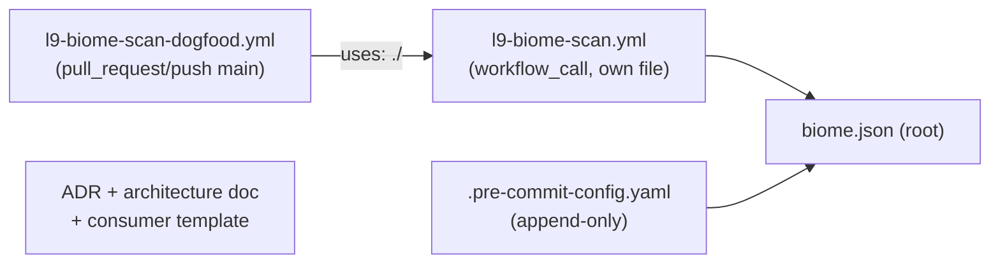

# PLAN: Biome CI Activation (aligned to PR #24 precedent)

## Phase 0: isolation and branch setup (confirmed with user)

**Target repo (confirmed):** `Quantum-L9/l9-ci-sdk`. `origin` in this checkout is
already `git@github.com:Quantum-L9/l9-ci-sdk.git` — no rebinding needed.

**Sync check (confirmed, read-only):**

```
local  refs/heads/main = bfaf4d29a775f5801e8dad932000ec8451d4217a
origin/main            = bfaf4d29a775f5801e8dad932000ec8451d4217a
```

Zero divergence — local and remote `main` are identical.

**Isolation constraint (confirmed with user):** do not touch anything except
the new feature branch. Concretely:

- Do **not** touch the `Cursor-Governance` repo or `.cursor-commands` (a different agent just finished work there).
- Do **not** touch `main`.
- Do **not** touch `feat/yaml-governance-sast` / PR #24 — this checkout
  (`/Users/macm2/Library/CloudStorage/Dropbox/Repo_Dropbox_IB/l9-ci-sdk-1`) is
  currently on that branch with live uncommitted changes that are not mine
  (`git worktree list` confirms it's the only worktree right now, HEAD `63279d6`).

**Chosen approach (confirmed with user): separate git worktree.** Instead of
checking out a new branch in the existing (dirty) directory, add a second
worktree from a clean `origin/main`, so the existing checkout is never
touched:

```bash
git worktree add ../l9-ci-sdk-biome -b feat/biome-static-checks origin/main
```

- New worktree path (proposed, adjustable): `../l9-ci-sdk-biome` (sibling to
  the current repo directory, i.e.
  `/Users/macm2/Library/CloudStorage/Dropbox/Repo_Dropbox_IB/l9-ci-sdk-biome`).
- New branch (matches existing naming convention, e.g. `feat/yaml-governance-sast`): `feat/biome-static-checks`.
- All Phase 2 file work below happens **only** inside that new worktree.
- Push target: `origin feat/biome-static-checks`, opening a new PR against `main` once CI is green — never pushing to or rebasing onto `feat/yaml-governance-sast`.

## Phase 1 (done): what PR #24 actually landed

PR #24 (`feat(ci): activate SDK-owned YAML governance static checks`, branch
`feat/yaml-governance-sast`, base `main`) is **open, mergeable, CI mostly green**
except one flagged item below. Verified directly from the two files originally
flagged as collision risks, plus the new workflow files and ADR.

### 1. `.github/workflows/l9-self-ci.yml` — touched, but only for SHA-pinning

The only change here (22 additions / 21 deletions) was pinning pre-existing
floating refs. **No new job was embedded into `pr_pipeline_gate`.** Confirmed
pinned SHAs to reuse verbatim if Biome's workflow needs the same actions:

```yaml
- uses: actions/checkout@d23441a48e516b6c34aea4fa41551a30e30af803  # v6
- uses: actions/setup-python@ece7cb06caefa5fff74198d8649806c4678c61a1  # v6
- uses: actions/upload-artifact@ea165f8d65b6e75b540449e92b4886f43607fa02  # v4.6.2
```

**Conclusion: Biome does not need to touch `l9-self-ci.yml` at all.** No job list
edit, no `pr_pipeline_gate.needs` change, no `R_BIOME` context wiring — that
whole approach from my original draft is superseded.

### 2. `.pre-commit-config.yaml` — pure addition, no restructure

39 additions, 0 deletions. Original `ruff`/`ruff-format` hooks untouched. Two
new repo blocks appended: a `yamllint` mirror repo, and a `repo: local` block
with three hooks (`l9-governance-json`, `l9-action-pins`, `l9-zizmor`). Biome's
hook appends the same way — no restructuring needed.

### 3. Integration pattern — standalone reusable + dogfood caller (confirmed)

PR #24 added two **new, separate** workflow files, never wired into
`l9-self-ci.yml`:

- [.github/workflows/l9-yaml-governance.yml](.github/workflows/l9-yaml-governance.yml) — `on: workflow_call`, four independent jobs (`yamllint`, `governance-json`, `actionlint`, `zizmor`), `permissions: contents: read` only, its own top-level `env:` version pins.
- [.github/workflows/l9-yaml-governance-dogfood.yml](.github/workflows/l9-yaml-governance-dogfood.yml) — `on: pull_request / push main / workflow_dispatch`, calls `uses: ./.github/workflows/l9-yaml-governance.yml` with explicit `with:` inputs.

This is exactly the pattern my earlier analysis recommended over embedding in
`pr_pipeline_gate`, and it's now the established precedent. **Biome must follow
the same two-file pattern**: `l9-biome-scan.yml` (reusable) + `l9-biome-scan-dogfood.yml`
(dogfood caller), both independent of `l9-self-ci.yml`.

### 4. Design choice worth adopting: zero external Actions in the reusable workflow

`l9-yaml-governance.yml`'s header comment locks in: *"zero external GitHub
Actions in this reusable workflow"* + *"immutable event-revision checkout (no
floating action ref)"*. It doesn't even use `actions/checkout` — every job
does a manual `git init && git remote add && git fetch --depth=1 && git
checkout --detach FETCH_HEAD` using `${{ github.token }}`. Tool installation
follows two patterns:

- **pip-installable tools** (yamllint, zizmor): `pip install "tool==X.Y.Z"` — pinned version, no Action.
- **binary tools** (actionlint): `curl` a pinned release URL + `sha256sum --check --status` against a hardcoded checksum, then `chmod +x`.

This is a *design choice*, not a hard requirement — confirmed by reading
[lint/check_action_pins.py](lint/check_action_pins.py): it only requires (a) every
`uses:` to be a full 40-char lowercase SHA, and (b) every workflow file to
declare a non-empty top-level `permissions:` block. Third-party marketplace
actions are allowed if SHA-pinned. **Recommendation: mirror the zero-Action,
checksum-verified-binary pattern anyway**, since Biome ships pinned-version
standalone binaries (like actionlint) and matching the established pattern
keeps supply-chain posture consistent across both new reusable workflows in
this repo — but this is a real choice point, not a hard block either way.

### 5. Flagged discrepancy — `enforce-actionlint: true` is currently causing a FAILURE

Live PR #24 status check `yaml-governance / actionlint` = **FAILURE**
(`enforce-actionlint: true` in the dogfood caller makes actionlint findings
hard-fail the job). It does **not** block the required merge gate ("L9 Self-CI
Gate" = SUCCESS, since yaml-governance jobs aren't wired into `pr_pipeline_gate`),
and `mergeable: MERGEABLE`, but `mergeStateStatus: UNSTABLE` and the check does
show red on the PR. `enforce-zizmor: false` by contrast is fully advisory
(warn-only). ADR 0010 locks `enforce-actionlint: true` as the activation default
deliberately.

**This is a real tension with "both are to fail open in advisory mode by
default"** — I have not touched PR #24 or its files (out of scope, owned by a
different session/branch). Flagging for your decision, not deciding it myself:
does the fail-open directive mean PR #24's `enforce-actionlint` should also
flip to `false`, or does it only govern the *new* Biome capability going
forward? See `resolve-actionlint-flag` todo above.

### 6. ADR 0010 explicitly confirms zero conflict

[docs/adr/0010-yaml-governance-static-checks.md](docs/adr/0010-yaml-governance-static-checks.md)
closes with: *"Biome and other formatter CI remain out of scope for this
ADR."* — clean handoff, no overlap to reconcile beyond the shared-file
mechanics already covered above.

---

## Phase 2: aligned Biome implementation plan



**Explicitly does not touch:** `.github/workflows/l9-self-ci.yml`,
`.github/workflows/l9-yaml-governance*.yml`, `lint/*`, anything on PR #24.

1. **`biome.json`** at repo root — single file, same tier as `ruff.toml`. No
   `lint/` subdirectory needed (Biome isn't part of the YAML-governance tool
   family; ADR 0010 explicitly excludes it).
2. **`.github/workflows/l9-biome-scan.yml`** (new, reusable):
   - `on: workflow_call` with `enforce-biome` boolean input, **default `false`**
     (mirrors `enforce-zizmor`, not `enforce-actionlint` — formatter/lint
     findings are advisory-by-default in this repo's existing philosophy:
     ruff, mypy, semgrep, audit are all advisory in `l9-self-ci.yml`).
   - Top-level `permissions: contents: read` (required — `check_action_pins.py`
     fails closed on workflow files with no top-level `permissions:` block).
   - Prefer the zero-Action manual-checkout + checksum-verified-binary
     install pattern (matches actionlint's job); if a marketplace action is
     used instead, it must be SHA-pinned (40-char lowercase) per
     `check_action_pins.py`.
   - Job reports findings via `::warning::` and exits 0 when `enforce-biome != 'true'`,
     matching the actionlint/zizmor `if [ "${ENFORCE}" = "true" ]; then ... else ... || echo "::warning::..."; fi` shape.
3. **`.github/workflows/l9-biome-scan-dogfood.yml`** (new, standalone caller):
   - `on: pull_request / push(main) / workflow_dispatch`, own `concurrency` group.
   - `uses: ./.github/workflows/l9-biome-scan.yml` with `enforce-biome: false`.
4. **`.pre-commit-config.yaml`** — append one new hook (local or pinned
   community repo) after the existing blocks; no restructuring.
5. **Docs** — mirror the YAML governance doc set:
   - `docs/adr/0011-biome-static-checks.md` (verify 0011 is still free at
     execution time — 0009 appears reserved/pending elsewhere).
   - `docs/architecture/biome.md` mirroring `docs/architecture/yaml-governance.md`.
   - `docs/templates/l9-biome-scan-caller.yml` mirroring the YAML governance
     consumer template, `<SDK_SHA>` placeholder only.
   - Short consumer section in `AGENTS.md` / `README.md`.
6. **Tests** — `tests/biome/test_biome_scan.py`, structurally mirroring
   [tests/yaml/test_yaml_governance.py](tests/yaml/test_yaml_governance.py) (workflow-structure assertions: `workflow_call` present, `permissions` block present, `enforce-biome` default is `false`, no floating `uses:` refs).
7. **MANIFEST.md** — no manual action; repo's manifest-reconcile bot picks up new files automatically (same as PR #24).

## Explicit non-goals (unchanged from original scope)

- No changes to `l9-self-ci.yml`, `l9-yaml-governance*.yml`, or `lint/*`.
- No changes to PR #24 itself.
- No org `.github` or `l9-ci-core` hosting for this capability (same rule ADR 0010 sets for YAML governance).

## Still open before execution

- **`resolve-actionlint-flag`**: does the fail-open directive retroactively apply to PR #24's `enforce-actionlint: true`? (Not my call to make unilaterally — that's a different branch/PR.)
- Confirm `enforce-biome: false` default (advisory) is the correct interpretation of "fail open by default" for Biome, matching zizmor's stance rather than actionlint's.
- Confirm whether to adopt the zero-external-Action pattern (curl + checksum) vs. a SHA-pinned `biomejs/setup-biome@<sha>` marketplace action for installing Biome.
