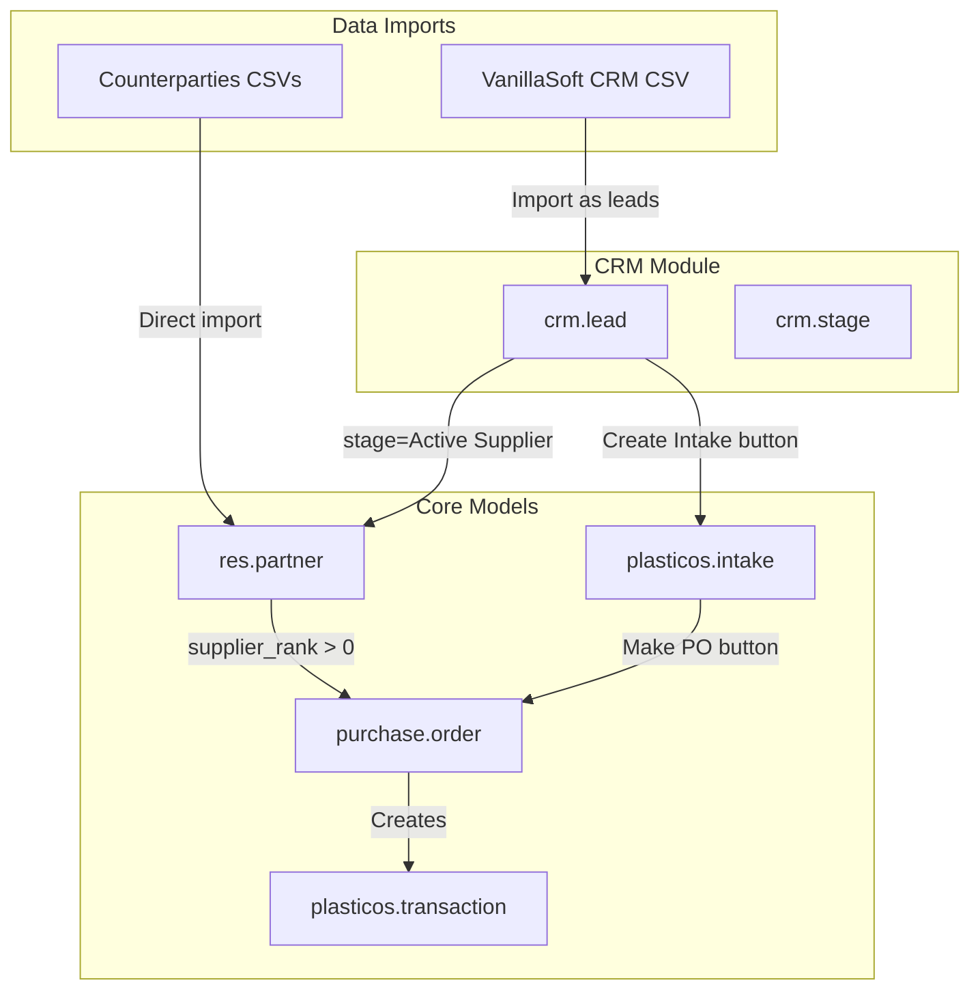

# CRM Integration + Unified Contact Management

## Summary of Decisions


| Topic        | Decision                                                                                |
| ------------ | --------------------------------------------------------------------------------------- |
| Lead Source  | MIGRATE `plasticos.lead.source` to native `utm.source`, then DELETE custom model        |
| CRM Stages   | Active Supplier, Hot, Warm, Cold, Dead (all contacts flow through CRM)                  |
| Segregation  | CRM leads stay in `crm.lead` until transaction initiated, then convert to `res.partner` |
| Import Order | 1) Counterparties CSVs first (existing partners), 2) VanillaSoft CRM leads second       |


---

## Architecture: Data Flow




---

## Phase 1: Enable CRM Module + Migrate Lead Sources

### 1.1 Add CRM dependency

File: [plasticos_base/**manifest**.py](plasticos_base/__manifest__.py)

```python
"depends": [
    "base",
    "mail",
    "crm",  # ADD - enables crm.lead, crm.stage, utm.source
    # ... existing deps
],
```

### 1.2 Create UTM source data (migrate from plasticos.lead.source)

New file: `plasticos_facility_profile/data/utm_source_data.xml`

Map existing codes to `utm.source`:

- Magazine, Web Lead, Google, Directory, Web Database, Attendee List, Referral, Agent Research, Trade Show, Cold Call, Existing Customer, Other

### 1.3 Migrate field references

Update [plasticos_facility_profile/models/res_partner.py](plasticos_facility_profile/models/res_partner.py):

- Change `lead_source_id` from `Many2one("plasticos.lead.source")` to `Many2one("utm.source")`

Update [plasticos_intake/models/intake.py](plasticos_intake/models/intake.py):

- Change `lead_source_id` to point to `utm.source`

Update [plasticos_web_leads/models/web_lead.py](plasticos_web_leads/models/web_lead.py):

- Update lead source lookup to use `utm.source`

### 1.4 Delete custom model

Remove files:

- `plasticos_facility_profile/models/lead_source.py`
- `plasticos_facility_profile/data/lead_source_data.xml`
- `plasticos_facility_profile/views/lead_source_views.xml`

Update `__init__.py` and `__manifest__.py` accordingly.

---

## Phase 2: Expand Intake Status

File: [plasticos_intake/models/intake.py](plasticos_intake/models/intake.py)

Current:

```python
status = fields.Selection([
    ("draft", "Draft"),
    ("matched", "Matched"),
], ...)
```

New:

```python
status = fields.Selection([
    ("draft", "Draft"),
    ("matched", "Matched"),
    ("offer_sent", "Offer Sent"),
    ("won", "Won / PO Made"),
    ("lost", "Lost"),
    ("expired", "Expired"),
], default="draft", tracking=True, index=True)
```

Update view: [plasticos_intake/views/intake_views.xml](plasticos_intake/views/intake_views.xml)

- Add statusbar widget with new stages

---

## Phase 3: Create CRM Stages

New file: `plasticos_crm/data/crm_stage_data.xml`

```xml
<record id="stage_active_supplier" model="crm.stage">
    <field name="name">Active Supplier</field>
    <field name="sequence">1</field>
    <field name="is_won">True</field>
</record>
<record id="stage_hot" model="crm.stage">
    <field name="name">Hot</field>
    <field name="sequence">10</field>
</record>
<record id="stage_warm" model="crm.stage">
    <field name="name">Warm</field>
    <field name="sequence">20</field>
</record>
<record id="stage_cold" model="crm.stage">
    <field name="name">Cold</field>
    <field name="sequence">30</field>
</record>
<record id="stage_dead" model="crm.stage">
    <field name="name">Dead</field>
    <field name="sequence">999</field>
</record>
```

---

## Phase 4: CRM Lead to Partner Conversion

### 4.1 What happens when a CRM lead becomes "Active Supplier"

When `crm.lead.stage_id` is set to "Active Supplier" (is_won=True):

1. Odoo native `action_set_won()` is called
2. If `partner_id` is not set, Odoo prompts to create partner
3. Partner is created with `supplier_rank=1` or `customer_rank=1` based on lead type

This is **native Odoo behavior** - no custom code needed.

### 4.2 Add "Create Intake" button on crm.lead

New file: `plasticos_crm/models/crm_lead.py`

```python
class CrmLead(models.Model):
    _inherit = "crm.lead"
    
    intake_ids = fields.One2many("plasticos.intake", "crm_lead_id", string="Intakes")
    intake_count = fields.Integer(compute="_compute_intake_count")
    
    def action_create_intake(self):
        """Create intake from CRM lead. Creates partner if needed."""
        self.ensure_one()
        if not self.partner_id:
            # Create partner from lead data
            self.partner_id = self._create_partner_from_lead()
        
        # Create intake linked to partner
        intake = self.env["plasticos.intake"].create({
            "partner_id": self.partner_id.id,
            "crm_lead_id": self.id,
            "lead_source_id": self.source_id.id,  # utm.source
            # Copy contact info
            "contact_name": self.contact_name,
            "contact_email": self.email_from,
            "contact_phone": self.phone,
        })
        return {
            "type": "ir.actions.act_window",
            "res_model": "plasticos.intake",
            "view_mode": "form",
            "res_id": intake.id,
        }
```

Add field to intake: [plasticos_intake/models/intake.py](plasticos_intake/models/intake.py)

```python
crm_lead_id = fields.Many2one("crm.lead", string="CRM Lead", index=True)
```

---

## Phase 5: Add "Make PO" Button on Intake

File: [plasticos_intake/models/intake.py](plasticos_intake/models/intake.py)

```python
def action_make_po(self):
    """Create Purchase Order from intake.
    
    Requires: partner_id (supplier), material_profile_id
    Creates: purchase.order linked to supplier
    Transitions: status -> 'won'
    """
    self.ensure_one()
    if not self.partner_id:
        raise UserError("Cannot create PO without a supplier.")
    if not self.material_profile_id:
        raise UserError("Cannot create PO without a material profile.")
    
    # Ensure partner has supplier_rank
    if self.partner_id.supplier_rank == 0:
        self.partner_id.supplier_rank = 1
    
    # Create PO
    po = self.env["purchase.order"].create({
        "partner_id": self.partner_id.id,
        # Link to intake for traceability
        "origin": self.name,
    })
    
    # Update intake status
    self.status = "won"
    
    return {
        "type": "ir.actions.act_window",
        "res_model": "purchase.order",
        "view_mode": "form",
        "res_id": po.id,
    }
```

Add button to view: [plasticos_intake/views/intake_views.xml](plasticos_intake/views/intake_views.xml)

---

## Phase 6: Partner Import Enhancement

### 6.1 Import order

1. **First**: Counterparties CSVs (files 1 and 2) - creates `res.partner` directly
2. **Second**: VanillaSoft CSV (file 3) - creates `crm.lead` records

### 6.2 VanillaSoft field mapping


| VanillaSoft Column     | Odoo Field                  | Notes                         |
| ---------------------- | --------------------------- | ----------------------------- |
| ContactID              | `ref` (external ID)         | For deduplication             |
| Buyer/Supplier         | `res.partner.category_id`   | Tag on partner when converted |
| Lead Status            | `crm.lead.stage_id`         | Map to custom stages          |
| Contact Owner          | `crm.lead.user_id`          | Salesperson                   |
| Company                | `crm.lead.partner_name`     | Company name                  |
| First Name + Last Name | `crm.lead.contact_name`     | Combined                      |
| Address fields         | Standard address            | Native fields                 |
| Email                  | `crm.lead.email_from`       | Lead email                    |
| Direct / Mobile        | `crm.lead.phone` / `mobile` | Phone fields                  |
| Company Type           | `res.partner.category_id`   | Tag when converted            |
| Notes                  | `crm.lead.description`      | Free text                     |
| Lead Source            | `crm.lead.source_id`        | Maps to `utm.source`          |


### 6.3 Lead Status mapping


| VanillaSoft Status        | CRM Stage       |
| ------------------------- | --------------- |
| 1= Currently Working With | Active Supplier |
| 2a=Qualified/HOT          | Hot             |
| 2b=Qualified/WARM         | Warm            |
| 3=Qualified/Resist        | Cold            |
| 4=Dead Lead               | Dead            |


---

## Phase 7: Company Type (category_id) on All Contacts

Ensure `res.partner.category_id` is visible and usable across all modules:

File: `plasticos_facility_profile/views/res_partner_views.xml`

Add category_id to partner form if not already visible. This is a native Odoo field - just ensure it's in the view.

Categories to create (master data):

- Buyer
- Supplier
- Distribution Center
- Commercial Recycler
- Pallet Recycler
- Compounder
- Carrier
- Warehouse
- Transload
- Toll Processor
- MRF
- Manufacturer

---

## Key Concepts Explained

### What is UTM?

UTM = Urchin Tracking Module (from Google Analytics). Odoo's `utm` module provides:

- `utm.source` - Where the lead came from (Google, Magazine, Trade Show)
- `utm.medium` - How they found you (email, phone, web)
- `utm.campaign` - Which marketing campaign

Native to CRM - no custom model needed.

### Partner Conversion (`partner_id`)

`crm.lead.partner_id` is optional. When set:

- Lead is linked to an existing `res.partner`
- Partner appears in CRM reports
- Conversion is complete

When NOT set:

- Lead is standalone (prospecting)
- No `res.partner` record exists yet
- Maintains segregation

### Segregation Summary


| Record Type                | In res.partner?      | Can Transact? |
| -------------------------- | -------------------- | ------------- |
| CRM Lead (Hot/Warm/Cold)   | NO                   | NO            |
| CRM Lead (Active Supplier) | YES (partner_id set) | YES           |
| Counterparty Import        | YES                  | YES           |
| Web Lead (before triage)   | NO                   | NO            |
| Web Lead (after intake)    | YES                  | YES           |


---

## Files to Create/Modify

### New Module: `plasticos_crm`

```
plasticos_crm/
  __init__.py
  __manifest__.py
  models/
    __init__.py
    crm_lead.py          # Inherit crm.lead, add intake link
  views/
    crm_lead_views.xml   # Add "Create Intake" button
  data/
    crm_stage_data.xml   # Custom stages
  security/
    ir.model.access.csv
```

### Modified Files

- `plasticos_base/__manifest__.py` - Add "crm" dependency
- `plasticos_facility_profile/models/res_partner.py` - Change lead_source_id to utm.source
- `plasticos_facility_profile/__manifest__.py` - Remove lead_source files
- `plasticos_intake/models/intake.py` - Add crm_lead_id, action_make_po, expand status
- `plasticos_intake/views/intake_views.xml` - Add Make PO button, statusbar
- `plasticos_web_leads/models/web_lead.py` - Update source lookup
- `plasticos_partner_import/models/partner_import_service.py` - Add CRM lead import method

### Deleted Files

- `plasticos_facility_profile/models/lead_source.py`
- `plasticos_facility_profile/data/lead_source_data.xml`
- `plasticos_facility_profile/views/lead_source_views.xml`

