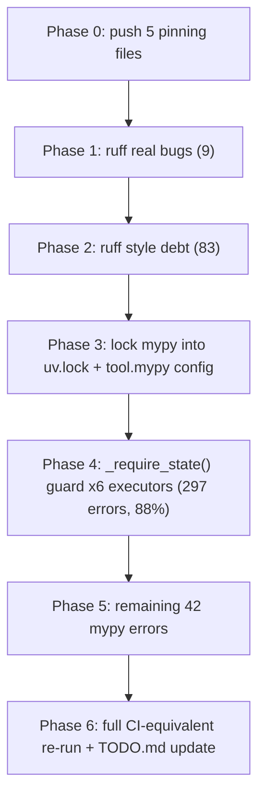

# Push + Structured Remediation Plan for `~/.cursor-governance`

## Verified current state (re-measured, not trusted from TODO.md's stale 2026-07-19 numbers)

Ran read-only `uv run ruff check .` and `uv run --with mypy mypy .` (ephemeral overlay, no project files touched) against the actual repo right now:

- **Ruff: 92 errors** (TODO.md said 77 — undercounted; `UP042`/`I001` weren't previously enumerated):
  - `E501` line-too-long: 51
  - `E402` import-not-top: 13
  - `UP042` replace-str-enum: 10
  - `I001` unsorted-imports: 5
  - `E722` bare-except: 4
  - `F401` unused-import: 4
  - `E741` ambiguous-name: 2
  - `UP022` replace-stdout-stderr: 2
  - `F841` unused-variable: 1
- **Mypy: 337 errors in 17 files** (TODO.md said 354 — close; the `datetime.UTC` issue TODO.md flagged is already gone once mypy runs under the pinned 3.12 venv instead of system 3.9, confirming last phase's Python-pinning work already paid off):
  - **295 of 337 (88%) are `union-attr`**, concentrated in **6 sibling executor files** that all share the exact same unguarded-`Optional` shape (`self.state: XState | None`, accessed without narrowing):
    - [workflows/gmp_executor.py](workflows/gmp_executor.py) — 61
    - [workflows/harvest_executor.py](workflows/harvest_executor.py) — 54
    - [workflows/migrate_executor.py](workflows/migrate_executor.py) — 51
    - [workflows/wire_executor.py](workflows/wire_executor.py) — 50
    - [workflows/lint_fix_executor.py](workflows/lint_fix_executor.py) — 44
    - [workflows/use_harvest_executor.py](workflows/use_harvest_executor.py) — 37
  - The remaining 42 errors are scattered across 11 files (langgraph stub mismatches, unguarded `Optional[str]`, one reducer-signature redefinition, a few one-off singles).
  - **Mypy is not part of the locked venv at all** — it only exists via a stray `~/Library/Python/3.9/bin/mypy`, contradicting the environment-locking work just finished.



## Phase 0 — Push (already approved: "push the 5 files")

Commit and push exactly these 5 files to `Quantum-L9/Cursor-Governance` (leaving the separate, pre-existing uncommitted `CHANGELOG.md`/`TODO.md`/`.github/workflows/l9-lint-test.yml` changes from the unrelated earlier session untouched, as instructed):
- `pyproject.toml`, `Makefile`, `.pre-commit-config.yaml`, `ops/hooks/session_start_bootstrap.sh`, `uv.lock`

## Phase 1 — Ruff real correctness bugs (9 errors, fix by hand, not `--fix`)

- `F401` x4: [ops/scripts/operational-oversight.py:59](ops/scripts/operational-oversight.py), [ops/scripts/transcript_distiller.py:406](ops/scripts/transcript_distiller.py), [workflows/__init__.py:85,93](workflows/__init__.py) — all are optional-dependency probe imports inside `try:` blocks; use ruff's own suggested fix (`importlib.util.find_spec` instead of a real import) rather than deleting the import or adding `# noqa` (per repo's no-noqa-to-hide-violations convention).
- `F841` x1: [ops/scripts/tool_pattern_extractor.py:117](ops/scripts/tool_pattern_extractor.py) — unused `aggregator` local, remove or use it.
- `E722` x4: all in [ops/scripts/operational-oversight.py](ops/scripts/operational-oversight.py) (lines 187, 225, 254, 351) — replace bare `except:` with the actual expected exception type(s).

**Validate:** `uv run ruff check . --select F401,F841,E722` returns 0.

## Phase 2 — Ruff style debt (83 errors)

- Run `uv run ruff check --fix .` then `--unsafe-fixes` for the eligible subset (`I001` unsorted-imports x5, part of `UP042`/`UP022`), review the diff.
- `E741` x2 (ambiguous `l`): rename in [workflows/wire_executor.py:445](workflows/wire_executor.py) and the second occurrence.
- `E501` x51 and `E402` x13: reflow/reorder by hand where auto-fix doesn't apply; for `E402` in [workflows/__init__.py](workflows/__init__.py), check whether the late imports are intentional (DAG-registration trigger comment suggests yes) — if so, this may warrant a scoped, disclosed `# noqa: E402` rather than a forced reorder that breaks registration order.

**Validate:** `uv run ruff check .` returns 0; `uv run ruff format --check .` passes (matches CI's exact two lint steps).

## Phase 3 — Lock mypy into the pinned environment

Continuation of the environment-locking phase already done:
- Add `mypy>=1.19` to `[project.optional-dependencies] dev` in `pyproject.toml`.
- Add a `[tool.mypy]` section: `python_version = "3.12"`, `exclude` mirroring the ruff archived-dir list, `ignore_missing_imports = true` (matches CI's `--ignore-missing-imports`).
- `uv lock` + `uv sync --extra dev` to regenerate `uv.lock` with mypy pinned.
- Update `Makefile`'s `lint` target to also run `uv run mypy .`, matching the CI workflow's two lint steps in one command.

**Validate:** `uv run mypy --version` resolves inside `.venv`; `make lint` runs both ruff and mypy through the locked venv.

## Phase 4 — Shared `_require_state()` guard pattern (297 of 337 mypy errors, 88%)

Per each of the 6 executor files, add one guard method to the `XExecutor` class and route all later `self.state.attr` accesses through it — same pattern already used elsewhere in this org (per the established convention: "helper raises RuntimeError if None, caller uses local var"):

```python
def _require_state(self) -> GMPState:
    if self.state is None:
        raise RuntimeError("GMPExecutor.state accessed before initialization")
    return self.state
```

Apply to: `gmp_executor.py` (`GMPState`), `harvest_executor.py` (`HarvestState`), `migrate_executor.py` (`MigrateState`), `wire_executor.py` (`WireState`), `lint_fix_executor.py` (`LintFixState`), `use_harvest_executor.py` (`UseHarvestState`).

Do this **file-by-file**, not as one giant diff — each file is independently compilable/testable and this is ~50-60 mechanical edits per file.

**Validate per file:** `uv run --with mypy mypy workflows/<file>.py` drops to 0 `union-attr` errors for that file; `python3 -m py_compile workflows/<file>.py` succeeds; any existing tests for that executor still pass.

## Phase 5 — Remaining 42 mypy errors (11 files)

- `workflows/dags/inspect_dag.py` (2), `workflows/harvest_deploy.py` (2): `return-value`/`attr-defined` on `StateGraph` vs `CompiledStateGraph` — investigate whether the function's own return-type annotation is simply wrong (should declare `CompiledStateGraph[...]`, not `StateGraph[...]`) before assuming a langgraph stub bug.
- `workflows/nodes/validate.py` (4), `workflows/nodes/report.py` (1): unguarded `Optional[str]` — add narrowing guards.
- `workflows/state.py:55`: incompatible redefinition of a reducer function signature — targeted fix.
- `skills/l9-pr-remediation/scripts/validate_run_report.py` (7), `intelligence/reasoning/reasoning-snapshot-generator.py` (7 — TODO.md already flagged this file separately), `workflows/dags/gmp/nodes/core.py` (6), `ops/scripts/tool_pattern_extractor.py` (1), `ops/scripts/operational-oversight.py` (1): triage individually.

**Validate:** `uv run --with mypy mypy .` returns 0 errors, matching CI's `mypy` step exactly.

## Phase 6 — Close the loop

- Update `TODO.md`'s "Ruff debt" / "mypy debt" sections to reflect the real, current, now-zero counts (replacing the stale 77/354 figures), or remove those sections once both are clean.
- Re-run the exact CI commands locally end to end: `uv run ruff check . --output-format=github`, `uv run ruff format --check .`, `uv run mypy . --show-error-codes --pretty --ignore-missing-imports`, `uv run pytest .`.
- Confirm `bash ops/scripts/check_governance_wiring.sh` still reports PASS (no regression from unrelated edits).

Each phase above is its own commit — small, independently reviewable, and independently validatable by re-running the exact command shown, consistent with the ≤400 LOC/PR review-ergonomics convention.
