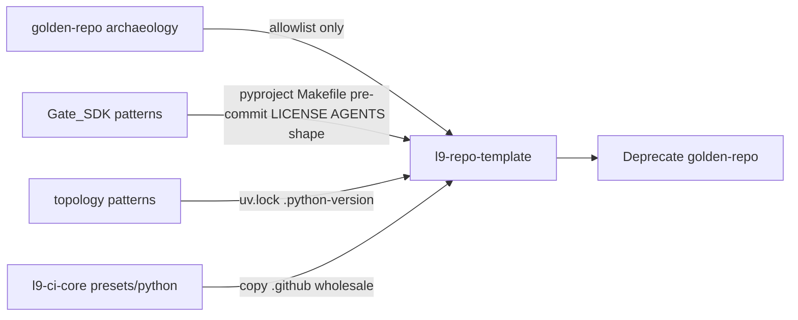

## PLAN: Open l9-repo-template museum (deprecate golden-repo)

### Objective
Turn [Quantum-L9/l9-repo-template](https://github.com/Quantum-L9/l9-repo-template) (currently only a stub `README.md`, `is_template: false`) into the **canonical thin Python repo skeleton** for bootstrapping new Quantum-L9 repos, so [cryptoxdog/golden-repo](https://github.com/cryptoxdog/golden-repo) can be deprecated.

**Success (falsifiable):**
1. `l9-repo-template` contains the Layer A root contract files + empty `src/l9_example_pkg/` + `tests/`, with placeholders documented.
2. CI is **only** the locked copy from `l9-ci-core/presets/python/.github` (analysis + lint-test + governance), pinned by full SHA — no Sonar/GitGuardian/PacketEnvelope CI from golden-repo.
3. Local gate works: `pre-commit run --all-files`, `make lint typecheck test` pass on the skeleton.
4. Repo is marked **GitHub Template** (`is_template: true`) and README documents “Use this template → rename package → fill AGENTS/ARCHITECTURE”.
5. golden-repo README has a deprecation banner pointing at `l9-repo-template`; archive follows after banner lands.

### Scope
**In:**
- Populate [Quantum-L9/l9-repo-template](https://github.com/Quantum-L9/l9-repo-template) as write target (clone outside Gate_SDK; Gate_SDK is planning/reference only).
- Thin Python skeleton (setuptools/uv, Python 3.12) — not a FastAPI/Neo4j engine.
- Selective harvest from golden-repo + L9-aligned transplants from Gate_SDK / topology / `l9-ci-core`.
- Bootstrap docs + minimal rename helper.
- Deprecate golden-repo (banner; archive as ops step).

**Out:**
- Migrating existing consumers (topology, Gate_SDK) onto the template.
- Porting golden-repo `engine/`, `chassis/`, `domains/`, Docker/VPS toolbox, Sonar, PacketEnvelope contracts.
- TypeScript preset (can be a later sibling; Core already has `presets/typescript`).
- Copier/cookiecutter (use GitHub Template + placeholders + rename script).
- Editing Gate_SDK product code (no golden-repo refs found there).

### Chosen defaults (locked for this plan)
- **Form factor:** GitHub Template repo with `l9_example_pkg` placeholders + `scripts/bootstrap_rename.py`.
- **Packaging:** `pyproject.toml` + `uv.lock` (match topology / modern L9), not Poetry.
- **Protocol stance in stubs:** TransportPacket / Gate-only language as *optional constellation notes* in `AGENTS.md` placeholders — never PacketEnvelope.
- **LOAD_PACK__REGISTRY.md:** minimal stub (empty pack index + activation rules) so the root surface exists without inventing domain packs.

### Pre-Validation (mandatory)
| Check | Command / action | Pass criteria |
|-------|------------------|---------------|
| P0 Target bind | Clone `Quantum-L9/l9-repo-template`; all writes only there | Single authorized target; Gate_SDK untouched |
| P1 Baseline inventory | Confirm remote has only stub README; record Core pin SHA from `presets/python` | Gap list complete |
| P2 Clean gate | N/A in Gate_SDK for this work | Skipped — different write root; use template-local gates after scaffold |
| P3 Source inventory | Diff allowlist/denylist below against golden-repo + Gate_SDK + Core | Harvest map approved before copy |

### Artifact routing (museum catalog)



**Allowlist from golden-repo (shape only — rewrite content):**
- `.gitignore` (merge with Gate_SDK ignores)
- `.editorconfig` if present / invent from topology
- Idea of `.l9-template-version` (bump to `2.0.0` for museum era)
- Generic env template *structure* (not APP_NAME/Neo4j vars) → becomes `.env.example`
- `CONTRIBUTING.md` brevity idea

**Deny list (do not copy):**
- `engine/`, `chassis/`, `domains/`, `client/`, `database/`, `deploy/`, `observability/`, `example_service/`
- `Dockerfile*`, `docker-compose*`, `sonar-project.properties`, `.semgrep/` engine rules tied to golden
- All golden `.github/workflows/*` (Sonar/GitGuardian/SLSA/numbered duplicates)
- `bootstrap.sh` ad-hoc git hooks, `tools/` Venture Forge toolbox
- PacketEnvelope contracts / CLAUDE.md 20-contract engine bible
- Poetry `pyproject.toml`, Python 3.11 pins

**Transplant SSOT (prefer these over golden):**
| File | Source |
|------|--------|
| `LICENSE` | Gate_SDK / topology proprietary text |
| `pyproject.toml` | Gate_SDK/topology shape; package `l9-example-pkg` |
| `.pre-commit-config.yaml` | Gate_SDK pattern (ruff + mypy on `src/`); pin revs to match Core consumer CI where possible |
| `Makefile` | Gate_SDK thin targets: `install-dev lint typecheck test` |
| `.github/**` | `l9-ci-core/presets/python/.github` verbatim, then set `SOURCE_DIR=src/` `TEST_DIR=tests/` in lint-test |
| `.python-version` | `3.12` |
| `AGENTS.md` / `ARCHITECTURE.md` | Structure from Gate_SDK; content = template placeholders + “fill before first real feature” |
| `CHANGELOG.md` | Keep a Changelog empty Unreleased |
| `.env.example` | Minimal L9 placeholders (`L9_ENVIRONMENT`, `L9_SERVICE_NAME`) — not Gate signing surface |

### TODO Plan
| # | Task | Files | Effort | Risk |
|---|------|-------|--------|------|
| T1 | Clone museum; enable Template repo flag after first green push | `l9-repo-template` remote settings | S | Low — `gh repo edit --template` |
| T2 | Root legal/docs stubs | `LICENSE`, `README.md`, `CHANGELOG.md`, `CONTRIBUTING.md`, `SECURITY.md` | M | Low |
| T3 | Packaging + empty package + smoke test | `pyproject.toml`, `.python-version`, `uv.lock`, `src/l9_example_pkg/__init__.py`, `tests/test_smoke.py` | M | Med — lockfile/tooling |
| T4 | Local quality surface | `.gitignore`, `.editorconfig`, `.pre-commit-config.yaml`, `Makefile`, `.env.example` | M | Low |
| T5 | Agent/architecture stubs (no PacketEnvelope) | `AGENTS.md`, `ARCHITECTURE.md`, `LOAD_PACK__REGISTRY.md`, `.l9-template-version` | M | Med — wrong protocol language |
| T6 | Wire Core python preset CI | `.github/governance/*`, `.github/workflows/l9-analysis.yml`, `.github/workflows/l9-lint-test.yml` | M | Med — must pin current Core SHA |
| T7 | Bootstrap UX | `README.md` (Use template steps), `scripts/bootstrap_rename.py`, `docs/BOOTSTRAP.md` | M | Low |
| T8 | Validate skeleton locally + CI on template repo | make/pre-commit; push triggers Actions | M | Med |
| T9 | Deprecate golden-repo | golden-repo `README.md` banner + archive | S | Low — needs cryptoxdog write access |
| T10 | Doc surface sync in museum after CI lands | museum `AGENTS.md` CI tables via `l9-update-agent-docs` | S | Low |

### Depth
- **Museum ≠ service clone.** Skeleton must pass CI with a trivial package so “Use this template” does not start red.
- **CI ownership stays in Core.** Template vendors a snapshot of the preset; README must say “to upgrade CI, re-copy from `l9-ci-core/presets/python` and bump `L9_CORE_REF`”.
- **Rename contract:** placeholders use `l9_example_pkg` / `l9-example-pkg` / `L9 Example Package`; `scripts/bootstrap_rename.py` rewrites those strings + directory name in one shot.
- **golden-repo deprecation is political + technical:** banner first (forward users), archive second (prevent new clones as default).

### Doc / Root Surface Impact (mandatory)
| Surface | Action | Files / notes |
|---------|--------|---------------|
| museum `README.md` | Update | T2, T7 — mission, bootstrap, CI upgrade, deprecation pointer |
| museum `AGENTS.md` | Update | T5, T10 — operating stub + post-CI metrics |
| museum `ARCHITECTURE.md` | Update | T5 — thin layout diagram only |
| museum `CHANGELOG.md` | Update | T2 — `[Unreleased]` Added skeleton |
| museum `LOAD_PACK__REGISTRY.md` | Update | T5 — empty index stub |
| museum `CLAUDE.md` | N/A | Do not ship engine CLAUDE from golden; AGENTS is SSOT |
| museum `INVARIANTS.md` | N/A | Not required for skeleton v1 |
| Gate_SDK roots | N/A | No golden-repo references; no consumer migration in scope |
| golden-repo `README.md` | Update | T9 — deprecation banner |

New roots in museum (`LICENSE`, `Makefile`, `.pre-commit-config.yaml`, etc.) are intentional template surface — document in museum README “root file inventory”.

### Dependencies
```text
T1 → T2 → T3 → T4 → T5 → T6 → T7 → T8 → T10 → T9
         └─────────────┘
```
T6 needs live Core SHA from current `presets/python` (do not reuse stale pins). T9 only after T8 green so deprecation points at a working museum.

### Milestones
| Milestone | Outcome | Unlocks |
|-----------|---------|---------|
| M1 Skeleton body | Root files + package + local make/pre-commit green | CI wiring |
| M2 Governed CI | Core preset copied + Actions green on museum | Bootstrap UX + Template flag |
| M3 Open museum | Template enabled; bootstrap docs complete | Deprecate golden |
| M4 Deprecate golden | Banner (+ archive) | Consumers stop forking golden |

### Checkpoints
| CP | After | Evidence required | No-go action |
|----|-------|-------------------|--------------|
| CP1 | M1 | `make lint typecheck test` + `pre-commit run --all-files` PASS | Fix packaging before CI |
| CP2 | M2 | GitHub Actions `l9-analysis` + `l9-lint-test` green on museum `main` | Fix Core pin / env; do not add golden CI |
| CP3 | M3 | `gh api repos/Quantum-L9/l9-repo-template --jq .is_template` → `true`; fresh “Use this template” smoke | Do not deprecate golden yet |
| CP4 | M4 | golden README banner live | Hold archive until banner merged |

### Checklist
- [ ] P0–P3 pre-validation recorded on execution
- [ ] Deny list never copied (T3–T6)
- [ ] Core preset only CI (T6)
- [ ] Placeholder package + smoke test (T3)
- [ ] Rename script + BOOTSTRAP docs (T7)
- [ ] Template flag enabled (T1/T8)
- [ ] Doc/root surfaces updated per table (T2/T5/T10/T9)
- [ ] Final Validation PASS; no commit/push unless user requests
- [ ] golden-repo deprecation banner (T9)

### Risks
| Risk | Mitigation |
|------|------------|
| Accidental PacketEnvelope / Poetry / Sonar bleed | Deny list + PR review checklist |
| Stale Core SHA | Always read current pin from `l9-ci-core/presets/python` at copy time |
| Template fails CI on empty package | Smoke test + lint-test `SOURCE_DIR`/`TEST_DIR` set |
| Deprecating golden before museum works | T9 gated on CP3 |
| Write access to cryptoxdog/golden-repo | Flag blocker; banner PR may need owner |

### Estimate
**Total:** ~1–2 focused sessions
**GMPs:** 1 primary GMP on `l9-repo-template`; optional small follow-up PR on golden-repo deprecation

### Final Validation (mandatory)
| Check | Command | Pass criteria |
|-------|---------|---------------|
| V1 Plan completeness | This plan vs l9-plan template | All required sections present |
| V2 Skeleton quality | In museum: `make lint typecheck test` + `pre-commit run --all-files` | PASS |
| V3 CI | Actions on museum `main` for analysis + lint-test | Green |
| V4 Template flag | `is_template == true` | PASS |
| V5 Protocol hygiene | `rg -i 'PacketEnvelope\|poetry\|sonar'` in museum | No hits (except historical notes if any — prefer zero) |
| V6 Doc surface | README/AGENTS/ARCHITECTURE/CHANGELOG/LOAD_PACK present and coherent | PASS |
| V7 Honesty | Report only checks run | Passed/Failed/Skipped labeled |

### Recommend (post-approval)
Chain **`l9-gmp-protocol`** (or Agent mode GMP) against a fresh clone of `Quantum-L9/l9-repo-template` for M1–M3; then a separate small change for golden-repo T9. Use **`l9-update-agent-docs`** after CI lands (T10). Do not implement from this planning session until you confirm the plan.
