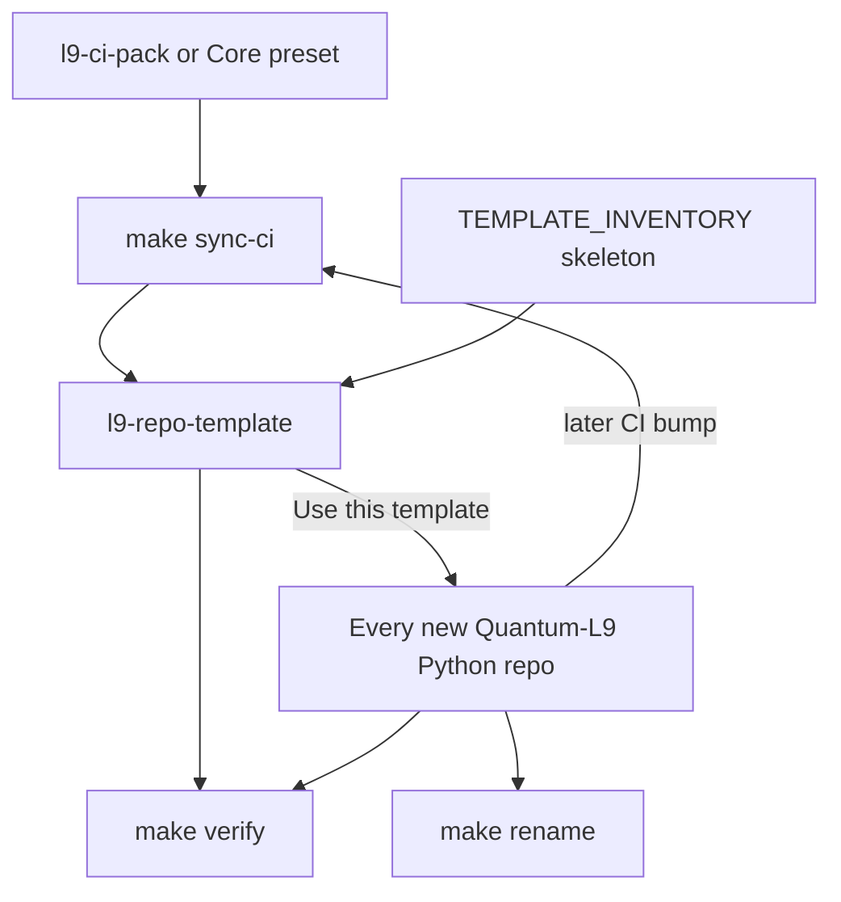

## PLAN: l9-repo-template museum (Leverage + Improve)

### Kernel status
- **Improve:** applied — hygiene, CI gaps, anti-sprawl, no decorative LOAD_PACK.
- **Leverage:** applied — collapse work into compounding automations; cut one-shot ceremony.
- Mode: plan iteration only until you approve execution.

### Objective
Open [Quantum-L9/l9-repo-template](https://github.com/Quantum-L9/l9-repo-template) as the **only** Python bootstrap path for new Quantum-L9 repos, with **minimum authoring** and **maximum downstream reuse**, so [cryptoxdog/golden-repo](https://github.com/cryptoxdog/golden-repo) can be deprecated.

**Success (falsifiable):**
1. Three durable automations exist and are tested: `make verify`, `make sync-ci`, `make rename PKG=…`.
2. Museum is green locally + on Actions (analysis + lint-test only from org pack/Core).
3. `is_template: true` after green; throwaway “Use this template” repo passes `make rename` + `make verify`.
4. Any future CI upgrade is `make sync-ci` (re-pin + re-copy) — not hand-editing workflows.
5. golden-repo banner points here; archive after banner.

### Leverage thesis (minimum work → maximum results)

| Investment (once) | Downstream payoff (every new repo / every CI bump) |
|-------------------|-----------------------------------------------------|
| `scripts/sync_ci_from_pack.py` + `.l9/ci-pin` | Deterministic CI attach/upgrade for museum **and** consumers |
| `scripts/bootstrap_rename.py` + test | Zero hand search-replace when forking template |
| `make verify` (= inventory + pre-commit + lint + typecheck + test) | Single agent/human gate; same command forever |
| `TEMPLATE_INVENTORY.md` (allowed roots + deny dirs) | Stops golden-style sprawl without review essays |
| Thin generic `AGENTS.md` | Safe default for any Python repo; no protocol contamination |

**Cut (low leverage / entropy):**
- Hand-maintaining CI YAML without a sync script
- `LOAD_PACK__REGISTRY.md` before packs exist
- Baking TransportPacket/Gate laws into template AGENTS
- Verbose community health (point at org [Quantum-L9/.github](https://github.com/Quantum-L9/.github))
- Separate provenance doc if inventory has a Source column
- Constellation notes file in v1
- Separate docs-refresh milestone — fold one AGENTS CI table update into L5 after first green run

### Scope
**In:** Museum clone only; thin Python skeleton; org `l9-ci-pack` (fallback Core `presets/python`); three automations; Template flag; golden deprecation.

**Out:** Migrating living repos; golden engine/Docker/Sonar/PacketEnvelope; TypeScript preset; copier; inventing new CI kernels; Gate_SDK edits.

### Locked defaults
- Packaging: setuptools + `uv.lock`, Python 3.12, package `l9_example_pkg`
- CI source order: [l9-ci-pack](https://github.com/Quantum-L9/.github/tree/main/l9-ci-pack) → else `l9-ci-core/presets/python`
- Pin: re-read at execution into `.l9/ci-pin` (never `@main`; never trust plan-stale SHAs alone)
- Lint env: `SOURCE_DIR=.`, `TEST_DIR=tests/`, `COVERAGE_THRESHOLD=0`
- Vendor `requirements-consumer-ci.txt` from Core via sync-ci
- Deny dirs: `engine/`, `chassis/`, `domains/`, `client/`, `database/`, `deploy/`, `observability/`, `example_service/`, golden `tools/`

### Pre-Validation
| Check | Action | Pass |
|-------|--------|------|
| P0 | Clone museum; Gate_SDK not write root | Bound |
| P1 | Stub README only; capture live pack/Core SHA | Pin frozen |
| P2 | Gate_SDK `make pr-check` | Skipped (wrong root) |
| P3 | Push access to Quantum-L9/l9-repo-template | Required |
| P4 | cryptoxdog/golden-repo write | Unknown — blocks archive only |

### Force-multiplier design

**`make sync-ci`:** read `.l9/ci-pin` → fetch pack at SHA → write governance + workflows + `requirements-consumer-ci.txt` → patch lint-test `env:` only → fail on non-40-char pin or deny-list workflows.

**`make verify`:** `inventory-check` → pre-commit → lint → typecheck → test (incl. rename unit test).

**`make rename PKG=foo_bar`:** rewrite placeholder names/paths; `--dry-run`; tested in temp dir.

### Skeleton (one L2 pass)
Materialize inventory paths only: LICENSE, README, CHANGELOG, thin CONTRIBUTING/SECURITY, pyproject/uv.lock/.python-version, package + smoke test, gitignore/editorconfig/gitattributes, pre-commit, Makefile, .env.example, generic AGENTS/ARCHITECTURE, `.l9-template-version`, `TEMPLATE_INVENTORY.md`, `.l9/ci-pin`, scripts+tests. **`.github/**` only via sync-ci.**

### Execution todos
1. **L1** — Clone; freeze pin into `.l9/ci-pin`
2. **L2** — Materialize skeleton from inventory
3. **L3** — Ship `make verify` + sync-ci + rename (+tests)
4. **L4** — First `make sync-ci`; lint env locked
5. **L5** — `make verify` + Actions green → `gh repo edit --template`; fold AGENTS CI table
6. **L6** — CP3 throwaway smoke → golden deprecation banner → archive

### Checkpoints
| CP | Evidence | No-go |
|----|----------|-------|
| CP1 | `make verify` PASS | No push |
| CP2 | Actions green | No Template flag |
| CP3 | Throwaway rename+verify PASS | No golden banner |
| CP4 | golden banner live | Hold archive if no write access |

### Doc / Root Surface Impact
| Surface | Action |
|---------|--------|
| README | Operator surface — three commands only |
| AGENTS | Generic stub; short CI table after CP2 |
| ARCHITECTURE | Thin layout + sync-ci ownership |
| TEMPLATE_INVENTORY | SSOT roots + Source column |
| CHANGELOG | Unreleased |
| LOAD_PACK / CLAUDE / constellation notes | N/A v1 |
| Gate_SDK | N/A |
| golden README | L6 banner |

### Risks
| Risk | Mitigation |
|------|------------|
| sync-ci over-built | stdlib/`gh` only |
| Pin drift | refuse `@main`/short SHA |
| Sprawl | inventory-check inside verify |
| Golden access | museum success independent of L6 archive |

### Final Validation
V1 `make verify` PASS · V2 Actions green · V3 `is_template` · V4 no PacketEnvelope/poetry/sonar · V5 sync-ci idempotent · V6 CP3 PASS · V7 honest Skipped/Unknown labels

### Recommend
Execute **L1–L5** on a museum clone after approval; **L6** after CP3. Never hand-edit workflows except through `make sync-ci`.
