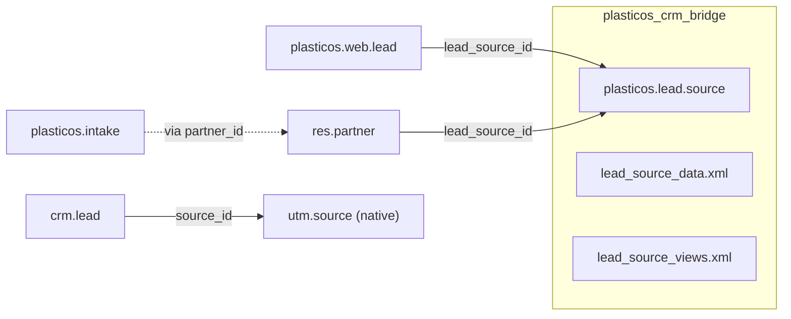

# Lead Source Architecture Cleanup

## Current State

| Model | Field | Type | Status |
|-------|-------|------|--------|
| `plasticos.web.lead` | `lead_source_id` | Many2one → `plasticos.lead.source` | Correct |
| `crm.lead` | `source_id` | Many2one → `utm.source` (native) | Correct (use native) |
| `res.partner` | `lead_source_id` | Many2one → `plasticos.lead.source` | Correct |
| `plasticos.intake` | `lead_source` | Selection (old pattern) | **Remove** |

## Target State



## Changes

### 1. Move `plasticos.lead.source` to `plasticos_crm_bridge`

**From:** [plasticos_facility_profile/models/lead_source.py](plasticos_facility_profile/models/lead_source.py)

**To:** `plasticos_crm_bridge/models/lead_source.py`

Files to move:
- `plasticos_facility_profile/models/lead_source.py` → `plasticos_crm_bridge/models/lead_source.py`
- `plasticos_facility_profile/data/lead_source_data.xml` → `plasticos_crm_bridge/data/lead_source_data.xml` (merge with existing)
- `plasticos_facility_profile/views/lead_source_views.xml` → `plasticos_crm_bridge/views/lead_source_views.xml`

Update `__init__.py` in both modules.

### 2. Update `plasticos_crm_bridge/__manifest__.py`

Add:
- `views/lead_source_views.xml` to data
- `security/ir.model.access.csv` entry for `plasticos.lead.source`

Remove dependency on `plasticos_facility_profile` for lead source (if any).

### 3. Update `plasticos_facility_profile`

- Remove `lead_source.py` from models
- Remove `lead_source_data.xml` from data
- Remove `lead_source_views.xml` from views
- Update `__manifest__.py` to remove these files
- Update `models/__init__.py` to remove import
- Add dependency on `plasticos_crm_bridge` (for `lead_source_id` on `res.partner`)

### 4. Remove `lead_source` from `plasticos.intake`

In [plasticos_intake/models/intake.py](plasticos_intake/models/intake.py):

**Remove:**
- Lines 66-82: `lead_source` Selection field and `_get_lead_source_selection` method
- Lines 497-510: `_onchange_lead_source` method
- Lines 769-772: `lead_source` assignment in partner creation

**Add (optional):** Related field for convenience:
```python
lead_source_id = fields.Many2one(
    related="partner_id.lead_source_id",
    string="Lead Source",
    readonly=True,
    store=False,
)
```

### 5. Update `plasticos_web_leads` dependency

In [plasticos_web_leads/__manifest__.py](plasticos_web_leads/__manifest__.py):

Change dependency from `plasticos_facility_profile` to `plasticos_crm_bridge` for the `plasticos.lead.source` model.

### 6. Delete obsolete files

- `plasticos_facility_profile/lead_source_enum.py` (if exists - referenced in intake.py import)

### 7. Update CRM bridge data file

Merge the duplicate `utm.source` record in [plasticos_crm_bridge/data/lead_source_data.xml](plasticos_crm_bridge/data/lead_source_data.xml) with the full `plasticos.lead.source` data from facility_profile.
