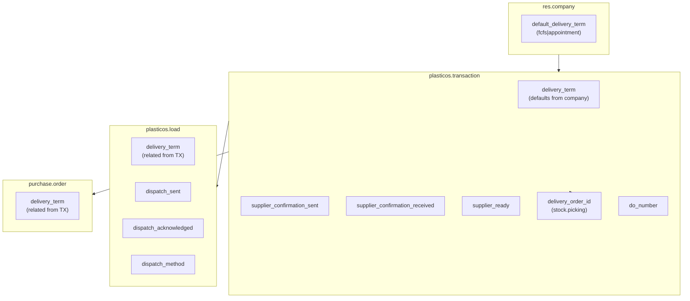

# Logistics Module Enhancement Plan

## Scope

Extend the logistics module with:

1. Company-level default delivery term (FCFS/Appointment)
2. Dispatch tracking fields on `plasticos.load`
3. Supplier confirmation tracking on `plasticos.transaction`
4. PO→DO workflow support (delivery_order_id linkage)
5. Three new cron jobs for automation

## Architecture




## Files to Modify/Create

### Phase 1: Company Default (plasticos_base)

**New file:** [plasticos_base/models/res_company.py](plasticos_base/models/res_company.py)

```python
from odoo import fields, models

class ResCompany(models.Model):
    _inherit = "res.company"

    default_delivery_term = fields.Selection(
        [("fcfs", "FCFS"), ("appointment", "Appointment")],
        string="Default Delivery Term",
        default="fcfs",
    )
```

**Modify:** [plasticos_base/models/**init**.py](plasticos_base/models/__init__.py) - add import

**New file:** [plasticos_base/views/res_company_views.xml](plasticos_base/views/res_company_views.xml) - settings UI

### Phase 2: Transaction Fields (plasticos_transaction)

**Modify:** [plasticos_transaction/models/transaction.py](plasticos_transaction/models/transaction.py)

- Change `delivery_term` default from `"fcfs"` to `lambda self: self.env.company.default_delivery_term or "fcfs"`
- Add fields:
  - `supplier_confirmation_sent` (Datetime)
  - `supplier_confirmation_received` (Datetime)
  - `supplier_ready` (Boolean, computed from confirmation_received)
  - `delivery_order_id` (Many2one: stock.picking)
  - `do_number` (Char, related to delivery_order_id.name)

### Phase 3: Load Fields (plasticos_logistics)

**Modify:** [plasticos_logistics/models/load.py](plasticos_logistics/models/load.py)

- Add fields:
  - `delivery_term` (Selection, related from transaction_id.delivery_term)
  - `dispatch_sent` (Datetime)
  - `dispatch_acknowledged` (Datetime)
  - `dispatch_method` (Selection: email/sms/api/email_sms)

### Phase 4: Purchase Order Extension (plasticos_transaction)

**Modify:** [plasticos_transaction/models/purchase_inherit.py](plasticos_transaction/models/purchase_inherit.py)

- Add `delivery_term` field (related from transaction via origin lookup or direct link)

### Phase 5: Cron Jobs (plasticos_logistics)

**Modify:** [plasticos_logistics/data/cron.xml](plasticos_logistics/data/cron.xml)

Add three crons:

1. `cron_dispatch_acknowledgment` - Check for missing acknowledgments (4h interval)
2. `cron_supplier_confirmation` - Follow up on supplier confirmations (6h interval)
3. `cron_auto_create_do` - Auto-create DOs for ready transactions (1h interval)

**Modify:** [plasticos_logistics/models/load.py](plasticos_logistics/models/load.py)

- Add `_cron_check_dispatch_acknowledgments()` method

**Modify:** [plasticos_transaction/models/transaction.py](plasticos_transaction/models/transaction.py)

- Add `_cron_supplier_confirmation_followup()` method
- Add `_cron_auto_create_delivery_orders()` method

### Phase 6: Views

**Modify:** [plasticos_logistics/views/load_views.xml](plasticos_logistics/views/load_views.xml)

- Add dispatch tracking fields to form view

**Modify:** [plasticos_transaction/views/transaction_views.xml](plasticos_transaction/views/transaction_views.xml)

- Add supplier confirmation fields
- Add delivery_order_id / do_number fields

## Validation Checklist

- Module loads without error (docker-compose test)
- Company settings show default_delivery_term field
- New transaction inherits company default
- Transaction delivery_term can be overridden
- Load shows related delivery_term (read-only)
- Dispatch tracking fields visible on load form
- Supplier confirmation fields visible on transaction form
- All 3 new crons appear in Settings > Technical > Scheduled Actions
- Pre-commit hooks pass
- CI passes

## Risk Mitigation


| Risk                                  | Mitigation                                     |
| ------------------------------------- | ---------------------------------------------- |
| Breaking existing delivery_term usage | Keep field name, only change default mechanism |
| Circular dependency                   | Company field in plasticos_base (lowest level) |
| Cron failures                         | Use try/except with logging, advisory locks    |
| stock.picking dependency              | Already in plasticos_logistics depends         |


