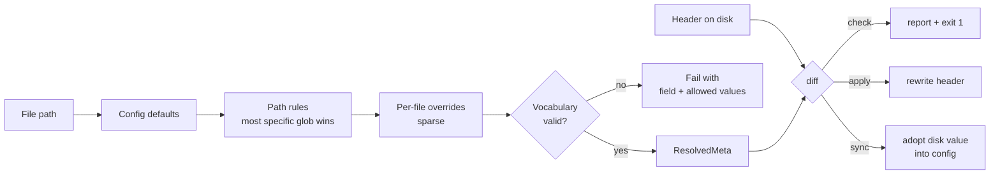

# Revise the L9_META injection pipeline

## Problem

[tools/l9_meta_injector.py](tools/l9_meta_injector.py) has three independent failures that compound:

1. **Data corruption, latent.** `format_comment_block` (line 892) and `format_python_docstring_block` (line 916) are stubs returning a single empty string. Running `--apply` today replaces the metadata in every YAML, Python, shell, and Makefile header with a blank line — 312 of 370 headered files. Only the Markdown, JSON, and TOML formatters are intact.

2. **Registry drift.** The hardcoded `FILE_REGISTRY` (line 45, ~830 lines) declares 245 files. Disk has 605 eligible files. 10 registry paths point at deleted files; 155 files carry a valid header the registry has never heard of; 237 files have no header at all. Hand-enumeration failed and will fail again.

3. **Tags carry no signal.** 188 unique tags across 245 entries, 112 used exactly once. Most restate the `layer` or the directory. `owner` is a pure function of `origin` in all 245 entries (`l9-template`→`platform`, `engine-specific`→`engine-team`, `chassis`→`platform-team`, `domain-specific`→`domain-team`) — zero independent information.

## Design

Split into a portable engine and a per-repo config. The engine never knows about CEG; the config is the only repo-specific artifact.

```
tools/l9_meta/            # repo-agnostic package
  __init__.py
  model.py                # MetaRecord, ResolvedMeta, schema v1/v2
  config.py               # load + validate l9-meta.yaml
  vocab.py                # allowlists, facet rules
  resolve.py              # defaults -> path rules -> overrides
  parse.py                # read existing headers (all variants, v1 + v2)
  formats/                # one module per filetype: emit + strip + inject
  commands/               # check, apply, sync, report, explain, init
  cli.py
tools/l9_meta_injector.py # thin shim -> tools.l9_meta.cli (keeps existing docs/CI refs working)
l9-meta.yaml              # per-repo config: vocabulary + rules + overrides
```

**Resolution** — `origin`/`layer` come from path rules (measured: 90% and 72% of 2-level dirs are already uniform), overrides cover the rest:



**Config shape** (`l9-meta.yaml`):

```yaml
l9_schema: 2
engine: graph
include: ["**/*.py", "**/*.md", "**/*.yaml", "**/*.yml", "**/*.json",
          "**/*.toml", "**/*.sh", "**/*.tf", "Makefile", "Dockerfile*"]
ignore:  ["artifacts/**", ".venv/**", "node_modules/**", "**/*.lock.json"]

vocabulary:
  origin: [l9-template, engine-specific, chassis, domain-specific]
  layer:  [api, engine, gates, scoring, traversal, compliance, meta, governance, docs, tests, infra]
  status: [active, deprecated, experimental]
  tags:
    family:     { cardinality: 1,    values: {L9_TEMPLATE: {origin: l9-template}, CEG_ENGINE: {origin: engine-specific}} }
    capability: { cardinality: 1,    min_files: 5, values: [gates, scoring, chassis, audit, domains, packet, graph] }
    concern:    { cardinality: "0..1", values: [security, cypher, privacy, performance] }

rules:
  - path: "engine/gates/**"   { origin: engine-specific, layer: [gates],  tags: [CEG_ENGINE, gates] }
  - path: "chassis/**"        { origin: chassis,         layer: [api],    tags: [L9_TEMPLATE, chassis] }
  # ~40 rules replace 245 enumerated entries

overrides:
  "engine/gates/compliance_guard.py": { layer: [compliance], tags: [CEG_ENGINE, gates, security] }
```

**Commands:** `check` (CI default, exit 1 on drift), `apply`, `sync --adopt` (bootstrap config from headers on disk), `report` (coverage + tag census + ghosts), `explain <path>` (which rule/override produced each field), `init` (scaffold config in a new repo).

## Phases

### Phase 0 — Safety net before touching anything
Golden fixtures under `tests/fixtures/l9_meta/` covering: Python with docstring, Python with shebang + docstring, Python with no docstring, YAML with `---` separator, Markdown, JSON object, JSON array, TOML, Makefile, shell with shebang, and the 3 malformed headers found on disk. Assert `parse(format(x)) == x` round-trip and idempotency (`apply` twice = `apply` once). These must exist and pass before any formatter change lands.

### Phase 1 — Restore formatters + write the parser
Fix the two stubs to mirror `format_html_comment` (line 900). Extract `formats/` modules. Write `parse.py` handling all four variants found on disk: `# --- L9_META ---` (81 files), `--- L9_META ---` bare/docstring (231), `<!-- L9_META` (53), plus JSON `_l9_meta` and TOML `[tool.l9_meta]`. Parser accepts v1 and v2; writer emits v2 only.

### Phase 2 — Config + resolver, bootstrap from disk
Build `config.py` / `resolve.py`. Run `sync --adopt` to generate `l9-meta.yaml` from the 370 existing headers plus the 245 registry entries, collapsing repeated values into path rules and emitting only genuine exceptions as overrides. Delete `FILE_REGISTRY` and the 10 ghost paths. Review the generated rule set by hand — this is the one step where human judgment matters most.

### Phase 3 — Tag facet model
Generate a proposed mapping from the 188 existing tags to the facet vocabulary, drop tags used under the `min_files` floor, and fold tags that merely restate `layer`. Review, then bake into `vocabulary`. `check` rejects any tag outside the allowlist or violating facet cardinality.

### Phase 4 — Schema v2
Drop `owner` from the emitted header. Update [contracts/contract_18.yaml](contracts/contract_18.yaml) postcondition from `schema v1` to `schema v2`, and widen its `scope.paths` beyond `engine/**` + `chassis/**` to match the config's `include`.

### Phase 5 — Full stamp
`apply` across all 605 eligible files: 368 rewritten to v2 with facet tags, 237 stamped for the first time. One commit, no logic changes mixed in. Verify with `check` returning clean and `git diff --stat` matching the expected file count.

### Phase 6 — Enforcement + docs
Add a `l9-meta-check` hook to [.pre-commit-config.yaml](.pre-commit-config.yaml) alongside the existing `l9-contract-scan` (line 85), and a CI step. Update the reference in [docs/TROUBLESHOOTING.md](docs/TROUBLESHOOTING.md) (line 351), [docs/AI_AGENT_REVIEW_CHECKLIST.md](docs/AI_AGENT_REVIEW_CHECKLIST.md) (line 104), [.claude/rules/contracts.md](.claude/rules/contracts.md) (line 47), [.claude/skills/pr-workflow/SKILL.md](.claude/skills/pr-workflow/SKILL.md) (line 20), [.cursorrules](.cursorrules) (line 291), and [agents/cursor/cursor_workflow_kernel.yaml](agents/cursor/cursor_workflow_kernel.yaml) (line 295).

## Risks

- **Python docstring injection is destructive by design.** `_inject_python_meta` (line 1029) discards any content between the shebang and the first docstring — the comment reads "Don't preserve orphaned comments before docstring (they're usually stale paths)". Across 227 unregistered `.py` files that assumption is untested. Phase 0 fixtures must cover it; consider making the discard opt-in.
- **JSON injection reformats the whole file.** Line 1101 does `json.dumps(data, indent=2)`, rewriting formatting for every JSON file it touches. Recommend excluding JSON from the default `include` unless you want the reformat.
- **TOML appends at end of file** (line 1107) — verify against `pyproject.toml` specifically before the mass stamp.
- **Mass rewrite of 605 files** lands as one commit. It is fully revertible via git, and `check` gives a clean before/after signal.