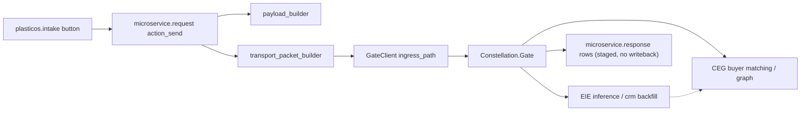

# Integrate plasticos_microservice_bridge into the repo (PR to Staging)

## Scope decisions (confirmed)
- Payload field mapping: map to REAL `plasticos.intake` fields now (functional payloads).
- ADR relocation (`reports/adr` -> `docs/adr`): OUT OF SCOPE for this PR.

## Governance precondition (do first)
New module + Gate integration = "Ask First" per `AGENTS.md` and `docs/adr/ADR-002-gate-hub-phased-autonomy.md`. The bridge is architecturally compliant (Odoo -> Gate only; never calls CEG/EIE directly), but confirm it fits the ADR-002 phase scope before landing. No edit to ADRs in this PR.

## Source of truth
Canonical source = `Current Work - IGNORE/plasticos_microservice_bridge - improved`. Discard the non-improved copy. Drop `.DS_Store` and `__pycache__/`.

---

## Phase 0 - Placement and branch
- Create `plasticos_microservice_bridge/` at repo root (sibling of other `plasticos_*` modules), copying the improved tree only (no `.DS_Store`, no `__pycache__`).
- Branch from `Staging`: `feat/microservice-bridge`.

## Phase 1 - Hard CI blockers (these fail `make pr-check`)

1. Root `__init__.py` imports nothing. Add (matches `plasticos_intake/__init__.py`):
```python
from . import models
from . import services
```

2. `<tree>` -> `<list>` and `view_mode` fixes:
- `views/microservice_request_views.xml`: lines 16/25 (`<tree>`...`</tree>`), nested o2m lines 51/52/60 (`mode="tree,form"` -> `mode="list,form"`, `<tree>` -> `<list>`), action line 79 `view_mode tree,form` -> `list,form`.
- `views/microservice_response_views.xml`: lines 17/28 (`<tree>` -> `<list>`), action line 76 `view_mode` -> `list,form`.
- `models/intake_extension.py`: lines 97 and 118 `"view_mode": "tree,form"` -> `"list,form"`.

3. `attrs="{...}"` on buttons (CI #19 hard reject) in `views/microservice_response_views.xml` lines 58/61/64 -> Odoo 19 direct expressions:
```xml
<button name="action_accept" string="Accept" type="object" class="btn-primary"
        invisible="accepted or result_type == 'error'"/>
<button name="action_reject" string="Reject" type="object" class="btn-secondary"
        invisible="accepted"/>
<button name="action_apply" string="Apply" type="object" class="btn-success"
        invisible="not accepted or applied"/>
```

4. Manifest `depends` order violates layer ordering (`plasticos_security_base` before `plasticos_base`). Reorder in `__manifest__.py`:
```python
"depends": [
    "base",
    "mail",
    "plasticos_base",
    "plasticos_security_base",
    "plasticos_intake",
    "plasticos_material_profile",
    "plasticos_facility_profile",
],
```
(See Phase 4 for trimming unused deps.)

## Phase 2 - Correctness: intake field mapping (silently-empty payloads)
`services/payload_builder.py` reads fields that do not exist on `plasticos.intake`. Real fields (verified): `polymer_id`, `form_id`, `color_id`, `material_profile_id`, `quantity_per_load_lbs`, `grade_hint`, `contamination_pct`, `contamination_notes`, `facility_id` (comodel `res.partner`). Material sub-models expose `name` + `code`; `material_profile_id` exposes `display_name`.

- `build_inference_payload`: replace getattr names with real relations:
  - `polymer` -> `intake.polymer_id.name`, plus `polymer_code` -> `intake.polymer_id.code`
  - `form` -> `intake.form_id.name`
  - `color` -> `intake.color_id.name`
  - `material_description` -> `intake.material_profile_id.display_name or intake.name`
  - `contamination_flags` -> `contamination_pct` (`intake.contamination_pct`) + `contamination_notes` (`intake.contamination_notes`)
  - `estimated_lbs` -> `intake.quantity_per_load_lbs`
  - Guard empty recordsets (`.name` on empty M2O returns False -> filtered by the existing None-strip; convert False to None).
- `build_matching_payload`:
  - `quantity_lbs` -> `intake.quantity_per_load_lbs`
  - `material_type` -> `intake.polymer_id.name or intake.material_profile_id.display_name`
  - geo: `facility_id` is a `res.partner`; map `location_lat/lon` to `facility_id.partner_latitude` / `facility_id.partner_longitude`. Verify geo source module (likely `base_geolocalize` via `plasticos_geolocalize`); if `partner_latitude` is not resolvable from current deps, either add the providing module to `depends` or keep geo optional (already None-guarded). Geo is not a blocker.
- `services/transport_packet_builder.py` line 109: `datetime.utcnow()` is deprecated in 3.12 -> `datetime.now(timezone.utc)`.

## Phase 3 - Tests
- `tests/test_payload_builder.py` `DummyIntake` uses the wrong field names (`polymer`, `estimated_lbs`, ...). Update the fixture to the real field shape (M2O stand-ins exposing `.name`/`.code`, `quantity_per_load_lbs`, `material_profile_id.display_name`, `contamination_pct/notes`).
- Import path / tier issue: tests do `from plasticos_microservice_bridge.services import ...` and `payload_builder` imports `from odoo import ...` at module top, which breaks the pure-python pytest tier. Resolve by either:
  - (a) Convert the 4 test files to Odoo `TransactionCase` under the module `tests/` with proper `@tagged`, creating real intake fixtures in `setUpClass` (aligns with repo test policy, runs in the Odoo runtime tier), OR
  - (b) Keep them as pure-unit tests and remove the top-level `from odoo import api, models` in `payload_builder.py`/`response_parser.py` (only used for type hints -> use `from __future__ import annotations` + string/`Any` hints) and fix the import path.
  - Recommendation: (a) for the model/flow tests, (b) for `transport_packet_builder`/`response_parser` (pure functions, no Odoo needed).

## Phase 4 - Conventions and polish
- Menu parent: `views/microservice_request_views.xml` line 97 and `views/microservice_response_views.xml` line 91 use `parent="base.menu_custom"` (not used anywhere in repo). Reparent to the real root `plasticos_base.plasticos_root_menu` (defined in `plasticos_base/views/menu.xml`).
- ACL groups: `security/ir.model.access.csv` uses `base.group_user` / `base.group_system`. Consider aligning to `plasticos_security_base` roles to match the rest of the suite (optional; confirm against a sibling ACL). Keep id format consistent (`access_*`, no module prefix) as already done.
- Trim unused deps: `plasticos_buyer_match_engine` appears unused (matching is via Gate, geo via partner); remove unless a concrete reference exists. Re-check after Phase 2 whether `plasticos_facility_profile` is still needed (facility is a `res.partner`). Keep `plasticos_material_profile` (traversed relations).
- `widget="json"` (request/response forms): verify it exists in Odoo 19 CE; if not, fall back to `widget="ace"` or plain readonly text.

## Phase 5 - Validation and push
Run in order, fix until green:
```bash
ruff check --fix . && ruff format .
python3 scripts/check_module_wiring.py
python3 ci/check_circular_deps.py
python3 ci/check_odoo19_xml.py
pre-commit run --all-files
make pr-check
```
Local install smoke (if Docker available): `make update m=plasticos_microservice_bridge`. Then:
```bash
make push b=feat/microservice-bridge   # runs pr-check then git push
```
Open PR targeting `Staging` (never Production). Use API push ONLY if `git push` crashes with the Dropbox mmap error after pr-check already passed.

## Mermaid - runtime flow (architecture-law compliance)


## Confidence and risks
- Blockers (init, tree/list, attrs, depends order, field mapping): HIGH confidence - verified by reading files and the real intake model.
- MEDIUM: geo field source module, `widget="json"` availability in Odoo 19 CE, and which pytest tier the module tests land in. These are flagged for verification during implementation, not assumptions baked into the plan.
- This PR keeps writeback disabled (staging only), matching the module's Phase 1 posture and ADR-002.