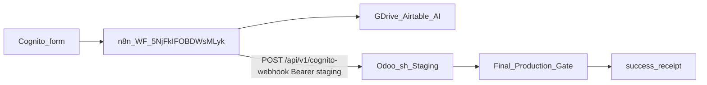

# PLAN: n8n Odoo staging wire

> **SSOT template:** [.cursor/plans/_TEMPLATE.plan.md](.cursor/plans/_TEMPLATE.plan.md) · canonical [environment/contracts/execution/templates/canonical.template.executable_plan.v1.plan.md](environment/contracts/execution/templates/canonical.template.executable_plan.v1.plan.md)
> **Schema:** `canonical.schema.plan_document.v1` — status starts `draft` / `preflight_blocked` until staging host + baseline law hold → then `executable`
> **Execute:** [@environment/program-execution](environment/program-execution/) → Program Lock/Controller → [@autonomy](commands/autonomy.md) / `l9-bounded-autonomy` under Program lease. Do not free-form mutate from markdown alone.
> **Rename on promote:** `n8n_odoo_staging_wire_<8hex>.plan.md`

## Structured-reasoning decisions (ambiguity closed)

| Ambiguity | Decision | Evidence / rationale |
|-----------|----------|----------------------|
| Prod vs staging primary | **Staging-only** for this workstream | Operator: production is formality; remaining work is on Staging |
| Separate workflow vs retarget | **Retarget Odoo hop** on live WF `5NjFkIFOBDWsMLyk` to Staging URL; keep Cognito→n8n webhook | Same form pipeline; only Odoo destination changes; avoids dual Cognito wiring |
| Inline Bearer vs credential | **Named staging credential** + remove inline `Authorization` header | n8n public API forbids updating old `Odoo API` id; plaintext header is residual debt from prior fix |
| AWS secret shape | Upsert `openclaw-igorbot/odoo-web-lead` (+ `l9/ODOO_WEB_LEAD_API_KEY`) for **staging** `api_url`/`api_key` | Registry already lists refs; values never in git |
| Staging host | **Blocking preflight** until `…-staging-36097692.dev.odoo.com` (or refreshed build id) answers HTTPS | Probe 2026-08-12: connect fail; `.env.local` has new build id vs prior `32727906` |
| Normalizer | **Keep** `decodePossiblyBufferedJson` on publish | Exec 71050 proved stream-body recovery; staging will hit same n8n HTTP quirk |
| Repo baseline | Cut dedicated branch from clean HEAD; **do not** mutate atop dirty `feat/scratch-hold-never-lose` | Current tree dirty with unrelated worktree/registry churn |
| Cognito | Leave Cognito→n8n webhook unchanged | Out of scope unless staging needs a separate form |

## Execute via PE + autonomy (required)

Authority: `this .plan.md` → Program Execution Controller (lease) → root `@autonomy` packet (subordinate) → adapter `cursor-foreground` (interactive n8n/AWS/SSH ops).

| Plan section | PE artifact |
|--------------|-------------|
| metadata / objective | `PROGRAM.yaml` `pes-n8n-odoo-staging-wire` |
| immutable_baseline | `CURRENT_STATE_DELTA` + exact SHA |
| envelope + architecture | Task Card ceilings |
| todos / DAG | `DEPENDENCY_GRAPH.yaml` + `TASK_CARDS.yaml` + `EXECUTION_WAVES.yaml` |
| preflight | Controller reconcile + probes |
| property matrix | Task Card `validation` |
| rollback / convergence | Task Card rollback + `CONVERGENCE_GATES.yaml` + Handoff Receipt |

**Campaign packet (fill at execute):** `authority: A4_CAMPAIGN_BOUNDED_EXTERNAL_WRITE`, `autonomous_merge: false`, `adapter_id: cursor-foreground`, `declared_branches: [fix/n8n-odoo-staging-wire]`, forbid secret commits / force-push / widen ceilings / outlive Program lease.

## Metadata

| Field | Value |
|-------|-------|
| plan_id | `plan.ops.n8n_odoo_staging_wire.v1` |
| plan_class | `integration_plan` |
| status | `preflight_blocked` until CP-STAGING-UP passes |
| redesign_allowed | `false` |
| owner | igor_beylin |
| created_at | `2026-08-12` |

## Immutable baseline (capture at execute W0)

| Field | Value |
|-------|-------|
| repository | `Quantum-L9/Cursor-Governance` |
| workspace | `/Users/ib-mac/Cursor-Governance` |
| branch | `fix/n8n-odoo-staging-wire` (cut clean; not current dirty branch) |
| commit_sha | lock full 40-char SHA at W0 (`git rev-parse HEAD`) — planning probe saw `61c1806f…` on dirty `feat/scratch-hold-never-lose` |
| dirty | must be `false` on write_allow overlap at execute |
| overlap_policy | `stop_if_dirty_overlaps_may_modify` |
| on_drift | `stop_and_replan` |
| external SSOT | n8n WF `5NjFkIFOBDWsMLyk` versionId + Odoo Staging build id in receipt |

## Objective / success properties

**Mission:** Make Cognito→n8n→**Staging Odoo** the authoritative lead path for ongoing work: staging API key + URL wired without inline secrets, normalizer retained, one green webhook execution, AWS/registry inventory aligned. Production Odoo is out of critical path (formality only).

| id | property | evidence_type | proof | blocking |
|----|----------|---------------|-------|----------|
| SP-01 | Baseline SHA matches at start | `repository_state` | `git rev-parse HEAD` == locked | true |
| SP-02 | Staging host serves `/api/v1/cognito-webhook` with Bearer staging key → HTTP 2xx + `status` in `{ok,success}` + `web_lead_id` | `network_observation` | curl/SSH probe receipt (redacted) | true |
| SP-03 | Published n8n node `POST Raw Cognito to Production Odoo` URL host = Staging; auth via credential (no inline Bearer) | `runtime_behavior` | n8n API get workflow; header list has no `Authorization` value | true |
| SP-04 | Fresh webhook execution `status=success`; `Normalize Odoo Delivery.odooStatus=success` | `runtime_behavior` | n8n executions get | true |
| SP-05 | AWS `openclaw-igorbot/odoo-web-lead#api_url` points at Staging; registry sync OK; `make pr-check` if governance files change | `quality_gate` / `proof_receipt` | resolve `--check` + pr-check | true |

## Capability preflight (blocking)

| id | capability | command_or_action | pass_criteria | blocking |
|----|------------|-------------------|---------------|----------|
| CP-01 | branch_and_HEAD | `git rev-parse HEAD` on clean feature branch | matches locked SHA | true |
| CP-02 | n8n_api | resolve `openclaw-igorbot/n8n#api_key` + `GET /workflows/5NjFkIFOBDWsMLyk` | HTTP 200 | true |
| CP-03 | staging_up | `https://cryptoxdog-ib-odoo-19-staging-36097692.dev.odoo.com/web/login` (refresh host from Odoo.sh if build id changed) | HTTP 200 | true |
| CP-04 | staging_ssh | SSH `ODOO_SH_STAGING_SSH` from IB-Odoo `.env.local` | session + `psql`/`api_key` prefix readable | true |
| CP-05 | aws_sm | `aws secretsmanager describe-secret` for `openclaw-igorbot/odoo-web-lead` | ARN exists | true |

**Current blocker:** CP-03 failed (staging TCP connect fail). Status remains `preflight_blocked` until Odoo.sh Staging is online.

## Execution envelope

**write_allow (governance):** `ops/secrets/openclaw-igorbot.registry.yaml`, `.cursor/plans/n8n_odoo_staging_wire_*.plan.md`, optional runbook note under `memory-bank/` if used locally (gitignored OK).

**write_deny:** secret values in git; `CANONICAL_LAW.md`; production Odoo destructive ops; Cognito form rebuild; Airtable schema; unrelated dirty paths on scratch-hold branch.

**External mutate (named services):** n8n Cloud API (`ibeylin.app.n8n.cloud`), AWS SM `us-east-1`, Odoo.sh Staging HTTPS + SSH.

**Network mode:** `bounded_external_write` — n8n, AWS SM, Odoo Staging only.

**Secrets:** `read_only_named` via `ops/secrets/resolve_secret.py`; `redaction_required: true`. Never paste keys into chat/plan body.

**Commands allow:** n8n API get/update/publish/executions; AWS put-secret-value/create; SSH staging key upsert; `make pr-check`; registry sync/resolve `--check`.

**Commands deny:** force-push, hard-reset, production Odoo key overwrite unless explicit later plan, secret exfil.

**autonomous_merge:** `false`

## Architecture impact

| todo | bounded_context | layer | owning_contract | prohibited |
|------|-----------------|-------|-----------------|------------|
| staging-up + key | PlasticOS web leads | `external_system` | `plasticos_web_leads` Bearer auth (`Authorization: Bearer`) | redesign triage AI |
| n8n retarget | n8n Cloud WF | `external_system` | WF `5NjFkIFOBDWsMLyk` v5.5.2 contracts | rename all nodes; disable Airtable path |
| secrets registry | Cursor-Governance ops/secrets | `ops` | `l9-aws-secrets` / registry SSOT | invent unregistered secret ids |

## Todos / DAG (PE Task Cards)

| id | pe_task | wave | depends_on | mutation | content |
|----|---------|------|------------|----------|---------|
| todo-01-baseline-preflight | TASK-001 | W0 | [] | false | Lock clean branch SHA; run CP-01..05; Program Lock bind; **stop if staging down** |
| todo-02-staging-key | TASK-002 | W1 | [todo-01] | true | On Staging: ensure `plasticos.web.lead.config` active + API key (generate on Staging UI or SSH write); prove SP-02 |
| todo-03-n8n-retarget | TASK-003 | W1 | [todo-02] | true | Create/attach staging bearer credential; set POST URL to `https://<staging-host>/api/v1/cognito-webhook`; `Accept-Encoding: identity`; remove inline Authorization; keep normalizer buffer decode; publish |
| todo-04-aws-registry | TASK-004 | W1 | [todo-02] | true | Upsert AWS staging refs; `sync_secrets_registry.py`; resolve `--check` |
| todo-05-prove | TASK-005 | W2 | [todo-03, todo-04] | false | Webhook replay or controlled Cognito test → SP-03/SP-04; redacted receipts |
| todo-06-converge | TASK-006 | W2 | [todo-05] | true | Commit registry/plan only; `make pr-check`; PE handoff; PR via L4 stack if governance files changed |

**Critical path:** todo-01 → todo-02 → todo-03 → todo-05 → todo-06 (todo-04 parallel after todo-02).

## Side effects / idempotency

| todo | side_effects | idempotency | compensation |
|------|--------------|-------------|--------------|
| todo-02 | `external_state_mutation` | `safe_with_dedupe` (rotate key only once per run) | restore prior staging key from AWS if saved |
| todo-03 | `external_state_mutation` | `safe_with_dedupe` | republish prior n8n versionId |
| todo-04 | `external_state_mutation` + possible `filesystem_mutation` | `safe_with_dedupe` | revert registry commit; prior SM version |
| todo-05 | `network_write` (creates staging web_lead / may Airtable) | `non_idempotent` | mark test leads; no prod delete |
| todo-06 | `network_write` (PR) | `safe_with_dedupe` | close PR |

## Rollback

| domain | mode |
|--------|------|
| n8n | republish previous `versionId` (capture in W0 receipt) |
| staging Odoo key | restore previous key from SM version if rotated |
| AWS/registry | `git revert` registry; SM previous version |
| external leads | manual_recovery (append-only; do not claim delete) |

Irreversible: staging web_lead rows / Airtable rows created by prove webhook — accept as test residue.

## Stress / disconfirm

- Staging build id changes again → CP-03 host stale → stop_and_replan URL
- n8n still emits IncomingMessage body without normalizer → SP-04 fails → do not strip buffer decode
- Credential create lands in wrong n8n project → attach fails → use header-auth credential pattern already proven, then migrate
- Accidental production URL left in node → SP-03 fails closed
- Dirty scratch-hold branch used for commit → stop (overlap policy)

## Out of scope

- Production Odoo as active destination; production key rotation “for real”
- Cognito form / webhook path redesign
- Airtable HOT/COLD schema; Agent 1/2 prompt changes
- PlasticOS module code changes beyond Staging config/key
- Dual parallel production+staging Cognito routers
- Autonomous merge; force-push

## Convergence

- **executable_when:** CP-01..05 pass; DAG acyclic; envelope filled; no blocking unknowns except resolved staging-up
- **complete_when:** SP-01..05 evidence `passed`; rollback contract recorded; out_of_scope respected
- **minimum_safe_next_action:** Bring Odoo.sh Staging online (or refresh build URL in `.env.local`), then attach PE + `/autonomy` and run W0

## Follow-on (separate plan)

- Production cutover when Staging workstream done
- Remove residual n8n credential clutter (`Odoo API Production`, header auth experiments)
- Optional Cognito sandbox form → staging-only webhook

## GMP / PE handoff

- `may_modify:` n8n Cloud WF (external), AWS SM named secrets, `ops/secrets/openclaw-igorbot.registry.yaml`, plan file under `.cursor/plans/`
- `must_not_modify:` production Odoo as primary; sealed `environment/program-execution/core/` templates; secret values in git
- `validation_commands:` staging curl probe; n8n executions get; `resolve_secret.py --check`; `make pr-check` when governance files change
- `next_skill` after plan accept: execute via PE + `l9-bounded-autonomy` (not free-form)
