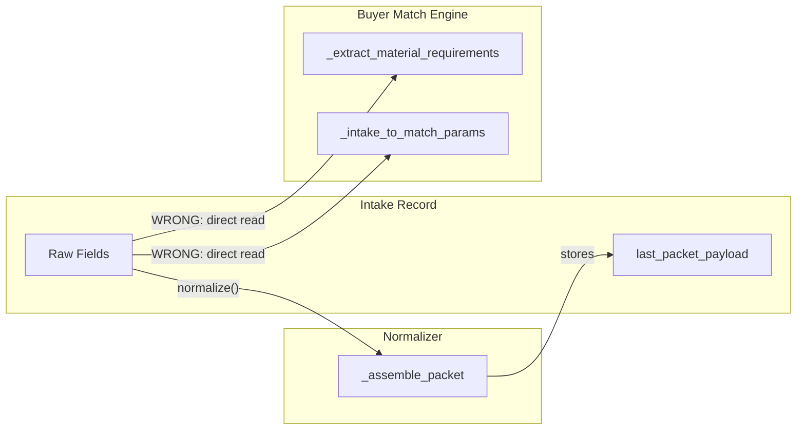
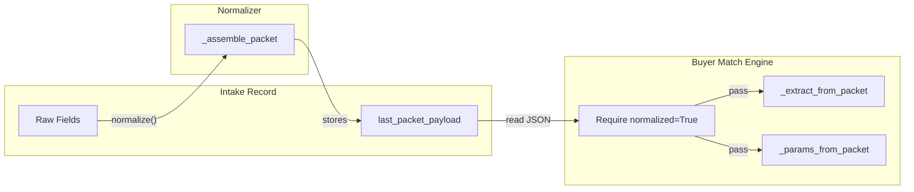

# Normalized Payload Consumption Refactor

## Problem Statement (VERIFIED)

The buyer match engine currently reads directly from raw intake ORM fields, bypassing the normalization layer. **All bugs verified against actual codebase:**

1. **AttributeError (CONFIRMED)**: Line 396 of `intake_normalizer.py` references `self.contamination_total_pct` which doesn't exist on intake (field is `contamination_pct`)
2. **Silent data bug (CONFIRMED)**: Matcher lines 248-250 and graph_service lines 350-351 read `intake.has_metal`, `intake.has_fr`, `intake.is_metalized` - these fields DON'T exist on intake (they're on `material_profile`). Odoo ORM silently returns `False` for non-existent fields, so matching ALWAYS treats materials as having no metal/FR contamination.
3. **Packet not consumed (CONFIRMED)**: The `last_packet_payload` field exists but matcher/graph_service never read it
4. **Packet missing flags (CONFIRMED)**: `_assemble_material_profile_block()` does NOT include `has_metal`, `has_fr`, `is_metalized` from material_profile
5. **Enrichment subgrade bug (CONFIRMED)**: `enrichment_service.py` line 684 writes `profile_vals["subgrade"]` but the model field is `sub_grade` - data silently lost
6. **Missing commodity polymer aliases (CONFIRMED)**: `POLYMER_NORMALIZE` lacks entries for "plastic pallets" and "gaylord boxes" - these special commodity types exist in polymer_data.xml but LLM-extracted values can't be resolved
7. **FILM incorrectly maps to ROLLSTOCK (CONFIRMED)**: `FORM_CODE_TO_MASTER["FILM"] = "ROLLSTOCK"` is wrong - FILM and ROLLSTOCK are both current trading forms, not synonyms
8. **Origin forms not handled (CONFIRMED)**: When LLM returns "bottles", "drums", "buckets" as form, they should map to `origin_form_id` not `form_id` - no `ORIGIN_FORM_NORMALIZE` exists

## Current Data Flow (Broken)



## Target Data Flow (Correct)



## Field Mapping Reference (VERIFIED)

| Packet Path | Source | Matcher Param | Notes |
|-------------|--------|---------------|-------|
| `quality.mfi_value` | `intake.mfi_value` | `mfi` | |
| `quality.density_value` | `intake.density_value` | `density` | |
| `quality.moisture_pct` | `intake.moisture_pct` | `moisture_pct` | |
| `quality.contamination_total_pct` | `intake.contamination_pct` | `contamination_pct` | Key name differs from field |
| `quality.filler_pct` | `intake.filler_pct` | `filler_pct` | |
| `quality.filler_type` | `intake.filler_type_id.code` | `filler_type_id` | Code, not ID |
| `quality.attributes` | `intake.material_attribute_ids.mapped("code")` | N/A | List of codes |
| `origin.sector` | `intake.origin_sector` | `origin_sector` | |
| `origin.sector == "food"` | derived | `food_grade_required` | Boolean |
| `origin.sector == "medical"` | derived | `medical_grade_required` | Boolean |
| `frequency.quantity_per_load_lbs` | `intake.quantity_per_load_lbs` | `quantity_lbs` | |
| `geo.lat` | `intake.lat` | `latitude` | |
| `geo.lon` | `intake.lon` | `longitude` | |
| `material_profile.polymer_code` | `mp.polymer_id.code` | `polymer_code` | |
| `material_profile.form` | `mp.form` | `form_code` | |
| `material_profile.color` | `mp.color` | `color_code` | |
| `material_profile.source_type` | `mp.source_type` | `source_type_code` | |
| `material_profile.has_metal` | `mp.has_metal` | `has_metal` | **NEW - must add** |
| `material_profile.has_fr` | `mp.has_fr` | `has_fr` | **NEW - must add** |
| `material_profile.is_metalized` | `mp.is_metalized` | `is_metalized` | **NEW - must add** |

## Implementation Plan

### Phase 1A: Fix Normalizer Contamination Field

**File**: [plasticos_intake_normalizer/models/intake_normalizer.py](plasticos_intake_normalizer/models/intake_normalizer.py)

**Line 396** - Fix the AttributeError:
```python
# BEFORE (broken):
"contamination_total_pct": self.contamination_total_pct or None,

# AFTER (fixed):
"contamination_total_pct": self.contamination_pct or None,
```

### Phase 1B: Add Material Profile Flags to Packet

**File**: [plasticos_intake_normalizer/models/intake_normalizer.py](plasticos_intake_normalizer/models/intake_normalizer.py)

**Method**: `_assemble_material_profile_block()` (lines 461-488)

Add `has_metal`, `has_fr`, `is_metalized` from material_profile:
```python
# After line 486, add:
for bool_fld in ("has_metal", "has_fr", "is_metalized"):
    if hasattr(mp, bool_fld):
        block[bool_fld] = getattr(mp, bool_fld) or False
```

### Phase 1C: Fix Enrichment subgrade Field Name

**File**: [plasticos_enrichment/models/enrichment_service.py](plasticos_enrichment/models/enrichment_service.py)

**Lines 684-687** - Fix field name mismatch:
```python
# BEFORE (broken - writes to non-existent field):
profile_vals["subgrade"] = str(raw_mat["subgrade"]).strip()
_prov("subgrade", profile_vals["subgrade"], raw_mat)

# AFTER (fixed - matches model field name):
profile_vals["sub_grade"] = str(raw_mat["subgrade"]).strip()
_prov("sub_grade", profile_vals["sub_grade"], raw_mat)
```

Note: The LLM prompt still asks for `subgrade` (line 557) - this is fine, it's just the JSON key from the AI response. The fix is in the code that writes to the Odoo model.

### Phase 1D: Add Commodity Polymer Aliases

**File**: [plasticos_enrichment/models/enrichment_service.py](plasticos_enrichment/models/enrichment_service.py)

**Location**: `POLYMER_NORMALIZE` dict (lines 33-76)

Add entries for special commodity types (before the closing brace on line 76):
```python
    # Special commodity types (not resins, but traded as polymer categories)
    "plastic pallets": "PLASTIC_PALLETS",
    "plastic pallet": "PLASTIC_PALLETS",
    "gaylord boxes": "GAYLORD_BOXES",
    "gaylord box": "GAYLORD_BOXES",
```

Note: Short forms like "pallets" and "gaylords" intentionally NOT added to avoid conflict with `FORM_NORMALIZE` where they mean packaging type, not commodity type.

### Phase 1E: Fix FILM Mapping in FORM_CODE_TO_MASTER

**File**: [plasticos_enrichment/models/enrichment_service.py](plasticos_enrichment/models/enrichment_service.py)

**Line 182** - Fix incorrect mapping:
```python
# BEFORE (wrong - FILM and ROLLSTOCK are different forms):
"FILM": "ROLLSTOCK",

# AFTER (correct - FILM maps to itself):
"FILM": "FILM",
```

### Phase 1F: Add Origin Form Normalization

**File**: [plasticos_enrichment/models/enrichment_service.py](plasticos_enrichment/models/enrichment_service.py)

**Step 1**: Add `ORIGIN_FORM_NORMALIZE` dict after `FORM_NORMALIZE` (around line 124):
```python
# Origin forms - what the material WAS before processing
# These map to origin_form_id, not form_id
ORIGIN_FORM_NORMALIZE = {
    "bottle": "BOTTLES",
    "bottles": "BOTTLES",
    "drum": "DRUMS",
    "drums": "DRUMS",
    "bucket": "BUCKETS",
    "buckets": "BUCKETS",
    "pail": "BUCKETS",
    "pails": "BUCKETS",
    "container": "OTHER",
    "containers": "OTHER",
    "cup": "OTHER",
    "cups": "OTHER",
    "jug": "BOTTLES",
    "jugs": "BOTTLES",
}
```

**Step 2**: Update `normalize_material()` form handling (around line 689-696):
```python
# ── form ──
raw_form = (raw_mat.get("form") or "").strip().lower()

# Check if this is an origin form first
if raw_form in ORIGIN_FORM_NORMALIZE:
    profile_vals["origin_form"] = ORIGIN_FORM_NORMALIZE[raw_form]
    _prov("origin_form", profile_vals["origin_form"], raw_mat)
else:
    # Current trading form
    norm_form = FORM_NORMALIZE.get(raw_form)
    if norm_form:
        profile_vals["form"] = norm_form
        _prov("form", norm_form, raw_mat)
    elif raw_form:
        unmapped.append(("form", raw_mat.get("form")))
```

**Step 3**: Update `enrichment_run.py` to resolve `origin_form` to `origin_form_id` (similar to how `form` is resolved to `form_id`).

### Phase 2: Add Packet Extraction to Matcher

**File**: [plasticos_buyer_match_engine/models/matcher.py](plasticos_buyer_match_engine/models/matcher.py)

Create new method `_extract_from_packet(self, payload)` around line 200:
```python
def _extract_from_packet(self, payload):
    """Extract material requirements from normalized packet payload."""
    if not payload:
        return None
    
    quality = payload.get("quality", {})
    origin = payload.get("origin", {})
    freq = payload.get("frequency", {})
    geo = payload.get("geo", {})
    mp = payload.get("material_profile", {})
    
    sector = origin.get("sector")
    
    return {
        "polymer_id": None,  # Not in packet, use code
        "polymer_code": mp.get("polymer_code"),
        "form_id": None,
        "form_code": mp.get("form"),
        "color_id": None,
        "color_code": mp.get("color"),
        "source_type_id": None,
        "source_type_code": mp.get("source_type"),
        "quantity_available": freq.get("quantity_per_load_lbs") or 0,
        "mfi": quality.get("mfi_value"),
        "density": quality.get("density_value"),
        "moisture_pct": quality.get("moisture_pct"),
        "contamination_pct": quality.get("contamination_total_pct"),
        "filler_pct": quality.get("filler_pct"),
        "filler_type_id": None,  # Code in packet
        "origin_sector": sector,
        "food_grade_required": sector == "food",
        "medical_grade_required": sector == "medical",
        "latitude": geo.get("lat"),
        "longitude": geo.get("lon"),
        "has_metal": mp.get("has_metal", False),
        "is_metalized": mp.get("is_metalized", False),
        "has_fr": mp.get("has_fr", False),
    }
```

### Phase 3: Add Normalization Guard

**File**: [plasticos_buyer_match_engine/models/matcher.py](plasticos_buyer_match_engine/models/matcher.py)

**Method**: `match_intake()` (around line 80-90)

Add auto-normalize before matching:
```python
# After intake validation, before matching logic:
if not intake.normalized:
    _logger.info("Auto-normalizing intake %s before matching", intake.name)
    intake.action_normalize()
    if not intake.normalized:
        raise UserError(_("Intake %s failed normalization. Check normalization errors.", intake.name))
```

### Phase 4: Refactor _extract_material_requirements

**File**: [plasticos_buyer_match_engine/models/matcher.py](plasticos_buyer_match_engine/models/matcher.py)

**Method**: `_extract_material_requirements()` (lines 204-254)

Replace the intake branch to use packet:
```python
def _extract_material_requirements(self, supplier, intake=None):
    if intake:
        # Use normalized packet instead of raw fields
        payload = intake.last_packet_payload
        if payload:
            return self._extract_from_packet(payload)
        # Fallback warning - should not happen if guard works
        _logger.warning("Intake %s has no packet, falling back to raw fields", intake.name)
    
    # ... existing supplier-only fallback code unchanged ...
```

### Phase 5: Add Packet Extraction to Graph Service

**File**: [plasticos_buyer_match_engine/models/graph_service.py](plasticos_buyer_match_engine/models/graph_service.py)

Create new method `_params_from_packet(self, payload)` around line 340:
```python
def _params_from_packet(self, payload):
    """Build Cypher params from normalized packet payload."""
    if not payload:
        return {}
    
    quality = payload.get("quality", {})
    origin = payload.get("origin", {})
    freq = payload.get("frequency", {})
    mp = payload.get("material_profile", {})
    
    sector = origin.get("sector")
    
    return {
        "polymer": mp.get("polymer_code"),
        "density": quality.get("density_value") or 0.0,
        "mfi": quality.get("mfi_value") or 0.0,
        "contamination_pct": quality.get("contamination_total_pct") or 0.0,
        "moisture_pct": quality.get("moisture_pct") or 0.0,
        "has_metal": mp.get("has_metal", False),
        "has_fr": mp.get("has_fr", False),
        "form": mp.get("form"),
        "quantity_lbs": freq.get("quantity_per_load_lbs") or 0,
        "food_grade_required": sector == "food",
        "medical_grade_required": sector == "medical",
        "filler_pct": quality.get("filler_pct") or 0.0,
    }
```

### Phase 6: Refactor _intake_to_match_params

**File**: [plasticos_buyer_match_engine/models/graph_service.py](plasticos_buyer_match_engine/models/graph_service.py)

**Method**: `_intake_to_match_params()` (lines 342-355)

Change to use packet when available:
```python
def _intake_to_match_params(self, intake):
    """Build Cypher params from intake - prefer packet if available."""
    # Use normalized packet if available
    if hasattr(intake, "last_packet_payload") and intake.last_packet_payload:
        return self._params_from_packet(intake.last_packet_payload)
    
    # Fallback to raw fields (backward compat)
    _logger.warning("Intake %s has no packet, using raw fields", intake.id)
    # ... existing raw field code ...
```

### Phase 7: Manual Testing

1. Normalize an intake with material_profile that has `has_metal=True`
2. Verify packet contains `material_profile.has_metal: true`
3. Run buyer matching
4. Verify Neo4j query receives `$has_metal = true`
5. Verify gate 7 (`AND (NOT $has_metal OR f.can_remove_metal = true)`) filters correctly

## Files to Modify

| File | Line(s) | Change |
|------|---------|--------|
| `plasticos_intake_normalizer/models/intake_normalizer.py` | 396 | Fix `self.contamination_total_pct` -> `self.contamination_pct` |
| `plasticos_intake_normalizer/models/intake_normalizer.py` | 484-487 | Add `has_metal`, `has_fr`, `is_metalized` to material_profile block |
| `plasticos_enrichment/models/enrichment_service.py` | 684, 687 | Fix `subgrade` -> `sub_grade` |
| `plasticos_enrichment/models/enrichment_service.py` | 73-76 | Add PLASTIC_PALLETS and GAYLORD_BOXES to POLYMER_NORMALIZE |
| `plasticos_enrichment/models/enrichment_service.py` | 182 | Fix FILM → FILM (not ROLLSTOCK) in FORM_CODE_TO_MASTER |
| `plasticos_enrichment/models/enrichment_service.py` | ~124 | Add ORIGIN_FORM_NORMALIZE dict |
| `plasticos_enrichment/models/enrichment_service.py` | 689-696 | Update normalize_material() to check origin forms first |
| `plasticos_enrichment/models/enrichment_run.py` | ~241 | Add origin_form → origin_form_id resolution |
| `plasticos_buyer_match_engine/models/matcher.py` | ~200 | Add `_extract_from_packet()` method |
| `plasticos_buyer_match_engine/models/matcher.py` | ~85 | Add auto-normalize guard in `match_intake()` |
| `plasticos_buyer_match_engine/models/matcher.py` | 204-254 | Refactor `_extract_material_requirements()` to use packet |
| `plasticos_buyer_match_engine/models/graph_service.py` | ~340 | Add `_params_from_packet()` method |
| `plasticos_buyer_match_engine/models/graph_service.py` | 342-355 | Refactor `_intake_to_match_params()` to use packet |

## Risk Mitigation

1. **Backward compatibility**: Keep fallback to raw fields if `last_packet_payload` is None (with warning log)
2. **Auto-normalize**: If intake not normalized, auto-call `action_normalize()` before matching
3. **Logging**: Add warning logs when falling back to raw fields (indicates data issue)
4. **No feature flag needed**: Packet path is strictly better - raw field path is only fallback for edge cases

## Verification Checklist

After implementation, verify:
- [ ] Normalizing intake with `contamination_pct=5.0` produces packet with `quality.contamination_total_pct: 5.0`
- [ ] Normalizing intake with material_profile where `has_metal=True` produces packet with `material_profile.has_metal: true`
- [ ] Running match on normalized intake passes correct `$has_metal` to Neo4j
- [ ] Gate 7 (`can_remove_metal`) correctly filters when material has metal
- [ ] Fallback warning logged if intake has no packet (should not happen in normal flow)