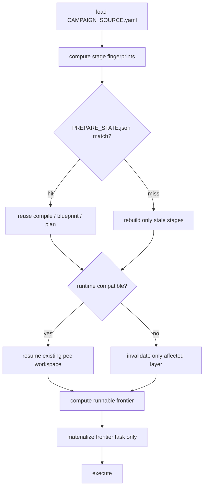

# PE-FAST-002 — Zero-Friction Prepare / Resume

## Base branch reality (read first)

The build stacks on **PR 224**. Its head branch could not be resolved during planning: the execution gate denied every `gh` call with `INTERNAL_EVALUATION_ERROR`, the GitHub MCP server reported `loading`, and the local clone has only one remote-tracking ref for this line (`refs/remotes/origin/feat/pe-fast-path-productivity`). So the base is recorded as a value to resolve, not a guess.

**First action at Build — resolve the base, then create the worktree:**

```bash
cd "$HOME/.cursor-governance"
PR224_HEAD="$(gh pr view 224 --json headRefName --jq .headRefName)"
PR224_SHA="$(gh pr view 224 --json headRefOid --jq .headRefOid)"
echo "PR 224 head: $PR224_HEAD @ $PR224_SHA"     # record both into the baseline table below
git fetch origin "$PR224_HEAD"
bash ops/scripts/worktree_add_wired.sh \
  -b feat/pe-fast-002-zero-friction-prepare \
  "$HOME/.l9/gov-worktrees/pe-fast-002" \
  "origin/$PR224_HEAD"
```

Publish with `PR_BASE=origin/$PR224_HEAD` (stacked child of 224).

- Stacking on 224 is what you asked for, but the **overlap rationale must be re-checked** once its head is known. The reason a main-based branch was rejected earlier is that PE-FAST-002 edits `run_campaign.py`, `pe_timing.py` and `pec/controller.py` — files PR 221 also edits. If 224 does not already contain 221's commits, this branch will still textually overlap 221 and `ops/scripts/pr_overlap_check.py` will block the push regardless of which base is set. Confirm at Build with `git log --oneline "origin/$PR224_HEAD" | grep bc23977`.
- Stacked topology means `AGENTS.md` `STACK_SAFE_MERGE_AND_AUTO_HYGIENE_V1` applies to the **whole chain**: every open PR whose head is the base of another open PR must be merged with `--merge`, not squash, or the children must land bottom-up first. With 221, 224 and this branch open, that is a three-deep chain — merge oldest first.
- This contract runs as ordinary Cursor coding work. **Do not drive it through PE** (contract §Final Instruction).

## What PE-FAST-001 already shipped (do not rebuild)

`pec/exec_env.py` shared interpreter, `pec/workspace_reset.py` + `pec fresh-workspace`, one-verify-per-attempt receipt replay, pre-bootstrap `scripts/launchability.py` gate, `scripts/pe_worker.py` worker handoff, `scripts/pe_timing.py` stage timing + `StageCache` + `PROGRESS.json`, `--fast` / `L9_PE_MODE=fast`, `campaign_input.py` campaign-source.v2 routing, auto `measure_admission_evidence()`.

Two things it left unfinished, which PE-FAST-002 inherits:

1. `StageCache` exists but is wired to **exactly one stage** — `run_campaign.py:2352-2366` caches `stack_proof` and nothing else.
2. `launchability.check_tasks(..., infer=fast)` synthesizes validation commands into the report only (`launchability.py:155-214`); they are never injected into contracts, yet `run_campaign.py:1984` tells the operator to "run with `--fast` to infer them".

## Target prepare flow



## Primary surfaces

All paths relative to the new worktree.

- [environment/program-execution/scripts/run_campaign.py](environment/program-execution/scripts/run_campaign.py) — `run_campaign()` L2294+ orchestration, `quarantine_occupied()` L650, `default_arm()` L985, `register_task_contract()` L944, `build_pr_stack()` L892, `locked_tasks()` L870
- [environment/program-execution/scripts/pe_timing.py](environment/program-execution/scripts/pe_timing.py) — `fingerprint()` L111, `StageCache` L131
- [environment/program-execution/scripts/compile_campaign_source.py](environment/program-execution/scripts/compile_campaign_source.py)
- [environment/program-execution/scripts/blueprint_ops.py](environment/program-execution/scripts/blueprint_ops.py) — `lock_exists_for_blueprint()` L119 is the "blueprint becomes sacred" guard
- [environment/program-execution/scripts/accept_blueprint.py](environment/program-execution/scripts/accept_blueprint.py), [collect_evidence.py](environment/program-execution/scripts/collect_evidence.py)
- [environment/program-execution/scripts/context7_stack_proof.py](environment/program-execution/scripts/context7_stack_proof.py) — `prove_stack()`
- [environment/program-execution/scripts/launchability.py](environment/program-execution/scripts/launchability.py)
- `environment/program-execution/core/program-execution-controller-template/scripts/pec/` — `controller.py` (`bootstrap`, `task_readiness`, `next_tasks`), `blueprint.py` (`write_program_lock`, `verify_program_lock`), `contracts.py`, `state.py`, `cli.py`
- `environment/program-execution/core/program-execution-blueprint-template/scripts/validate_blueprint.py` — fast vs full split

`PREPARE_STATE.json` lands at `$L9_ROOT/programs/<id>/runtime/PREPARE_STATE.json` post-bootstrap and `$L9_ROOT/primed/<id>/prepare-state.json` pre-bootstrap. The host campaign dir cannot hold it — `ALLOWED_CAMPAIGN_FILES` (`run_campaign.py:45`) permits only two files.

## Sequencing

Follows the contract's own Execution Order. Each wave is a commit; no mid-execution push (L4 local autonomy).

0. **PLAN_DOCUMENT** — inside the new worktree, emit the `l9-plan` PLAN_DOCUMENT JSON for this contract and validate it with `skills/l9-plan/scripts/validate_plan_document.py`. Implementation does not begin until that PASSes. This step exists because JSON emission and validator execution are both unavailable in plan mode, so the skill's machine artifact is deferred to Build rather than skipped.
1. **Baseline benchmark** — measure current cold and warm prepare on `demo-activate-v1` (2 tasks) and `bounded-replanning-v1` (7 tasks) before editing. This is the regression baseline; the contract's 10-minute cap is meaningless without it.
2. **Fingerprints + `PREPARE_STATE.json`** — extend `StageCache` to `emit`, `plan_window`, `compile`, `validate_blueprint`, `launchability`, `admission_evidence`, `accept`. Persist `source_digest`, `compiler_digest`, `schema_digest`, `repository_head`, `compile_digest`, `blueprint_digest`, `plan_digest`, `prepared_at`.
3. **Reuse blueprint / plan / runtime; one resumable front door** — gate `quarantine_occupied()` (L2448-2449) behind a compatibility check so a compatible runtime resumes instead of being moved to `programs/stale/`. Repeated invocation must not restart the campaign.
4. **Remove normal-path preparation locks** — keep locks only around task-worktree, branch, state-DB and external publication mutation; replace protective locking of local compute with temp-write + `os.replace()` atomic rename.
5. **Implicit FAST local acceptance** — when the campaign has no push/merge/deploy authority, `compile PASS + launchability PASS = locally executable`; emit a `LOCAL_ACCEPTED` provenance record automatically rather than requiring `collect_evidence` + `accept_blueprint` state flips. Keep strict acceptance for publish/merge/deploy.
6. **Lazy task materialization** — `default_arm()` L999-1000 currently loops `register_task_contract()` over **every** locked task, and L1001-1003 builds the whole PR stack. Restrict to the runnable frontier plus a one-wave lookahead; register the rest on demand as tasks become runnable. Keep the full task plan in sqlite/program-lock so dependency resolution is unaffected.
7. **Scoped invalidation + unfreeze the blueprint** — separate definition state from execution history. A `TASK-019` validation edit invalidates that task's contract and pending verification, not the workspace, the program lock, completed receipts, or admission state. Relax `lock_exists_for_blueprint()` for local FAST edits while keeping per-task provenance (`task_definition_digest`, `source_digest`, `base_sha`, `validation_spec_digest`, `candidate_sha`).
8. **Lazy external research + incremental validation** — move `prove_stack()` off the critical path to per-task on-demand, cached by request fingerprint; a transient Context7 failure must not restart the campaign. Split `validate_blueprint.py` into cheap structural validation for local execution and full sweep for CI/release/strict.
9. **Close the inherited validation-inference gap** — inject `launchability` synthesized validations into rendered contracts so the `--fast` promise at `run_campaign.py:1984` is real.
10. **Timing + cache-miss reporting** — every recompute states its reason (`blueprint rebuild: source_digest changed`, `plan reused: planning inputs unchanged`).
11. **Tests, benchmark fixture, regression scenario** — the contract's named tests, a 30-40 task benchmark fixture, and the critical regression scenario (compile → bootstrap → execute → change one future task validation → re-run, expecting scoped invalidation only).

## Explicitly out of scope

Contract §"Do Not Implement Yet": canonical semantic IR, semantic conservation, repository generations, principal/grant redesign, event sourcing, CAS redesign, fencing, autonomy execution bridge, typed verifier DSL, promotion architecture, release-grade authority redesign. Also deferred to the roadmap's later slices: parallel workers on independent runnable tasks (PE-FAST-005).

## Guardrails

- FAST mode must gain **no** merge, push, or deploy authority — dedicated tests (`test_fast_mode_cannot_merge`, `..._cannot_push_without_authority`, `..._cannot_deploy`).
- New `pec` / PE modules must be registered in the integrity manifests via `ops/scripts/sync_generated_artifacts.py` — PE-FAST-001 needed a follow-up commit (`635527b`) for exactly this.
- Docs go in `environment/program-execution/README.md` and `RUNBOOK.md`, matching where PE-FAST-001 put the fast-path contract. `AGENTS.md` is additive-only if touched at all.
- Contract Rule 2: prefer deletion over abstraction. No `PreparationCoordinatorManager` / `ArtifactInvalidationFramework` / `LockLifecycleOrchestrator`.

## Publish

```bash
make improve                      # kernels: Recursive Alignment, then Validate & Repair
make improve IMPROVE_RECORD=1
make pr-check
PR_BASE="origin/$PR224_HEAD" PR_REMEDIATE=0 make pr
```

`make pr` is the only path to GitHub. Do not merge from this path. Merge only via `/l9-pr-remediation`, and only bottom-up: PR 221 first, then 224, then this branch — an ancestor squash-merged out of order silently drops the descendant's content.

---

# Plan pack

The canonical executable-plan template assumes execution through Program Execution. This contract forbids that (§Final Instruction: "Do not require PE to execute this contract"), so the PE projection sections — campaign authorization packet, Task Card mapping, Program Lock binding, adapter routing — are deliberately **not applicable**. Everything else in the template is filled below. This is ordinary Cursor coding work under L4 local autonomy.

## Metadata

| Field | Value |
|---|---|
| plan_id | `plan.program-execution.pe-fast-002-zero-friction-prepare.v1` |
| schema_version | `1.0.0` |
| mode | `plan` |
| depth | `deep` |
| status | `draft` — becomes `executable` when every blocking preflight probe passes |
| plan_class | `refactor_plan` |
| redesign_allowed | `false` |
| is_project | `false` |
| code_in_scope | `true` |
| execute_via | ordinary Cursor coding under L4 local autonomy; **not** Program Execution |
| source contracts | `WIP/8-18-26/PE Pipeline Contract.md`, `WIP/8-18-26/PE Pipeline Context.md` |

## Architect framing

`planning_ssot` is the PE subsystem itself — `environment/program-execution/README.md` plus the sealed core templates under `environment/program-execution/core/`. No architecture redesign is authorized: the contract's Rule 2 requires deletion over abstraction, and its "Do Not Implement Yet" list fences off the PE-v3 convergence work. Follow-on schema and platform evolution stays in separate plans (PE-FAST-003 through 005).

## Immutable baseline

| Field | Value |
|---|---|
| repository | `Quantum-L9/Cursor-Governance` |
| base ref | `origin/<PR 224 headRefName>` — **UNRESOLVED**, fill from `gh pr view 224 --json headRefName` |
| commit_sha | **UNRESOLVED** — fill the full 40-char SHA from `gh pr view 224 --json headRefOid` |
| known related SHA | `bc23977c52158ea0e3b75981e19484adb939bed0` = head of PR 221, the fast-path predecessor whose files this contract also edits |
| new branch | `feat/pe-fast-002-zero-friction-prepare` |
| workspace | `$HOME/.l9/gov-worktrees/pe-fast-002` |
| ssot_clone | `$HOME/.cursor-governance` |
| dirty | `false` required in the new worktree at start |
| overlap_policy | `stop_if_dirty_overlaps_may_modify` |
| verification_rule | `reverify_at_execution_start` |
| on_drift | `stop_and_replan` — if PR 224 has been squash-merged or its head has moved between resolution and branch creation, the stacking premise is void and the base must be re-decided |

The baseline is intentionally incomplete. `PLAN-SCHEMA-001` requires a full 40-character SHA before status may become `executable`, so this plan stays `draft` until the two `UNRESOLVED` rows are filled from the live PR.

## Objective

### Mission

PE preparation currently repeats expensive work on every invocation: it re-primes network-backed stack research, recompiles an unchanged blueprint, re-runs whole-blueprint validation, quarantines a perfectly usable runtime, registers a contract for all 39 tasks before TASK-001 can start, and treats a one-byte source edit as whole-campaign invalidation. PE-FAST-002 makes preparation behave like a build tool: fingerprint the inputs of every stage, reuse whatever is unchanged, materialize only the runnable frontier, and scope invalidation to what actually depends on the change. The preserved contracts are absolute — FAST mode gains no merge, push, or deploy authority; writable-path boundaries hold; git history is untouched; verification still precedes task completion; and per-task provenance must be sufficient to know which definition produced which code.

### Success properties

| id | property | evidence_type | proof | blocking |
|---|---|---|---|---|
| SP-01 | Base tip still matches the resolved PR 224 head SHA when execution starts | `repository_state` | `git rev-parse HEAD` equals the SHA recorded in the baseline table at branch creation | true |
| SP-02 | A second invocation with unchanged inputs reuses compile, plan and runtime | `runtime_behavior` | `TIMINGS.json` marks `compile`, `plan_window`, `validate_blueprint` cached; runtime resumed not recreated | true |
| SP-03 | One task-definition change invalidates only that task | `runtime_behavior` | edit TASK-019 validation, re-run, observe TASK-001..018 contracts and receipts intact | true |
| SP-04 | First executable task does not require all task contracts rendered | `structural` | `contracts/source/` contains frontier plus one-wave lookahead, not every task | true |
| SP-05 | Future-task external research does not run during startup | `network_observation` | zero Context7 fetches when the frontier task declares no research need | true |
| SP-06 | Warm/resume startup is dramatically faster than cold | `runtime_behavior` | benchmark fixture: warm under 10s against a cold baseline recorded in step 1 | true |
| SP-07 | A 30–40 task campaign reaches its first executable task within 10 minutes | `runtime_behavior` | benchmark fixture cold run under the cap, preferably under 2 minutes | true |
| SP-08 | FAST mode gains no merge, push or deploy authority | `structural` | `test_fast_mode_cannot_merge`, `..._cannot_push_without_authority`, `..._cannot_deploy` pass | true |
| SP-09 | Completed task history survives definition edits and process restarts | `runtime_behavior` | `test_completed_tasks_remain_completed_after_resume` passes | true |
| SP-10 | Every recompute states why it recomputed | `runtime_behavior` | cache-miss reason string present for each rebuilt stage | true |
| SP-11 | A transient research failure does not restart the campaign | `runtime_behavior` | inject a stack-proof failure on a warm cache; campaign continues from cached receipt | true |
| SP-12 | Inferred validations reach rendered contracts | `structural` | a task declaring no validation executes the launchability-synthesized command under `--fast` | true |
| SP-13 | Changed-files quality gate passes | `quality_gate` | `make pr-check` → PASS | true |

## Capability preflight

Any failed blocking probe sets status `preflight_blocked`. Note CP-05: the execution gate returned `INTERNAL_EVALUATION_ERROR` twice during planning, so it must be confirmed healthy before Build — a faulting gate blocks every shell step in this plan.

| id | capability | command_or_action | pass_criteria | blocking |
|---|---|---|---|---|
| CP-01 | base identity resolution | `gh pr view 224 --json headRefName,headRefOid,state,baseRefName` | `OPEN`; head branch and full SHA recorded into the baseline table | true |
| CP-02 | overlap premise | `git log --oneline "origin/$PR224_HEAD"` and `ops/scripts/pr_overlap_check.py` | either 224 already contains PR 221's `bc23977`, or the residual overlap with 221 is understood and a stacking target chosen | true |
| CP-02b | chain merge order | `gh pr list --state open --json number,headRefName,baseRefName` | the 221 → 224 → this-branch chain is mapped, and no ancestor is set to squash-merge | true |
| CP-03 | worktree wiring | `bash ops/scripts/check_governance_wiring.sh "$HOME/.l9/gov-worktrees/pe-fast-002"` | PASS as `ssot_checkout` | true |
| CP-04 | locked interpreter | `make gov-python` | `sys.prefix` is `.venv`; yaml, pydantic, jsonschema, structlog import | true |
| CP-05 | execution gate healthy | any trivial gated shell command | no `INTERNAL_EVALUATION_ERROR` | true |
| CP-06 | PE test suites runnable | PE pytest suites on the untouched base | green before any edit | true |
| CP-07 | smoke campaign runnable | `make pe-smoke` | passes on the untouched base | true |

## Execution envelope

Mutations outside this envelope are forbidden.

### Filesystem

**write_allow**

- `environment/program-execution/scripts/**`
- `environment/program-execution/core/program-execution-controller-template/scripts/pec/**`
- `environment/program-execution/core/program-execution-blueprint-template/scripts/validate_blueprint.py`
- `environment/program-execution/campaigns/**` (benchmark and smoke fixtures only)
- `environment/program-execution/README.md`, `RUNBOOK.md`
- `environment/program-execution/MANIFEST.json` and sibling integrity manifests (regenerated, not hand-edited)

**write_deny**

- `ops/autonomy/merge_gate.py`, `ops/autonomy/local_execution_gate.py`, `ops/autonomy/surface_profile.yaml`
- `CANONICAL_LAW.md`, `ORG_INVARIANTS.yaml`, `pyproject.toml`, `CODEOWNERS`, `.github/workflows/**`
- `AGENTS.md` beyond an additive block, and only if genuinely required
- any secret material; `WIP/Legal Defense/**`
- sealed `environment/program-execution/core/` template content mutated in place rather than through its generator

### Commands

**allow:** `git` (read, branch, add, commit), `ops/scripts/worktree_add_wired.sh`, `make gov-python`, `make test`, `make pe-smoke`, `make pr-check`, `make improve`, `make pr`, `python3 ops/scripts/sync_generated_artifacts.py`, PE pytest suites, the benchmark harness.

**deny:** `git push` other than through `make pr`, `gh pr create` / `gh pr edit`, `git push --force`, `git reset --hard`, `gh pr merge --admin`, MCP `create_pull_request` / `push_files`, weakening or skipping scanners to obtain PASS.

### Network

`named_services_only`. GitHub via `gh` for PR status only. Context7 reached only through the existing stack-proof path, and the whole point of step 8 is to stop reaching it during startup. Benchmarks must run without new network dependencies.

### Secrets

`access: none`. `redaction_required: true`. Nothing in this contract needs a credential beyond the ambient `gh` token used by `make pr`.

### Autonomous merge

`false`. `make pr` ends at green and merge-ready. Merge happens only after PR 221 lands and only through `/l9-pr-remediation`.

## Side effects and idempotency

| todo_id | side_effects | idempotency | retry | compensation | irreversible |
|---|---|---|---|---|---|
| worktree | `filesystem_mutation` | `safe_with_dedupe` | `retry_once` | `git worktree remove` + delete branch | false |
| plan-document | `filesystem_mutation` | `safe_to_repeat` | `bounded_retry` | delete the JSON | false |
| baseline | `filesystem_read` | `safe_to_repeat` | `bounded_retry` | none | false |
| fingerprints | `filesystem_mutation` | `safe_to_repeat` | `bounded_retry` | `git restore` scoped paths | false |
| resume | `filesystem_mutation` | `safe_to_repeat` | `bounded_retry` | `git restore` scoped paths | false |
| locks | `filesystem_mutation` | `safe_to_repeat` | `manual_only` | `git restore` scoped paths | false |
| acceptance | `filesystem_mutation` | `safe_to_repeat` | `manual_only` | `git restore` scoped paths | false |
| lazy-tasks | `filesystem_mutation` | `safe_to_repeat` | `manual_only` | `git restore` scoped paths | false |
| scoped-invalidation | `filesystem_mutation` | `safe_to_repeat` | `manual_only` | `git restore` scoped paths | false |
| lazy-research | `filesystem_mutation` | `safe_to_repeat` | `bounded_retry` | `git restore` scoped paths | false |
| inference-gap | `filesystem_mutation` | `safe_to_repeat` | `bounded_retry` | `git restore` scoped paths | false |
| observability | `filesystem_mutation` | `safe_to_repeat` | `bounded_retry` | `git restore` scoped paths | false |
| tests | `filesystem_mutation` | `safe_to_repeat` | `bounded_retry` | `git restore` scoped paths | false |
| manifests | `filesystem_mutation` | `safe_to_repeat` | `bounded_retry` | regenerate from generator | false |
| publish | `network_write` | `safe_with_dedupe` | `manual_only` | close the PR | false |

Local benchmark and smoke runs mutate `$HOME/.l9/programs/**`, `$HOME/.l9/blueprints/**` and `$HOME/.l9/primed/**`. Those are machine-local runtime scratch outside the repository, disposable via `pec fresh-workspace`, and must never be committed.

## Architecture impact

| todo_id | bounded_context | layer | owning_contract | prohibited |
|---|---|---|---|---|
| fingerprints, resume, observability | program-execution | `control_plane` | PE README fast-path section | inventing a second cache authority outside `pe_timing.StageCache` |
| locks | program-execution | `control_plane` | PE locking model | removing task-worktree, branch, state-DB or publication synchronization |
| acceptance | program-execution | `policy` | admission model | granting FAST mode any external authority |
| lazy-tasks, scoped-invalidation | program-execution | `runtime` | Program Lock + Controller state | breaking dependency resolution or losing per-task provenance |
| lazy-research, inference-gap | program-execution | `runtime` | stack-proof + launchability | fabricating validations that do not actually verify the task |
| tests, manifests | program-execution | `assurance` | integrity manifests | hand-editing generated manifests |

## Rollback

| Field | Value |
|---|---|
| supported | `true` |
| automatic_allowed | `false` |
| approval_required | `true` |
| trigger_conditions | base drift; any blocking success property fails; envelope breach; PE suites or smoke regress against the step-1 baseline |

| domain | mode | notes |
|---|---|---|
| code | `git_restore_scoped_paths`, then `revert_commit` per wave | each wave is one commit, so a single wave reverts cleanly |
| local_state | `manual_recovery` via `pec fresh-workspace` | runtime scratch under `$HOME/.l9/` |
| external_state | `none` before publish; after publish, close the PR | no force-push, no history rewrite |

**Irreversible operations:** none. Nothing here deletes user data, migrates a schema, or writes to an append-only external system.

**Rollback verification:** PE pytest suites plus `make pe-smoke` return to the step-1 baseline result.

## Complexity and uncertainty

| Field | Value |
|---|---|
| complexity | `high` |
| uncertainty | `medium` |
| blast_radius | `high` — PE is the execution substrate for every campaign in the org |
| architectural_boundaries_crossed | 2 (`scripts/` orchestration and sealed `core/` controller templates) |
| external_systems_touched | 1 (GitHub, at publish only) |
| migration_required | `false` |
| unknown_dependency_count | 2 (see unknowns) |

## Execution DAG

| id | depends_on | outputs |
|---|---|---|
| worktree | [] | wired worktree, branch at locked SHA |
| plan-document | [worktree] | validated PLAN_DOCUMENT JSON |
| baseline | [plan-document] | cold/warm timing baseline receipt |
| fingerprints | [baseline] | `PREPARE_STATE.json`, StageCache across all prep stages |
| resume | [fingerprints] | compatibility-gated runtime resume, idempotent front door |
| locks | [resume] | lock removal from local compute, atomic rename writes |
| acceptance | [resume] | implicit FAST local acceptance + `LOCAL_ACCEPTED` provenance |
| lazy-tasks | [resume] | frontier-only contract registration |
| scoped-invalidation | [fingerprints, lazy-tasks] | task-level invalidation, per-task provenance |
| lazy-research | [fingerprints] | on-demand stack proof, incremental validation split |
| inference-gap | [lazy-tasks] | inferred validations injected into rendered contracts |
| observability | [fingerprints, resume, scoped-invalidation] | timings + cache-miss reasons |
| tests | [locks, acceptance, lazy-tasks, scoped-invalidation, lazy-research, inference-gap, observability] | contract tests, benchmark fixture, regression scenario |
| manifests | [tests] | regenerated integrity manifests, README/RUNBOOK |
| publish | [manifests] | stacked PR against PR 221's head |

**Critical path:** `worktree` → `plan-document` → `baseline` → `fingerprints` → `resume` → `lazy-tasks` → `scoped-invalidation` → `tests` → `manifests` → `publish`

**Forbidden edges:** nothing may precede `baseline` and still claim a performance result; `publish` may not precede `manifests`, because PE-FAST-001 already proved that unregistered new modules fail the integrity gate.

## Property evidence matrix

Exit-0 alone is insufficient for the reuse and laziness properties — each needs a positive marker.

| evidence_id | SP | evidence_kind | command | expected_positive |
|---|---|---|---|---|
| EV-01 | SP-01 | `repository_state_evidence` | `git rev-parse HEAD` | `bc23977c…bed0` |
| EV-02 | SP-02 | `runtime_behavior_evidence` | second run on unchanged inputs | `TIMINGS.json` entries marked cached; no recompile |
| EV-03 | SP-03 | `runtime_behavior_evidence` | `test_validation_change_invalidates_only_affected_task` | earlier task contracts and receipts unchanged |
| EV-04 | SP-04 | `structural_evidence` | `test_first_task_does_not_require_all_task_contracts_rendered` | registered contract count < task count |
| EV-05 | SP-05 | `network_observation` | `test_context_research_not_run_for_unrelated_future_tasks` | zero fetches recorded |
| EV-06 | SP-06 / SP-07 | `runtime_behavior_evidence` | benchmark harness on the 30–40 task fixture | cold under cap; warm under 10s |
| EV-07 | SP-08 | `structural_evidence` | the three fast-mode safety tests | all pass |
| EV-08 | SP-09 | `runtime_behavior_evidence` | `test_completed_tasks_remain_completed_after_resume` | completions preserved |
| EV-09 | SP-10 | `runtime_behavior_evidence` | forced cache miss | reason string names the changed digest |
| EV-10 | SP-11 | `runtime_behavior_evidence` | injected stack-proof failure with warm cache | campaign continues |
| EV-11 | SP-12 | `structural_evidence` | task with no declared validation under `--fast` | rendered contract carries the inferred command |
| EV-12 | SP-13 | `quality_gate_evidence` | `make pr-check` | PASS |

## Stress and disconfirm

### Disconfirming questions

- Is preparation actually the bottleneck, or is the real cost the worker and verification loop? Step 1's baseline answers this before any refactor. If preparation is already a small fraction of time-to-first-code, most of this plan is misdirected effort and the scope should shrink to the cache plus lazy research.
- Does `quarantine_occupied()` exist for a reason the contract does not know about? It was written so a stopped campaign's draft workspace is not silently attached to. Gating it on fingerprint compatibility must not resurrect that failure.
- Can acceptance be made implicit without weakening the post-bootstrap edit guard that `lock_exists_for_blueprint()` provides? If the two are entangled, implicit acceptance may require accepting mutable definitions first, which reverses steps 5 and 7.
- Is `verify_program_lock()` load-bearing for correctness rather than ceremony? If task readiness genuinely depends on a frozen normalized plan, replacing global immutability with per-task provenance is a behavior change, not a ceremony removal.
- Will frontier-only contract registration break `build_pr_stack()`, which today assumes the full task list?

### Assumption failure conditions

- An ancestor in the 221 → 224 → this-branch chain is squash-merged while a descendant is open, which per `STACK_SAFE_MERGE_AND_AUTO_HYGIENE_V1` silently drops the descendant's content at merge.
- PR 224 does not contain PR 221's commits, so this branch still overlaps 221 and the push is blocked no matter what `PR_BASE` says.
- The dirty tree in the new worktree overlaps `write_allow`.
- Any blocking success property fails after a wave, particularly SP-03 or SP-09, which would mean invalidation is not actually scoped.
- The 30–40 task benchmark fixture cannot be built cheaply, leaving SP-07 unprovable.
- The execution gate keeps faulting, which blocks every shell step.

### Blast radius

PE is the execution substrate for every campaign in the organization. A regression here does not break one feature, it stops all campaign work. That is why step 1 records a baseline first, each wave is a separately revertible commit, and `make pe-smoke` plus the PE suites gate every wave rather than only the final publish.

## Unknowns

| id | question | decision effect | resolution |
|---|---|---|---|
| U1 | Is `verify_program_lock()` correctness-bearing or ceremony? | Decides whether step 7 can replace global immutability with per-task provenance, or must keep the lock and only scope contract invalidation | probe — read `pec/blueprint.py` and `task_readiness()` before starting step 7 |
| U2 | Can a 30–40 task benchmark fixture be synthesized cheaply, or must a real campaign source be reused? | Decides whether SP-07 is provable in this contract or defers to a follow-on | probe during step 11; if expensive, synthesize from `bounded-replanning-v1` by task multiplication |
| U3 | Why is the execution gate returning `INTERNAL_EVALUATION_ERROR`? | A faulting gate blocks every shell step in this plan | ask / measure at Build; do not work around the gate |
| U4 | What is PR 224's head branch and SHA, and does it already contain PR 221's commits? | Sets the base ref and baseline SHA, decides whether residual overlap with 221 still blocks the push, and fixes the chain merge order | probe — `gh pr view 224 --json headRefName,headRefOid` then check ancestry of `bc23977` |

U1 and U2 are non-blocking probes. **U3 and U4 are blocking for execution:** U4 leaves the immutable baseline without a 40-char SHA, which `PLAN-SCHEMA-001` requires before status may become `executable`, and U3 blocks the very command that would resolve U4.

## Convergence

| Field | Value |
|---|---|
| status | `blocked` |
| implementation_ready | `false` until CP-01 through CP-07 pass, particularly CP-01 (base identity) and CP-05 (gate health) |
| remaining unknowns | U1, U2, U3, U4 — U3 and U4 blocking |
| complete_when | every blocking SP-01..SP-13 has passing evidence; PE suites and `make pe-smoke` are no worse than the step-1 baseline; out-of-scope list respected in the diff |
| blocking_conditions | preflight blocked; base drift; envelope breach; any failed blocking property |
| next_skill | `l9-ynp` after publish, or `l9-pr-remediation` once the ancestors have landed |
| stop_reason | PR 224's head is unresolved so the baseline has no full SHA, and the execution gate is faulting so it cannot be resolved; preflight has not been run |

## Machine artifact — PLAN_DOCUMENT

Write this to `.l9/plans/pe-fast-002.plan.json` in the new worktree as step 0, then validate with `python3 skills/l9-plan/scripts/validate_plan_document.py .l9/plans/pe-fast-002.plan.json`. It conforms to `skills/l9-plan/schemas/plan-document.schema.json`.

```json
{
  "schema_version": "1.0.0",
  "mode": "plan",
  "depth": "deep",
  "title": "PE-FAST-002 — Zero-Friction Prepare / Resume",
  "objective": "Make Program Execution preparation behave like a build tool: fingerprint every preparation stage, reuse unchanged artifacts, resume a compatible runtime instead of recreating it, materialize only the runnable task frontier, scope invalidation to actual input dependencies, and move external research off the startup path — without granting FAST mode any merge, push or deploy authority.",
  "code_in_scope": true,
  "estimate": "11 waves, one commit each; dominated by lazy materialization and scoped invalidation",
  "success_criteria": [
    "SP-01 base tip matches the resolved PR 224 head SHA recorded in the immutable baseline at execution start",
    "SP-02 a second invocation with unchanged inputs reuses compile, plan and runtime",
    "SP-03 one task-definition change invalidates only that task",
    "SP-04 the first executable task does not require every task contract rendered",
    "SP-05 future-task external research does not run during startup",
    "SP-06 warm/resume startup is dramatically faster than the recorded cold baseline",
    "SP-07 a 30-40 task campaign reaches its first executable task within 10 minutes",
    "SP-08 FAST mode gains no merge, push or deploy authority",
    "SP-09 completed task history survives definition edits and process restarts",
    "SP-10 every recompute states the reason it recomputed",
    "SP-11 a transient research failure does not restart the campaign",
    "SP-12 launchability-inferred validations reach rendered contracts",
    "SP-13 make pr-check PASSes on changed files"
  ],
  "scope": {
    "in": [
      "environment/program-execution/scripts/run_campaign.py",
      "environment/program-execution/scripts/pe_timing.py",
      "environment/program-execution/scripts/compile_campaign_source.py",
      "environment/program-execution/scripts/blueprint_ops.py",
      "environment/program-execution/scripts/accept_blueprint.py",
      "environment/program-execution/scripts/collect_evidence.py",
      "environment/program-execution/scripts/context7_stack_proof.py",
      "environment/program-execution/scripts/launchability.py",
      "environment/program-execution/core/program-execution-controller-template/scripts/pec/",
      "environment/program-execution/core/program-execution-blueprint-template/scripts/validate_blueprint.py",
      "PE tests, benchmark and smoke fixtures",
      "environment/program-execution/README.md and RUNBOOK.md",
      "regenerated PE integrity manifests"
    ],
    "out": [
      "canonical semantic IR and semantic conservation architecture",
      "repository generations, principal/grant redesign, full event sourcing, CAS redesign",
      "full fencing architecture, autonomy execution bridge, complete typed verifier DSL",
      "promotion architecture and release-grade authority redesign",
      "parallel workers on independent runnable tasks (PE-FAST-005)",
      "ops/autonomy merge and execution gates",
      "CANONICAL_LAW.md, ORG_INVARIANTS.yaml, pyproject.toml, CI workflows",
      "driving this contract through Program Execution"
    ]
  },
  "pre_validation": [
    {
      "id": "CP-01",
      "command_or_action": "gh pr view 224 --json headRefName,headRefOid,state,baseRefName",
      "pass_criteria": "state OPEN; head branch name and full 40-char SHA resolved and written into the immutable baseline, replacing the UNRESOLVED rows",
      "status": "pending"
    },
    {
      "id": "CP-02",
      "command_or_action": "git log --oneline \"origin/$PR224_HEAD\" and python3 ops/scripts/pr_overlap_check.py",
      "pass_criteria": "either PR 224 already contains PR 221 commit bc23977, or the residual textual overlap with PR 221 on run_campaign.py, pe_timing.py and pec/controller.py is understood and a stacking target deliberately chosen",
      "status": "pending"
    },
    {
      "id": "CP-02b",
      "command_or_action": "gh pr list --state open --json number,headRefName,baseRefName",
      "pass_criteria": "the 221 to 224 to this-branch chain is mapped and no ancestor is queued for squash-merge",
      "status": "pending"
    },
    {
      "id": "CP-03",
      "command_or_action": "bash ops/scripts/check_governance_wiring.sh \"$HOME/.l9/gov-worktrees/pe-fast-002\"",
      "pass_criteria": "PASS as workspace kind ssot_checkout",
      "status": "pending"
    },
    {
      "id": "CP-04",
      "command_or_action": "make gov-python",
      "pass_criteria": "sys.prefix is .venv and yaml, pydantic, jsonschema, structlog import",
      "status": "pending"
    },
    {
      "id": "CP-05",
      "command_or_action": "run any trivial gated shell command",
      "pass_criteria": "no INTERNAL_EVALUATION_ERROR from the execution gate",
      "status": "pending"
    },
    {
      "id": "CP-06",
      "command_or_action": "PE pytest suites on the untouched base",
      "pass_criteria": "green before any edit",
      "status": "pending"
    },
    {
      "id": "CP-07",
      "command_or_action": "make -C \"$HOME/.cursor-governance\" pe-smoke",
      "pass_criteria": "two-task smoke campaign passes on the untouched base",
      "status": "pending"
    }
  ],
  "todos": [
    {
      "id": "worktree",
      "task": "Resolve PR 224 head branch and full SHA, write both into the immutable baseline, then create the wired worktree at $HOME/.l9/gov-worktrees/pe-fast-002 on branch feat/pe-fast-002-zero-friction-prepare off origin/<PR224 head> via ops/scripts/worktree_add_wired.sh",
      "files": ["ops/scripts/worktree_add_wired.sh"],
      "effort": "S",
      "risk": "low",
      "dependencies": [],
      "operation": "Create",
      "leverage_rank": 13
    },
    {
      "id": "plan-document",
      "task": "Emit .l9/plans/pe-fast-002.plan.json and validate it with skills/l9-plan/scripts/validate_plan_document.py; do not begin implementation until it PASSes",
      "files": [".l9/plans/pe-fast-002.plan.json"],
      "effort": "S",
      "risk": "low",
      "dependencies": ["worktree"],
      "operation": "Create",
      "leverage_rank": 14
    },
    {
      "id": "baseline",
      "task": "Record cold and warm prepare timings for demo-activate-v1 and bounded-replanning-v1 before any edit; this is the regression baseline that makes every later performance claim falsifiable",
      "files": ["environment/program-execution/campaigns/"],
      "effort": "M",
      "risk": "low",
      "dependencies": ["plan-document"],
      "leverage_rank": 10
    },
    {
      "id": "fingerprints",
      "task": "Add PREPARE_STATE.json and extend StageCache from stack_proof alone to emit, plan_window, compile, validate_blueprint, launchability, admission_evidence and accept; persist source, compiler, schema, repository_head, compile, blueprint and plan digests",
      "files": [
        "environment/program-execution/scripts/pe_timing.py",
        "environment/program-execution/scripts/run_campaign.py",
        "environment/program-execution/scripts/compile_campaign_source.py"
      ],
      "effort": "L",
      "risk": "medium",
      "dependencies": ["baseline"],
      "operation": "Replace",
      "anchor": "run_campaign.py StageCache usage at the stack_proof stage",
      "leverage_rank": 1,
      "shared_root_cause": "no preparation artifact records the fingerprint of its inputs, so every invocation must assume staleness"
    },
    {
      "id": "resume",
      "task": "Gate quarantine_occupied() behind a runtime-compatibility check so a compatible pec workspace resumes instead of being moved to programs/stale/; make repeated invocation idempotent rather than restarting the campaign",
      "files": [
        "environment/program-execution/scripts/run_campaign.py",
        "environment/program-execution/core/program-execution-controller-template/scripts/pec/controller.py"
      ],
      "effort": "L",
      "risk": "high",
      "dependencies": ["fingerprints"],
      "operation": "Replace",
      "anchor": "quarantine_occupied calls before compile",
      "leverage_rank": 2,
      "shared_root_cause": "no preparation artifact records the fingerprint of its inputs, so every invocation must assume staleness"
    },
    {
      "id": "locks",
      "task": "Remove preparation locks from the normal local path, keeping synchronization only for task-worktree, branch, state-DB and external publication mutation; use temp-write plus atomic rename for local artifact replacement",
      "files": [
        "environment/program-execution/scripts/run_campaign.py",
        "environment/program-execution/scripts/blueprint_ops.py",
        "environment/program-execution/core/program-execution-controller-template/scripts/pec/state.py"
      ],
      "effort": "M",
      "risk": "high",
      "dependencies": ["resume"],
      "leverage_rank": 6
    },
    {
      "id": "acceptance",
      "task": "Implement implicit FAST local acceptance: compile PASS plus launchability PASS equals locally executable, with an auto-emitted LOCAL_ACCEPTED provenance record; retain strict acceptance for publish, merge, deploy and migration",
      "files": [
        "environment/program-execution/scripts/accept_blueprint.py",
        "environment/program-execution/scripts/collect_evidence.py",
        "environment/program-execution/scripts/run_campaign.py"
      ],
      "effort": "L",
      "risk": "high",
      "dependencies": ["resume"],
      "leverage_rank": 5,
      "shared_root_cause": "local development pays RELEASE-mode ceremony costs"
    },
    {
      "id": "lazy-tasks",
      "task": "Restrict default_arm contract registration and PR stack generation to the runnable frontier plus a one-wave lookahead instead of every locked task, registering the rest on demand; keep the full task plan in sqlite and the program lock so dependency resolution is unaffected",
      "files": [
        "environment/program-execution/scripts/run_campaign.py",
        "environment/program-execution/core/program-execution-controller-template/scripts/pec/contracts.py",
        "environment/program-execution/core/program-execution-controller-template/scripts/pec/controller.py"
      ],
      "effort": "L",
      "risk": "high",
      "dependencies": ["resume"],
      "operation": "Replace",
      "anchor": "default_arm loop over locked_tasks registering every task contract",
      "leverage_rank": 3
    },
    {
      "id": "scoped-invalidation",
      "task": "Separate definition state from execution history so a task-definition edit invalidates that task's contract and pending verification only, not the workspace, program lock, completed receipts or admission state; record per-task provenance digests in place of global immutability",
      "files": [
        "environment/program-execution/core/program-execution-controller-template/scripts/pec/blueprint.py",
        "environment/program-execution/core/program-execution-controller-template/scripts/pec/controller.py",
        "environment/program-execution/scripts/blueprint_ops.py"
      ],
      "effort": "XL",
      "risk": "high",
      "dependencies": ["fingerprints", "lazy-tasks"],
      "leverage_rank": 4,
      "shared_root_cause": "definition state and execution history are conflated, so any definition edit invalidates history"
    },
    {
      "id": "lazy-research",
      "task": "Move stack proof off the critical path to per-task on-demand with fingerprint caching so a transient failure cannot restart the campaign, and split blueprint validation into cheap structural validation for local execution versus a full sweep for CI, release and strict mode",
      "files": [
        "environment/program-execution/scripts/context7_stack_proof.py",
        "environment/program-execution/scripts/run_campaign.py",
        "environment/program-execution/core/program-execution-blueprint-template/scripts/validate_blueprint.py"
      ],
      "effort": "L",
      "risk": "medium",
      "dependencies": ["fingerprints"],
      "leverage_rank": 7
    },
    {
      "id": "inference-gap",
      "task": "Inject launchability-synthesized validation commands into rendered contracts so the --fast inference message in run_campaign.py is truthful rather than pointing at behavior that was never implemented",
      "files": [
        "environment/program-execution/scripts/launchability.py",
        "environment/program-execution/core/program-execution-controller-template/scripts/pec/contracts.py",
        "environment/program-execution/scripts/run_campaign.py"
      ],
      "effort": "M",
      "risk": "medium",
      "dependencies": ["lazy-tasks"],
      "leverage_rank": 8
    },
    {
      "id": "observability",
      "task": "Report stage timings and an explicit reason for every cache miss and every recompute so future preparation regressions are obvious rather than mysterious",
      "files": [
        "environment/program-execution/scripts/pe_timing.py",
        "environment/program-execution/scripts/run_campaign.py"
      ],
      "effort": "M",
      "risk": "low",
      "dependencies": ["fingerprints", "resume", "scoped-invalidation"],
      "leverage_rank": 9
    },
    {
      "id": "tests",
      "task": "Add the contract's named behavioral tests for cache reuse, scoped invalidation, resume, lazy work, implicit local acceptance and timing; add a 30-40 task benchmark fixture, the critical regression scenario, and the three FAST-mode safety-boundary tests",
      "files": [
        "environment/program-execution/scripts/tests/",
        "environment/program-execution/core/program-execution-controller-template/scripts/tests/",
        "environment/program-execution/campaigns/"
      ],
      "effort": "XL",
      "risk": "medium",
      "dependencies": [
        "locks",
        "acceptance",
        "lazy-tasks",
        "scoped-invalidation",
        "lazy-research",
        "inference-gap",
        "observability"
      ],
      "leverage_rank": 11
    },
    {
      "id": "manifests",
      "task": "Regenerate the PE integrity manifests via sync_generated_artifacts.py for every new module and update environment/program-execution/README.md and RUNBOOK.md; PE-FAST-001 needed a follow-up commit for exactly this omission",
      "files": [
        "environment/program-execution/MANIFEST.json",
        "environment/program-execution/README.md",
        "environment/program-execution/RUNBOOK.md"
      ],
      "effort": "S",
      "risk": "low",
      "dependencies": ["tests"],
      "leverage_rank": 12
    },
    {
      "id": "publish",
      "task": "Run make improve kernels, then make pr-check, then PR_BASE=origin/<PR224 head> PR_REMEDIATE=0 make pr; end at green and merge-ready without merging",
      "files": [],
      "effort": "S",
      "risk": "medium",
      "dependencies": ["manifests"],
      "leverage_rank": 15
    }
  ],
  "critical_path": [
    "worktree",
    "plan-document",
    "baseline",
    "fingerprints",
    "resume",
    "lazy-tasks",
    "scoped-invalidation",
    "tests",
    "manifests",
    "publish"
  ],
  "milestones": [
    {
      "id": "M0",
      "outcome": "Wired worktree at the locked base SHA with a validated PLAN_DOCUMENT and a recorded cold/warm timing baseline",
      "unlocks": "Every later performance claim becomes falsifiable against a measured starting point"
    },
    {
      "id": "M1",
      "outcome": "Preparation is fingerprint-cached and a compatible runtime resumes instead of being quarantined",
      "unlocks": "Repeated invocation costs seconds, which makes iterating on PE itself practical"
    },
    {
      "id": "M2",
      "outcome": "Local path is lock-free and locally acceptable without ceremony",
      "unlocks": "Compile and plan stop serializing the whole campaign"
    },
    {
      "id": "M3",
      "outcome": "Only the runnable frontier is materialized and invalidation is task-scoped",
      "unlocks": "A 39-task campaign starts coding without rendering 39 contracts, and one edit stops costing the campaign"
    },
    {
      "id": "M4",
      "outcome": "Research is lazy, validation is incremental, and every recompute explains itself",
      "unlocks": "Network failures and mysterious rebuilds stop blocking implementation"
    },
    {
      "id": "M5",
      "outcome": "Contract tests, benchmark and regression scenario pass; PR open, green and merge-ready",
      "unlocks": "PE-FAST-003 lazy planning can start from a measured, protected baseline"
    }
  ],
  "checkpoints": [
    {
      "id": "CK-01",
      "after": "baseline",
      "evidence_required": "Recorded cold and warm timings for both fixtures, plus green PE suites and pe-smoke on the untouched base",
      "no_go_action": "If preparation is a small fraction of time-to-first-code, stop and renegotiate scope down to cache plus lazy research"
    },
    {
      "id": "CK-02",
      "after": "resume",
      "evidence_required": "Second invocation reuses compile, plan and runtime; pe-smoke still passes cold and warm",
      "no_go_action": "Revert the wave; if runtime-compatibility cannot be determined safely, keep quarantine and cache only the pre-bootstrap stages"
    },
    {
      "id": "CK-03",
      "after": "scoped-invalidation",
      "evidence_required": "The critical regression scenario preserves completed tasks, runtime, unrelated definitions and cached research",
      "no_go_action": "Revert the wave; if verify_program_lock is correctness-bearing (U1), keep the lock and scope only contract invalidation"
    },
    {
      "id": "CK-04",
      "after": "tests",
      "evidence_required": "All contract tests pass, benchmark meets SP-06 and SP-07, and the three fast-mode safety tests pass",
      "no_go_action": "Do not publish. A performance win that widens authority is a failed contract, not a partial one"
    }
  ],
  "doc_root_surface_impact": [
    {
      "surface": "environment/program-execution/README.md",
      "action": "update",
      "todo_ids": ["manifests"]
    },
    {
      "surface": "environment/program-execution/RUNBOOK.md",
      "action": "update",
      "todo_ids": ["manifests"]
    },
    {
      "surface": "AGENTS.md",
      "action": "n_a",
      "reason": "PE-FAST-001 established environment/program-execution/README.md as the fast-path operator surface; the root file is additive-only and this contract changes no governance law"
    },
    {
      "surface": "CANONICAL_LAW.md",
      "action": "n_a",
      "reason": "No symlink, memory-layer or authority law changes; merge, push and deploy authority are explicitly unchanged"
    },
    {
      "surface": "TODO.md",
      "action": "update",
      "todo_ids": ["publish"],
      "reason": "Record the PE-FAST-003 through 005 follow-on slices deferred by this contract"
    }
  ],
  "stress_test": {
    "disconfirming_questions": [
      "Is preparation actually the bottleneck, or is the real cost the worker and verification loop? The step-1 baseline settles this before any refactor.",
      "Does quarantine_occupied exist to stop a stopped campaign's draft workspace being silently attached to? Gating it must not resurrect that failure.",
      "Can acceptance become implicit without weakening the post-bootstrap edit guard in lock_exists_for_blueprint? If entangled, steps 5 and 7 must swap order.",
      "Is verify_program_lock correctness-bearing rather than ceremony? If task readiness depends on a frozen normalized plan, replacing it is a behavior change, not a ceremony removal.",
      "Will frontier-only registration break build_pr_stack, which today assumes the full task list?"
    ],
    "assumed_false_ifs": [
      "An ancestor in the 221 to 224 to this-branch chain is squash-merged while a descendant is open, silently dropping the descendant's content at merge",
      "PR 224 does not contain PR 221's commits, so this branch still overlaps 221 and the push is blocked regardless of PR_BASE",
      "The new worktree is dirty in paths overlapping write_allow",
      "SP-03 or SP-09 fails after a wave, meaning invalidation is not actually scoped",
      "A 30-40 task benchmark fixture cannot be built cheaply, leaving SP-07 unprovable",
      "The execution gate keeps returning INTERNAL_EVALUATION_ERROR, blocking every shell step"
    ],
    "blast_radius": "PE is the execution substrate for every campaign in the organization, so a regression stops all campaign work rather than one feature. Mitigated by recording a baseline first, keeping each wave a separately revertible commit, and gating every wave on the PE suites plus pe-smoke rather than only the final publish.",
    "rollback": "Per-wave git revert within scoped write_allow paths; local runtime scratch recovered with pec fresh-workspace; after publish, close the PR. No force-push, no hard reset, no history rewrite. Nothing in this contract is irreversible."
  },
  "leverage": {
    "ranked_todo_ids": [
      "fingerprints",
      "resume",
      "lazy-tasks",
      "scoped-invalidation",
      "acceptance",
      "locks",
      "lazy-research",
      "inference-gap",
      "observability",
      "baseline",
      "tests",
      "manifests",
      "worktree",
      "plan-document",
      "publish"
    ],
    "shared_causes": [
      "No preparation artifact records the fingerprint of its inputs, so every invocation must assume staleness — this single cause drives fingerprints, resume, scoped-invalidation and lazy-research",
      "Definition state and execution history are conflated, so any definition edit invalidates history",
      "Local development pays RELEASE-mode ceremony costs because there is no mode distinction below strict"
    ],
    "deletions_or_consolidations": [
      "Delete the unconditional quarantine of a usable runtime rather than adding a coordinator around it",
      "Delete preparation locks from local deterministic compute rather than adding a lock lifecycle manager",
      "Delete operator-driven acceptance from the local path rather than adding an acceptance workflow engine",
      "Reuse the existing pe_timing.StageCache rather than introducing a second caching authority"
    ]
  },
  "risks": [
    {
      "risk": "Resuming an incompatible runtime silently attaches to a stale or draft workspace, which is exactly the failure quarantine_occupied was written to prevent",
      "mitigation": "Compatibility is decided by program identity plus fingerprint match, never by mere presence; on any doubt fall back to quarantine, and cover it with test_restart_continues_existing_campaign"
    },
    {
      "risk": "Weakening the program lock loses the ability to know which definition produced which code",
      "mitigation": "Per-task provenance (task_definition_digest, source_digest, base_sha, validation_spec_digest, candidate_sha) is added before global immutability is relaxed, not after"
    },
    {
      "risk": "Implicit acceptance leaks into a path that does have push, merge or deploy authority",
      "mitigation": "Three dedicated safety tests plus an authority check that gates implicit acceptance on the absence of external authority; ops/autonomy gates are in write_deny"
    },
    {
      "risk": "Inferred validations verify nothing, so a task passes without being proven",
      "mitigation": "Inference must produce a command that actually exercises the task's paths; a task that verifies with an unmodified worktree already fails as an execution-path defect in PE-FAST-001"
    },
    {
      "risk": "Frontier-only registration breaks dependency resolution or the PR stack",
      "mitigation": "The full task plan stays in sqlite and the program lock; only contract rendering is deferred, and stack generation moves to the point where the task becomes runnable"
    },
    {
      "risk": "New modules are not registered in the integrity manifests, failing the gate at publish",
      "mitigation": "The manifests wave is a hard dependency of publish; PE-FAST-001 already paid this cost in a follow-up commit"
    },
    {
      "risk": "An ancestor in the 221 to 224 to this-branch chain is squash-merged while a descendant is open, dropping the descendant's content with no conflict",
      "mitigation": "Merge bottom-up oldest first, or merge ancestors with --merge rather than squash; ops/autonomy/merge_gate.py enforces this fail-closed"
    },
    {
      "risk": "PR 224 does not contain PR 221's commits, so this branch still textually overlaps 221 on run_campaign.py, pe_timing.py and pec/controller.py and pr_overlap_check.py blocks the push regardless of PR_BASE",
      "mitigation": "CP-02 checks ancestry before any code is written; if the overlap is real, choose between committing into the overlapping PR, waiting for it to land, or renegotiating scope"
    },
    {
      "risk": "Caching hides a real staleness bug, so the campaign silently executes an outdated definition",
      "mitigation": "Every cache hit and miss reports its reason (SP-10), and the critical regression scenario asserts that a genuine change is detected"
    }
  ],
  "unknowns": [
    {
      "id": "U1",
      "question": "Is verify_program_lock correctness-bearing for task readiness, or is it ceremony that can be replaced by per-task provenance?",
      "decision_effect": "Decides whether scoped invalidation can relax global immutability or must keep the lock and scope only contract invalidation",
      "resolution": "probe"
    },
    {
      "id": "U2",
      "question": "Can a 30-40 task benchmark fixture be synthesized cheaply, or must an existing real campaign source be reused?",
      "decision_effect": "Decides whether SP-07 is provable inside this contract or defers to a follow-on",
      "resolution": "probe"
    },
    {
      "id": "U3",
      "question": "Why is the execution gate returning INTERNAL_EVALUATION_ERROR on ordinary read-only commands?",
      "decision_effect": "A faulting gate blocks every shell step in this plan, so execution cannot start",
      "resolution": "ask"
    },
    {
      "id": "U4",
      "question": "What is PR 224's head branch and head SHA, and does it already contain PR 221's fast-path commits?",
      "decision_effect": "Determines the base ref, the immutable baseline SHA, whether residual overlap with PR 221 still blocks the push, and the merge order of the chain",
      "resolution": "probe"
    }
  ],
  "final_validation": [
    {
      "id": "FV-01",
      "command": "python3 skills/l9-plan/scripts/validate_plan_document.py .l9/plans/pe-fast-002.plan.json",
      "pass_criteria": "PASS",
      "status": "pending"
    },
    {
      "id": "FV-02",
      "command": "make -C \"$HOME/.cursor-governance\" pe-smoke",
      "pass_criteria": "two-task smoke passes cold and after a simulated interruption and reset",
      "status": "pending"
    },
    {
      "id": "FV-03",
      "command": "PE pytest suites for scripts/ and the controller template",
      "pass_criteria": "no worse than the step-1 baseline; all new contract tests pass",
      "status": "pending"
    },
    {
      "id": "FV-04",
      "command": "benchmark harness on the 30-40 task fixture, cold then warm",
      "pass_criteria": "cold first-executable-task under 10 minutes and preferably under 2; warm under 10 seconds",
      "status": "pending"
    },
    {
      "id": "FV-05",
      "command": "the three fast-mode safety tests for merge, push and deploy",
      "pass_criteria": "all pass; FAST mode gains no external authority",
      "status": "pending"
    },
    {
      "id": "FV-06",
      "command": "make pr-check",
      "pass_criteria": "PASS on changed files",
      "status": "pending"
    },
    {
      "id": "FV-07",
      "command": "python3 ops/scripts/sync_generated_artifacts.py --force followed by a clean git status for generated paths",
      "pass_criteria": "integrity manifests already current; no unstaged regeneration",
      "status": "pending"
    }
  ],
  "convergence": {
    "status": "blocked",
    "remaining_unknown_ids": ["U1", "U2", "U3", "U4"],
    "next_skill": "l9-ynp",
    "stop_reason": "Two blocking unknowns prevent status executable. U4: PR 224's head branch and SHA are unresolved, so the immutable baseline has no 40-char SHA (PLAN-SCHEMA-001). U3: the execution gate returns INTERNAL_EVALUATION_ERROR on ordinary read-only commands, which blocks both the resolution of U4 and every later shell step. Capability preflight CP-01 through CP-07 has not run."
  },
  "gmp_handoff": {
    "may_modify": [
      "environment/program-execution/scripts/**",
      "environment/program-execution/core/program-execution-controller-template/scripts/pec/**",
      "environment/program-execution/core/program-execution-blueprint-template/scripts/validate_blueprint.py",
      "environment/program-execution/campaigns/** (benchmark and smoke fixtures only)",
      "environment/program-execution/README.md",
      "environment/program-execution/RUNBOOK.md",
      "environment/program-execution integrity manifests (regenerated, not hand-edited)"
    ],
    "must_not_modify": [
      "ops/autonomy/merge_gate.py",
      "ops/autonomy/local_execution_gate.py",
      "ops/autonomy/surface_profile.yaml",
      "CANONICAL_LAW.md",
      "ORG_INVARIANTS.yaml",
      "pyproject.toml",
      "CODEOWNERS",
      ".github/workflows/**",
      "WIP/Legal Defense/**",
      "sealed environment/program-execution/core/ template content mutated in place"
    ],
    "preserved_contracts": [
      "FAST mode gains no merge, push or deploy authority",
      "task writable-path boundaries hold",
      "git history is never rewritten; no force-push, no hard reset, no admin merge",
      "verification still precedes declaring a task complete",
      "per-task provenance remains sufficient to know which definition produced which code",
      "make pr is the only path to GitHub",
      "campaign work ends green and merge-ready; merge only via /l9-pr-remediation after PR 221 lands"
    ],
    "validation_commands": [
      "python3 skills/l9-plan/scripts/validate_plan_document.py .l9/plans/pe-fast-002.plan.json",
      "make -C \"$HOME/.cursor-governance\" pe-smoke",
      "make pr-check",
      "python3 ops/scripts/sync_generated_artifacts.py --force"
    ]
  },
  "checklist": [
    "Baseline recorded before any edit",
    "Each wave is one revertible commit",
    "No mid-execution push (L4 local autonomy)",
    "New modules registered in integrity manifests before publish",
    "FAST mode authority unchanged and tested",
    "Cache miss reasons present for every rebuilt stage",
    "PR 224 head branch and SHA resolved into the immutable baseline before any code is written",
    "PR_BASE points at origin/<PR224 head>, never main",
    "No ancestor in the 221 to 224 to this-branch chain squash-merged while a descendant is open"
  ]
}
```
