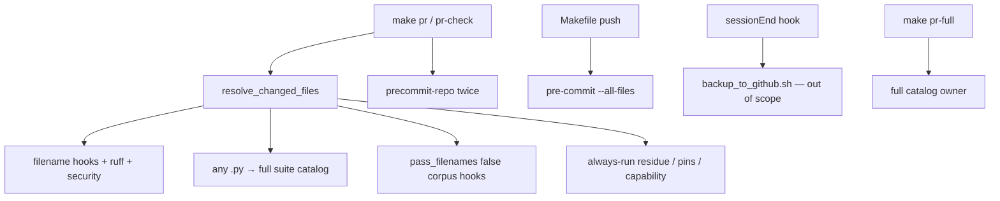

# Superseded — do not Build

Landed elsewhere. Pytest scoped as `select_pr_pytest_paths.py` + `--changed-file` in [`pr_gate_velocity_25da307a.plan.md`](../../built/pr_gate_velocity_25da307a.plan.md). Hooks / Makefile / docs in [`finish_gate_velocity_db0d864b.plan.md`](../../built/finish_gate_velocity_db0d864b.plan.md) ([PR #279](https://github.com/Quantum-L9/Cursor-Governance/pull/279)). This packet's `--paths-file` / `select_pytest_paths.py` design was never executed.

# Slim local PR gate to changed files

> First-class SSOT: [`environment/contracts/execution/templates/canonical.template.executable_plan.v1.plan.md`](environment/contracts/execution/templates/canonical.template.executable_plan.v1.plan.md)
> Schema: `canonical.schema.plan_document.v1` · plan_id: `plan.ops.pr-gate-changed-files-velocity.v1`
> Machine artifact: extract the PLAN_DOCUMENT JSON block below at execute (`validate_plan_document.py`). Plan-mode cannot write a sidecar `.json`.
> Execute: `@environment/program-execution` then subordinate `@autonomy` under a Program lease. Do not free-form mutate from this markdown alone.
> KERNEL landing: **new branch from `origin/main`**. Do not mix onto dirty `main` (l9-plan-simple WIP).
> Improve: 2026-08-21T20:04:00Z — bound absolute INTENT; copied PLAN_DOCUMENT `files` onto frontmatter todos; replaced write_deny ellipsis.
> Validate & Repair: 2026-08-21T20:06:00Z — F-01..F-08 held; F-09 bound `target_repo` so compile_brief does not treat `$HOME/.cursor-governance` as the GitHub repository.

## Execute via @environment/program-execution + autonomy (required)

```text
this .plan.md
        │ project
        ▼
@environment/program-execution   Blueprint → Program Lock → Controller
        │ lease (narrow-never-widen)
        ▼
root autonomy/  +  @autonomy (/autonomy → l9-bounded-autonomy)
        │
        ▼
Peer Execution Core → cursor-foreground (default)
```

Live execution is one command. Do not hand-run pec or inner L4 scripts from chat.

```bash
make -C "$HOME/.cursor-governance" campaign INTENT=/Users/ib-mac/Cursor-Governance/docs/plans/pr_gate_velocity_8b9391f7.plan.md
```

`autonomous_merge: false`. After local finish: kernels → L4 authorize → `PR_REMEDIATE=0 make pr`. Do not spawn remediation. Do not merge.

### Campaign authorization packet (fill at execute)

```yaml
packet_id: autonomy-2026-08-21-pr-gate-velocity
authority: A4_CAMPAIGN_BOUNDED_EXTERNAL_WRITE
profile: pr-convergence
authority_profile: program_controller_bound
autonomous_merge: false
plan_ref: docs/plans/pr_gate_velocity_8b9391f7.plan.md
plan_id: plan.ops.pr-gate-changed-files-velocity.v1
schema_ref: canonical.schema.plan_document.v1
program_execution:
  root: environment/program-execution
  program_id: pes-pr-gate-changed-files-velocity
  provider_ref: cursor-foreground
declared_branches: [feat/pr-gate-changed-files-velocity]
forbidden_inside_packet:
  - merge_outside_l4_plan_build_stack
  - force_push
  - weaken_tests_for_green
  - expand_scope
```

## Metadata

- plan_id: `plan.ops.pr-gate-changed-files-velocity.v1`
- status: `executable` (operator admitted 2026-08-21; execute on the campaign isolate)
- owner: repo agents under Program lease
- created_at: `2026-08-21`
- updated_at: `2026-08-21` (Improve + Validate & Repair)
- depth: `standard`

## Architect framing

- planning_ssot: [`AGENTS.md`](AGENTS.md) §4 + [`ops/scripts/run_pr_gate.sh`](ops/scripts/run_pr_gate.sh) + [`ops/config/python-contract.json`](ops/config/python-contract.json) + [`ops/config/root-file-protection.json`](ops/config/root-file-protection.json)
- plan_class: `bounded_execution_contract`
- redesign_allowed: `false`

## Immutable baseline

- repository: `Quantum-L9/Cursor-Governance`
- target_repo: `Quantum-L9/Cursor-Governance`
- planning workspace: `/Users/ib-mac/Cursor-Governance` on dirty `main` at `577c482cac657403fb6fb66f7f7d89e2ad6994e1`, **behind `origin/main` by 74**
- locked execute-from tip (planning-time): `origin/main` = `8bc5781df8b246b83c14d359d0e0803e6d2ef868`
- overlap_policy: `stop_if_dirty_overlaps_may_modify` — do **not** mutate the dirty planning checkout
- on_drift: `relock_and_proceed` (operator admitted 2026-08-21; relock origin/main tip, do not stop)
- verification_rule: `reverify_at_execution_start`

P0 inventory was taken on the **dirty planning checkout**, not a clean `origin/main` tree. Re-read gate scripts on the worktree before mutating.

## Locked decisions (user + repair)

- **Pytest (user):** changed test files + mapped siblings. No map → skip that file with a notice. Never fall back to the full catalog on `make pr` / `pr-check`.
- **CI (user):** local Makefile / pre-commit only. GitHub required `Lint and Type Check` / `Test Suite` stay full-tree.
- **Mapper path (repair F-02):** one file, [`ops/scripts/select_pytest_paths.py`](ops/scripts/select_pytest_paths.py). Do not create `ops/scripts/lib/changed_test_map.py`.
- **Runner flag (repair F-03):** add `--paths-file` to [`run_python_test_suites.py`](ops/scripts/run_python_test_suites.py). When set, **replace** suite discovery `.` with those paths. Do not append mapped paths onto `.`.
- **no-hardcoded-paths (repair F-04):** `files:` is known now. Trigger only when any of these change:
  - `ops/scripts/validate_governance_no_hardcoded_paths.sh`
  - `ops/hooks/session_end_governance_backup.sh`
  - `ops/scripts/resolve_governance_paths.sh`
  - `ops/scripts/backup_to_github.sh`
  - `ops/scripts/setup_workspace_symlinks.sh`
  - `ops/scripts/validate_governance_symlinks.sh`
  - `ops/scripts/install_ide_profile.sh`
  - `ops/scripts/backup_gate.sh`
- **sessionEnd (repair F-05):** [`session_end_governance_backup.sh`](ops/hooks/session_end_governance_backup.sh) calls `backup_to_github.sh` directly. Slimming Makefile `push` does **not** slim session-end. Session-end is **out of scope**.
- **ARCHITECTURE.md (repair F-06):** L57 already claims `make pr-check` pytest is changed-files. That claim is false today. todo-07 **must** correct it (file is `managed`, not additive_only).
- **Root-file protection (repair F-01):** [`Makefile`](Makefile) and [`.pre-commit-config.yaml`](.pre-commit-config.yaml) are `additive_only`. Overwriting existing recipe/hook lines requires commit messages:
  - `ALLOW-ROOT-DELETION: Makefile — velocity path must change push/prereq/pr-full lines; additive append cannot change Make prerequisites`
  - `ALLOW-ROOT-DELETION: .pre-commit-config.yaml — add files: to no-hardcoded-paths; in-place hook rewrite`
- **P2-12 (user + repair F-07):** always-run validators on every `make pr` are superseded on the velocity path. Domain-gate or move to `make pr-full`, and **rewrite the comment** in `run_pr_gate.sh` so a later agent does not restore always-run.
- **capability-contract trigger:** run on the velocity path only when the change set matches `^(ops/secrets/|environment/agents/)`. Otherwise `make pr-full` owns it.

## Objective

`make pr` / `make pr-check` / Makefile `push` only scan **new code** vs `PR_BASE`. Tools that still do a deep full-repo pass on that path move to [`make pr-full`](Makefile). Do not invent a GHA `nightly.yml`.

### Success properties

- **SP-01** Worktree HEAD equals the locked (or re-locked) `origin/main` SHA at execute start (`repository_state`)
- **SP-02** Velocity-path pytest collects only mapped tests; unmapped production `.py` prints `OK: skip pytest (no mapped tests for changed Python)` and does not pass discovery `.` (`runtime_behavior`)
- **SP-03** `make pr-check` PASS on the feature worktree; docs-only diffs do not run the pytest catalog (`quality_gate`)
- **SP-04** `run_pr_precommit.sh` SKIP_LIST contains `repo-hygiene`, `legacy-doctrine-residue`, `rules-check`, `skills-check`; those hooks still run via `make precommit` / `pr-full` (`structural`)
- **SP-05** Makefile `push` prerequisite is `precommit-repo`, not `precommit` (`structural`)
- **SP-06** `AGENTS.md` append and `ARCHITECTURE.md` L57 no longer claim pytest is already changed-files (`filesystem`)

## Pre-validation

- **P0** Inventory gate scripts + ARCHITECTURE L57 — **passed** (structural, dirty checkout 2026-08-21)
- **P1** `python3 skills/l9-plan/scripts/route_plan.py` — **passed** (`depth=standard`)
- **P2** `make pr-check` on dirty planning checkout — **skipped** (unrelated WIP)
- **P3** in-memory extract of the PLAN_DOCUMENT JSON fence → `validate_plan_document.py` semantic + schema — **passed** (2026-08-21; sidecar `.json` still absent)

## Capability preflight

- CP-01 `git rev-parse origin/main` equals locked SHA or todo-01 relocks (U1)
- CP-02 locked `.venv` imports pytest
- CP-03 write_allow paths writable on the new worktree
- CP-04 `pre-commit` CLI present
- CP-05 commit messages for Makefile / `.pre-commit-config.yaml` contain the ALLOW-ROOT-DELETION markers

## What is already slim (do not re-implement)

- Changed-file resolution: [`ops/scripts/resolve_changed_files.sh`](ops/scripts/resolve_changed_files.sh)
- Filename pre-commit hooks + ruff on changed Python: [`ops/scripts/run_pr_precommit.sh`](ops/scripts/run_pr_precommit.sh)
- Security (gitleaks/bandit/semgrep): [`ops/scripts/run_pr_security.sh`](ops/scripts/run_pr_security.sh)
- Pytest **trigger** skip when no `.py` changed: [`ops/scripts/run_pr_gate.sh`](ops/scripts/run_pr_gate.sh) (`--- pytest ---`, currently L291)
- Secrets suite ignore when `ops/secrets` unchanged (keep)

## What still burns velocity



1. Pytest: any `.py` → [`run_pytest_suites.sh`](ops/scripts/run_pytest_suites.sh) → all suites; `repo-root` argv is `.`
2. Always-run in `run_pr_gate.sh` (governance contract surface / doctrine residue / workflow pins) plus Make `capability-contract-validate`
3. `pass_filenames: false` corpus hooks: `repo-hygiene`, `legacy-doctrine-residue`; `rules-check` / `skills-check` scan the whole corpus when triggered
4. Double `precommit-repo`: Make prereq **and** `_gate_run_precommit`
5. Makefile `push: precommit backup` is `--all-files` (sessionEnd is a different path)

## Design

### Pytest mapper (locked)

Create [`ops/scripts/select_pytest_paths.py`](ops/scripts/select_pytest_paths.py). stdin or `--changed-file` list in → existing test paths + skip notices on stderr/stdout.

For production `path/to/foo.py` include existing matches among:

- `path/to/test_foo.py`
- `path/to/tests/test_foo.py`
- `tests/path/to/test_foo.py`
- `tests/test_foo.py` only when that basename is unique in the selected set
- extra for `ops/scripts/*.py`: `ops/scripts/tests/test_<stem>.py` **and** `tests/ops/scripts/test_<stem>.py`

Test files (`test_*.py`, `*_test.py`) are included as-is.

Suite routing: longest matching `owned_paths` prefix in [`python-contract.json`](ops/config/python-contract.json).

- **pytest suites:** `--paths-file` **replaces** `.`; keep `--ignore` flags; keep secrets ignore unless secrets paths changed
- **command / command_sequence:** run the whole suite only if a selected test path sits under that suite’s `owned_paths`
- **empty selection:** print `OK: skip pytest (no mapped tests for changed Python)` and do not start the runner
- **`make test` / `make pr-full` / CI:** unchanged full catalog (no mapper)

### Pre-commit velocity

Extend `SKIP_LIST` in [`run_pr_precommit.sh`](ops/scripts/run_pr_precommit.sh) (already skips `sync-generated-artifacts`):

- `repo-hygiene`
- `legacy-doctrine-residue`
- `rules-check`
- `skills-check`

Keep filename hooks + ruff. Add `files:` on `no-hardcoded-paths` for the eight paths locked above.

### Dedup + push + always-run

- Remove Make prereqs `pr-check: precommit-repo` and `pr: precommit-repo`. Gate already calls `run_pr_precommit.sh`.
- Domain-gate workflow pins to `.github/workflows/` (or the pin script). Domain-gate capability-contract to `^(ops/secrets/|environment/agents/)`. Move unconditional residue + contract-surface off the velocity path.
- Rewrite the P2-12 “always-run” comment when that block is gated.
- Makefile `push:` → `precommit-repo backup`.

### `make pr-full` owns corpus

Keep: `precommit` (`--all-files`), `lint-ruff-full`, `uv-lock-check`, `test`, `rules-validate`.
Add: `capability-contract-validate`, doctrine residue, workflow pins, contract surface.

## Execution envelope

**write_allow**

- `ops/scripts/select_pytest_paths.py` (Create)
- `ops/scripts/run_pr_gate.sh`
- `ops/scripts/run_pr_precommit.sh`
- `ops/scripts/run_python_test_suites.py` (`--paths-file` only)
- `ops/scripts/run_pytest_suites.sh` (forward `--paths-file` if the wrapper must)
- `.pre-commit-config.yaml` (ALLOW-ROOT-DELETION)
- `Makefile` (ALLOW-ROOT-DELETION)
- `ops/config/precommit-hook-contract.json` only if SKIP set changes the contract
- `tests/ops/scripts/test_select_pytest_paths.py` (Create)
- `tests/ops/scripts/test_pr_lifecycle.py`
- `AGENTS.md` (append-only)
- `ARCHITECTURE.md` (managed; correct L57)

**write_deny**

- `.github/workflows/**`
- `CANONICAL_LAW.md`
- `pyproject.toml`
- `ops/config/python-contract.json` local/ci full-profile argv (keep `.` for `make test`)
- `ops/hooks/session_end_governance_backup.sh`
- dirty WIP on the planning checkout (`skills/l9-plan-simple/**` and other uncommitted paths already covered by `overlap_policy`)

**commands allow:** targeted pytest, `make pr-check`, `make precommit-repo`, `make pr-full`, `PR_REMEDIATE=0 make pr` after L4
**commands deny:** force-push, hard-reset, `pre-commit install`, weakening scanners, GHA edits
**network:** `bounded_external_write` only at todo-09
**secrets:** `none`
**autonomous_merge:** `false`

## Side effects and idempotency

- SE-todo-02 / 03 / 04 / 05 / 06 / 07: `filesystem_mutation`, `safe_with_dedupe`
- todo-08: `filesystem_read`
- SE-todo-09: `network_write` via `make pr` after L4

## Architecture impact

- Mapper / gate / hooks / Makefile: layer `ops` + `assurance`; owning contract `AGENTS.md` §4 and `root-file-protection.json`
- Prohibited: second test runner, pytest-testmon, GHA nightly, sessionEnd rewrite, `pyproject.toml` addopts rewrite

## Rollback

- supported: `true` · automatic_allowed: `false`
- code: `git_restore_scoped_paths` / revert on the feature branch
- No force-push
- If velocity skip hides a corpus break: `make pr-full` still exists; restore SKIP_LIST / always-run block from `origin/main`

## Complexity and uncertainty

- complexity: `medium` · uncertainty: `low` · blast_radius: `medium`
- Residual: mapped-test miss skips pytest until GitHub Test Suite / `make pr-full` (user accepted)

## Execution DAG

Critical path: `todo-01` → `todo-02` → `todo-03` → (`todo-04` + `todo-05`) → `todo-06` → `todo-07` → `todo-08` → `todo-09`

| id | pe_task_id | wave | depends_on | mutation | isolation_key |
|----|------------|------|------------|----------|---------------|
| todo-01-baseline-preflight | TASK-001 | W0 | [] | false | preflight |
| todo-02-pytest-mapper | TASK-002 | W1 | [todo-01] | true | mapper |
| todo-03-wire-gate | TASK-003 | W1 | [todo-02] | true | gate |
| todo-04-precommit-skip | TASK-004 | W1 | [todo-01] | true | hooks |
| todo-05-dedupe-push | TASK-005 | W1 | [todo-01] | true | makefile |
| todo-06-pr-full-owner | TASK-006 | W1 | [todo-04, todo-05] | true | pr-full |
| todo-07-docs | TASK-007 | W1 | [todo-06] | true | docs |
| todo-08-prove | TASK-008 | W1 | [todo-03..todo-07] | false | validate |
| todo-09-converge | TASK-009 | W2 | [todo-08] | true | converge |

## Property evidence matrix

- EV-SP-01: `git rev-parse HEAD` equals locked SHA — `not_run`
- EV-SP-02: mapper fixtures + gate log skip/mapped paths — `not_run`
- EV-SP-03: `make pr-check` PASS — `not_run`
- EV-SP-04: SKIP_LIST contains the four corpus ids; `pr-full` still runs `precommit` — `not_run`
- EV-SP-05: `Makefile` `push:` prerequisite is `precommit-repo` — `not_run`
- EV-SP-06: `ARCHITECTURE.md` no longer states pytest is already changed-files — `not_run`

## Stress and disconfirm

- Mapper misses `tests/ops/scripts/test_<script>.py` → encode both conventions in tests; CI Test Suite stays full
- `--paths-file` still passes `.` → replace, do not append (F-03)
- SKIP `rules-check` → ratchet only on `pr-full` / existing CI `governance-self-check` (accepted; CI not slimmed)
- Claiming “all pushes” are slim while sessionEnd still runs backup only — **do not claim that** (F-05)
- Later agent restores always-run from the P2-12 comment → rewrite the comment (F-07)
- Makefile / pre-commit rewrite without ALLOW-ROOT-DELETION → root-file-protection FAIL (F-01)

**assumed_false_ifs:** `make pr-full` stays local corpus owner; GitHub Test Suite stays full; `resolve_changed_files.sh` stays SSOT; sessionEnd stays out of scope

**blast_radius:** local publish velocity and what `make pr` proves; CI merge bar unchanged

## Doc / root surface

- `AGENTS.md` — **update** (append-only) via todo-07
- `ARCHITECTURE.md` — **update** via todo-07 (L57 overclaim)
- `INVARIANTS.md` — **n_a** (does not claim pytest is already changed-files)
- `CANONICAL_LAW.md` — **n_a** (operating detail stays in AGENTS)
- `CLAUDE.md` — **n_a**
- `pyproject.toml` — **n_a** (do not rewrite pytest addopts)
- `Makefile` / `.pre-commit-config.yaml` — **update** with ALLOW-ROOT-DELETION (not doc surfaces; gate surfaces)

## Out of scope

- Slimming `.github/workflows/l9-lint-test.yml` or other required checks
- Creating `nightly.yml` / full-tree GHA security
- `sessionEnd` / `backup_to_github.sh` path
- pytest-testmon / coverage-based impact
- Changing `make test` / CI `--profile ci` catalog
- Weakening assertions
- Mixing onto dirty `main` WIP

## Follow-on (separate plan)

- Slim CI lint/test + scheduled nightly (user declined here)
- Filename-aware `check_rules_standard.py`
- Optionally slim sessionEnd if a later plan wants the same velocity on X-out backup

## Convergence

- status: `admitted`
- remaining_unknown_ids: none
- next_skill: `l9-pe-campaign-activate` (execute)
- stop_reason: none — operator admitted this campaign for execute on 2026-08-21
- executable_when: now (admitted)

## GMP handoff

- may_modify: write_allow paths
- must_not_modify: write_deny paths + secrets
- preserved_contracts: `resolve_changed_files.sh` SSOT; no git commit hook; `make pr` only publish path; scanners not weakened; `make test` / CI full catalog; sessionEnd unchanged
- validation_commands: extract JSON → `validate_plan_document.py`; `pytest tests/ops/scripts/test_select_pytest_paths.py tests/ops/scripts/test_pr_lifecycle.py -q`; `make pr-check`

## Unknowns

- **U1** (accepted): Relock the then-current `origin/main` tip at execute start and proceed. Do not stop_and_replan.

## YNP

Highest-value next move: execute on a **new `origin/main` worktree** via PE + `/autonomy`. First execute action after checkout: copy the PLAN_DOCUMENT JSON block to `docs/plans/pr_gate_velocity_8b9391f7.plan.json` and run `validate_plan_document.py`.

## Validate & Repair finding register

- **F-01** Critical / Confirmed / Resolved-in-plan: Makefile and `.pre-commit-config.yaml` are `additive_only`; original plan omitted ALLOW-ROOT-DELETION.
- **F-02** High / Confirmed / Resolved-in-plan: dual mapper path (`select_pytest_paths.py` OR `lib/changed_test_map.py`) — locked to one file.
- **F-03** High / Confirmed / Resolved-in-plan: `--paths-file` was optional; double-collection risk. Now required replace-not-append.
- **F-04** High / Confirmed / Resolved-in-plan: “inspect SCAN_FILES during execute” — list is already in `validate_governance_no_hardcoded_paths.sh` L15–23.
- **F-05** High / Confirmed / Resolved-in-plan: `make push` ≠ sessionEnd; original text implied all pushes.
- **F-06** High / Confirmed / Resolved-in-plan: ARCHITECTURE.md L57 already overclaims changed-file pytest; todo-07 is mandatory, not “only if”.
- **F-07** Medium / Confirmed / Resolved-in-plan: P2-12 comment would fight the slim path unless rewritten.
- **F-08** High / Confirmed / PartiallyResolved: l9-plan requires a sidecar `.json` on disk. Plan-mode cannot write it. Embedded JSON in this file schema+semantic **Passed** in-memory 2026-08-21. Frontmatter todos now carry `files`, so compile_brief does not need the sidecar to emit paths. Execute may still copy the fence to `docs/plans/pr_gate_velocity_8b9391f7.plan.json`.
- **F-09** High / Confirmed / Resolved-in-plan: `extract_target` accepted `HOME/.cursor-governance` from `make -C "$HOME/.cursor-governance"`. Bound `target_repo: Quantum-L9/Cursor-Governance` so TARGET_REPO_RE wins.

## PLAN_DOCUMENT (machine SSOT — extract at execute)

```json
{
  "schema_version": "1.0.0",
  "mode": "plan",
  "title": "Slim local PR gate to changed files",
  "objective": "make pr, make pr-check, and Makefile push scan only new or changed code versus PR_BASE. Pytest on that path runs changed tests plus mapped siblings and never falls back to the full catalog. Full-corpus work stays on make pr-full. GitHub required checks stay full-tree.",
  "success_criteria": [
    "On the velocity path, a production .py with no mapped test prints the skip notice and does not invoke run_python_test_suites.py with discovery .",
    "On the velocity path, a mapped test file is the only pytest path collected for that change set",
    "make test and make pr-full still execute every suite in ops/config/python-contract.json local profile",
    "run_pr_precommit.sh SKIP_LIST includes repo-hygiene, legacy-doctrine-residue, rules-check, and skills-check",
    "Makefile push prerequisite is precommit-repo, not precommit",
    "make pr-full recipe invokes precommit --all-files plus the validators removed from the velocity path",
    "make pr-check PASS on the feature worktree"
  ],
  "scope": {
    "in": [
      "Local make pr / make pr-check gate pytest selection",
      "precommit-repo SKIP_LIST and no-hardcoded-paths files trigger",
      "Makefile push and pr-full ownership",
      "Duplicate precommit-repo Make prerequisite",
      "Domain-gated always-run validators on the velocity path",
      "Append-only AGENTS.md plus ARCHITECTURE.md pytest claim correction"
    ],
    "out": [
      "GitHub required Lint and Type Check / Test Suite slimming",
      "New nightly.yml or full-tree GHA security",
      "sessionEnd hook (calls backup_to_github.sh, not make push)",
      "pytest-testmon or coverage-based impact analysis",
      "Changing make test or CI --profile ci catalog",
      "Weakening scanners or assertions",
      "Mixing this landing onto dirty main WIP"
    ]
  },
  "code_in_scope": true,
  "pre_validation": [
    {
      "id": "P0",
      "command_or_action": "Inventory run_pr_gate.sh, run_pr_precommit.sh, .pre-commit-config.yaml, Makefile, python-contract.json, ARCHITECTURE.md, root-file-protection.json on the planning checkout",
      "pass_criteria": "Velocity gaps named with file evidence; ARCHITECTURE.md L57 overclaim recorded; additive_only Makefile and pre-commit recorded",
      "status": "passed"
    },
    {
      "id": "P1",
      "command_or_action": "python3 skills/l9-plan/scripts/route_plan.py",
      "pass_criteria": "depth=standard",
      "status": "passed"
    },
    {
      "id": "P2",
      "command_or_action": "make pr-check on dirty planning checkout",
      "pass_criteria": "N/A — execute on a clean origin/main worktree",
      "status": "skipped"
    },
    {
      "id": "P3",
      "command_or_action": "in-memory extract of PLAN_DOCUMENT JSON fence through validate_plan_document semantic_errors + Draft202012 schema",
      "pass_criteria": "PASS",
      "status": "passed"
    }
  ],
  "todos": [
    {
      "id": "todo-01-baseline-preflight",
      "task": "Create a wired worktree from origin/main, reverify full SHA, run capability probes, stop_and_replan on drift",
      "files": [],
      "blocker": "Mutate only after a clean worktree exists at origin/main 8bc5781df8b246b83c14d359d0e0803e6d2ef868 or the then-current origin/main tip if it fast-forwarded",
      "effort": "S",
      "risk": "medium",
      "dependencies": [],
      "operation": "Create",
      "anchor": "ops/scripts/worktree_add_wired.sh",
      "leverage_rank": 8
    },
    {
      "id": "todo-02-pytest-mapper",
      "task": "Add select_pytest_paths.py and unit tests for include, mapped siblings, unique basename, ops/scripts dual path, empty set, and longest owned_paths prefix",
      "files": [
        "ops/scripts/select_pytest_paths.py",
        "tests/ops/scripts/test_select_pytest_paths.py"
      ],
      "effort": "M",
      "risk": "medium",
      "dependencies": ["todo-01-baseline-preflight"],
      "operation": "Create",
      "anchor": "new file ops/scripts/select_pytest_paths.py",
      "leverage_rank": 1,
      "shared_root_cause": "any .py change runs the full suite catalog"
    },
    {
      "id": "todo-03-wire-gate",
      "task": "Wire run_pr_gate.sh pytest to --paths-file from the mapper; discovery . is replaced, not appended",
      "files": [
        "ops/scripts/run_pr_gate.sh",
        "ops/scripts/run_python_test_suites.py",
        "ops/scripts/run_pytest_suites.sh"
      ],
      "effort": "M",
      "risk": "medium",
      "dependencies": ["todo-02-pytest-mapper"],
      "operation": "Replace",
      "anchor": "echo --- pytest ---",
      "leverage_rank": 2
    },
    {
      "id": "todo-04-precommit-skip",
      "task": "SKIP corpus hooks on precommit-repo; add files trigger on no-hardcoded-paths for the seven SCAN_FILES plus the validator script",
      "files": [
        "ops/scripts/run_pr_precommit.sh",
        ".pre-commit-config.yaml"
      ],
      "effort": "S",
      "risk": "high",
      "dependencies": ["todo-01-baseline-preflight"],
      "operation": "Replace",
      "anchor": "SKIP_LIST=sync-generated-artifacts",
      "leverage_rank": 3
    },
    {
      "id": "todo-05-dedupe-push",
      "task": "Remove duplicate Make precommit-repo prerequisite; switch push to precommit-repo; domain-gate always-run validators",
      "files": [
        "Makefile",
        "ops/scripts/run_pr_gate.sh"
      ],
      "effort": "S",
      "risk": "medium",
      "dependencies": ["todo-01-baseline-preflight"],
      "operation": "Replace",
      "anchor": "pr-check: precommit-repo",
      "leverage_rank": 4
    },
    {
      "id": "todo-06-pr-full-owner",
      "task": "Thicken make pr-full so it runs skipped corpus validators and capability-contract-validate",
      "files": ["Makefile"],
      "effort": "S",
      "risk": "low",
      "dependencies": ["todo-04-precommit-skip", "todo-05-dedupe-push"],
      "operation": "Replace",
      "anchor": "pr-full: venv precommit",
      "leverage_rank": 5
    },
    {
      "id": "todo-07-docs",
      "task": "Append velocity versus pr-full contract to AGENTS.md; correct ARCHITECTURE.md pytest overclaim additively",
      "files": ["AGENTS.md", "ARCHITECTURE.md"],
      "effort": "S",
      "risk": "low",
      "dependencies": ["todo-06-pr-full-owner"],
      "operation": "Insert",
      "anchor": "PRECOMMIT_REPO_OWNS_RUFF_V1",
      "leverage_rank": 6
    },
    {
      "id": "todo-08-prove",
      "task": "Extend lifecycle tests for mapped run, unmapped skip, docs-only skip, and make test still full; run make pr-check",
      "files": [
        "tests/ops/scripts/test_pr_lifecycle.py",
        "tests/ops/scripts/test_select_pytest_paths.py"
      ],
      "effort": "M",
      "risk": "medium",
      "dependencies": [
        "todo-03-wire-gate",
        "todo-04-precommit-skip",
        "todo-05-dedupe-push",
        "todo-06-pr-full-owner",
        "todo-07-docs"
      ],
      "operation": "Insert",
      "anchor": "test_pr_lifecycle.py",
      "leverage_rank": 7
    },
    {
      "id": "todo-09-converge",
      "task": "Apply kernels, L4 authorize-release, PR_REMEDIATE=0 make pr; do not merge",
      "files": ["ops/autonomy/l4_local.py"],
      "effort": "S",
      "risk": "medium",
      "dependencies": ["todo-08-prove"],
      "operation": "Wrap",
      "anchor": "PR_REMEDIATE=0 make pr",
      "leverage_rank": 9
    }
  ],
  "critical_path": [
    "todo-01-baseline-preflight",
    "todo-02-pytest-mapper",
    "todo-03-wire-gate",
    "todo-04-precommit-skip",
    "todo-05-dedupe-push",
    "todo-06-pr-full-owner",
    "todo-07-docs",
    "todo-08-prove",
    "todo-09-converge"
  ],
  "milestones": [
    {"id": "M1", "outcome": "Clean origin/main worktree bound", "unlocks": "mutation"},
    {"id": "M2", "outcome": "Mapped pytest wired on the velocity path", "unlocks": "hook and Makefile slimming"},
    {"id": "M3", "outcome": "pr-full owns corpus; docs match", "unlocks": "prove and publish"}
  ],
  "checkpoints": [
    {"id": "C1", "after": "M1", "evidence_required": "git rev-parse HEAD equals locked origin/main SHA on the worktree", "no_go_action": "relock_and_proceed"},
    {"id": "C2", "after": "M2", "evidence_required": "mapper unit tests PASS; gate log shows skip or mapped paths", "no_go_action": "do not slim hooks until pytest selection is proven"},
    {"id": "C3", "after": "M3", "evidence_required": "make pr-check PASS; make test still runs all registry suites", "no_go_action": "block L4 authorize"}
  ],
  "doc_root_surface_impact": [
    {"surface": "AGENTS.md", "action": "update", "todo_ids": ["todo-07-docs"]},
    {"surface": "ARCHITECTURE.md", "action": "update", "todo_ids": ["todo-07-docs"]},
    {"surface": "INVARIANTS.md", "action": "n_a", "reason": "Does not claim pytest is already changed-files"},
    {"surface": "CANONICAL_LAW.md", "action": "n_a", "reason": "Operating detail stays in AGENTS.md"},
    {"surface": "CLAUDE.md", "action": "n_a", "reason": "Authority pointer only"},
    {"surface": "pyproject.toml", "action": "n_a", "reason": "Do not rewrite pytest addopts"}
  ],
  "stress_test": {
    "disconfirming_questions": [
      "Does the mapper miss tests/ops/scripts/test_<script>.py so a script edit ships with zero pytest on make pr?",
      "Does --paths-file still pass discovery . and double-collect the catalog?",
      "Does SKIP_LIST drop rules-check so a rules PR never ratchets until make pr-full?",
      "Does changing Makefile push leave sessionEnd on the full backup path while docs claim all pushes are slim?",
      "Does a later agent restore always-run validators from the P2-12 comment?",
      "Does a Makefile or pre-commit rewrite fail root-file-protection without ALLOW-ROOT-DELETION?"
    ],
    "assumed_false_ifs": [
      "make pr-full remains the local full-corpus owner",
      "GitHub Test Suite remains full-tree on non-WIP PRs",
      "resolve_changed_files.sh remains the change-set SSOT",
      "sessionEnd is not in scope and is not claimed slim"
    ],
    "blast_radius": "Local publish velocity and what make pr proves. CI merge bar unchanged. Corpus residue or rules-budget drift can land locally until make pr-full or GitHub Test Suite / governance-self-check.",
    "rollback": "On the feature branch restore run_pr_gate.sh pytest block, run_pr_precommit.sh SKIP_LIST, Makefile push/pr-full/prereqs, and docs from origin/main. No force-push."
  },
  "leverage": {
    "ranked_todo_ids": [
      "todo-02-pytest-mapper",
      "todo-03-wire-gate",
      "todo-04-precommit-skip",
      "todo-05-dedupe-push",
      "todo-06-pr-full-owner",
      "todo-07-docs",
      "todo-08-prove",
      "todo-01-baseline-preflight",
      "todo-09-converge"
    ],
    "shared_causes": [
      "Velocity path still invokes full-corpus tools after a changed-file trigger",
      "P2-12 always-run comment fights the user-authorized slim contract",
      "ARCHITECTURE.md already states pytest is changed-files when it is not",
      "Makefile and .pre-commit-config.yaml are additive_only"
    ],
    "deletions_or_consolidations": [
      "Remove duplicate Make precommit-repo prerequisite",
      "Do not create lib/changed_test_map.py",
      "Do not defer no-hardcoded-paths files list to execute"
    ]
  },
  "risks": [
    {"risk": "Mapped-test miss skips pytest for a production edit on make pr", "mitigation": "Encode both live conventions in mapper tests; GitHub Test Suite stays full"},
    {"risk": "SKIP corpus hooks hide rules-budget or hygiene breaks until pr-full", "mitigation": "pr-full owns those hooks; do not slim CI governance-self-check"},
    {"risk": "Root-file-protection fails on Makefile or pre-commit rewrite", "mitigation": "ALLOW-ROOT-DELETION markers in the commit that touches those files"},
    {"risk": "Later agent restores always-run validators from the P2-12 comment", "mitigation": "Rewrite that comment when domain-gating; append AGENTS.md"}
  ],
  "unknowns": [
    {
      "id": "U1",
      "question": "Will origin/main still be 8bc5781df8b246b83c14d359d0e0803e6d2ef868 at execute start?",
      "decision_effect": "todo-01 relocks the then-current origin/main tip and proceeds",
      "resolution": "accepted"
    }
  ],
  "final_validation": [
    {"id": "V1", "command": "python -m pytest tests/ops/scripts/test_select_pytest_paths.py tests/ops/scripts/test_pr_lifecycle.py -q", "pass_criteria": "PASS", "status": "pending"},
    {"id": "V2", "command": "make pr-check", "pass_criteria": "PASS on the feature worktree", "status": "pending"},
    {"id": "V3", "command": "python3 skills/l9-plan/scripts/validate_plan_document.py docs/plans/pr_gate_velocity_8b9391f7.plan.json", "pass_criteria": "PASS", "status": "unknown"}
  ],
  "convergence": {
    "status": "admitted",
    "remaining_unknown_ids": [],
    "next_skill": "l9-pe-campaign-activate",
    "stop_reason": "none — operator admitted this campaign for execute on 2026-08-21"
  },
  "gmp_handoff": {
    "may_modify": [
      "ops/scripts/select_pytest_paths.py",
      "ops/scripts/run_pr_gate.sh",
      "ops/scripts/run_pr_precommit.sh",
      "ops/scripts/run_python_test_suites.py",
      "ops/scripts/run_pytest_suites.sh",
      ".pre-commit-config.yaml",
      "Makefile",
      "ops/config/precommit-hook-contract.json",
      "tests/ops/scripts/test_select_pytest_paths.py",
      "tests/ops/scripts/test_pr_lifecycle.py",
      "AGENTS.md",
      "ARCHITECTURE.md"
    ],
    "must_not_modify": [
      ".github/workflows/",
      "CANONICAL_LAW.md",
      "pyproject.toml",
      "ops/config/python-contract.json",
      "ops/hooks/session_end_governance_backup.sh",
      "skills/l9-plan-simple/",
      "secrets"
    ],
    "preserved_contracts": [
      "resolve_changed_files.sh is the change-set SSOT",
      "no git commit hook; do not run pre-commit install",
      "make pr is the only publish path",
      "scanners are not weakened",
      "make test and CI --profile ci keep full catalog",
      "sessionEnd backup path unchanged"
    ],
    "validation_commands": [
      "python3 skills/l9-plan/scripts/validate_plan_document.py docs/plans/pr_gate_velocity_8b9391f7.plan.json",
      "python -m pytest tests/ops/scripts/test_select_pytest_paths.py tests/ops/scripts/test_pr_lifecycle.py -q",
      "make pr-check"
    ]
  },
  "depth": "standard",
  "checklist": ["mapped pytest", "corpus SKIP", "pr-full owner", "ALLOW-ROOT-DELETION", "docs align"],
  "estimate": "one gated landing on a new origin/main worktree"
}
```
