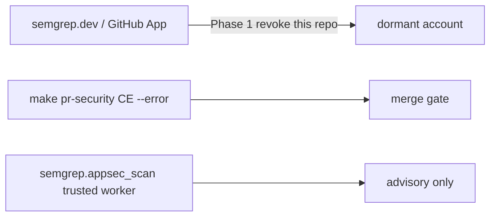

# Semgrep CI-only on Cursor-Governance

**Plan id:** `plan.security.semgrep-ci-only-cg.v1`
**Depth:** `deep` (router: risk=high, evidence=conflicting; omit_gates=[])
**Mode:** plan only until you Build. Then emit validated JSON + PE `.plan.md`, then execute via `@environment/program-execution` → Program Lock → `@autonomy`. Do not free-form mutate from this markdown.
**Supersedes:** [`~/.cursor/plans/semgrep_platform_configuration_3df7db22.plan.md`](/Users/macm2/.cursor/plans/semgrep_platform_configuration_3df7db22.plan.md) (STALE: missing execute section; written for a TS/JS consumer that is not this repo).

## Architect framing

- **Target:** `Quantum-L9/Cursor-Governance` at [`/Users/macm2/Cursor-Governance/Cursor-Governance`](/Users/macm2/Cursor-Governance/Cursor-Governance)
- **plan_class:** `retirement_plan` (retire platform surface) + bounded contract record
- **redesign_allowed:** false
- **Branch:** new branch from `origin/main` (`941ab775c3e6d2a4d8b0425b10e9cb32b9a8e403`). Do not land on `feat/agents-md-operating-digest` (unrelated WIP; dirty `scripts/claude-deepseek.sh`; ahead 4 / behind 8).
- **autonomous_merge:** false

## Why the draft cannot run as written

Verified on this tree (conflicts the draft’s “verified” evidence):

- No [`.github/workflows/l9-analysis.yml`](.github/workflows/l9-analysis.yml)
- No `.github/governance/semgrep-policy.yaml` or `semgrep-identity-map.yaml`
- [`.semgrepignore`](.semgrepignore) already exists (root-file-protection **managed**)
- Semgrep configs here are `p/python p/secrets` (not `p/typescript` / `p/javascript`)
- [`.github/governance/execution-profiles.yaml`](.github/governance/execution-profiles.yaml) and [`rule-modes.yaml`](.github/governance/rule-modes.yaml) already default **blocking** for `pr_fast` / `merge` / `release` / `supply_chain`
- GitHub required contexts named in [`.github/workflows/l9-lint-test.yml`](.github/workflows/l9-lint-test.yml) are **Lint and Type Check** and **Test Suite** — not “L9 Analysis”
- No workflow uploads Semgrep SARIF; Code scanning is not the findings UI

## Remapped objective (locked)

Semgrep merge-gating for this repo flows **only** through local Community Edition in [`ops/scripts/run_pr_security.sh`](ops/scripts/run_pr_security.sh) (`make pr` / `make pr-security`): changed files, `--error`, `SEMGREP_APP_TOKEN` scrubbed. The semgrep.dev / Semgrep GitHub App scan surface for **this repo only** is retired. Authenticated AppSec stays inside the trusted worker (`semgrep.appsec_scan` in [`ops/secrets/capabilities.yaml`](ops/secrets/capabilities.yaml)); it is not a merge gate.

**Do not** add a GitHub Semgrep workflow (that would invent a second surface and invent CI). **Do not** edit locked l9-ci-core presets. **Do not** uninstall the Semgrep app org-wide (WIP shows `semgrep-cloud-platform/scan` still used on `Quantum-L9/.github`).

## Immutable baseline (reverify at execute)

- **repository:** `Quantum-L9/Cursor-Governance`
- **commit_sha:** `941ab775c3e6d2a4d8b0425b10e9cb32b9a8e403` (`origin/main`)
- **overlap_policy:** `stop_if_dirty_overlaps_may_modify`
- **on_drift:** `stop_and_replan`
- Current checkout HEAD `ac5ab905…` is **not** the baseline.

## Success properties

- **SP-01** Baseline SHA matches at start (`git rev-parse HEAD`)
- **SP-02** Platform: no new semgrep.dev / `semgrep-cloud-platform/scan` events on this repo after cutoff (human screenshot or `gh` check-run absence)
- **SP-03** Local CE gate blocks: a deliberate finding fails `make pr-security`, then the probe is reverted
- **SP-04** `SEMGREP_APP_TOKEN` still unset in the local child env (gate comment contract in `run_pr_security.sh`)
- **SP-05** Written coverage ledger exists and names substitutes (gitleaks, GitGuardian MCP, pip-audit)
- **SP-06** `make pr-check` PASS on the doc/ignore delta (no scanner weakening)

## Scope

**In**

- Pause/remove the semgrep.dev project for `Cursor-Governance` only; revoke the Semgrep GitHub App’s access to **this** repository
- Record that `make pr-security` is the sole Semgrep merge authority (append-only AGENTS correction + `docs/SEMGREP_SURFACE.md`)
- Tune [`.semgrepignore`](.semgrepignore) only if a live CE scan proves noise (file is `managed`)
- Record mode contract: already-blocking; any future demotion must follow [`promotion-policy.yaml`](.github/governance/promotion-policy.yaml) (20 runs / 7 days / approval) via [`rule-modes.yaml`](.github/governance/rule-modes.yaml) `provider_overrides` or [`waivers.yaml`](.github/governance/waivers.yaml)
- Prove blocking locally, then revert the probe

**Out**

- New GitHub Semgrep / `l9-analysis.yml` / SARIF upload workflow
- Org-wide Semgrep App uninstall
- Paid plans, Managed Scans, Unified Policies, platform Supply Chain / Secrets / Workflows / AI
- Adding `p/react` or changing `SEMGREP_CONFIGS` defaults
- Promoting a “first wave” of TS/JS rule IDs (those IDs are not this pack)
- Editing `run_pr_security.sh` token-scrub / `--error` semantics
- Mixing onto `feat/agents-md-operating-digest`
- Force-push, hard-reset, admin-merge, scanner weakening

## Execution envelope

- **write_allow:** `docs/SEMGREP_SURFACE.md` (create); `AGENTS.md` (append-only block); `.semgrepignore` (managed, only if probe proves need); optional `WIP/8-20-26/semgrep-ci-only/` receipt
- **write_deny:** `.github/workflows/**`, `ops/scripts/run_pr_security.sh`, `pyproject.toml` existing keys, `CANONICAL_LAW.md`, secrets, unrelated trees
- **commands allow:** `git`, `gh` read + repo-scoped App revoke if PAT can, `make pr-security`, `make pr-check`, `make pr` after L4
- **commands deny:** `git push --force`, hard-reset, `semgrep login` from the agent, org-wide App uninstall
- **network:** `named_services_only` — `api.github.com`, `semgrep.dev` (read/pause this project only)
- **secrets:** `read_only_named` for `openclaw-igorbot/github#token`; never print `SEMGREP_APP_TOKEN`
- **AGENTS.md:** additive_only — append a correction block; no overwrite of existing lines

## Todos (PE Task Cards)

1. **todo-00-baseline-preflight** — Lock SHA `941ab775…`, new branch from `origin/main`, probe `gh` for Semgrep App + check-runs + Code scanning. Files: none. Blocker until probes recorded. Wave W0. Risk low.
2. **decommission-platform** — Pause/remove this repo on semgrep.dev; revoke Semgrep GitHub App **repo** access (not org-wide). Files: none. Blocker: org/repo admin via `openclaw-igorbot/github#token` or human. Evidence: no new platform scan after cutoff. Wave W1. Risk high (external). Depends: todo-00.
3. **record-sole-authority** — Write [`docs/SEMGREP_SURFACE.md`](docs/SEMGREP_SURFACE.md) and append an AGENTS correction: sole merge gate = local CE `make pr-security`; trusted worker AppSec is advisory; platform retired for this repo. Wave W1. Risk medium (AGENTS additive). Depends: todo-00.
4. **tune-semgrepignore** — Only if W0 CE probe shows noise; otherwise record N/A on the ledger. File: [`.semgrepignore`](.semgrepignore). Wave W2. Risk low. Depends: todo-00.
5. **record-mode-contract** — Document already-blocking + promotion-policy bar. Do **not** flip modes in this plan. Files: ledger only unless a proven-noisy rule needs a waiver (then [`waivers.yaml`](.github/governance/waivers.yaml)). Wave W2. Risk medium. Depends: record-sole-authority.
6. **coverage-gaps** — Ledger: secrets = gitleaks (blocking in same script) + GitGuardian MCP (advisory); supply chain = `pip-audit` on lock/manifest change; accepted gap = no reachability SCA, no Code scanning history. File: `docs/SEMGREP_SURFACE.md`. Wave W2. Depends: record-sole-authority.
7. **prove-blocking** — Add a throwaway finding, show `make pr-security` FAIL, revert. Wave W3. Risk medium. Depends: tune-semgrepignore, record-mode-contract.
8. **todo-04-converge** — `make pr-check` then `PR_REMEDIATE=0 make pr`. Mark old plan superseded. Wave W4. Depends: prove-blocking, coverage-gaps, decommission-platform.

**Critical path:** todo-00 → decommission-platform → record-sole-authority → coverage-gaps → prove-blocking → todo-04-converge

**Leverage order:** decommission-platform, record-sole-authority, coverage-gaps, tune-semgrepignore, prove-blocking, record-mode-contract, todo-00, todo-04-converge

**Shared causes:** two Semgrep surfaces; draft bound to files this repo does not have
**Deletions:** platform project/app access for this repo; no product-code deletion

## Stress / rollback

Disconfirming questions

- Is the Semgrep App even installed on Cursor-Governance, or only on `Quantum-L9/.github`? (U1 — probe)
- Would repo-only revoke leave Managed Scans alive via org default? (U1)
- Does a clean `origin/main` CE scan already FAIL, so “prove-blocking” is already true and a planted finding is unnecessary? (U3)
- Would an AGENTS append be mistaken as requiring a GitHub Semgrep check later?

Assumed false ifs

- `run_pr_security.sh` keeps CE + `--error` + token scrub
- Org will not treat “uninstall Semgrep” as org-wide
- `make pr` still composes `pr-security`

Blast radius: other Quantum-L9 repos still on platform; false merge blocks if ignore/waiver is wrong; AGENTS readers

Rollback: re-grant App repo access; restore `.semgrepignore` / AGENTS / docs via scoped git restore; demote any accidental waiver; never force-push

## Unknowns (do not invent)

- **U1** App/project present on this repo? → probe at W0
- **U2** Any existing Code scanning Semgrep alerts? → probe at W0
- **U3** Live CE false-positive set on `origin/main`? → probe at W0

## Convergence

- **status:** `partial` until U1–U3 probed and SP-02..SP-06 have evidence
- **next_skill:** `@environment/program-execution` + `/autonomy` (or `/ynp` to pick)
- **stop_reason:** planning-only; conflicting draft evidence remapped; platform revoke needs live `gh` probe

## After you confirm this plan (implementation of the plan artifacts, not the Semgrep work)

1. Emit `PLAN_DOCUMENT` JSON and run `python3 ~/.codex/skills/l9-plan/scripts/validate_plan_document.py` — FAIL is not ready
2. Project PE+autonomy `.plan.md` via `render_plan_pe_autonomy.py` (must keep **Execute via @environment/program-execution + autonomy**)
3. Status `executable` only when W0 probes fill U1–U3
4. Execute through `make -C "$HOME/.cursor-governance" campaign INTENT=…` — not free-form edits
