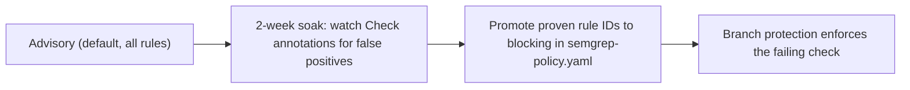

# Semgrep CI-Only Plan (GitHub Check as sole authority)

## Decision summary

- **Objective**: Semgrep value flows exclusively through the locked, governed GitHub Check. The semgrep.dev platform surface is retired so there is exactly one place findings appear and one place merges are gated.
- **Decision (user)**: platform features (Managed Scans, Unified Policies, Supply Chain, Secrets, Workflows, AI) are out. No paid plans, no trials, no second scan surface.
- **Evidence (verified)**:
  - [.github/workflows/l9-analysis.yml](.github/workflows/l9-analysis.yml) is LOCKED (managed by l9-ci-core), runs `semgrep scan --config p/typescript --config p/javascript`, normalizes through the pinned SDK, and uploads SARIF (`security-events: write`) — so findings already land in GitHub's native **Security > Code scanning** UI, which replaces the semgrep.dev dashboard for free.
  - [.github/governance/semgrep-policy.yaml](.github/governance/semgrep-policy.yaml) is the intended blocking knob: all findings default advisory; individual `provider_rule_id`s are promoted to blocking in its `rules{}` map after review.
  - [.github/governance/semgrep-identity-map.yaml](.github/governance/semgrep-identity-map.yaml) enumerates every rule the pack can emit (~80 TS/JS security rules) — this is the menu to promote from.
  - No `.semgrepignore` exists yet.
- **Not touched, ever**: the locked workflow itself. All tuning happens in governance files (designed for it) and GitHub settings.

## Phase 1 — Decommission the semgrep.dev surface

The dashboard you screenshotted is fed by something (most likely Managed Scans via a Semgrep GitHub App). Left alone, it keeps scanning weekly and accumulating a parallel backlog nobody looks at.

- In semgrep.dev (**Projects**): remove or pause the projects for this repo.
- In GitHub org settings (**Settings > GitHub Apps**): uninstall the Semgrep app, or revoke its access to this repository. This is the hard stop — no app access, no managed scans, no PR comments from the platform.
- Keep the free semgrep.dev account itself (costs nothing, useful if you ever revisit); it just goes dormant.
- Evidence of done: no new scan timestamps on the platform after the cutoff date.

## Phase 2 — Make the GitHub Check authoritative

- Branch protection / repository ruleset on `main`: require the L9 Analysis check (the `publish` job's check name) to pass before merge. Today a blocking finding fails the check but nothing forces PRs to respect it.
- Confirm the SARIF pipeline is live: **Security > Code scanning** should list semgrep findings per PR and on main. This tab is now the findings UI — filtering, history, dismissals with recorded reasons, all free.

## Phase 3 — Backlog triage and noise control

- Triage existing findings in the Code scanning tab: fix real issues; dismiss false positives with a reason (GitHub records who/why); for deliberate patterns, annotate inline with `// nosemgrep: <rule-id>` plus a justification comment.
- Add a root `.semgrepignore` for paths that generate noise without value: build output (`dist/`, `.astro/`, `.vercel/`), test fixtures, generated files. Note `node_modules` is ignored by default. This cuts findings at the source, before the SDK pipeline even sees them.

## Phase 4 — Bounded autonomy: graduated blocking

This is the CI-only version of the Monitor → Comment → Block ladder, using your own governance contract:

- Candidate first wave (high-confidence, low false-positive rules already in the identity map): hardcoded JWT/session/passport secrets, `detect-eval-with-expression`, `bypass-tls-verification`, the SQLi family (`knex-sqli`, `pg-sqli`, `sequelize-sqli`, `mysql-sqli`), `express-vm-injection` variants.
- Mechanism: add each `provider_rule_id` to `rules{}` in [.github/governance/semgrep-policy.yaml](.github/governance/semgrep-policy.yaml) with blocking mode, per the file's own note ("promoted to blocking here after org review").
- Rollback is one-line: demote the rule back to advisory. No workflow change, no lockfile churn.
- Expanding rule coverage (e.g. adding `p/react`) is out of scope — rulesets are baked into the locked preset and require an l9-ci-core preset update plus identity-map regeneration.

## Phase 5 — Record the coverage gaps (honest ledger)

Dropping the platform drops two product areas. Both have existing or free substitutes:

- **Secrets**: GitGuardian is already wired in this workspace (MCP + honeytokens) — it remains the secrets plane. No gap.
- **Supply chain**: the 67 platform findings go away with the platform. GitHub-native Dependabot alerts (free, zero config beyond enabling) or `npm audit` cover known-CVE detection without reachability analysis. Optional — enable Dependabot alerts only, no auto-PRs, if you want any coverage here; otherwise record it as an accepted gap.

## Validation evidence (per L9 validation rule)

- Phase 1: platform shows no scans after cutoff (screenshot).
- Phase 2: branch protection screenshot + a PR showing the required check; Code scanning tab populated.
- Phase 4: a deliberately failing test PR proving a blocking rule fails the check, then reverted.
- Phase 5: written gap record (what is not covered and by what it is substituted).
